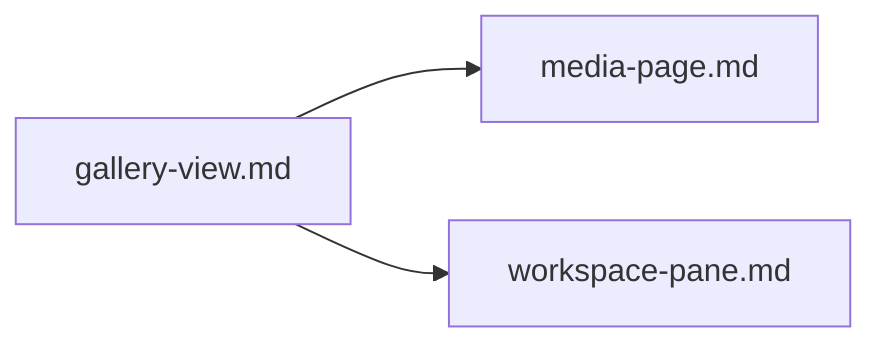
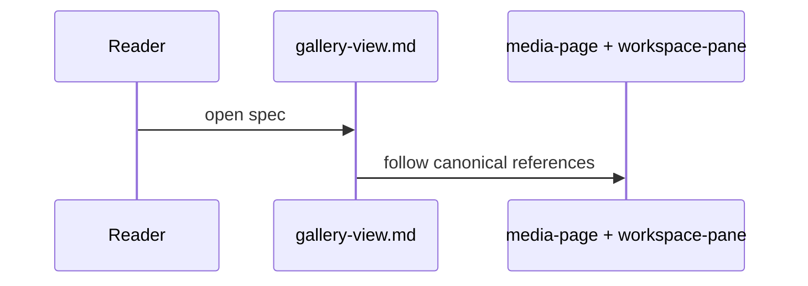

# Gallery View (Deprecated)

## What It Is

Deprecated compatibility alias for the old gallery concept.
Implementation must use `media-page.md` and `workspace-pane.md`.

## What It Looks Like

No standalone UI. This alias resolves to the media page with the persistent workspace pane.

## Where It Lives

- Alias only (no route ownership)
- Canonical route: `/media`
- Canonical pane owner: `AppShellComponent`

## Actions

| #   | User Action                | System Response             | Notes             |
| --- | -------------------------- | --------------------------- | ----------------- |
| 1   | Opens this deprecated spec | Redirect to canonical specs | Read-only pointer |

## Component Hierarchy

```
GalleryViewAlias
└── RedirectTo
		├── media-page.md
		└── workspace-pane.md
```

## Data Requirements

| Source | Fields Needed | Purpose           |
| ------ | ------------- | ----------------- |
| none   | none          | Pointer-only spec |

## State

| Name         | Type   | Default | Controls                               |
| ------------ | ------ | ------- | -------------------------------------- |
| `deprecated` | `true` | `true`  | Prevents implementation from this file |

## File Map

| File                                   | Purpose                           |
| -------------------------------------- | --------------------------------- |
| `docs/element-specs/gallery-view.md`   | Backward-compatible redirect spec |
| `docs/element-specs/media-page.md`     | Canonical media page behavior     |
| `docs/element-specs/workspace-pane.md` | Canonical pane behavior           |

## Wiring





## Acceptance Criteria

- [x] Deprecated status is explicit
- [x] Canonical replacement specs are listed
- [x] No implementation guidance is duplicated here
