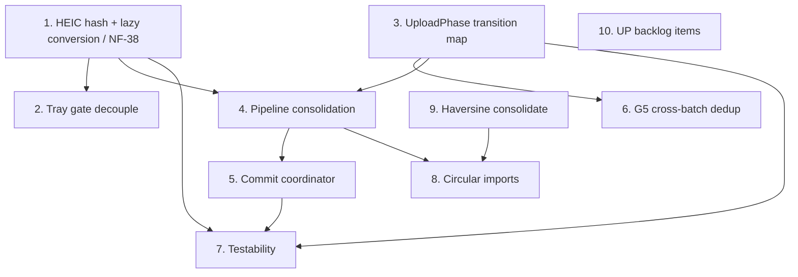

# 06 — Post-integration improvement plan

**Compiled:** 2026-09-10 · **Branch:** `cursor/upload-fixes-integration-3be6` (PR #128 stacked on `cursor/upload-flow-review-3be6`).

This document records the structural work that remains after the NF-01…NF-37 integration pass. NF-01…NF-37 are treated as **addressed** unless noted open in [`02-new-issues.md`](./02-new-issues.md). A new finding from this investigation — **NF-38** (HEIC dedup fingerprint instability) — is recorded there and cross-referenced below.

**Method:** Static reading of `apps/web/src/app/core/upload/**` and related specs. Every `path:line` anchor was re-verified against integration-branch HEAD.

**Related documents:**

| Document | Role |
| --- | --- |
| [`01-flow-walkthrough.md`](./01-flow-walkthrough.md) | What the flow is trying to do |
| [`02-new-issues.md`](./02-new-issues.md) | NF-01 … NF-38 findings |
| [`03-hard-cases-and-decisions.md`](./03-hard-cases-and-decisions.md) | Decisions expensive to revisit; reversals in § H |
| [`04-status-of-prior-findings.md`](./04-status-of-prior-findings.md) | UP-xx re-measured status |
| [`05-address-resolution-and-ui-findings.md`](./05-address-resolution-and-ui-findings.md) | NF-17 … NF-37 (address resolution and UI) |

---

## Open questions answered

### 1. Which file does the content hash read for a HEIC photo?

**Answer: the converted JPEG, not the original HEIC.** See [**NF-38**](./02-new-issues.md) § 3.

| Step | Evidence |
| --- | --- |
| HEIC conversion swaps `job.file` to JPEG | `core/upload/support/upload-heic-prepare.util.ts:33` (`applyConvertedFileToJob`) |
| Conversion runs and is awaited before dedup (new) | `core/upload/pipelines/new/upload-new-prepare-route.util.ts:185-213` |
| Dedup gate follows prepare | `core/upload/pipelines/new/upload-new-pre-resolve.util.ts:336` → `finishPreResolveDedup` at `:161` |
| Hash reads `job.file` | `core/upload/support/upload-dedup-check.util.ts:91` |
| `readFileHead(file)` + `file.size` | `core/upload/support/content-hash.util.ts:121-127` |
| EXIF metadata from original parse | `core/upload/pipelines/new/upload-new-prepare-route.util.ts:179-181`; combined at `content-hash.util.ts:128-132` |
| Encoder | `core/upload/support/upload.service.util.ts:142-143` (`heic2any`, quality `0.85`) |
| Attach / replace same ordering | `core/upload/pipelines/attach/upload-attach-pipeline.service.ts:170-197`; `core/upload/pipelines/replace/upload-replace-pipeline-run.util.ts:103-127` |

**Consequence:** Dedup for HEIC depends on byte-identical `heic2any` output. The EXIF component does not rescue a changing 64 KiB head and file size. Duplicate detection can silently never fire for the primary input format. **Fix:** item 1 below (also NF-38).

---

### 2. What does the resolver tray readiness gate require, and why conversion?

**Answer:** Every live job on the active tray item must be in `awaiting_disambiguation` **and** `!isHeic(job.file)`. Conversion is required as a **Phase 0 completion proxy**, not because tray questions need JPEG bytes.

| Evidence | Location |
| --- | --- |
| Gate predicate | `core/upload/address-resolution/upload-tray-resolution-gate.helpers.ts:12-19` |
| Spec contract | `docs/specs/service/media-upload-service/upload-manager-pipeline.location-routing.supplement.md` § Tray Continue gate (`:63-68`) |
| Tray can open before prepare | `core/upload/location/upload-location-disambiguation-registration.service.ts:91-92` (`classifyBatch` path) |
| Text-answer exception | `features/upload/upload-resolver-tray/upload-resolver-tray.component.ts:198-199` |

**Incidental coupling:** Folder/filename questions have no dependency on converted bytes. iPhone users can wait on `heic2any` before answering a folder-structure question because `classifyBatch` sets `awaiting_disambiguation` while `job.file` is still HEIC.

---

### 3. Ordering and concurrency: HEIC vs EXIF vs dedup (new pipeline)

**Answer:** In `prepareExifAndFile`, EXIF parse and HEIC conversion start **in parallel** on the original file; both are **awaited** before return. Dedup runs **after** in `runPreUploadLocationResolve`.

| Step | Phase(s) | Location |
| --- | --- | --- |
| Validate | `validating` | `core/upload/pipelines/new/upload-new-prepare-route.util.ts:67-72` |
| EXIF ∥ HEIC (await both) | `parsing_exif` → `converting_format` | `:178-213` |
| Title merge | `extracting_title` | `core/upload/pipelines/new/upload-new-pre-resolve.util.ts:327` |
| Hash + dedup | `hashing` → `dedup_check` | `:336` → `core/upload/support/upload-dedup-check.util.ts:90-97` |
| Location resolve (may hold) | `resolving_location` / `awaiting_disambiguation` | pre-resolve util |
| Upload HEIC safety net | `uploading` | `core/upload/pipelines/new/upload-new-run-upload-phase.util.ts:71` |

**Attach/replace:** sequential — EXIF, then HEIC, then dedup (no parallelism).

**Work discarded** after `prepareExifAndFile` when a file is skipped (dedup), stranded in Issues, or cancelled: EXIF parse, HEIC conversion, title merge, hash computation, and any geocode work if location resolution already ran. Jobs held in `awaiting_disambiguation` from `classifyBatch` before prepare incur none of that until `drainQueue` reaches them.

---

### 4. Is conversion output reused across pipelines?

**Answer: Yes — singleflight per `jobId`, shared module, not recomputed per pipeline invocation.**

| Evidence | Location |
| --- | --- |
| Shared util + singleflight map | `core/upload/support/upload-heic-prepare.util.ts:17`, `:65-86` |
| Used by new / attach / replace | `upload-new-prepare-route.util.ts:185`; `upload-attach-pipeline.service.ts:170`; `upload-replace-pipeline-run.util.ts:103` |
| Upload gate no-op when already JPEG | `upload-heic-prepare.util.ts:97-105` |

Conversion is not cached across different jobs. Map entry cleared in `finally` (`:82-84`).

---

## Ranked improvement plan

Ordered by value (correctness and regression-prevention first). Each item: problem → proposed change → cost → risk → **Change class** per `AGENTS.md`.

---

### 1. Fix HEIC dedup fingerprint stability (NF-38)

**Problem:** Hash reads converted JPEG bytes ([**NF-38**](./02-new-issues.md)). Dedup silently fails for HEIC if `heic2any` output varies. Undermines NF-01 (hash retirement keyed on `contentHash`) and NF-04 (in-flight registry keyed on `contentHash`).

**Proposed change:**
- Hash **original** source bytes (first 64 KiB + size) + EXIF from original parse for `photo_v1`.
- Move HEIC conversion to **after** the dedup gate, immediately before storage write.
- Update `upload-manager-pipeline.dedup-scope.supplement.md` to state fingerprint is from source bytes, not stored format.

**Cost:** Touch prepare path in all three pipelines, dedup util, HEIC util ordering; red-test-first case (same HEIC hashed twice after independent conversions → identical fingerprint when using source bytes).

**Risk:** Re-validate post-conversion size cap (NF-08) at new conversion site. Preview thumbnails may still use HEIC object URLs until conversion — behavior-only.

**Change class:** **Sensitive** — upload pipeline + dedup semantics. Full ceremony including red-test-first.

**Depends on:** Nothing. Decide before pipeline consolidation (item 4).

---

### 2. Decouple tray Continue gate from HEIC conversion

**Problem:** Folder/filename tray questions block on `heic2any` because `classifyBatch` can set `awaiting_disambiguation` before Phase 0 (`upload-location-disambiguation-registration.service.ts:91-92`).

**Proposed change:**
- Replace `!isHeic(job.file)` with explicit flag (e.g. `filePrepareComplete` or `exifParsed`) set at end of `prepareExifAndFile`.
- Tray gate for option-list steps: require flag only where needed; `layer_package` / `admin_level_conflict` may need no file-prepare gate.
- Keep `awaitHeicConversionForUpload` before storage write.
- Update spec § Tray Continue gate.

**Cost:** Small core change + unit tests on `upload-tray-resolution-gate.helpers.ts`.

**Risk:** Must not allow upload before conversion. NF-12 text-answer exception becomes less special if gate is kind-aware.

**Change class:** **Sensitive** — upload pipeline + tray orchestration.

**Depends on:** Best done with item 1; can ship independently using `exifParsed` instead of `!isHeic`.

---

### 3. `UploadPhase` transition map and guarded transitions (UP-11)

**Problem:** 20 reachable phases, no transition map. Six user actions write `phase` directly via `updateJob` (`core/upload/manager/upload-manager-actions.util.ts:66-67`, `:140-141`, `:157-158`, `:283-286`, `:310-312`). `failJob` has terminal guard (`core/upload/support/upload-job-state.service.ts:182-186`) but no legal-transition enforcement. Only `Record<UploadPhase, …>` is presentation (`features/upload/upload-phase.helpers.ts:20`).

**Proposed change:**
1. Add `upload-phase-transitions.ts`: map, `canTransition(from, to)`, terminal set, idempotency rules.
2. Route all phase writes through `setPhase` or `transitionTo(jobId, next, reason)`.
3. Red-test-first: illegal transitions must fail.
4. Document terminal phases and idempotency in `upload-manager.md`.

**Cost:** Medium-invasiveness across `core/upload/**` and panel actions. No product behavior change if map matches current practice.

**Risk:** Low if map is inventory-derived from existing writers.

**Change class:** **Sensitive** — stateful service FSM.

**Depends on:** Nothing. **Blocks item 12 (phase collapse).**

**What the map buys:** Safe refactors, enforceable idempotency, CI guard, foundation for collapsing 20 → 13–15 phases (H3).

---

### 4. Consolidate three pipelines around shared prepare + commit tails

**Problem:** NF-01…NF-10 pattern — every hardening fix landed three times. Merge extracted timeout + HEIC helpers; attach/replace/new still duplicate validate → EXIF → convert → dedup → upload → postwrite.

**Proposed change — shared layers:**

| Layer | Shared module | Pipelines |
| --- | --- | --- |
| Prepare | `upload-pipeline-prepare.util.ts` | validate, EXIF, lazy HEIC (after item 1), dedup |
| Storage write | `runStorageUploadWithTimeout` + `persistUploadFile` | all three |
| Post-write | `upload-db-postwrite.util.ts`, cancel residue | all three |
| Mode tail | thin adapters | new / attach / replace |

**Must stay separate:**
- **New:** pre-resolve location, conflict check, missing-data routing.
- **Attach:** link to existing row, `verifyStoragePathWrite`, no row delete on cancel.
- **Replace:** `oldStoragePath` restore on cancel (NF-02), `retireStaleDedupHashes` (NF-01), row update not insert.

**Cost:** ~15–20 files, mostly extraction. Existing replace/attach specs are safety net.

**Risk:** Regression in cancel semantics if replace/attach tails forced into new-pipeline shape.

**Change class:** **Sensitive** — upload pipeline.

**Depends on:** Item 1 (HEIC/dedup order) should land first or be designed into shared prepare contract.

---

### 5. Commit point: intent-before-bytes

**Problem:** Storage write and `media_items` insert are two systems with no transaction (`core/upload/support/upload-file-persist.util.ts:92-101` storage, `:190-213` insert; rollback on DB failure `:215-219`). Per-call-site cleanup handles known windows; each new path must remember cleanup.

**Proposed change (incremental):**
- Track `persistStage: 'none' | 'storage_written' | 'row_committed'` on job.
- Central `UploadCommitCoordinator`: write storage → insert row → on failure/cancel, cleanup from stage.
- Replace path uses **restore** branch, not delete-row.
- Sign-out guard calls coordinator for in-flight jobs.

**Cost:** Medium — new support service + migrate three tails. No migration for v1.

**Risk:** Over-engineering if API too abstract. Start with stage enum + single `abortJobPersist(job)`.

**Change class:** **Sensitive** — upload pipeline, data integrity.

**Depends on:** Item 4 makes this cheaper; can prototype on new pipeline first.

**Assessment:** Storage-then-row shape is correct for browser client. Problem is cleanup is call-site-driven, not state-driven.

---

### 6. G5 — Cross-batch tray dedup (F3)

**Problem:** Second folder drop re-asks a question already pending for the first (`03-hard-cases-and-decisions.md` F3; G5 in `contradiction-resolution-model.md`).

**Proposed change:** Session-scoped index keyed by `(field, conflicting-value-set)`: reuse resolved answer, merge `jobIds` into open tray, skip duplicate Photon call.

**Cost:** Orchestrator + tray producer + integration spec. No DB migration.

**Risk:** Stale merge if first batch cancelled mid-tray — needs idempotency (item 3).

**Change class:** **Sensitive** — address resolution orchestrator.

**Depends on:** Item 3 recommended first for tray group lifecycle.

---

### 7. Testability — raise confidence without live backend/browser

**Problem:** Cancel timing, sign-out, replace restore, folder DnD hard to prove in CI; UP-32 mojibake fixtures block umlaut path.

| Action | Value | Cost | Class |
| --- | --- | --- | --- |
| Fix UP-32 fixtures in `apps/web/public/vienna_sample_photos/` | Unblocks umlaut tests | Low | **Trivial** |
| Commit real device-exported HEIC fixture (repo has zero `.heic`/`.heif` files; `vienna_sample_photos/` is JPEG-only) | Exercises primary iPhone input format in CI; closes NF-38 measurement caveat | Low | **Trivial** |
| Extend `upload-folder-upload.integration.spec.ts` pattern: cancel mid-upload, sign-out before/after storage, replace cancel after row update | High | Medium | **Sensitive** when gating pipeline |
| Transition map property tests (item 3) | High | Low | **Standard** |
| NF-38 experiment: convert same HEIC twice, compare bytes + hash | **Done (2026-09-10):** byte-identical output across 5 runs + 2 Chrome processes; latent risk only — see [`02-new-issues.md`](./02-new-issues.md) § 3 (NF-38) | — | — |
| Document LIVE VERIFICATION block for replace cancel + sign-out residue | Required for Sensitive merges | Low | **Trivial** |
| Playwright in CI | Highest fidelity | High env cost | **Not recommended now** |

**Depends on:** Items 1, 3, 5 for targeted tests.

---

### 8. Break circular imports (UP-26, ~20 cycles)

**Problem:** `UploadLocationResolutionService` ↔ `UploadManagerService` ↔ pipelines; `injector.get` workarounds (`upload-location-disambiguation-registration.service.ts:26-28`).

**Proposed change:** Narrow event/port interfaces; target 0 cycles via `madge --circular`.

**Cost:** Medium — import rewiring, no behavior change.

**Risk:** Incomplete extraction recreates cycles.

**Change class:** **Standard**.

**Depends on:** Item 4 — do after or in same pass.

---

### 9. Consolidate haversine copies (UP-47)

**Problem:** Multiple private `haversineMeters` copies (`core/upload/location/upload-location-resolution.helpers.ts:354`; `upload-location-precedence.helpers.ts:41`; `upload-new-post-save.util.ts:308`; `core/search/search-bar-helpers.ts:245`; plus `disambiguation-algorithms.ts`, `search-engine.ts`).

**Note:** The UI-layer import violation cited in UP-26 (`features/…/search-bar-helpers`) is **fixed** on integration branch — `upload-location-tray-producer.adapter.ts:13-19` imports from `upload-location-precedence.helpers.ts`.

**Proposed change:** Single `core/geo/haversine.util.ts`; replace copies.

**Cost:** Low.

**Risk:** Minimal.

**Change class:** **Trivial** to **Standard**.

---

### 10. Remaining UP backlog (post-integration)

| Rank | ID | Problem | Action | Class |
| --- | --- | --- | --- | --- |
| 1 | UP-32 | Mojibake sample photos | Fix fixtures | **Trivial** |
| 2 | UP-05 | `beforeUnloadHandler = () => {}` (`upload-manager.service.ts:239`) | Wire `preventDefault` + i18n when busy | **Standard** |
| 3 | UP-14 | `revokeLocalUrl` never called (`media-download.service.ts:382-383`) | Call on job remove/complete/cancel | **Standard** |
| 4 | UP-09 | Direct `phase:` via `updateJob` in actions | Absorbed by item 3 | **Sensitive** |
| 5 | UP-36 | `enrichWithReverseGeocode` no-op (`upload-enrichment.service.ts:43-47`) | Implement or remove cosmetic `resolving_address` phase | **Standard** / **Trivial** |
| 6 | UP-27 | Scattered `.from()`/`.rpc()` | `UploadDbAdapter` incrementally | **Standard** |
| 7 | UP-34 | "Requeue at front" documented but not implemented | Implement or delete spec comments | **Standard** |
| 8 | UP-25 | Duplicate `ImageUploadedEvent` types | Alias consolidation | **Trivial** |
| 9 | UP-29 | English via `job.error` / raw `statusLabel` | i18n keys for service errors | **Standard** |
| 10 | UP-37 | 64 KiB truncation undocumented | Spec doc (or revisit with item 1) | **Trivial** |

---

### 11. Unbuilt features — build, defer, or remove from specs

| Feature | User impact | Recommendation |
| --- | --- | --- |
| **G5** Cross-batch dedup | **High** — duplicate tray on second folder | **Build** (item 6) |
| **G4** Deferred-address lifecycle | Medium — Skip writes `failed` + `pendingPartialLocation` | **Build** if product wants "answer later", or **remove** G4 AC from specs |
| **G1** Sibling-folder conflict | Low frequency | **Remove from active AC** unless product confirms; move to backlog appendix |
| **C5** `context_distance` tray | None — filter ships, tray never fires (NF-15) | **Remove** from union + spec table or mark deferred indefinitely |

Per `AGENTS.md` Change-Completeness Rule: specs with unchecked AC for unbuilt behavior are a trust problem.

---

### 12. Phase collapse (20 → 13–15)

**Problem:** Phase noise in UI and subscribers.

**Proposed change:** **None now.**

**Reason:** Rejected in H3 — collapse without transition map is a behavior change. Map must exist first.

**Change class:** **Sensitive** when attempted.

**Depends on:** Item 3 complete + tests per merged phase.

---

## Dependency ordering

**Correctness track:** 1 (NF-38) → 2 → 3 → 5 → 6  
**Maintainability track:** 3 → 4 → 8 → 9  
**Quick wins (parallel):** UP-32, UP-05, UP-14, UP-25

**Blocked-by summary:**
- Phase collapse (12) blocked by transition map (3).
- G5 (6) benefits from transition/idempotency rules (3).
- Pipeline consolidation (4) should follow NF-38 fix (1).
- Commit coordinator (5) cheaper after consolidation (4).

---

## Correctness vs developer experience

| Correctness (user data / behavior) | Developer experience |
| --- | --- |
| NF-38 / HEIC hash stability (item 1) | Circular import breakup (8) |
| Transition map + idempotency (3) | Haversine consolidation (9) |
| Commit coordinator (5) | Supabase adapter layer (UP-27) |
| G5 cross-batch dedup (6) | Phase collapse (12, later) |
| Replace/attach/new parity via consolidation (4) | `beforeunload` wiring (UP-05) |
| Fix mojibake fixtures (UP-32) | Spec line-count (UP-38) |

---

## Recommend against

| Proposal | Reason |
| --- | --- |
| **Collapse `UploadPhase` to ~5 now** | H3: all 20 phases reachable; collapse changes UX and events without a guard. |
| **Server-side same-user dedup → attach new address to existing row** | H1: shipped and reverted 2026-06-29; client cannot know existing row addresses. |
| **Hash converted JPEG without fixing algorithm** | Current path is strictly worse than hashing original HEIC for dedup stability (NF-38). |
| **Build C5 `context_distance` tray without product sign-off** | Filter ships; tray never written (NF-15). |
| **Build G1 sibling-folder tray preemptively** | High complexity, rare case; demote spec instead. |
| **Full single-pipeline rewrite** | Replace cancel semantics differ (restore vs delete). Extract shared tails (4), do not merge modes. |
| **Playwright in CI in this environment** | No display server; invest in integration specs + LIVE VERIFICATION. |
| **Implement reverse-geocode enrichment as no-op phase** | Either wire `enrichWithReverseGeocode` (UP-36) or stop emitting `resolving_address` to users. |
| **Re-fix NF-01…NF-37** | Addressed in integration pass; re-audit only with live DB for migration `20260910120000`. |

---

## Changes from original investigation draft

| Item | Change | Why |
| --- | --- | --- |
| UP-26 haversine UI import | **Removed** from item 9 problem statement | Fixed on integration branch — tray producer imports from `upload-location-precedence.helpers.ts:13-19`, not `features/…/search-bar-helpers` |
| Integration status | NF-01…NF-37 treated as addressed | Per integration pass on `cursor/upload-fixes-integration-3be6` |
| NF-38 | **Added** as new high finding | Discovered during open-question investigation; not among NF-01…NF-37 |
| UP-10 `failJob` terminal guard | **Not listed as open** | Fixed in integration pass (`04-status-of-prior-findings.md` § 6) |
| UP-07, UP-12, UP-23, UP-24, UP-33, UP-43–46 | **Removed from open backlog** | Fixed in integration pass |
