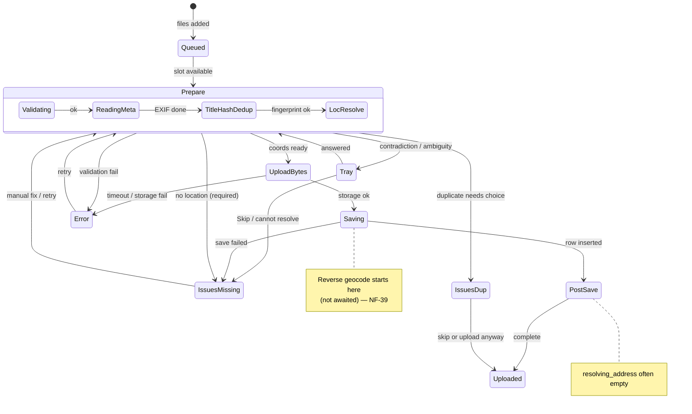

# 07 — What happens when (product walkthrough)

**Audience:** Product owner and anyone who needs to understand the upload flow without reading code.  
**Scope:** The **new** pipeline (`submit()` → add photos), **non-HEIC** happy path, plus the branch points that send a job elsewhere.  
**Measured:** 2026-09-10 against HEAD on branch `cursor/upload-heic-hash-order-3be6`.

For line-level evidence and open defects, see [`02-new-issues.md`](./02-new-issues.md) (especially **NF-39** § 3) and the ranked plan in [`06-improvement-plan.md`](./06-improvement-plan.md).

---

## 1. What you are watching

When someone adds photos through the upload panel, each file becomes one **job** with a **phase** label (for example "Uploading…", "Saving…"). The panel groups jobs into three **lanes**:

| Lane | Meaning |
| --- | --- |
| **Uploading** | Work in progress, or waiting on you in the resolver tray |
| **Issues** | Stuck — needs a decision, a manual address, or a retry |
| **Uploaded** | Finished from the pipeline's point of view |

There is no stored "lane" in the database. The UI derives it from the phase and a few flags every time it renders.

---

## 2. Phase by phase — happy path (JPEG, folder with a street address)

Example: user picks folder `Baustelle Wien Getreidegasse 9/` containing `IMG_0001.jpg` with GPS in the photo. Everything agrees; no tray question.

Phases appear in the order the user typically sees them. **Real work?** means whether the label matches substantial work at that moment.

| Phase | What you see | What the code is doing | Rough duration | Real work? |
| --- | --- | --- | --- | --- |
| *(before queue)* | Rows appear; may flash "Scanning…" on a big folder | **Batch classify** — reads folder names and filenames once for the whole drop, builds a shared "Search Object" address, assigns a grouping key so similar files share one geocode | Under a second to a few seconds | **Yes** — parsing and grouping |
| `queued` | "Queued" | Job waits for a free slot (up to 3 files at once) | Usually instant | **Label only** — waiting |
| `validating` | "Validating…" | Checks file type and size (25 MiB cap) | Instant | **Yes** |
| `parsing_exif` | "Reading metadata…" | Reads GPS, capture date, camera direction from the file | Under a second | **Yes** |
| `converting_format` | *(skipped for JPEG)* | HEIC-only step | — | — |
| `extracting_title` | "Checking filename…" | Merges folder path and filename into a text address on the job | Instant | **Yes** |
| `hashing` | "Computing hash…" | Fingerprints file bytes + EXIF for duplicate detection | Under a second | **Yes** |
| `dedup_check` | "Checking duplicates…" | Asks the database whether this fingerprint already exists | Under a second | **Yes** |
| `resolving_location` | "Resolving location…" | **Forward geocode** — turns folder text ("Getreidegasse 9, Wien") into map coordinates via Photon | About 1–3 seconds (network) | **Yes** — this is the main geocode wait on this path |
| `conflict_check` | "Checking conflicts…" | If the batch is tied to a project, checks for "photoless address" conflicts | Instant to ~1 s | **Yes** when a project is selected; quick no-op otherwise |
| `uploading` | "Uploading…" | Sends file bytes to cloud storage | Seconds (file size + network) | **Yes** — largest wait |
| `saving_record` | "Saving…" | Inserts the `media_items` row and links storage. **Also starts reverse geocode in the background** if the job has coordinates — turns GPS into a street address line in the database, but **does not wait for it** | Usually under a second for the row; reverse geocode may continue after | **Yes, but mislabeled** — label says "Saving…" while street lookup already started ([**NF-39**](./02-new-issues.md)) |
| `resolving_address` | *(often skipped on this path)* | If shown: label says "Resolving address…" but the awaited method is **empty** — no work here | Instant if shown | **No — false signal** when it appears on GPS-only paths |
| `resolving_coordinates` | *(skipped when coords already set)* | Forward-geocodes a text address after save when coords were missing | 1–3 s when it runs | **Yes** when it runs |
| `complete` | Row moves to **Uploaded** | Job marked done; map and media grid get patched | Instant | **Yes** for pipeline bookkeeping — but **street address may still be loading or may never arrive** ([**NF-39**](./02-new-issues.md)) |

**Takeaway for the happy path with a named folder:** Most location work you wait on is **forward** geocode under "Resolving location…". The **reverse** geocode that fills in the readable street line runs later under "Saving…", is not awaited, and can fail without changing the green completion.

---

## 3. Alternate happy path — camera roll, no address in the folder name

Example: folder `Fotos/` and `IMG_1234.jpg` with GPS only.

| Difference | Effect |
| --- | --- |
| Batch classify | Little or no street text from the path — placement comes from EXIF GPS in pre-resolve |
| `resolving_location` | May be shorter or skipped depending on confidence path |
| `saving_record` | Still starts **reverse** geocode in the background |
| `resolving_address` | **Usually shown** — user sees "Resolving address…" but **nothing runs**; real work already started under Saving |
| `complete` | Arrives before the street line is guaranteed |

This is the path where [**NF-39**](./02-new-issues.md) hurts most: the user sees an address-resolution label, then Uploaded, and may still have coordinates with no street.

---

## 4. Branch points — what sends a job somewhere else

### Resolver tray (still in Uploading lane)

**When:** Sources disagree or the system cannot pick one address (contradiction), or a folder structure needs a choice before geocoding.

**What you see:** "Choose address" and a tray card with one question at a time.

**What you do:** Pick an option and Continue, or Skip (Skip forfeits address placement for that group — see spec warnings in [`03-hard-cases-and-decisions.md`](./03-hard-cases-and-decisions.md)).

**Phase:** `awaiting_disambiguation` (tray may also show earlier `resolving_location` while geocode runs).

### Issues lane — `missing_data`

**When:**

- Required location mode and **no** usable GPS and **no** usable text address after resolution.
- Forward geocode after save failed for a required job.
- Dedup found a match that needs a human choice (duplicate handling).

**What you see:** Issues row — "Missing location", "Choose location or project", or duplicate messaging.

**What you do:** Enter address manually, assign to a project, upload anyway (duplicate), or dismiss/cancel depending on issue kind.

**Phases:** `missing_data`, sometimes preceded by `skipped` for auto-dedup skip.

### `skipped`

**When:** Duplicate detected and policy says auto-skip (same uploader, existing row).

**What you see:** Issues lane — "Already uploaded".

**What you do:** Open existing media or dismiss.

### `error`

**When:** Validation failure, storage timeout (180 s), DB insert failure, HEIC conversion failure, etc.

**What you see:** Issues or error styling with message; Retry may be available.

**What you do:** Retry or cancel.

**Note:** Reverse geocode failure does **not** send a job here — it silently marks the row `unresolvable` while the job still completes ([**NF-39**](./02-new-issues.md)).

---

## 5. State diagram (spine + branches)

---

## 6. Two geocoding directions (the confusing part)

Geocoding is not one thing. The upload pipeline uses two opposite directions at different times.

### Forward — text → coordinates

**Question answered:** "Where on the map is this address?"

**Typical source:** Folder path and filename — the dominant case for construction uploads.

**Example:** Folder `Baustelle Wien Getreidegasse 9/` → system parses "Getreidegasse 9, Wien" → **Photon forward geocode** → pin on the map before bytes upload.

**When you wait on it:** Mostly under **"Resolving location…"** (`resolving_location`), before upload.

### Reverse — coordinates → text

**Question answered:** "What is the street address at this GPS point?"

**Typical source:** Camera EXIF GPS when there is no trustworthy text address, or after coords are already chosen.

**Example:** Folder `Fotos/` with only `IMG_1234.jpg` and GPS → pin from EXIF → after save, **Nominatim reverse geocode** (via Supabase `/geocode`) → should fill "Getreidegasse 9, 1010 Wien" on the record.

**When it runs today:** During **"Saving…"** (`saving_record`), fire-and-forget — not under "Resolving address…" despite that label ([**NF-39**](./02-new-issues.md)).

### Why this feels backwards

Folder-first workflows train you to think location = reading the path. That is **forward** geocode, and it is awaited in pre-upload resolve.

**Reverse** geocode is a second pass for the human-readable line on the database row. It is easy to assume it happens when the UI says "Resolving address…" — it does not; that phase is wired to an empty method while the real call already started under Saving.

---

## 7. Related reading

| Document | Use when |
| --- | --- |
| [`01-flow-walkthrough.md`](./01-flow-walkthrough.md) | Engineer-oriented end-to-end summary |
| [`02-new-issues.md`](./02-new-issues.md) § 3 (NF-39) | Evidence chain and failure modes |
| [`06-improvement-plan.md`](./06-improvement-plan.md) item 13 | Open product choices for fixing NF-39 |
| [`../upload-process-analysis-2026-09-08/02-happy-path.md`](../upload-process-analysis-2026-09-08/02-happy-path.md) | 36-step trace with `path:line` anchors |
