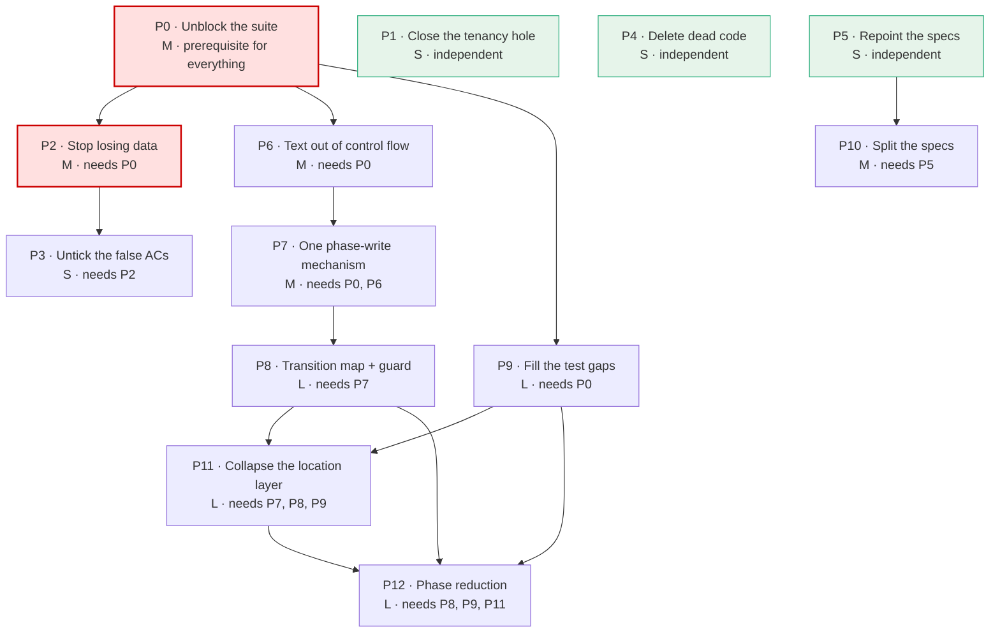

# 11 — Fix and refactor proposals

**Companion to** [`10-findings.md`](./10-findings.md). Every proposal maps to finding IDs there.

**Nothing in this audit was implemented.** This pass changed no file under `apps/web/src/app/**`, `supabase/migrations/**` or `docs/specs/**` (plan § 1.1, § 7). Each proposal below is sized, sequenced and given a PR boundary so a follow-up agent can pick one up without re-deriving the analysis.

**Change class** is declared per proposal using root `AGENTS.md` § Change Classification. Note that rule's own words: *"the upload pipeline"* is named as a **Sensitive**-class example, so most of what follows carries full ceremony — ownership matrix, FSM tables, `/security-review`, the matching `validate-*-rls.sql`, LIVE VERIFICATION, and a fresh-context adversarial review by a different agent than the implementer. **Red-test-first is a Hard Blocker for all of them**, which is why P0 exists.

---

## 0. Gate status at the end of this audit

Plan § 9 requires the gates to be re-run and `lint:specs` compared against the Phase 0 baseline.

| Gate | Phase 0 baseline | End of audit | Verdict |
| --- | --- | --- | --- |
| `npm run lint:specs` | 183 specs, **201 errors, 32 warnings** | 183 specs, **201 errors, 32 warnings** | **unchanged** ✅ — new markdown under `docs/audits/` is outside `shouldIncludeSpecFile()` in `scripts/lint-specs.mjs`, as plan § 9 predicted |
| `npm run i18n:check` | `violations=0` | `violations=0` | unchanged ✅ |
| `npm run design-system:check` | green | green | unchanged ✅ (no `docs/design` or SCSS file touched) |
| `cd apps/web && npm run lint` | 151 errors, 1068 warnings | 151 errors, 1068 warnings | unchanged ✅ (baseline comparison only) |
| `cd apps/web && npx ng build` | green | green | unchanged ✅ |
| `cd apps/web && npx ng test --watch=false` | **RED** — 101 TS errors, 0 tests run | **RED** — identical | unchanged; see P0 |

---

## 1. Sequence



Red = do first. Green = independently shippable today, no prerequisite.

---

## 2. Proposals

### P0 — Make the unit suite compile again

**Status: done (partial scope), 2026-09-09.** The 11 upload-scope errors were fixed so upload specs compile and run in isolation (`npx vitest run --dir src/app/core/upload`); the remaining ~90 errors across unrelated spec files were left out of scope. `npx ng test --watch=false` for the whole repo is therefore still red — see the individual fix commits on `claude/upload-process-analysis-0mnzwr`.

| | |
| --- | --- |
| **Findings** | UP-03 |
| **Severity / effort** | blocker / **M** |
| **Class** | Standard (test-only diff), but it gates all Sensitive work |
| **Prerequisites** | none |
| **PR boundary** | one PR, spec files only; no production file changes |

101 TypeScript errors across 26 spec files stop the compiler before a single test runs. Eleven are in upload scope, and six of those are stale-test drift — e.g. `core/upload/location/upload-location-resolution.service.spec.ts:39` still uses `'source_conflict'`, a `UploadJobIssueKind` member that no longer exists.

**Do not "fix" a spec by loosening a type.** Each error is evidence: a spec asserting a removed union member is a test for deleted behaviour and should be deleted, not cast away. Triage each into *stale (delete)*, *drifted (update the assertion)*, or *genuinely broken fixture (repair)*.

**Done when** `npx ng test --watch=false` exits 0 and reports a pass/fail count for all 326 tests. Record that count — it is the first real coverage number this repository will have had in this audit's frame of reference.

> Everything that follows is unverifiable until this lands. Root `AGENTS.md` § Red-test-first makes a failing-then-passing test a Hard Blocker for Sensitive work, and today no test can be made to fail.

---

### P1 — Close the cross-tenant read in `find_photoless_conflicts`

**Status: done, 2026-09-09.** Migration + client-side change landed, red-test-first. LIVE VERIFICATION (`supabase migration list` against the hosted schema) and the fresh-context adversarial review still need a human/different agent — see the commit for the exact caveat.

| | |
| --- | --- |
| **Findings** | UP-01 |
| **Severity / effort** | blocker / **S** |
| **Class** | **Sensitive** — RLS + migration |
| **Prerequisites** | **none — ship this independently and first** |
| **Affected specs** | none directly; add a note to `docs/security-boundaries.md` |
| **PR boundary** | one migration + the one-line client change |

Derive the tenant server-side instead of trusting the caller:

```sql
-- add to the photoless CTE
WHERE m.organization_id = public.user_org_id()
```

and drop `p_org_id` from the signature, since `apps/web/src/app/core/upload/support/upload-conflict.service.ts:54-59` only ever passes its own org. Dropping the parameter is the stronger fix: it makes the class of bug unrepresentable.

**Before merge, per `AGENTS.md` § Change Classification (Sensitive):** `/security-review`, the matching `validate-*-rls.sql`, and a check for whether any **other** repo RPC shares this shape — only the six upload-path RPCs were audited (`10-findings.md` § 4 #12).

**Verify first** (`10-findings.md` § 3): confirm the hosted definition matches the committed migration with `supabase migration list` before assuming the hole is live — and equally, before assuming it is not.

---

### P2 — Stop losing data on the failure paths

**Status: done, 2026-09-10 (all three sub-PRs — P2a, P2b, P2c).** Each landed red-test-first on `claude/upload-process-analysis-0mnzwr`; see the per-finding "Fixed" notes in `10-findings.md`. LIVE VERIFICATION and the fresh-context adversarial review required by `AGENTS.md` § Change Classification for Sensitive-class work are still open — flagged in every P2 commit message.

| | |
| --- | --- |
| **Findings** | UP-02, UP-04, UP-06, UP-13, UP-15, UP-35 |
| **Severity / effort** | blocker+high / **M** |
| **Class** | **Sensitive** — the upload pipeline, storage, DB writes |
| **Prerequisites** | **P0** (each fix needs a red test first) |
| **Affected specs** | `upload-manager.md` ACs, `upload-manager-pipeline.md` § Cancel |
| **PR boundary** | **split into three PRs** — they share a theme, not a mechanism |

**P2a — Storage/DB residue (UP-02, UP-04). Done.** One awaited cancellation routine that removes both the object and the row, replacing the four current ones (`06-health.md` § 1.1); plus the missing removal on the DB-error branch at `core/upload/support/upload-file-persist.util.ts:198-200`. Red tests first: T1 and T2 from `09-coverage.md` § 4.

**P2b — Timeout abort (UP-06). Done.** Abort the controller when the race rejects, so a late success cannot persist. Red test T4. Confirm first that the Supabase client honours the `signal` option passed at `upload-file-persist.util.ts:128` — it is inside a cast object literal, so the type system does not prove it exists. **Confirmed: it does not** — `.upload()` drops `signal` entirely (see `10-findings.md` UP-06); the shipped fix also cleans up a late-arriving success, not just the abort call this line originally asked for.

**P2c — Silent failures (UP-13, UP-15, UP-35). Done.** Guard the `classifyBatch` await; fail the job on an RLS read-back mismatch instead of logging and completing; give the dedup insert a rejection handler. Red tests T11, T14, T10.

**LIVE VERIFICATION is required** for all three (`AGENTS.md` § Change Classification), and the checks are named in `10-findings.md` § 3.

---

### P3 — Untick the acceptance criteria that are false

**Status: done, 2026-09-09.** All four edits landed in `upload-manager.md` (commit `85225509`).

| | |
| --- | --- |
| **Findings** | UP-02, UP-05, UP-17, UP-30 |
| **Severity / effort** | high / **S** |
| **Class** | Trivial (docs), but **do it in the same session as P2** per `AGENTS.md` § Feedback-to-Spec Sync |
| **Prerequisites** | P2 for the two that P2 makes true |
| **Affected specs** | `upload-manager.md:139,264,277,280` |

Four edits:

1. `:277` — untick orphaned-storage cleanup, or tick it *after* P2a lands.
2. `:280` — untick the `beforeunload` warning, or implement the handler (UP-05, a genuinely small fix worth folding into P2).
3. `:264` — reword to "**colleague** hash matches are resolved via explicit user decision", resolving the contradiction with `dedup.md` (UP-17). `dedup.md`'s resume-safety goal is the stronger argument and the code already follows it.
4. `:139` — sync the `issueKind` union to the 8 real members and drop `duplicate_photo` (UP-30), coordinated with P4 which deletes it from code.

A ticked-but-false AC is worse than an unticked one: it is the reason nobody has looked at UP-02.

---

### P4 — Delete the dead code

**Status: P4a, P4c, P4d, P4e done (2026-09-10). P4b and P4f not started** — P4b needs the deliberate `mockResolverTray` decision this proposal itself calls for below, not a unilateral one; P4f needs re-encode tooling this pass didn't build.

| | |
| --- | --- |
| **Findings** | UP-19, UP-20, UP-21, UP-22, UP-40, UP-41, UP-42, UP-48 |
| **Severity / effort** | medium+low / **S** |
| **Class** | Trivial per file, but see the caveat |
| **Prerequisites** | **none — independently shippable today** |
| **PR boundary** | **one PR per group**, so a revert is cheap |

| Group | Contents | LOC | Status |
| --- | --- | --- | --- |
| P4a | `features/upload/upload-panel/upload-panel-dialog-handlers.service.ts` (UP-19) | 316 | **Done** |
| P4b | `USE_TRAY_ORCHESTRATOR`, `UPLOAD_DEV_FLAGS.useTrayOrchestrator`, the 13 dead tray guards, `upload-resolver-tray.mock.ts` (UP-20) | ~200 | Not started |
| P4c | `upload-attach-hash.util.ts`, `upload-timeout.util.ts`, `upload.helpers.ts`, 7 dead exports, `issueKind:'duplicate_photo'` + its 10 readers, `UploadTrayStep '2'` (UP-21, UP-48) | ~120 | **Done**, except `upload.helpers.ts` — kept deliberately, it satisfies the module-symmetry rule |
| P4d | the project-tray remnant: stub, facade delegation, test-only helper (UP-22) | ~60 | **Done** |
| P4e | 7 committed refactor scripts under `apps/web/scripts/` (UP-42) | — | **Done** |
| P4f | mojibake re-encode across 11 files (UP-40) and console gating (UP-41) | — | Not started |

**Caveat on P4b.** `mockResolverTray` currently ships in the production bundle and is one constant away from seeding fixture data (`06-health.md` § 4). Decide deliberately whether to keep it as a dev affordance behind a build-time flag or remove it; do not delete it silently.

**Caveat on P4f.** Re-encode with a tool, not by hand, and keep it in its own commit — it rewrites whole files and would otherwise bury a real diff.

---

### P5 — Repoint every spec path

**Status: done, 2026-09-10.** All 6 findings resolved (UP-18 turned out to be refuted, not fixed — see its `10-findings.md` note). Added the CI guard script this proposal asked for (`scripts/check-spec-code-paths.mjs`, wired into `scripts/verify.mjs` as a `soft` check with the measured non-upload debt count — 263 broken paths across the wider `docs/specs/` tree that were out of this task's scope).

| | |
| --- | --- |
| **Findings** | UP-16, UP-18, UP-28, UP-49, UP-50, UP-39 |
| **Severity / effort** | medium / **S** |
| **Class** | Trivial |
| **Prerequisites** | **none — independently shippable today** |
| **PR boundary** | one PR; mechanical |

60 broken paths, with the current locations already resolved in `05-spec-drift.md` §§ 2.1–2.5 — the follow-up agent can copy them straight across. Plus:

- archive `docs/specs/component/upload/upload-button-zone.md` and remove the `upload-manager.md:241` wiring row, **or** record the component as planned (UP-18);
- archive `docs/playbooks/upload-manager-playbook.md` (UP-49) — its numbers are wrong by an order of magnitude and its central advice contradicts a Hard Blocker;
- add the three missing adapter specs and the `core/upload-resolver-tray-orchestrator` governance-registry entry (UP-28);
- fix the split table in `routing.md` (UP-50);
- regenerate or delete `lint-specs-full.txt` (UP-39) — a captured lint run in version control cannot stay honest, and this one already misled the plan that commissioned this audit.

**Add a guard so this cannot recur.** A CI script that resolves every code path referenced in `docs/specs/**` and fails on a miss would have caught all 60 the day they broke. Roughly 30 lines, sized `S`, and it belongs in this PR.

---

### P6 — Get user-facing text out of control flow

| | |
| --- | --- |
| **Findings** | UP-07, UP-08, UP-29 |
| **Severity / effort** | high / **M** |
| **Class** | **Sensitive** — stateful UI + the upload pipeline |
| **Prerequisites** | P0 |
| **Affected specs** | `upload-panel.feedback-triage.md`, `upload-panel.lane-and-row-actions.md` |
| **PR boundary** | two PRs |

**P6a — Cancellation (UP-08).** Add a `cancelled` phase, or a `cancelledAt`/`wasCancelled` field, and make `isCancelledUploadJob` read it. Today the regex is also why cancel is modelled as `error` and why the UI offers Retry on a cancelled job (`03-branch-matrix.md` Y3) — one fix, three symptoms.

**P6b — Issue kind (UP-07).** Make `job.issueKind` authoritative and delete the status-label fallback at `features/upload/upload-phase.helpers.ts:67-75`. That requires every producer to set `issueKind` explicitly, which is a small, well-bounded sweep of the five writers listed in `04-state-machine.md` § 2.

Then UP-29 becomes safe: with no control flow reading them, the error strings can be routed through i18n. Extend `scripts/check-i18n-hardcoded-literals.mjs` to scan TS string literals reaching `job.error` and `statusLabel`, otherwise the guard stays blind (`03-branch-matrix.md` § 7).

---

### P7 — One phase-write mechanism

| | |
| --- | --- |
| **Findings** | UP-09, UP-10, UP-36 |
| **Severity / effort** | high / **M** |
| **Class** | **Sensitive** — FSM |
| **Prerequisites** | P0, P6a (the `cancelled` phase changes what "terminal" means) |
| **Affected specs** | `upload-manager.md` § State, `upload-manager-pipeline.md` § State |
| **PR boundary** | one PR |

Route all 12 direct `phase:` writes through `setPhase`, add the terminal guard to `failJob`, and delete the cosmetic `resolving_address` phase (UP-36) — or move the real reverse-geocode work into it, which is the better fix if the phase is meant to mean something to the user.

Red tests first: T6, T7 from `09-coverage.md` § 4.

**This is the prerequisite for anything called "simplification".** Until every transition goes through one function, no reasoning about the state machine is sound.

---

### P8 — Declare the transition map

| | |
| --- | --- |
| **Findings** | UP-11 |
| **Severity / effort** | high / **L** |
| **Class** | **Sensitive** — FSM, and it needs a design decision |
| **Prerequisites** | P7 |
| **Affected specs** | `upload-manager.md`, `.cursor/rules/ui-state-machine.mdc` compliance |
| **PR boundary** | one PR: the map, the guard, the spec table, the tests |

`.cursor/rules/ui-state-machine.mdc` § Hard rules requires `Record<State, State[]>` plus a guard. Build it from the **actual** graph in `04-state-machine.md` § 4, not from an idealised one — including the awkward edges (`awaiting_disambiguation → queued`, `queued → complete`, `skipped → queued`), each of which is real and load-bearing.

Then declare terminal states and idempotency rules in the spec, and assert them in acceptance criteria, as root `AGENTS.md` § State-machine invariants requires. That closes S1–S6 in `04-state-machine.md` § 6.

---

### P9 — Fill the test gaps

| | |
| --- | --- |
| **Findings** | UP-03, UP-31, UP-32, and coverage for every P2/P6/P7 fix |
| **Severity / effort** | high / **L** |
| **Class** | Standard |
| **Prerequisites** | P0 |
| **PR boundary** | one PR per cluster |

The 16 tests in `09-coverage.md` § 4 are written as ready-to-implement descriptions. **All 16 run under Vitest with no browser and no backend.** Clusters:

| Cluster | Tests | Covers |
| --- | --- | --- |
| Data loss | T1, T2, T4, T10, T11, T14 | P2 |
| FSM | T6, T7 | P7 |
| Contract | T3, T8, T9, T12, T13, T16 | P3, P6, and two normative rules with no test today |
| Structural | T5, T15 | UP-23, and the 351 untested LOC of `replace` |

Also: replace the mock-driven tray test with one that exercises `upload-location-tray-producer.adapter.ts` (349 LOC, 0 tests), delete the spec for the removed project-tray feature (UP-31), and re-encode the eight mojibake fixture filenames so the corpus can finally exercise the umlaut path the routing spec singles out (UP-32).

**E2E** (`09-coverage.md` § 5) is a separate, later PR: a `playwright.config.ts` project entry, seeded credentials, and — non-negotiable — a teardown step, because the `DUP_` fixtures guarantee that a second run without cleanup tests something different from the first.

---

### P10 — Split the oversized specs

| | |
| --- | --- |
| **Findings** | UP-38 |
| **Severity / effort** | medium / **M** |
| **Class** | Trivial |
| **Prerequisites** | **P5** — do not split a wrong index |
| **PR boundary** | one PR per parent spec |

Concrete section-by-section splits with line estimates are in `09-coverage.md` § 6: `upload-panel.md` 310 → ~120 (45 % of it is Mermaid), `upload-manager-pipeline.md` 284 → ~140, `upload-manager.md` 281 → ~150. Six further specs miss required sections and need **content**, not splitting — that is authoring work, not refactoring, and should be scheduled as such.

---

### P11 — Give the location layer one owner

| | |
| --- | --- |
| **Findings** | UP-26, UP-27 |
| **Severity / effort** | medium / **L** |
| **Class** | **Sensitive** — needs a design decision |
| **Prerequisites** | P7, P8, P9 |
| **Affected specs** | `upload-location-resolution.md`, `upload-location-config.md`, the address-resolution set |
| **PR boundary** | a series; not one change |

`core/upload/location/` is seven mutually recursive services (3,853 LOC) around one hub, with six identical `injector.get` work-arounds and five writers of one piece of state (`01-structure.md` §§ 3.1–3.2). Collapsing it is the largest structural win available — and the most dangerous, because it is the least tested area relative to its complexity.

**Do not start this before P9.** The `unverified` rows in `10-findings.md` § 4 — especially #1, the 858-LOC Branch C tray — must be read first; a refactor of code nobody has fully traced is how the current shape came about.

Fold in UP-27 while the layer is open: move database access behind `adapters/` and consolidate the four `*.types.ts` into one.

---

### P12 — Phase reduction, if it is still wanted

| | |
| --- | --- |
| **Findings** | UP-11 context; supersedes the playbook's Phase 1 |
| **Severity / effort** | — / **L** |
| **Class** | **Sensitive** |
| **Prerequisites** | P8, P9, P11 |

**Establish the premise before planning the work.** `04-state-machine.md` § 2 shows all 20 phases are reachable and written from live code. There is nothing to delete for free: a collapse changes what the user sees and what subscribers receive. The playbook's "18+ → 5" (`docs/playbooks/upload-manager-playbook.md:32-42`, itself listing only 16) is not a cleanup; it is a product decision about how much of the pipeline the user should be shown.

What the audit can say is which phases are **candidates**:

- `resolving_address` — currently does nothing (UP-36); either give it work or remove it in P7.
- `saving_record` — new-pipeline only, entered and left within one function.
- `extracting_title` and `conflict_check` — both narrow, both new-pipeline only.
- `hashing` / `dedup_check` — currently entered twice (UP-23); after P2/UP-23 they might merge.

Everything else has a distinct user-visible meaning or a distinct owner. A realistic target is **13–15**, not 5, and only after the state machine has a map (P8) and the branches have tests (P9).

---

## 3. What to do this week

If only three things happen:

1. **P1** — the tenancy hole. Small, independent, and the only finding in this audit with a security consequence. **Done 2026-09-09.**
2. **P0** — the suite. Nothing else can be verified until it compiles, and every Sensitive change is formally blocked by `AGENTS.md` § Red-test-first without it. **Done (upload scope) 2026-09-09.**
3. **P3** — untick the two false acceptance criteria. It takes minutes, and it stops the next reader concluding, as this one nearly did, that the orphaned-storage case is already handled. **Done 2026-09-09.**

**P4 and P5 can run in parallel with all of the above** — they touch nothing the others touch, and together they remove ≈700 LOC of dead code and 60 broken references, which makes every later diff easier to read. **Not started.**

**Beyond the original "this week" list, P2 (all three sub-PRs) also landed 2026-09-09/10** — see § 2 above. **P4–P12 remain open**; P4 and P5 are still independently shippable today.
