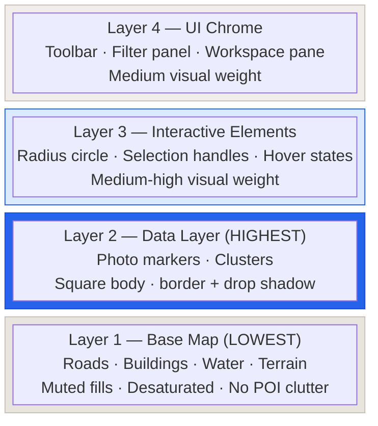

# Feldpost – Map System

Load this file for any task involving map hierarchy, marker prominence, clustering, or proximity behavior.

**Leaflet pierced CSS (implementation):** Rules targeting Leaflet-injected marker / overlay DOM live in **`apps/web/src/styles/_map-shell-leaflet-global.scss`**, scoped under **`app-map-shell { … }`**, and are pulled into the global bundle via **`@use`** from **`apps/web/src/styles.scss`** (Phase 8 Path A — not ad-hoc blocks inside unrelated feature SCSS). See [`phase-8-global-scss-elimination.md`](../migration/phase-8-global-scss-elimination.md) §7 and [`phase-10-visual-qa.md`](../migration/phase-10-visual-qa.md#stacking-sanity).

## 3.7 Map Visual Hierarchy and Proximity Rules

A well-designed map has four distinct visual layers, each lower in visual weight than the layer above it. This hierarchy must be enforced via tile styling, z-index management, and proximity/collision logic:

| Layer                | Visual weight | Elements                                       | Design rule                                                                                             |
| -------------------- | ------------- | ---------------------------------------------- | ------------------------------------------------------------------------------------------------------- |
| Base map             | Lowest        | Roads, buildings, water, terrain               | Muted — no POI clutter, desaturated fills, thin outlines                                                |
| Data layer           | **Highest**   | Photo markers, clusters                        | Most visually prominent element on the map. Square marker body (**no tail**); border + drop-shadow per [`media-marker.md`](../specs/ui/media-marker/media-marker.md) and **`_map-shell-leaflet-global.scss`** |
| Interactive elements | Medium-high   | Radius circle, selection handles, hover states | Clearly distinct from base, does not compete with markers                                               |
| UI chrome            | Medium        | Toolbar, filter panel, workspace pane          | Floats above map on `--color-bg-surface` background with shadow                                         |

Quoting Eleken's Head of Design: _"The challenge is balancing information density with readability. You need to decide what information is essential and how to present it without overwhelming the user."_

**Marker and cluster details:** See [media-marker.md](../specs/ui/media-marker/media-marker.md) for full marker anatomy, state diagram, clustering rules, and viewport lifecycle. Clustering is proximity-based, not tied to fixed city/street/address zoom bands.
