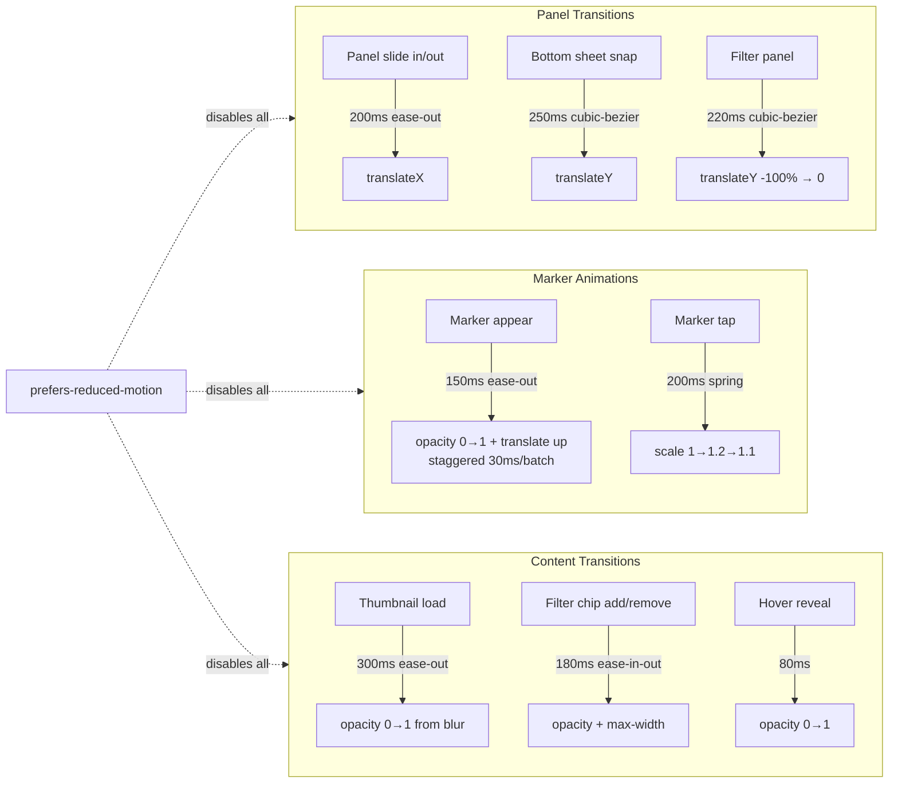

# Feldpost – Motion & Transitions

Load this file for any task involving animation, timing, or transitions.

## 6. Motion and Transitions

### Motion Overview

All motion serves clarity or orientation — no decorative animation.

### Geometry stability rules

- Shared layout primitives keep their geometry during transitions.
- Panels may animate container width or container height when the interaction requires it.
- Do not animate container padding, row padding, row height, media-column width, item gap, or panel corner radius.
- Sidebar expand/collapse may animate outer container width and label opacity/clipping only.
- Search surfaces may animate revealed container height and content opacity, but keep the same panel radius and container padding as the closed state.
- Search results should reveal within the existing panel surface rather than translating like a detached dropdown.
- If a pill-style treatment causes layout errors, clipping issues, or geometry shifts during state changes, fall back to the standard `.ui-container` panel shape.

| Interaction                  | Effect                                           | Duration | Easing                                   |
| ---------------------------- | ------------------------------------------------ | -------- | ---------------------------------------- |
| Panel slide in/out (desktop) | `transform: translateX`                          | 200ms    | `ease-out`                               |
| Bottom sheet snap (mobile)   | `transform: translateY`                          | 250ms    | `cubic-bezier(0.4, 0, 0.2, 1)`           |
| Marker appear (map load)     | `opacity: 0→1`, slight upward translate          | 150ms    | `ease-out` (staggered by 30ms per batch) |
| Marker tap (highlight)       | `scale: 1→1.2→1.1`                               | 200ms    | spring-like `ease-in-out`                |
| Thumbnail load               | `opacity: 0→1` from placeholder blur             | 300ms    | `ease-out`                               |
| Filter chip add/remove       | `opacity + max-width` (chip appear/collapse)     | 180ms    | `ease-in-out`                            |
| Page navigation              | No full-page transitions; panels update in place | —        | —                                        |

Panel and row geometry remain fixed while these transitions run, including container padding, row padding, media-column width, and panel radius.

`prefers-reduced-motion: reduce` disables all transforms and fades, keeping only immediate state changes.

### Media Page Transition Contract

Use this table as the implementation reference for transition usage on the media page.

| Media Area                               | File / Selector                                                                                                                                        | Transition Properties                                     | Required Token                                                 |
| ---------------------------------------- | ------------------------------------------------------------------------------------------------------------------------------------------------------ | --------------------------------------------------------- | -------------------------------------------------------------- |
| Media card container                     | `apps/web/src/app/features/media/media-item.component.scss` / `:host`                                                                                  | `box-shadow`, `transform`, `border-color`                 | `var(--transition-interactive)`                                |
| Media frame emphasis                     | `apps/web/src/app/features/media/media-item.component.scss` / `.media-item__frame`                                                                     | `box-shadow`, `border-color`                              | `var(--transition-interactive)`                                |
| Quiet actions reveal (hidden -> visible) | `apps/web/src/app/features/media/media-item.component.scss` / `.media-item__quiet-actions`                                                             | `opacity`, `transform`                                    | `var(--transition-fade-in)`                                    |
| Quiet actions hide (visible -> hidden)   | `apps/web/src/app/features/media/media-item.component.scss` / `.media-item__quiet-actions`                                                             | `opacity`, `transform`                                    | `var(--transition-fade-out)`                                   |
| Primary open control focus affordance    | `apps/web/src/app/features/media/media-item.component.scss` / `.media-item__open:focus-visible`                                                        | `outline-color`, optional `box-shadow` ring               | `var(--transition-interactive)`                                |
| Quiet action button state changes        | `apps/web/src/app/features/media/media-item-quiet-actions.component.scss` / `.media-item-quiet-actions__button`                                        | `background-color`, `border-color`, `color`, `box-shadow` | `var(--transition-interactive)`                                |
| Render-surface selected emphasis         | `apps/web/src/app/features/media/media-item-render-surface.component.scss` / `[data-state='content-selected'] .media-item-render-surface__media-frame` | `outline-color`, `filter`                                 | `var(--transition-interactive)`                                |
| Header breadcrumb hover                  | `apps/web/src/app/features/media/media-page-header.component.scss` / `.media-page-header__breadcrumb a`                                                | `color`                                                   | `var(--transition-interactive)`                                |
| Shared media display reveal              | `apps/web/src/app/shared/media-display/media-display.component.scss` / media reveal states                                                             | `opacity`                                                 | `var(--transition-fade-in)` + `var(--transition-reveal-delay)` |

Notes:

- Keep geometry stable while transitions run; animate only visual properties.
- Prefer `--transition-interactive` for direct user-driven state changes.
- Use `--transition-panel` only for panel/container-level open-close choreography.
