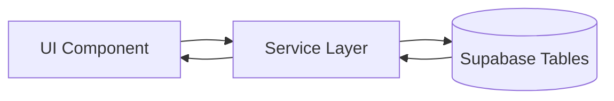
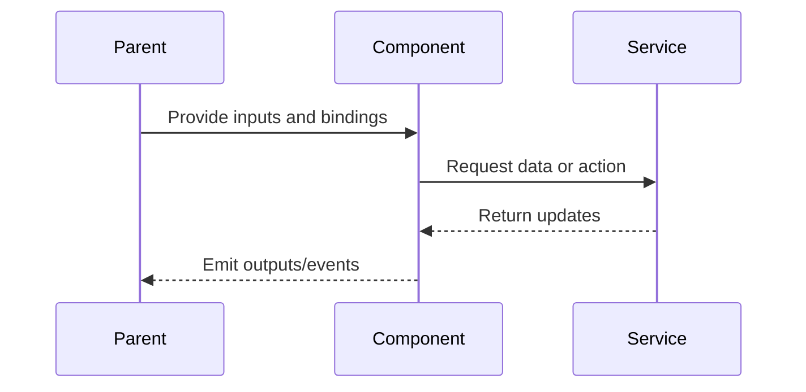

# Account Page

## What It Is

User account management page for profile and account security. It includes display name updates, email and password changes, password reset/recovery entry point, 2FA management, explicit logout, and account deletion. Accessed via `/account` from the Sidebar avatar. All auth mutations go through service abstractions wrapping Supabase Auth APIs.

## What It Looks Like

Full-width page, max-width centered (640px). User info appears at top (avatar circle with initial, email, role badge, assurance label). Below, account/security actions are grouped as stacked cards: `Profil`, `Anmeldung`, `2FA`, `Sitzung`, `Konto löschen`. Each card has a short description and focused action controls (inline forms or guided actions). The `Konto löschen` section is visually distinct (warning/critical treatment).

## Where It Lives

- **Route**: `/account`
- **Parent**: App shell
- **Sidebar link**: Avatar circle at bottom of rail

## Actions

| #   | User Action                    | System Response                                                            | Triggers                                     |
| --- | ------------------------------ | -------------------------------------------------------------------------- | -------------------------------------------- |
| 1   | Navigates to /account          | Shows current email, role, avatar, assurance level, and account actions   | Load from `AuthService` and profile service  |
| 2   | Updates display name           | Saves profile metadata and refreshes identity display                      | `UserProfileService.updateDisplayName()`     |
| 3   | Clicks "E-Mail ändern"         | Opens inline form and starts verified email-change flow                    | `AuthService.updateEmail()`                  |
| 4   | Submits new email              | Sends verification and shows pending verification hint                     | Supabase `updateUser({ email })`             |
| 5   | Clicks "Passwort ändern"       | Expands password form with validation and optional re-auth requirement     | local validation + `AuthService.reauthenticate()` |
| 6   | Submits new password           | Password updated, shows success                                            | Supabase `updateUser({ password })`          |
| 7   | Clicks "Passwort vergessen"     | Sends reset email and shows neutral confirmation                           | `AuthService.resetPasswordForEmail()`        |
| 8   | Starts 2FA setup               | Shows TOTP QR/secret and verify input                                     | `AuthService.mfaEnrollTotp()`                |
| 9   | Verifies 2FA code              | Marks factor verified and updates assurance level                          | `AuthService.mfaChallengeAndVerifyTotp()`    |
| 10  | Removes 2FA factor             | Requires confirmation and removes selected factor                          | `AuthService.mfaUnenroll()`                  |
| 11  | Clicks "Logout"               | Opens confirmation dialog and signs out on confirm                         | `AuthService.signOut()`                      |
| 12  | Clicks "Delete account"        | Confirmation dialog: "This cannot be undone. Type DELETE to confirm."      | local confirm flow                           |
| 13  | Confirms deletion              | Deletes auth user, cascades profile/app data, logs out, redirects to login | backend delete flow (service/RPC/admin path) |

## Component Hierarchy

```
AccountPage                                ← full-width, max-width 640px centered
├── UserInfoCard
│   ├── AvatarCircle                       ← large circle with user initial + --color-clay bg
│   ├── UserEmail                          ← current email address
│   ├── RoleBadge                          ← "Admin" / "User" pill
│   └── AssuranceBadge                     ← "AAL1" / "AAL2"
├── AccountSection "Profil"
│   └── DisplayNameForm
│       ├── DisplayNameInput
│       └── SaveButton
├── AccountSection "Anmeldung"
│   ├── [expanded] EmailForm
│   │   ├── NewEmailInput
│   │   └── ConfirmButton
│   ├── [expanded] PasswordForm
│   │   ├── CurrentPasswordInput
│   │   ├── NewPasswordInput
│   │   └── ConfirmButton
│   └── PasswordRecoveryAction
│       └── SendResetMailButton
├── AccountSection "2FA"
│   ├── FactorList
│   │   └── FactorRow x N
│   └── TotpSetupFlow
│       ├── EnrollButton
│       ├── QrCodeOrSecret
│       ├── VerifyCodeInput
│       └── VerifyButton
├── AccountSection "Sitzung"
│   └── LogoutButton
└── DangerSection "Delete account"
    ├── WarningText                        ← "This permanently deletes all your data."
    └── DeleteButton                       ← red/warning styled, opens confirmation dialog
```

## Data

### Data Flow (Mermaid)



| Field        | Source                                     | Type      |
| ------------ | ------------------------------------------ | --------- |
| Current user | `AuthService.currentUser()`                | `User`    |
| Profile      | `supabase.from('profiles').select('role')` | `Profile` |
| MFA Factors  | `AuthService.mfaListFactors()`             | `MfaFactor[]` |
| AAL          | `AuthService.getAuthenticatorAssuranceLevel()` | `'aal1' \| 'aal2' \| null` |

## State

| Name                | Type                            | Default | Controls                         |
| ------------------- | ------------------------------- | ------- | -------------------------------- |
| `expandedSection`   | `'profile' \| 'email' \| 'password' \| 'mfa' \| null` | `null`  | Which form/group is open         |
| `submitting`        | `boolean`                       | `false` | Loading state for forms/actions  |
| `deleteConfirmOpen` | `boolean`                       | `false` | Whether deletion dialog is shown |
| `mfaSetupState`     | `'idle' \| 'enrolling' \| 'verifying'` | `'idle'` | Current TOTP setup progress      |

## File Map

| File                                      | Purpose                                |
| ----------------------------------------- | -------------------------------------- |
| `features/account/account.component.ts`   | Account and security page component    |
| `features/account/account.component.html` | Template                               |
| `features/account/account.component.scss` | Styles                                 |
| `core/auth.service.ts`                    | Email/password/reset/mfa/logout/delete auth boundary |
| `core/user-profile.service.ts`            | Display name read/update               |

## Wiring

### Wiring Flow (Mermaid)



- Email change sends Supabase confirmation email to new address
- Password change can require re-auth nonce when secure password change is active
- Password reset uses recovery flow (`resetPasswordForEmail` then `updateUser`)
- 2FA setup uses TOTP enroll + verify and surfaces assurance level
- Delete account cascades via DB triggers (profiles, images, group memberships)
- After deletion, `AuthService.signOut()` → redirect to `/login`

## Acceptance Criteria

- [ ] Shows current email and role
- [ ] Change email: inline form, sends confirmation to new address
- [ ] Change password: validates new password and supports re-auth nonce path when required
- [ ] Password reset action is available and sends recovery email with neutral anti-enumeration feedback
- [ ] 2FA setup supports TOTP enrollment and verification
- [ ] 2FA factor list supports explicit factor removal
- [ ] Account page shows assurance state (`AAL1`/`AAL2`)
- [ ] Delete account: confirmation dialog with typed "DELETE" confirmation
- [ ] Delete cascades properly (handled by DB, but frontend shows success/error)
- [ ] All forms show loading state while submitting
- [ ] Success/error feedback via toast notifications

## Settings

- **Identity Profile**: display name edit behavior and validation.
- **Email Change Security**: verification requirements and pending-state copy.
- **Password Security**: policy messaging and re-auth requirement handling.
- **Password Recovery**: reset email behavior and redirect target.
- **2FA**: enrollment defaults, factor visibility, and removal safeguards.
- **Session**: logout confirmation and scope behavior.
