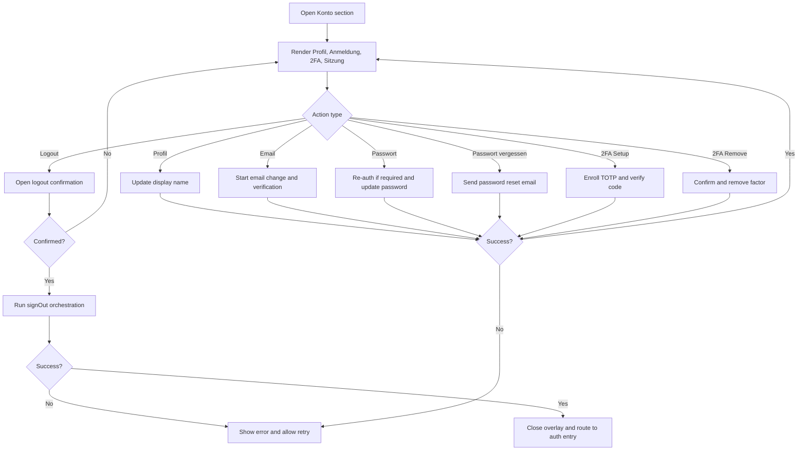
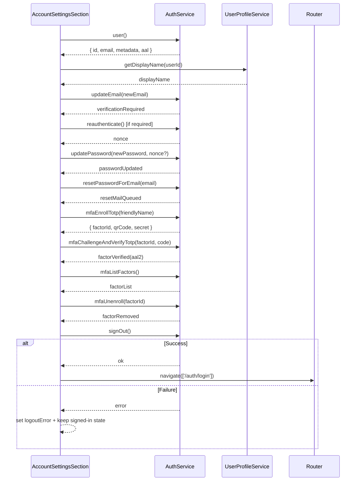
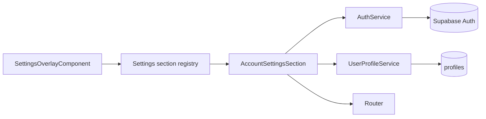

# Account Settings Section

## What It Is

A Settings Overlay section for account identity and account security management. It allows signed-in users to view and update display name, email address, password, password recovery channel behavior, second factors (2FA), and session termination (`Logout`) in one place.

## What It Looks Like

The section is rendered in the right detail column of the Settings Overlay as a stacked `.ui-container` layout with grouped cards: `Profil`, `Anmeldung`, `2FA`, and `Sitzung`. Each card follows existing `.ui-item` rhythm with clear title, short helper copy, and a single focused action area (inline form or step flow). Destructive actions are visually isolated and use critical action tokens; primary account actions keep neutral/brand emphasis. Every interactive control keeps minimum height `2.75rem` (44px) for tap targets. There is no secondary local close action in this section; overlay dismissal remains at shell level (top-right close button, backdrop click, or Escape).

## Where It Lives

- **Route**: Global settings overlay section (no route segment).
- **Parent**: `SettingsOverlayComponent` via section registry.
- **Appears when**: User opens Settings Overlay and selects `Konto`.

## Actions

| #   | User Action                                        | System Response                                                                               | Triggers                                          |
| --- | -------------------------------------------------- | --------------------------------------------------------------------------------------------- | ------------------------------------------------- |
| 1   | Opens `Konto` section                              | Renders identity, email, password, 2FA, and session groups with current user context          | section selection in settings registry            |
| 2   | Edits display name and saves                       | Persists profile metadata, updates visible identity label, shows success feedback             | `UserProfileService.updateDisplayName()`          |
| 3   | Starts email change                                | Validates email syntax, calls auth email update, displays verification-required state         | `AuthService.updateEmail()`                       |
| 4   | Confirms new email via verification link/OTP       | Session/user metadata refreshes and section resolves to new verified email                    | Supabase `updateUser({ email })` confirmation     |
| 5   | Starts password change                             | Requests current password + new password, validates policy, optionally requests re-auth nonce | local validation + `AuthService.reauthenticate()` |
| 6   | Submits password change                            | Updates password and clears password form; surfaces secure success message                    | `AuthService.updatePassword()`                    |
| 7   | Clicks "Passwort vergessen" in account context     | Sends reset email and shows neutral "if account exists" confirmation copy                     | `AuthService.resetPasswordForEmail()`             |
| 8   | Opens 2FA setup (TOTP)                             | Starts enrollment flow, displays QR/secret and one-time verify input                          | `AuthService.mfaEnrollTotp()`                     |
| 9   | Verifies 2FA code                                  | Marks factor verified, elevates assurance state, refreshes factor list                        | `AuthService.mfaChallengeAndVerifyTotp()`         |
| 10  | Removes existing 2FA factor                        | Requires confirmation and active high-assurance session, then removes factor                  | `AuthService.mfaUnenroll()`                       |
| 11  | Clicks `Logout`                                    | Opens confirmation dialog/sheet with consequences copy                                        | logout action in account section                  |
| 12  | Confirms logout                                    | Cancels volatile client activity, signs out auth session, closes overlay                      | `AuthService.signOut()`                           |
| 13  | Any auth/security action fails                     | Keeps current session state, shows actionable inline error + retry where applicable           | failed auth/service request                       |
| 14  | Dismisses Settings Overlay while request in-flight | Keeps active request semantics intact; discards only local draft UI state not yet persisted   | shell close action                                |



## Component Hierarchy

```text
AccountSettingsSection (.ui-container in Settings detail area)
|- SectionHeader
|  |- Title: "Konto"
|  `- Description: "Profil, Anmeldung, Sicherheit und Sitzung"
|- ProfileGroupCard
|  |- IdentityRow (.ui-item)
|  |  |- LeadingIcon (avatar/account icon)
|  |  `- IdentityTextStack (DisplayName, EmailAddress)
|  `- DisplayNameEditForm
|     |- DisplayNameInput
|     `- SaveDisplayNameButton
|- AuthGroupCard
|  |- EmailChangeForm
|  |  |- NewEmailInput
|  |  `- SaveEmailButton
|  |- PasswordChangeForm
|  |  |- CurrentPasswordInput
|  |  |- NewPasswordInput
|  |  |- ConfirmPasswordInput
|  |  `- SavePasswordButton
|  `- PasswordRecoveryAction
|     `- SendResetMailButton
|- MfaGroupCard
|  |- AssuranceLevelRow (aal1/aal2)
|  |- ExistingFactorsList
|  |  `- FactorRow x N (friendlyName, type, status, remove)
|  `- TotpEnrollmentFlow
|     |- StartEnrollButton
|     |- QrCodeOrSecretView
|     |- TotpCodeInput
|     `- VerifyFactorButton
|- SessionGroupCard
|  `- LogoutButton (critical style, min-height 2.75rem / 44px)
`- [conditional] ErrorRows / SuccessRows
   `- ErrorText + Retry affordance

LogoutConfirmDialog (overlay-local)
|- Title: "Logout?"
|- BodyCopy: session end consequences
`- Actions
   |- CancelButton
   `- ConfirmLogoutButton
```

## Data



| Field              | Source                                         | Type                                           |
| ------------------ | ---------------------------------------------- | ---------------------------------------------- |
| `userEmail`        | `AuthService.user()?.email`                    | `string \| null`                               |
| `userDisplayName`  | `UserProfileService.getDisplayName()`          | `string`                                       |
| `userAal`          | `AuthService.getAuthenticatorAssuranceLevel()` | `'aal1' \| 'aal2' \| null`                     |
| `mfaFactors`       | `AuthService.mfaListFactors()`                 | `MfaFactor[]`                                  |
| `pendingEmail`     | section-local signal                           | `string`                                       |
| `emailChangeState` | section-local signal                           | `'idle' \| 'verification_required' \| 'error'` |
| `logoutResult`     | `AuthService.signOut()`                        | `{ ok: boolean; error?: string }`              |
| `isLoggingOut`     | section-local signal                           | `boolean`                                      |
| `logoutError`      | section-local signal                           | `string \| null`                               |

## State

| Name                 | Type                                                           | Default  | Controls                                                     |
| -------------------- | -------------------------------------------------------------- | -------- | ------------------------------------------------------------ |
| `confirmOpen`        | `boolean`                                                      | `false`  | visibility of logout confirmation dialog                     |
| `isSavingProfile`    | `boolean`                                                      | `false`  | loading/disabled states while saving display name            |
| `isUpdatingEmail`    | `boolean`                                                      | `false`  | loading/disabled states while requesting email change        |
| `isUpdatingPassword` | `boolean`                                                      | `false`  | loading/disabled states while changing password              |
| `isSendingReset`     | `boolean`                                                      | `false`  | loading state for password-reset request                     |
| `isEnrollingMfa`     | `boolean`                                                      | `false`  | loading state during TOTP enrollment start                   |
| `isVerifyingMfa`     | `boolean`                                                      | `false`  | loading state during TOTP verification                       |
| `isRemovingMfa`      | `boolean`                                                      | `false`  | loading state during factor removal                          |
| `isLoggingOut`       | `boolean`                                                      | `false`  | loading/disabled states for logout controls                  |
| `errorMessage`       | `string \| null`                                               | `null`   | shared inline error copy for failed account-security actions |
| `successMessage`     | `string \| null`                                               | `null`   | short success confirmation after save/update actions         |
| `userEmail`          | `string`                                                       | `''`     | identity row secondary line                                  |
| `userDisplayName`    | `string`                                                       | `''`     | identity row primary line                                    |
| `pendingDisplayName` | `string`                                                       | `''`     | profile edit control                                         |
| `pendingEmail`       | `string`                                                       | `''`     | email change control                                         |
| `passwordForm`       | `{ current: string; next: string; confirm: string }`           | empty    | password change controls and validation                      |
| `emailChangeState`   | `'idle' \| 'verification_required' \| 'error'`                 | `'idle'` | email verification guidance state                            |
| `mfaEnrollment`      | `{ factorId: string; qrCode: string; secret: string } \| null` | `null`   | active TOTP enrollment step payload                          |
| `mfaVerifyCode`      | `string`                                                       | `''`     | TOTP verify input                                            |
| `mfaFactors`         | `MfaFactor[]`                                                  | `[]`     | rendered factor list and remove actions                      |

## File Map

| File                                                                         | Purpose                                                                          |
| ---------------------------------------------------------------------------- | -------------------------------------------------------------------------------- |
| `apps/web/src/app/features/settings-overlay/settings-overlay.component.ts`   | account section state machine for profile/auth/mfa/session actions               |
| `apps/web/src/app/features/settings-overlay/settings-overlay.component.html` | account section template with grouped cards, forms, mfa flow, and logout confirm |
| `apps/web/src/app/features/settings-overlay/settings-overlay.component.scss` | account group styling, form states, and critical action variants                 |
| `apps/web/src/app/features/settings-overlay/settings-section-registry.ts`    | section registration entry for `account`                                         |
| `apps/web/src/app/core/auth/auth.service.ts`                                 | auth boundary for updateUser, resetPasswordForEmail, mfa, reauth, and sign-out   |
| `apps/web/src/app/core/user-profile.service.ts`                              | display-name lookup for identity row                                             |

## Wiring

### Injected Services

- `AuthService`: reads active identity and executes sign-out.
- `AuthService`: executes email update, password update, password reset email, re-auth nonce, MFA operations, and sign-out.
- `UserProfileService`: resolves and updates preferred display name for the signed-in user.
- `Router`: redirects to auth entry view after successful logout.

### Inputs / Outputs

- **Inputs**: None (registry-mounted section).
- **Outputs**: None (shell handles overlay close primitives).

### Subscriptions

- Auth identity signal stream to keep displayed email/name current.
- Account action request streams (profile/email/password/reset/mfa/logout) to toggle loading/error/success states.

### Supabase Calls

- None directly in the section component.
- Delegated through `AuthService`:
  - `updateUser({ email })`
  - `updateUser({ password })` (with nonce when secure password change is active)
  - `resetPasswordForEmail(email, { redirectTo })`
  - `reauthenticate()`
  - `mfa.enroll/challenge/verify/challengeAndVerify/listFactors/unenroll`
  - `signOut()`



### Security Standards Alignment

- Password reset is a two-step flow (`resetPasswordForEmail` then `updateUser`) and uses dedicated recovery event handling.
- Email change requires out-of-band verification and avoids immediate silent credential takeover.
- Password updates support re-authentication nonce flow when secure password change is enabled.
- MFA setup uses TOTP enrollment + explicit verification; assurance level is surfaced (`aal1`/`aal2`).
- Recovery behavior avoids user enumeration in user-facing messaging.

## Acceptance Criteria

- [ ] `Konto` section shows signed-in display name and email in a non-editing identity row.
- [ ] Display name can be edited and saved with immediate visible confirmation.
- [ ] Email change requires verification and clearly communicates pending verification state.
- [ ] Password change validates inputs and supports re-authentication nonce when required.
- [ ] Password reset mail action is available and uses neutral anti-enumeration feedback copy.
- [ ] 2FA setup supports TOTP enrollment with QR/secret and explicit code verification.
- [ ] Verified 2FA factors are listed and removable only via explicit confirmation flow.
- [ ] Section exposes one session termination action: `Logout`.
- [ ] Section does not render a local `Einstellungen schließen`/`Close settings` button.
- [ ] Logout requires explicit confirmation before session termination.
- [ ] Successful logout closes overlay and navigates to auth entry route.
- [ ] Failed auth/security actions keep session integrity and surface actionable error feedback.
- [ ] While actions are in progress, corresponding controls are disabled and show busy states.

## Settings

- **Identity Profile**: display name edit policy, formatting, and save behavior.
- **Email Change Security**: whether dual-email confirmation is required and how pending verification is shown.
- **Password Security**: change policy, re-auth requirement behavior, and minimum validation messaging.
- **Password Recovery**: reset email trigger behavior and redirect target handling.
- **2FA**: allowed factor types, enrollment flow defaults, assurance indicator display, and removal constraints.
- **Session**: explicit sign-out behavior and confirmation requirements.
