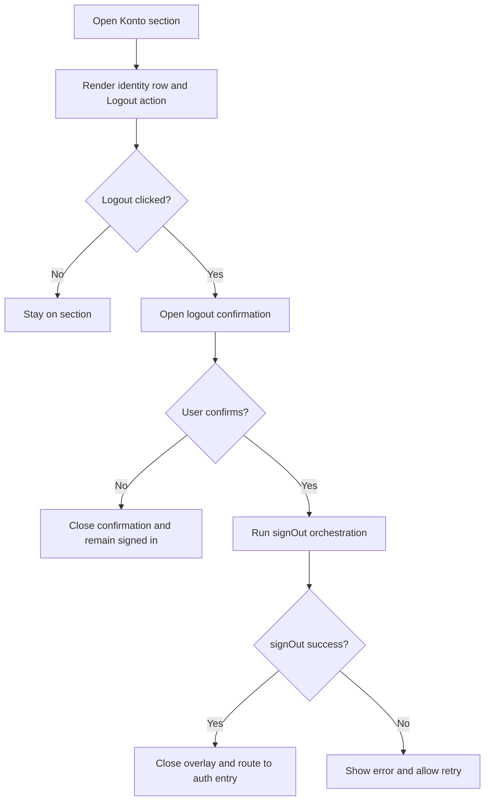
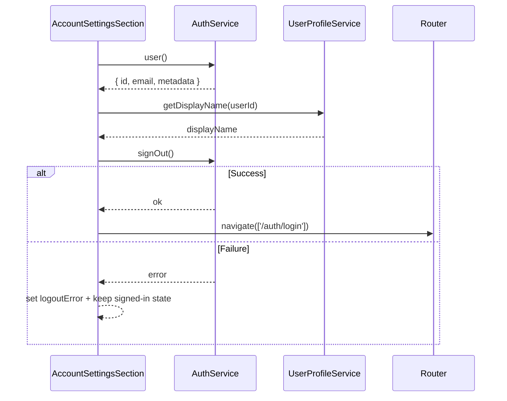
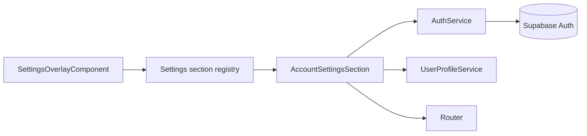

# Account Settings Section

## What It Is

A Settings Overlay section for signed-in identity context and explicit session termination. It shows who is currently signed in and provides a dedicated `Logout` flow for ending the active workspace session.

## What It Looks Like

The section is rendered in the right detail column of the Settings Overlay as a compact `.ui-container` card with a single identity row and one primary danger action. The identity row uses the existing `.ui-item` rhythm: leading avatar/icon, name and email text stack, and no trailing action chip. The logout action is a full-width button with minimum height `2.75rem` (44px), styled as a destructive/critical action token variant while retaining Feldpost spacing tokens. There is no secondary local close action in this section; overlay dismissal remains at shell level (top-right close button, backdrop click, or Escape).

## Where It Lives

- **Route**: Global settings overlay section (no route segment).
- **Parent**: `SettingsOverlayComponent` via section registry.
- **Appears when**: User opens Settings Overlay and selects `Konto`.

## Actions

| #   | User Action                                      | System Response                                                               | Triggers                               |
| --- | ------------------------------------------------ | ----------------------------------------------------------------------------- | -------------------------------------- |
| 1   | Opens `Konto` section                            | Renders signed-in identity card with display name and email                   | section selection in settings registry |
| 2   | Clicks `Logout`                                  | Opens confirmation dialog/sheet with consequences copy                        | logout action in account section       |
| 3   | Confirms logout                                  | Cancels volatile client activity, signs out auth session, closes overlay      | confirmation action                    |
| 4   | Logout succeeds                                  | Navigates to auth entry route and shows success feedback                      | successful `AuthService.signOut()`     |
| 5   | Cancels logout in confirmation                   | Closes confirmation and keeps user in `Konto` section                         | cancel action in confirmation          |
| 6   | Logout fails (network/service/session issue)     | Keeps session, shows inline error/toast, enables retry                        | failed `AuthService.signOut()`         |
| 7   | Dismisses Settings Overlay while not logging out | Discards local section draft state only; authenticated session remains active | shell close action                     |



## Component Hierarchy

```text
AccountSettingsSection (.ui-container in Settings detail area)
|- SectionHeader
|  |- Title: "Konto"
|  `- Description: "Signed-in identity and workspace session context"
|- IdentityRow (.ui-item)
|  |- LeadingIcon (avatar/account icon)
|  `- IdentityTextStack
|     |- DisplayName
|     `- EmailAddress
|- LogoutActionRow
|  `- LogoutButton (critical style, min-height 2.75rem / 44px)
`- [conditional] LogoutErrorRow
   `- ErrorText + Retry affordance

LogoutConfirmDialog (overlay-local)
|- Title: "Logout?"
|- BodyCopy: session end consequences
`- Actions
   |- CancelButton
   `- ConfirmLogoutButton
```

## Data



| Field             | Source                                | Type                              |
| ----------------- | ------------------------------------- | --------------------------------- |
| `userEmail`       | `AuthService.user()?.email`           | `string \| null`                  |
| `userDisplayName` | `UserProfileService.getDisplayName()` | `string`                          |
| `logoutResult`    | `AuthService.signOut()`               | `{ ok: boolean; error?: string }` |
| `isLoggingOut`    | section-local signal                  | `boolean`                         |
| `logoutError`     | section-local signal                  | `string \| null`                  |

## State

| Name              | Type             | Default | Controls                                            |
| ----------------- | ---------------- | ------- | --------------------------------------------------- |
| `confirmOpen`     | `boolean`        | `false` | visibility of logout confirmation dialog            |
| `isLoggingOut`    | `boolean`        | `false` | loading/disabled states for logout controls         |
| `logoutError`     | `string \| null` | `null`  | inline/toast error copy after failed logout attempt |
| `userEmail`       | `string`         | `''`    | identity row secondary line                         |
| `userDisplayName` | `string`         | `''`    | identity row primary line                           |

## File Map

| File                                                                                          | Purpose                                                     |
| --------------------------------------------------------------------------------------------- | ----------------------------------------------------------- |
| `apps/web/src/app/features/settings-overlay/sections/account-settings-section.component.ts`   | standalone account section host with logout state handling  |
| `apps/web/src/app/features/settings-overlay/sections/account-settings-section.component.html` | template for identity card, logout button, and confirmation |
| `apps/web/src/app/features/settings-overlay/sections/account-settings-section.component.scss` | scoped styles for account row and critical logout action    |
| `apps/web/src/app/features/settings-overlay/settings-section-registry.ts`                     | section registration entry for `account`                    |
| `apps/web/src/app/core/auth/auth.service.ts`                                                  | sign-out boundary and session state                         |
| `apps/web/src/app/core/user-profile.service.ts`                                               | display-name lookup for identity row                        |

## Wiring

### Injected Services

- `AuthService`: reads active identity and executes sign-out.
- `UserProfileService`: resolves preferred display name for the signed-in user.
- `Router`: redirects to auth entry view after successful logout.

### Inputs / Outputs

- **Inputs**: None (registry-mounted section).
- **Outputs**: None (shell handles overlay close primitives).

### Subscriptions

- Auth identity signal stream to keep displayed email/name current.
- Logout request stream to toggle loading/error states.

### Supabase Calls

- None directly in the section component.
- Sign-out delegation happens through `AuthService`, which wraps Supabase Auth session termination.



## Acceptance Criteria

- [ ] `Konto` section shows signed-in display name and email.
- [ ] Section exposes one session action: `Logout`.
- [ ] Section does not render a local `Einstellungen schließen`/`Close settings` button.
- [ ] Logout requires explicit confirmation before session termination.
- [ ] Successful logout closes overlay and navigates to auth entry route.
- [ ] Failed logout keeps session active and surfaces actionable error feedback.
- [ ] While logout is in progress, confirm action is disabled and shows busy state.
