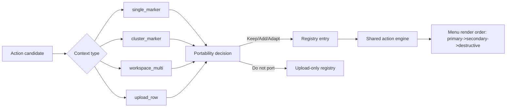
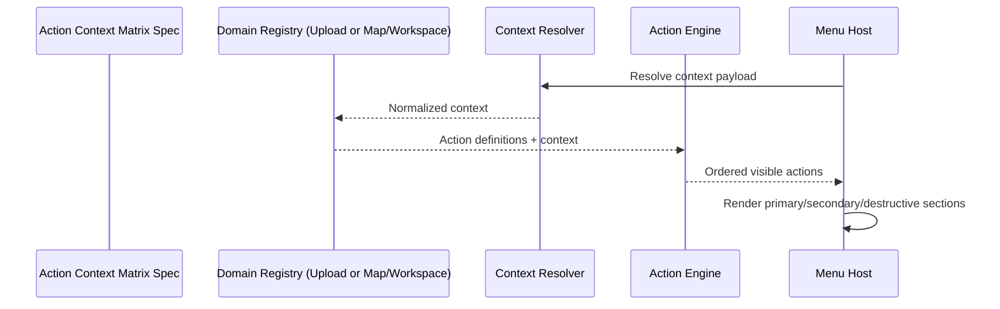

# Action Context Matrix

> **Related specs:** [upload-panel](upload-panel.md), [map-secondary-click-system](map-secondary-click-system.md), [workspace-export-bar](workspace-export-bar.md), [dropdown-system](dropdown-system.md)

## What It Is

The Action Context Matrix is the canonical contract for which actions are available in which UI context.
It prevents duplicate or conflicting action definitions across Upload, Map, and Workspace surfaces.

## What It Looks Like

The matrix is represented as context-first action tables with deterministic section ordering: `primary`, `secondary`, `destructive`.
Each action row includes portability guidance from upload semantics to marker, cluster, and multi-selection semantics.
Destructive actions are always grouped last and require explicit target-count confirmation for multi-target contexts.
The visual menu shell stays unchanged (`dd-items`, `dd-item`, `dd-divider`), while visibility and ordering are driven by this contract.

## Where It Lives

- **Docs location**: `docs/element-specs/action-context-matrix.md`
- **Used by**: Upload row menus, map context menus, marker context menus, workspace selection actions
- **Trigger**: Any feature work that adds, removes, or reorders actions

## Actions & Interactions

| #   | User Action                                       | System Response                                                       | Triggers                   |
| --- | ------------------------------------------------- | --------------------------------------------------------------------- | -------------------------- |
| 1   | Adds or changes an action in Upload/Map/Workspace | Action is evaluated against this matrix before implementation         | Spec update workflow       |
| 2   | Ports an upload action to map/workspace           | Action is marked `Keep`, `Add`, `Adapt`, or `Do not port` per context | Portability matrix         |
| 3   | Adds destructive action for cluster/multi         | Requires explicit affected-count confirmation                         | Destructive guard contract |
| 4   | Adds utility action (`copy_*`, external open)     | Must define deterministic target policy for cluster/multi             | Context resolver contract  |

### Canonical Context Types

| Context ID         | Description                                            | Typical surface                  |
| ------------------ | ------------------------------------------------------ | -------------------------------- |
| `single_marker`    | One persisted media target                             | Marker menu                      |
| `cluster_marker`   | Multiple persisted media targets from a marker cluster | Marker menu                      |
| `map_point`        | Empty-map point target from secondary-click            | Map context menu                 |
| `radius_selection` | Current in-radius set target                           | Radius context menu              |
| `workspace_single` | One selected media target in workspace detail          | Workspace detail actions         |
| `workspace_multi`  | Multiple selected media targets                        | Workspace export/context actions |
| `upload_row`       | Upload job/media row scoped by lane and issue kind     | Upload panel menu                |

### Canonical Action Inventory (v2)

This is the complete inventory for marker-related actions across Upload, Map, Workspace, Cluster, and Detail surfaces.

| Action ID                    | Label (EN)                         | Available in                                                                                               | Section       | Upload-only | Notes                                                                 |
| ---------------------------- | ---------------------------------- | ---------------------------------------------------------------------------------------------------------- | ------------- | ----------- | --------------------------------------------------------------------- |
| `open_details_or_selection`  | Open details / Open selection      | `single_marker`, `cluster_marker`                                                                          | `primary`     | No          | Canonical marker entry action                                         |
| `create_marker_here`         | Create media marker here           | `map_point`                                                                                                | `primary`     | No          | Map context creation action                                           |
| `zoom_house`                 | Zoom here (house proximity)        | `map_point`, `single_marker`, `cluster_marker`                                                             | `primary`     | No          | Shared map navigation action                                          |
| `zoom_street`                | Zoom here (street proximity)       | `map_point`, `single_marker`, `cluster_marker`                                                             | `primary`     | No          | Shared map navigation action                                          |
| `copy_address`               | Copy address                       | `map_point`, `single_marker`, `cluster_marker`, conditional `workspace_single`/`workspace_multi`           | `secondary`   | No          | Keep deterministic policy for cluster/multi                           |
| `copy_gps`                   | Copy GPS                           | `map_point`, `single_marker`, `cluster_marker`, `workspace_single`                                         | `secondary`   | No          | `copy_coordinates` is treated as alias label of this canonical action |
| `open_google_maps`           | Open in Google Maps                | `map_point`, `single_marker`, `cluster_marker`, conditional `workspace_multi`                              | `secondary`   | No          | External navigation utility                                           |
| `assign_to_project`          | Assign to project                  | `upload_row`, `single_marker`, `cluster_marker`, `workspace_single`, `workspace_multi`, `radius_selection` | `primary`     | No          | Canonical assignment action                                           |
| `open_project`               | Open project                       | `upload_row` and optional map/workspace contexts                                                           | `primary`     | No          | Context-sensitive deep-link                                           |
| `open_in_media`              | Open in media                      | `upload_row`, `single_marker` and optional workspace contexts                                              | `primary`     | No          | Single focus or multi filtered view                                   |
| `download`                   | Download                           | `upload_row`, optional marker/workspace contexts                                                           | `secondary`   | No          | Batch path for cluster/multi                                          |
| `download_zip`               | Download ZIP                       | `workspace_multi`                                                                                          | `secondary`   | No          | Workspace export action                                               |
| `toggle_priority`            | Prioritize / Remove priority       | `upload_row` and optional map/workspace contexts                                                           | `secondary`   | No          | Capability-gated                                                      |
| `change_location_map`        | Add/Change GPS location            | `upload_row`, planned `single_marker`/`cluster_marker`/`workspace_multi`                                   | `primary`     | No          | Batch guard required for multi-target                                 |
| `change_location_address`    | Add/Change address                 | `upload_row`, planned `single_marker`/`cluster_marker`/`workspace_multi`                                   | `primary`     | No          | Batch guard required for multi-target                                 |
| `remove_from_project`        | Remove from project(s)             | `upload_row`, `single_marker`, `cluster_marker`, planned workspace contexts                                | `destructive` | No          | Membership removal without deleting media                             |
| `delete_media`               | Delete media                       | `upload_row`, `single_marker`, `workspace_single`, `workspace_multi`, guarded `cluster_marker`             | `destructive` | No          | Allowed for persisted media only                                      |
| `create_project_from_radius` | Create new project from radius     | `radius_selection`                                                                                         | `primary`     | No          | Radius-specific project creation                                      |
| `select_all`                 | Select all                         | `workspace_multi`                                                                                          | `primary`     | No          | Workspace selection control                                           |
| `select_none`                | Select none                        | `workspace_multi`                                                                                          | `primary`     | No          | Workspace selection control                                           |
| `share_link`                 | Share link                         | `workspace_multi`                                                                                          | `secondary`   | No          | Workspace share-set action                                            |
| `copy_link`                  | Copy link                          | `workspace_multi`                                                                                          | `secondary`   | No          | Workspace share utility                                               |
| `native_share`               | Share                              | `workspace_multi` (device support)                                                                         | `secondary`   | No          | Native share sheet                                                    |
| `view_file_details`          | View file details                  | `upload_row` (`uploading`)                                                                                 | `primary`     | Yes         | Upload lifecycle UI action                                            |
| `cancel_upload`              | Cancel upload                      | `upload_row` (`uploading`)                                                                                 | `destructive` | Yes         | Upload lifecycle action                                               |
| `open_existing_media`        | Open existing media                | `upload_row` (`issues: duplicate_photo`)                                                                   | `primary`     | Yes         | Duplicate issue resolution path                                       |
| `upload_anyway`              | Upload anyway                      | `upload_row` (`issues: duplicate_photo`)                                                                   | `primary`     | Yes         | Upload conflict override                                              |
| `retry`                      | Retry                              | `upload_row` (`issues`)                                                                                    | `primary`     | Yes         | Upload pipeline retry                                                 |
| `dismiss`                    | Dismiss                            | `upload_row` (`issues/terminal`)                                                                           | `destructive` | Yes         | Queue/history triage action                                           |
| `candidate_select`           | Select suggested address candidate | `upload_row` (`address_ambiguous` prompt)                                                                  | `primary`     | Yes         | Implemented as preferred-candidate apply path                         |
| `manual_location_entry`      | Enter location manually            | `upload_row` (`address_ambiguous` prompt)                                                                  | `secondary`   | Yes         | Opens address editor/search flow                                      |
| `cancel_location_prompt`     | Cancel location prompt             | `upload_row` (`address_ambiguous` prompt)                                                                  | `destructive` | Yes         | Explicit cancel/abort action for ambiguous-address prompt             |

### Upload Action Portability (Canonical)

| Upload action (source)                    | single_marker | cluster_marker | workspace_multi | Recommendation | Why                                                           |
| ----------------------------------------- | ------------- | -------------- | --------------- | -------------- | ------------------------------------------------------------- |
| `View file details`                       | Adapt         | No             | No              | Adapt          | Reuse as detail-open behavior in marker single context        |
| `Cancel upload`                           | No            | No             | No              | Do not port    | Upload lifecycle only                                         |
| `Change location > Add/Change GPS`        | Adapt         | Adapt          | Adapt           | Add            | Persisted-media location edit; cluster/multi as batch flow    |
| `Change location > Add/Change address`    | Adapt         | Adapt          | Adapt           | Add            | Same as GPS edit, address-first flow                          |
| `Open in /media`                          | Adapt         | Adapt          | Adapt           | Add            | Single focus or multi filtered selection                      |
| `Assign project`                          | Yes           | Yes            | Yes             | Keep           | Canonical cross-context assignment action                     |
| `Open project`                            | Adapt         | Adapt          | Adapt           | Add            | Context-sensitive direct open or chooser                      |
| `Prioritize`                              | Adapt         | Adapt          | Adapt           | Optional add   | Capability-gated workflow enhancement                         |
| `Download`                                | Yes           | Adapt          | Adapt           | Add            | Single direct, cluster/multi batch path                       |
| `Open existing media` (`duplicate_photo`) | No            | No             | No              | Do not port    | Upload issue-resolution only                                  |
| `Upload anyway` (`duplicate_photo`)       | No            | No             | No              | Do not port    | Upload conflict decision only                                 |
| `Retry` (issue/error)                     | No            | No             | No              | Do not port    | Upload pipeline only                                          |
| `Dismiss` (issue/error)                   | No            | No             | No              | Do not port    | Upload queue/history triage only                              |
| `Remove from project(s)`                  | Yes           | Yes            | Yes             | Add            | Destructive membership removal, non-delete                    |
| `Delete media`                            | Yes           | Adapt          | Yes             | Keep + guard   | Cluster/multi require count confirmation and resolved targets |

### Existing Actions That Must Stay

| Action                      | Contexts                                     | Section       | Keep reason                                                |
| --------------------------- | -------------------------------------------- | ------------- | ---------------------------------------------------------- |
| `copy_address`              | single/conditional cluster/conditional multi | `secondary`   | Core utility action across surfaces                        |
| `copy_gps`                  | single/conditional cluster/conditional multi | `secondary`   | Core utility action across surfaces                        |
| `open_google_maps`          | single/cluster/conditional multi             | `secondary`   | Established external-navigation utility                    |
| `zoom_house`                | single/cluster                               | `primary`     | Fast map work action                                       |
| `zoom_street`               | single/cluster                               | `primary`     | Fast map work action                                       |
| `open_details_or_selection` | single/cluster                               | `primary`     | Canonical entry action                                     |
| `delete_media`              | single/cluster/workspace_multi               | `destructive` | Canonical destructive action where persisted target exists |

## Component Hierarchy

```text
ActionContextMatrixSpec (docs contract)
├── Upload domain registry (`upload_actions`)
├── Map/workspace registry (`map_workspace_actions`)
├── Shared resolver contracts (context normalization)
└── Shared action engine (section order + visibility + enablement)
```

## Data Requirements

### Data Flow (Mermaid)



| Field          | Source   | Type        | Purpose                                 |
| -------------- | -------- | ----------- | --------------------------------------- |
| `contextType`  | resolver | string enum | Action availability scope               |
| `targetCount`  | resolver | number      | Guard for destructive and batch actions |
| `targetIds`    | resolver | string[]    | Concrete execution targets              |
| `capabilities` | resolver | record      | Feature flags and policy gates          |
| `section`      | registry | enum        | Visual and keyboard grouping            |

## State

| Name              | TypeScript Type | Default        | What it controls                           |
| ----------------- | --------------- | -------------- | ------------------------------------------ |
| `contextType`     | context enum    | per invocation | Which action subset is visible             |
| `resolvedActions` | action array    | `[]`           | Ordered menu actions                       |
| `hasDestructive`  | `boolean`       | `false`        | Divider and destructive section visibility |
| `targetCount`     | `number`        | `0`            | Confirmation requirements                  |

## File Map

| File                                                               | Purpose                                 |
| ------------------------------------------------------------------ | --------------------------------------- |
| `docs/element-specs/action-context-matrix.md`                      | Canonical cross-context action contract |
| `apps/web/src/app/features/action-system/action-types.ts`          | Shared action types                     |
| `apps/web/src/app/features/action-system/action-engine.service.ts` | Shared ordering/filtering engine        |

## Wiring

### Integration Sequence (Mermaid)



- Upload and map/workspace registries must reference the same section-order contract.
- Ported actions keep canonical IDs when intent is identical.
- Destructive actions for `cluster_marker` and `workspace_multi` require affected-count confirmation.
- UI labels may vary by surface, but Action ID and section semantics must stay stable.

## Acceptance Criteria

- [ ] A single canonical spec maps upload actions to `single_marker`, `cluster_marker`, and `workspace_multi` contexts.
- [x] `delete_media` is explicitly allowed where a persisted media target exists, including cluster/multi with guards.
- [ ] `copy_address` and `copy_gps` are explicitly retained as cross-surface utility actions.
- [ ] Upload-only lifecycle actions (`retry`, `dismiss`, `upload_anyway`) are explicitly excluded from map/workspace registries.
- [ ] Section ordering is documented as `primary`, `secondary`, `destructive` across all contexts.
