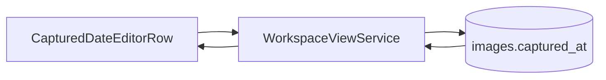
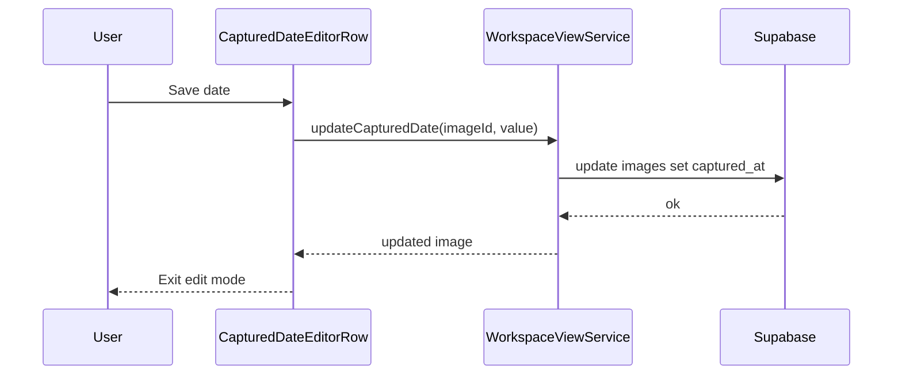

# Captured Date Editor

## What It Is

The Captured Date Editor is the inline date-editing control used in Image Detail View for a photo's `captured_at` value. It allows quick correction when EXIF timestamps are missing or inaccurate.

## What It Looks Like

The control renders as a compact `.ui-item` row with a date value label and an edit affordance. In read mode, the value uses muted text when empty and standard text when set. In edit mode, the row swaps to a native date input plus Save and Cancel ghost actions. Spacing follows `--spacing-2` and `--spacing-3`, with `--radius-sm` for action targets and `--color-clay` hover treatment.

## Where It Lives

- Route: `/`
- Parent: `ImageDetailViewComponent` metadata area
- Appears when: Image Detail View is open and metadata rows are rendered

## Actions

| # | User Action | System Response | Notes |
| --- | --- | --- | --- |
| 1 | Clicks captured date row | Row enters edit mode | Prefills input from `captured_at` when present |
| 2 | Changes date value | Local draft state updates | No DB write yet |
| 3 | Clicks Save | Persists `captured_at` and exits edit mode | Emits image update event |
| 4 | Clicks Cancel | Discards draft and exits edit mode | No DB write |
| 5 | Clears value then saves | Persists `captured_at = null` | Row returns to muted empty-state label |

## Component Hierarchy

```
ImageDetailView
└── CapturedDateEditorRow
		├── ReadModeLabel
		├── EditModeInput[type=date]
		└── ActionButtons
				├── SaveButton
				└── CancelButton
```

## Data



| Field | Source | Type |
| --- | --- | --- |
| Captured date | `images.captured_at` | `timestamptz \| null` |
| Image id | `WorkspaceImage.id` | `uuid` |

## State

| Name | Type | Default | Controls |
| --- | --- | --- | --- |
| `isEditing` | `boolean` | `false` | Read vs edit mode |
| `draftDate` | `string` | `''` | Pending value in date input |
| `isSaving` | `boolean` | `false` | Save button busy/disabled state |

## File Map

| File | Purpose |
| --- | --- |
| `docs/element-specs/captured-date-editor.md` | Captured Date Editor contract |
| `apps/web/src/app/features/map/workspace-pane/image-detail-view.component.ts` | Inline edit logic host |
| `apps/web/src/app/features/map/workspace-pane/image-detail-view.component.html` | Captured date row markup |

## Wiring



- `ImageDetailViewComponent` owns the row-level state and delegates persistence to `WorkspaceViewService`.
- Persistence updates only `captured_at`; no other metadata fields are mutated.

## Acceptance Criteria

- [ ] Captured date row enters edit mode when activated.
- [ ] Save persists `captured_at` and exits edit mode.
- [ ] Cancel exits edit mode without persisting changes.
- [ ] Empty-state label appears when `captured_at` is null.
- [ ] Save and Cancel actions are disabled while persistence is in progress.
