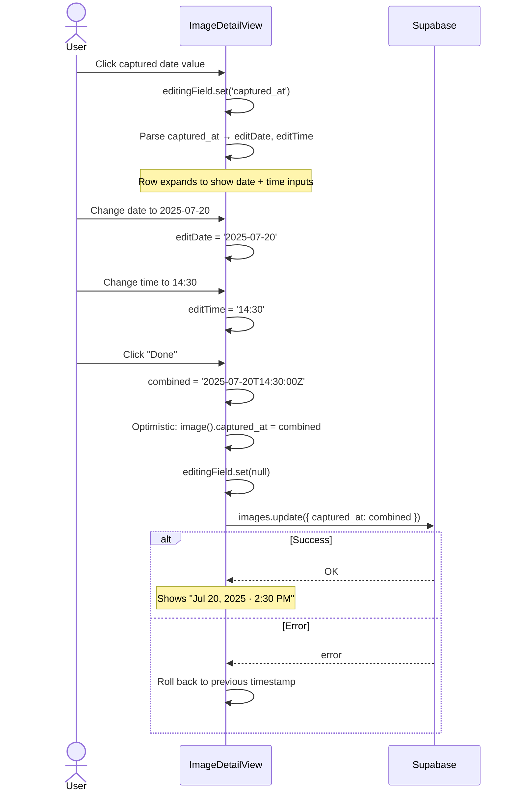
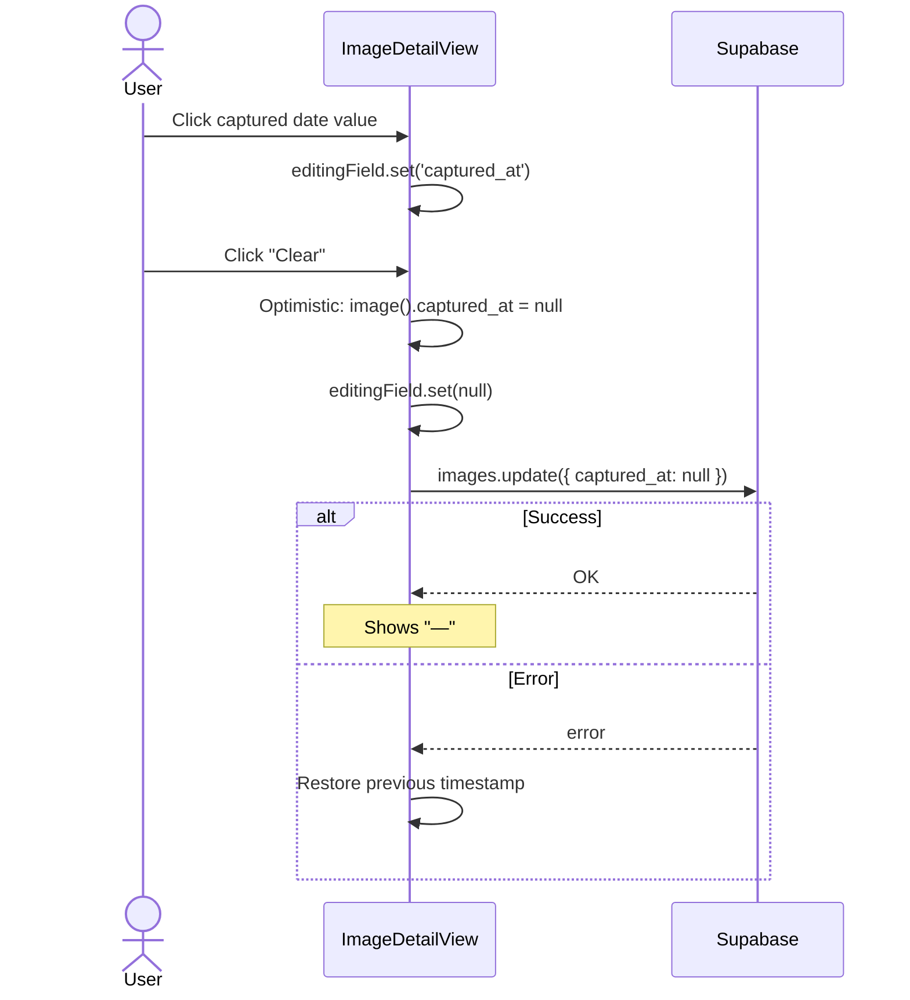
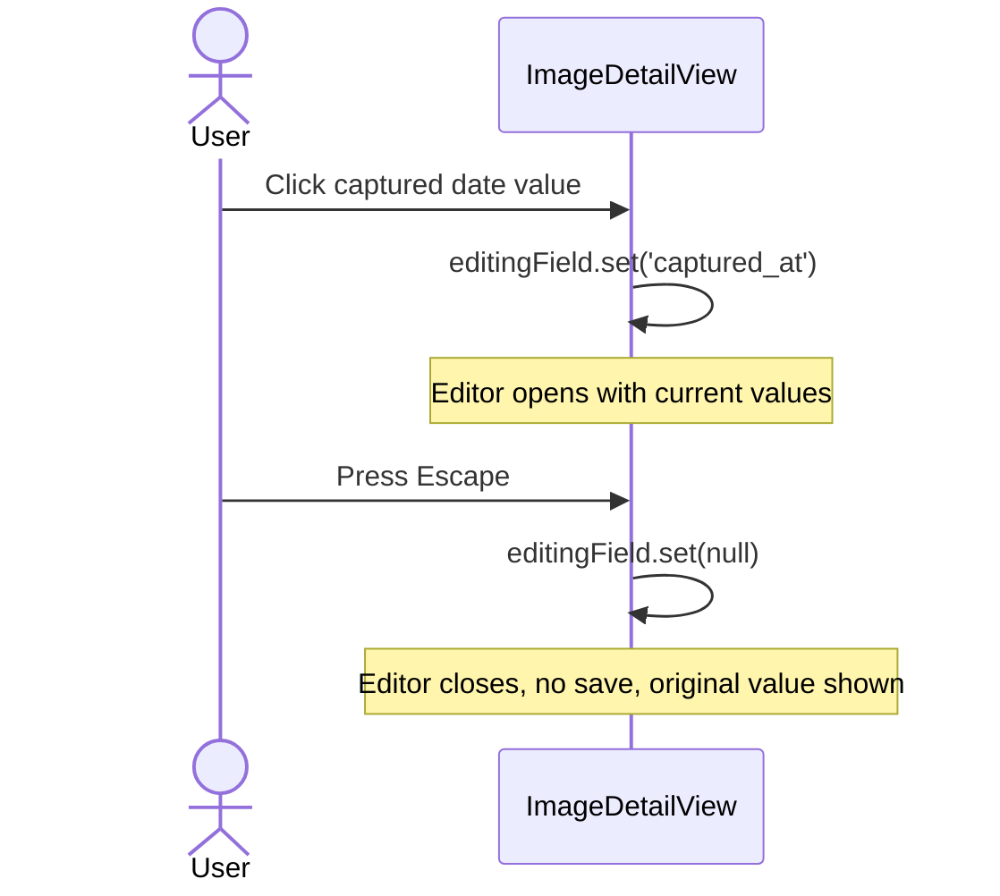

# Captured Date Editor

> **Parent spec:** [image-detail-view](image-detail-view.md)
> **Use cases:** [image-editing](../use-cases/image-editing.md) (IE-2)
> **Database:** [database-schema](../database-schema.md) — `images.captured_at`

## What It Is

An inline date+time editor for the `captured_at` timestamp on a photo. Replaces the native `datetime-local` input with a Notion-style split editor that provides separate date and time controls, relative date display, and clear affordance. Users can set date and time independently — some photos may have a date but no meaningful time.

## What It Looks Like

**Display mode (default):** A dd-item–styled property row with a `schedule` icon, "Captured" label, and formatted date string (e.g., "Jun 15, 2025 · 10:30 AM"). The date is formatted using `Intl.DateTimeFormat` for locale awareness. If no `captured_at`, displays "—" in text-disabled color.

**Edit mode:** Clicking the row reveals a two-row inline editor ("popover" feel but inline, not floating):

- **Date row**: A native `<input type="date">` styled to match dd-item geometry. Shows "YYYY-MM-DD" format. Full width of the edit area.
- **Time row**: A native `<input type="time">` styled identically. Shows "HH:MM" (24h or 12h depending on locale). Full width.
- **Action row**: "Clear" link-button (dd-item--muted) to remove captured_at entirely. "Done" dd-item button to confirm and close.

Both inputs use the design system's input styling: `--color-primary` border when focused, `--shadow-focus`, `--radius-sm` corners. The edit area has a subtle `--color-bg-base` panel background with `--radius-md` corners and a `--color-border` outline, sitting inside the existing detail-row space.

Transitions: the row smoothly expands to accommodate the editor (no jarring reflow).

## Where It Lives

- **Route**: Any route with Image Detail View open
- **Parent**: `ImageDetailViewComponent` → Details section → "Captured" row
- **Appears when**: User clicks the captured date value in the detail view

## Actions

| #   | User Action               | System Response                                            | Triggers                          |
| --- | ------------------------- | ---------------------------------------------------------- | --------------------------------- |
| 1   | Click captured date value | Row expands to show date + time inputs                     | `editingField.set('captured_at')` |
| 2   | Change date input         | Updates local `editDate` signal                            | `onDateChange(dateInput.value)`   |
| 3   | Change time input         | Updates local `editTime` signal                            | `onTimeChange(timeInput.value)`   |
| 4   | Click "Done" button       | Combines date+time, saves to Supabase, closes editor       | `saveCapturedAt()`                |
| 5   | Press Enter on time input | Same as clicking "Done"                                    | `saveCapturedAt()`                |
| 6   | Click "Clear" button      | Sets captured_at to null, saves to Supabase, closes editor | `clearCapturedAt()`               |
| 7   | Press Escape              | Discard changes, close editor, restore display             | `editingField.set(null)`          |

## Component Hierarchy

```
CapturedDateRow ← .detail-row, dd-item geometry
├── Icon ← material-icons "schedule"
├── Label ← "Captured"
│
├── [!editing] ValueButton ← formatted date string, click to edit
│   └── EditIcon ← pencil, opacity 0→1 on hover
│
└── [editing] DateTimeEditor ← .detail-datetime-editor, panel bg
    ├── DateRow ← flex row
    │   ├── DateIcon ← material-icons "calendar_today", small
    │   └── DateInput ← <input type="date">, dd-item input style
    ├── TimeRow ← flex row
    │   ├── TimeIcon ← material-icons "access_time", small
    │   └── TimeInput ← <input type="time">, dd-item input style
    └── ActionRow ← flex row, justify-between
        ├── ClearButton ← dd-item--muted, "Clear"
        └── DoneButton ← dd-item, "Done", primary text on hover
```

## Data

| Source     | Table    | Column        | Type          | Operation      |
| ---------- | -------- | ------------- | ------------- | -------------- |
| Capture TS | `images` | `captured_at` | `timestamptz` | SELECT, UPDATE |

### Value format

- Database: ISO 8601 with timezone — `2025-06-15T10:30:00+00:00`
- Date input: `YYYY-MM-DD` (e.g., `2025-06-15`)
- Time input: `HH:MM` (e.g., `10:30`)
- Combined for save: `${date}T${time}:00Z` (UTC assumption for now, locale-aware in v2)
- Display: `Intl.DateTimeFormat` with options `{ year: 'numeric', month: 'short', day: 'numeric', hour: '2-digit', minute: '2-digit' }`

## State

| Name           | Type             | Default | Controls                           |
| -------------- | ---------------- | ------- | ---------------------------------- |
| `editingField` | `string \| null` | `null`  | Set to `'captured_at'` when active |
| `editDate`     | `string`         | `''`    | The date portion being edited      |
| `editTime`     | `string`         | `''`    | The time portion being edited      |

## Interaction Pseudo Code

### Open editor

```
WHEN user clicks captured date value:
  editingField → 'captured_at'
  parse current captured_at:
    IF captured_at exists:
      editDate → captured_at formatted as 'YYYY-MM-DD'
      editTime → captured_at formatted as 'HH:MM'
    ELSE:
      editDate → today's date
      editTime → ''
  focus date input
```

### Save

```
WHEN user clicks "Done" OR presses Enter on time input:
  IF editDate is empty:
    do nothing (need at least a date)
  combined = editDate + 'T' + (editTime || '00:00') + ':00Z'
  optimistic update: image().captured_at = combined
  editingField → null
  Supabase: images.update({ captured_at: combined }).eq('id', imageId)
  IF error → roll back to previous captured_at
```

### Clear

```
WHEN user clicks "Clear":
  optimistic update: image().captured_at = null
  editingField → null
  Supabase: images.update({ captured_at: null }).eq('id', imageId)
  IF error → roll back
```

### Cancel

```
WHEN user presses Escape:
  editingField → null
  discard editDate / editTime changes
  no Supabase call
```

## Interaction Diagrams

### Edit Captured Date (happy path)



### Clear Captured Date



### Cancel Edit



## Acceptance Criteria

- [ ] Clicking captured date row opens inline date+time editor
- [ ] Date input pre-fills with current captured_at date (or today if null)
- [ ] Time input pre-fills with current captured_at time (or empty if null)
- [ ] Changing date and clicking "Done" saves combined date+time to Supabase
- [ ] Time is optional — saving with date only defaults to midnight
- [ ] "Clear" button sets captured_at to null
- [ ] Escape closes editor without saving
- [ ] Enter on time input saves
- [ ] Optimistic update shows new date immediately
- [ ] Rollback on Supabase error restores previous value
- [ ] Display format uses locale-aware Intl.DateTimeFormat
- [ ] Native date/time inputs allow keyboard entry of hours and minutes
- [ ] Editor panel has design-system styling (bg-base, border, radius-md)
- [ ] No native datetime-local input — separate date and time controls
