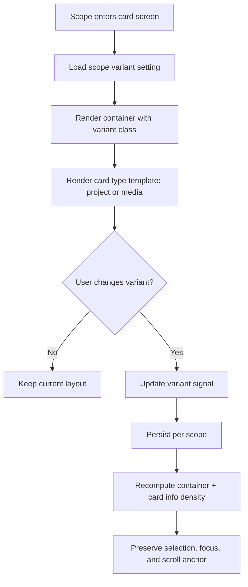
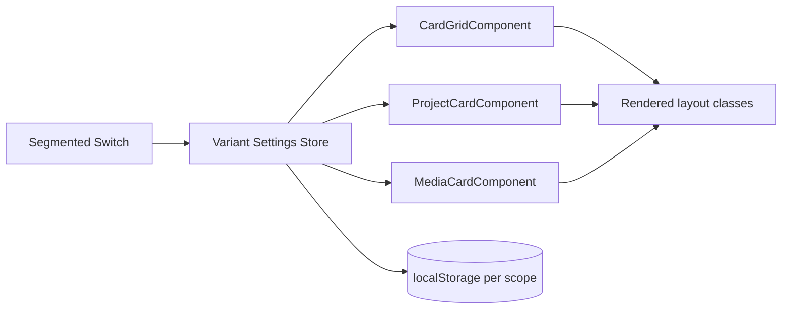
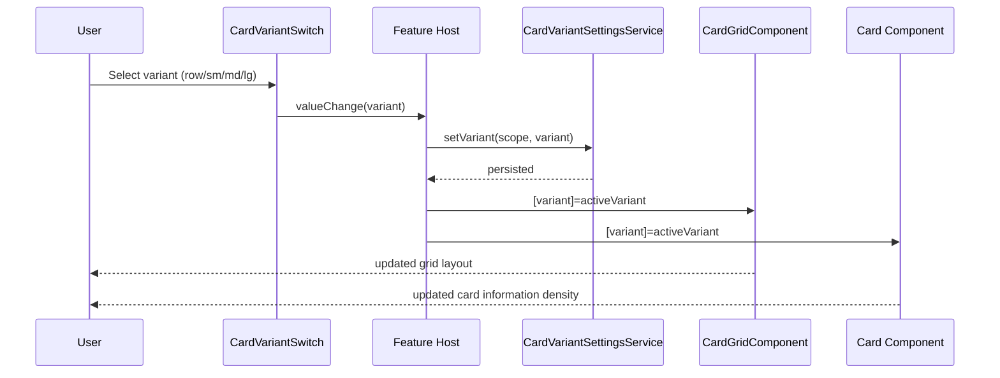

# Card Variant System

## What It Is

A cross-feature UI contract that standardizes card variants for two card types: `Project Card` and `Media Card`. It defines shared layout sizes (`row`, `small`, `medium`, `large`) and how each size changes visible information density while staying connected to segmented view switches.

## What It Looks Like

The system uses one shared variant language: `row`, `small`, `medium`, `large`. `row` is list-like (horizontal, dense, fast scan), while `small`/`medium`/`large` are grid cards with increasing metadata visibility. All dimensions use design tokens and rem-based interactive sizing (minimum touch target `3rem` / 48px). Project cards and media cards share container rhythm and spacing but render type-specific content blocks. Variant changes are immediate, preserve scroll position and selection state, and animate within 120-250ms.

## Where It Lives

- Route surfaces:
  - `/map` workspace pane (thumbnail/media selection)
  - `/media` media page grid
  - `/projects` projects page (cards + list)
- Parent components:
  - `WorkspaceToolbarComponent` (map workspace size switch)
  - `ProjectsToolbarComponent` (project view/size switch)
  - `MediaPageComponent` (media size switch)
- Trigger:
  - User changes segmented switch selection
  - Restored from persisted preference per feature scope

## Actions

| #   | User Action                                                    | System Response                                                                               | Triggers                                |
| --- | -------------------------------------------------------------- | --------------------------------------------------------------------------------------------- | --------------------------------------- |
| 1   | Opens a page with card content (`/map`, `/media`, `/projects`) | Reads saved variant for that scope and renders matching layout                                | localStorage + scope key                |
| 2   | Selects `row` in segmented switch                              | Container becomes list flow; cards render high-density row content                            | `variantChange('row')`                  |
| 3   | Selects `small`                                                | Container uses compact grid columns; cards show minimal metadata                              | `variantChange('small')`                |
| 4   | Selects `medium`                                               | Container uses default grid columns; cards show standard metadata                             | `variantChange('medium')`               |
| 5   | Selects `large`                                                | Container uses wider/taller cards; cards show extended metadata and secondary actions         | `variantChange('large')`                |
| 6   | Changes variant while items are selected                       | Selection and hover context remain intact                                                     | selection service signals               |
| 7   | Returns to same scope later                                    | Last variant is restored (`map`, `media`, `projects` independently)                           | persisted settings                      |
| 8   | Uses projects card variant `large`                             | Additional project info appears (status, counts, last activity, city/district, quick actions) | `projectCardVariant='large'`            |
| 9   | Uses media card variant `large`                                | Additional media info appears (captured date/time, address, project chip, media type)         | `mediaCardVariant='large'`              |
| 10  | Keyboard-navigates switch and cards                            | Variant can be changed and cards activated by keyboard only                                   | segmented switch keydown + card keydown |

### Interaction Flow



## Component Hierarchy

```text
CardVariantHost (feature-level orchestrator)
├── SegmentedSwitch (shared, icon-only or icon+label)
│   └── Options: row | small | medium | large
├── CardGridComponent (shared container)
│   ├── [variant=row] CardGridRowFlow
│   ├── [variant=small] CardGridCompactFlow
│   ├── [variant=medium] CardGridDefaultFlow
│   └── [variant=large] CardGridExpandedFlow
└── CardTypeRenderer
    ├── [type=project] ProjectCardComponent
    │   ├── Project identity block (name, color)
    │   ├── Metrics block (counts, status)
    │   ├── Context block (activity, location)
    │   └── Actions block (archive/restore/delete/color)
    └── [type=media] MediaCardComponent
        ├── Preview block (thumbnail/video/doc icon)
        ├── Primary meta block (title/date)
        ├── Context block (address/project/media type)
        └── Actions block (select/open/locate)
```

## Data

### Data Flow



| Field                    | Source                                       | Type                                      |
| ------------------------ | -------------------------------------------- | ----------------------------------------- |
| `scope`                  | feature context (`map`, `media`, `projects`) | `'map' \| 'media' \| 'projects'`          |
| `variant`                | segmented switch + restored preference       | `'row' \| 'small' \| 'medium' \| 'large'` |
| `projectCardInfoProfile` | derived from `variant`                       | `'minimal' \| 'standard' \| 'extended'`   |
| `mediaCardInfoProfile`   | derived from `variant`                       | `'minimal' \| 'standard' \| 'extended'`   |
| `gridMinColumnWidth`     | derived from variant map                     | `string` (rem)                            |
| `gridGap`                | design token by variant                      | `string`                                  |
| `persistedVariantKey`    | `feldpost.settings.cards.<scope>.variant`    | `string`                                  |

## State

| Name                     | Type                                      | Default             | Controls                                          |
| ------------------------ | ----------------------------------------- | ------------------- | ------------------------------------------------- |
| `activeScope`            | `'map' \| 'media' \| 'projects'`          | current route scope | which variant key is read/written                 |
| `activeVariant`          | `'row' \| 'small' \| 'medium' \| 'large'` | `'medium'`          | grid flow + card info density                     |
| `variantByScope`         | `Record<string, CardVariant>`             | `{}`                | remembered user preference per scope              |
| `projectInfoProfile`     | `'minimal' \| 'standard' \| 'extended'`   | derived             | visible project metadata blocks                   |
| `mediaInfoProfile`       | `'minimal' \| 'standard' \| 'extended'`   | derived             | visible media metadata blocks                     |
| `allowedVariantsByScope` | `Record<string, CardVariant[]>`           | scope policy        | which options appear in segmented switch          |
| `variantTransitioning`   | `boolean`                                 | `false`             | optional animation flag for 120-250ms transitions |

## File Map

| File                                                                                            | Purpose                                                         |
| ----------------------------------------------------------------------------------------------- | --------------------------------------------------------------- |
| `apps/web/src/app/shared/ui-primitives/card-variant.types.ts`                                   | canonical variant types and mapping contracts                   |
| `apps/web/src/app/shared/ui-primitives/card-variant-settings.service.ts`                        | scope-based variant persistence + restore                       |
| `apps/web/src/app/shared/ui-primitives/card-variant-switch.component.ts`                        | thin wrapper around segmented switch with variant options       |
| `apps/web/src/app/shared/ui-primitives/card-grid.component.ts`                                  | extend container with `variant` input                           |
| `apps/web/src/app/shared/ui-primitives/card-grid.component.scss`                                | variant classes (`--row`, `--small`, `--medium`, `--large`)     |
| `apps/web/src/app/features/projects/project-card.component.ts`                                  | dedicated project card renderer with variant-aware info density |
| `apps/web/src/app/features/projects/project-card.component.html`                                | project card template per info profile                          |
| `apps/web/src/app/features/projects/project-card.component.scss`                                | project card variant styles                                     |
| `apps/web/src/app/features/photos/media-card.component.ts`                                      | dedicated media card renderer with variant-aware info density   |
| `apps/web/src/app/features/photos/media-card.component.html`                                    | media card template per info profile                            |
| `apps/web/src/app/features/photos/media-card.component.scss`                                    | media card variant styles                                       |
| `apps/web/src/app/features/projects/projects-toolbar.component.ts`                              | integrate variant switch options (`row/small/medium/large`)     |
| `apps/web/src/app/features/map/workspace-pane/workspace-toolbar/workspace-toolbar.component.ts` | align existing thumbnail size presets to canonical variant type |
| `apps/web/src/app/features/photos/media-page.component.ts`                                      | add media variant switch and state wiring                       |

## Wiring

### Injected Services

- `CardVariantSettingsService` — reads/writes active variant per scope.
- `I18nService` — labels for segmented options and aria text.
- `WorkspaceSelectionService` — preserves selected IDs across variant changes.
- `WorkspaceViewService` (map scope) — bridges current thumbnail preset and unified variant model.

### Inputs / Outputs

- `CardGridComponent`
  - Input: `variant: CardVariant`
  - Input: `tag: 'div' | 'ul'`
  - Input: `role: string | null`
- `CardVariantSwitchComponent`
  - Input: `value: CardVariant`
  - Input: `allowed: CardVariant[]`
  - Output: `valueChange: CardVariant`
- `ProjectCardComponent`
  - Input: `variant: CardVariant`
  - Input: `project: ProjectListItem`
- `MediaCardComponent`
  - Input: `variant: CardVariant`
  - Input: `media: WorkspaceMedia`

### Subscriptions

- Scope route signal → resolves active scope.
- `activeVariant` signal effect → persists value to `CardVariantSettingsService`.
- Card renderers compute info profile from variant without additional subscriptions.

### Supabase Calls

None — delegated to existing feature services (`ProjectsService`, `WorkspaceViewService`, media/query services).

### Wiring Sequence



## Acceptance Criteria

- [x] One canonical variant enum is used across map, media, and projects (`row`, `small`, `medium`, `large`).
- [x] Project and media cards are separate components, both variant-aware.
- [x] `row` behaves as dense list layout in all scopes.
- [x] `small` shows minimal metadata, `medium` standard metadata, `large` extended metadata.
- [x] Projects support all four variants and reveal progressively more information in larger variants.
- [x] Media supports all four variants and reveal progressively more information in larger variants.
- [x] Variant changes preserve selection state and do not reset active filters/sorts/groupings.
- [x] Variant is persisted per scope and restored on revisit.
- [x] Segmented switch remains keyboard-accessible and announces current value via ARIA.
- [x] No direct Supabase calls are introduced in card UI components.

## Settings

- **Card Variant Presets**: default and persisted card layout variant per scope (`map`, `media`, `projects`) including allowed options (`row`, `small`, `medium`, `large`).
- **Project Card Information Density**: controls which metadata blocks are visible at each project card size.
- **Media Card Information Density**: controls which metadata blocks are visible at each media card size.
