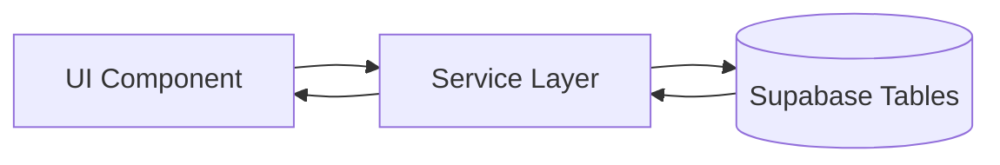
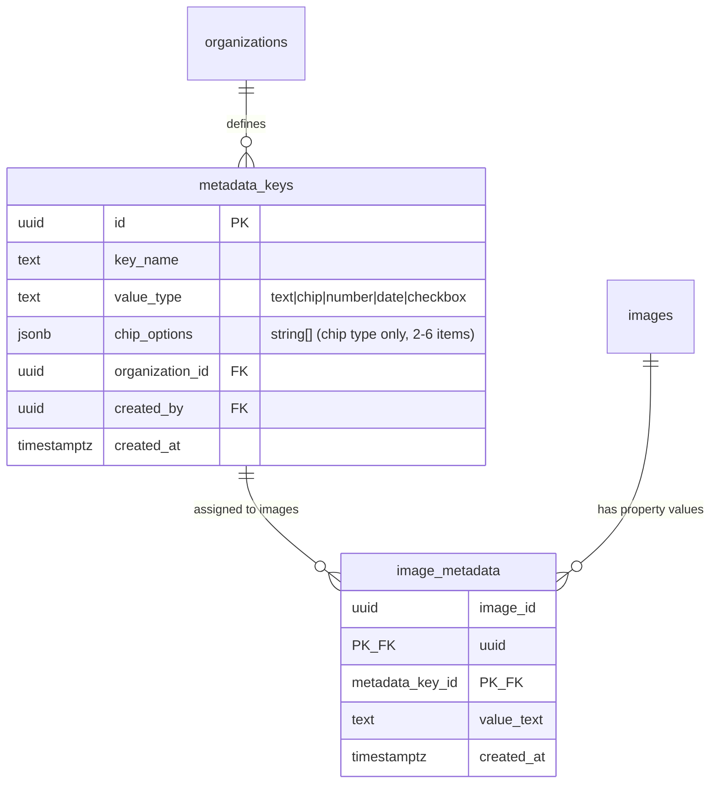
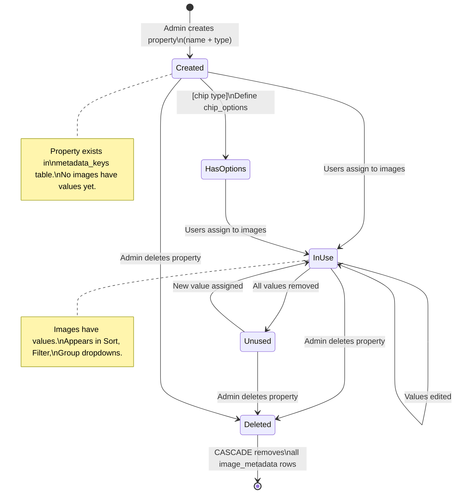
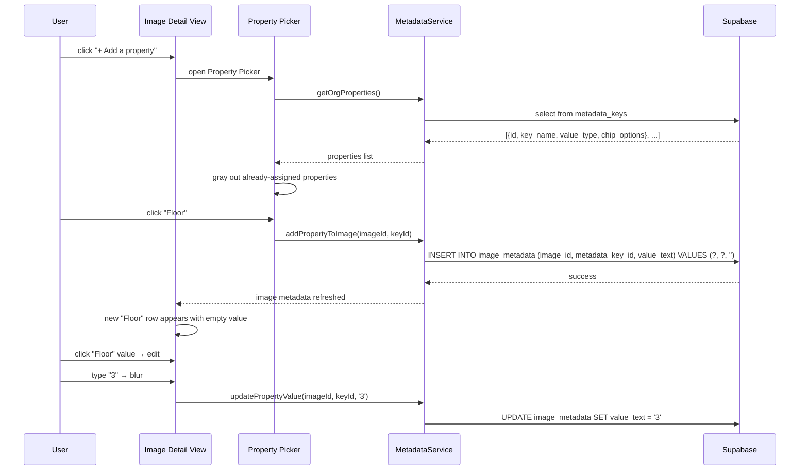
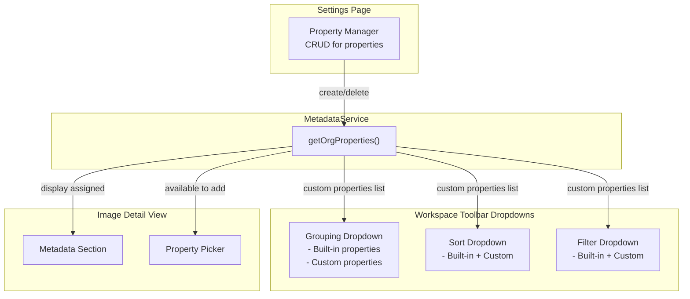

# Custom Properties

> **Spec type:** Feature spec (cross-cutting). This covers a feature that spans multiple components (image detail view, filter panel, workspace toolbar). Standard element spec sections are included below, followed by extended data-model and lifecycle details.

## What It Is

A system for defining and managing user-created metadata keys that can be attached to any image. Follows the Notion "property" pattern: an organization defines property names (e.g., "Material", "Floor", "Building Type"), then individual images can have values for any subset of those properties. Not every image needs every property — properties are sparse. Custom properties are the foundation for grouping, sorting, and filtering.

## Design Pattern: Notion-Style Sparse Properties

The core insight from Notion's property system:

1. **Properties are defined at the organization level** — like database columns in Notion. Any user in the org can create a new property.
2. **Values are assigned per image** — like cell values in Notion. An image may have values for 3 of 20 available properties.
3. **Properties have types** — text (free-form), chip (single-select from fixed options, 2–6 items), number, date, checkbox. Type determines input UI and valid filter operators.
4. **Property values are searchable, filterable, groupable, and sortable** across the entire image library.

### Schema Alignment

The existing database already supports this pattern:

- `metadata_keys` table = property definitions (org-scoped, unique key_name per org)
- `image_metadata` table = property values (image_id + metadata_key_id + value_text)

**Enhancement needed**: The current schema stores all values as `value_text`. For typed properties (chip, number, date), we need:

- **Type column + chip options on `metadata_keys`**: add `value_type` enum (`text`, `chip`, `number`, `date`, `checkbox`) and `chip_options` (JSONB array of strings for chip-type options) — simple, no extra joins, keeps all key metadata in one row

> **Previous consideration**: A normalized `metadata_key_options` table was considered for select-type options. Rejected: for 2–6 categorical options (the chip sweet spot), a JSONB array is simpler and sufficient. A separate table adds join overhead for minimal benefit.

**Chosen approach**: `value_type` + `chip_options` on `metadata_keys`. Keep `value_text` as the universal storage format in `image_metadata` and parse on read. This matches Notion's approach where the property type defines the UI, not the storage format.

## Where Properties Are Managed

Properties can be managed from three places:

### 1. Property Manager (Settings page)

Full CRUD for organization properties. Accessible from Settings → Properties.

### 2. Image Detail View — Metadata Section

Add/edit property values for a specific image. The existing `MetadataPropertyRowComponent` already supports click-to-edit. Enhancement: add a "+ Add a property" row that opens a property picker.

### 3. Inline in Dropdowns

When a grouping, sort, or filter dropdown shows "Available" properties, each also shows a "+ Create property" option at the bottom.

## What It Looks Like

### Property Manager (Settings → Properties)

A full-width list inside the Settings page. Each row is a `.ui-item`:

- **Leading icon**: type indicator (Aa for text, ◆ for chip, # for number, 📅 for date, ☑ for checkbox)
- **Label**: property name (e.g., "Material")
- **Trailing**: type badge + delete button (×, hover-only)

At the bottom: "+ New property" row. Clicking opens an inline creation form:

- Name input (text)
- Type selector (dropdown: Text, Chip, Number, Date, Checkbox)
- For Chip type: option chips input (add/remove predefined values, 2–6 items)

### Property Picker (Image Detail View → "+ Add a property")

A compact floating dropdown (12rem / 192px wide) showing available properties. Search input at top. Click a property to add it to the image (creates an `image_metadata` row with empty value). Properties already on the image are grayed out.

## Actions

| #   | User Action                                  | System Response                                                             | Triggers                      |
| --- | -------------------------------------------- | --------------------------------------------------------------------------- | ----------------------------- |
| 1   | Clicks "+ New property" in Property Manager  | Inline creation form appears                                                | Form visible                  |
| 2   | Fills name + selects type + confirms         | Property created in `metadata_keys`                                         | DB insert, list updates       |
| 3   | Clicks × on a property in Property Manager   | Confirmation dialog ("Delete 'Material'? This removes it from all images.") | Property deleted if confirmed |
| 4   | Clicks "+ Add a property" in Image Detail    | Property Picker dropdown opens                                              | Picker opens                  |
| 5   | Clicks a property in the picker              | `image_metadata` row created with empty value; row appears in detail view   | DB insert, detail updates     |
| 6   | Edits a property value in Image Detail       | `image_metadata.value_text` updated                                         | DB update                     |
| 7   | Clicks × on a property value in Image Detail | `image_metadata` row deleted                                                | DB delete, row removed        |
| 8   | Searches in Property Picker                  | Filters visible properties by name                                          | `searchTerm` changes          |

## Component Hierarchy

### Property Manager (Settings)

```
PropertyManager                            ← .ui-container, full-width section
├── SectionHeader "Properties"             ← --text-h2
├── PropertyList                           ← vertical stack
│   └── PropertyRow × N                    ← .ui-item
│       ├── TypeIcon                       ← .ui-item-media, type-specific icon
│       ├── PropertyName                   ← .ui-item-label
│       ├── TypeBadge                      ← chip, --text-caption
│       └── [hover] DeleteButton (×)       ← ghost, trailing
├── [creating] NewPropertyForm             ← inline row
│   ├── NameInput                          ← text input
│   ├── TypeSelect                         ← compact dropdown
│   ├── [select type] OptionChipsInput     ← tag input for predefined values
│   └── ConfirmButton                      ← ghost "Create"
└── NewPropertyButton                      ← ghost "+ New property"
```

### Property Picker (Image Detail View)

```
PropertyPicker                             ← floating dropdown, 12rem, --color-bg-elevated, shadow-xl
├── SearchInput                            ← compact, "Search properties…"
├── PropertyOptionList                     ← scrollable
│   └── PropertyOption × N                 ← .ui-item, click to add
│       ├── TypeIcon                       ← type-specific
│       ├── PropertyName                   ← label
│       └── [already on image] DisabledState ← grayed out
└── InlineCreateButton                     ← "+ Create new property"
```

## Data

### Data Flow (Mermaid)



| Field                 | Source                                                                                              | Type              |
| --------------------- | --------------------------------------------------------------------------------------------------- | ----------------- |
| Org properties        | `supabase.from('metadata_keys').select('id, key_name, value_type, chip_options').eq('org_id', org)` | `MetadataKey[]`   |
| Image property values | `supabase.from('image_metadata').select('metadata_key_id, value_text').eq('image_id', id)`          | `ImageMetadata[]` |
| Chip options          | Stored on `metadata_keys.chip_options` (JSONB array of strings)                                     | `string[]`        |

### Database Enhancement: Property Types

```sql
-- Migration: Add value_type and chip_options to metadata_keys
ALTER TABLE metadata_keys
  ADD COLUMN value_type text NOT NULL DEFAULT 'text'
  CHECK (value_type IN ('text', 'chip', 'number', 'date', 'checkbox'));

ALTER TABLE metadata_keys
  ADD COLUMN chip_options jsonb DEFAULT NULL
  CHECK (
    chip_options IS NULL
    OR (
      value_type = 'chip'
      AND jsonb_typeof(chip_options) = 'array'
      AND jsonb_array_length(chip_options) BETWEEN 2 AND 6
    )
  );

-- chip_options stores a JSON array of strings, e.g. ["Good", "Fair", "Poor"]
-- Enforced: only present when value_type = 'chip', 2–6 options
```

> **Note:** The previous spec considered a normalized `metadata_key_options` table. This was replaced with a `chip_options` JSONB column for simplicity — chip options are small fixed sets (2–6 items) where ordering, individual CRUD, and relational integrity are not needed. If requirements evolve beyond 6 options or need complex option management, revisit the table approach.

## State

| Name              | Type                    | Default  | Controls                             |
| ----------------- | ----------------------- | -------- | ------------------------------------ |
| `orgProperties`   | `MetadataKeyWithType[]` | `[]`     | Available properties for the org     |
| `imageProperties` | `ImageMetadataEntry[]`  | `[]`     | Properties assigned to current image |
| `isCreating`      | `boolean`               | `false`  | Property creation form visible       |
| `newPropertyName` | `string`                | `''`     | New property name                    |
| `newPropertyType` | `PropertyType`          | `'text'` | New property type                    |

Where `PropertyType` = `'text' | 'chip' | 'number' | 'date' | 'checkbox'`.

### When to Use Each Type

| Type         | When to use                                             | Examples                                                                   |
| ------------ | ------------------------------------------------------- | -------------------------------------------------------------------------- |
| **chip**     | Known fixed set, 2–6 categorical options, single-select | Condition (Good/Fair/Poor), Access (Public/Private), Orientation (N/S/E/W) |
| **text**     | Freeform, unbounded, or unknown upfront                 | Notes, descriptions, street names                                          |
| **number**   | Numeric without fixed range                             | Floor area, year, quantity                                                 |
| **date**     | Obviously temporal values                               | Inspection date, renovation year                                           |
| **checkbox** | Boolean yes/no                                          | Accessible, completed                                                      |

> **Chip sweet spot:** 2–6 options. Fewer than 2 is just a toggle (use checkbox). More than 6 gets cramped — consider text with validation or a dropdown.

## File Map

| File                                                                 | Purpose                           |
| -------------------------------------------------------------------- | --------------------------------- |
| `features/settings/property-manager/property-manager.component.ts`   | Settings page property CRUD       |
| `features/settings/property-manager/property-manager.component.html` | Template                          |
| `features/settings/property-manager/property-manager.component.scss` | Styles                            |
| `features/map/workspace-pane/property-picker.component.ts`           | Floating property picker          |
| `core/metadata.service.ts`                                           | Property CRUD + value management  |
| `supabase/migrations/XXXXXXX_metadata_key_types.sql`                 | value_type + chip_options columns |

## Wiring

- `PropertyManager` is a section inside the Settings page (`/settings`)
- `PropertyPicker` is used inside `ImageDetailViewComponent` at the bottom of the metadata section
- `MetadataService` provides CRUD for properties and values, shared across all consumers
- Grouping, Sort, and Filter dropdowns all query `MetadataService.getOrgProperties()` for the custom properties list

## Acceptance Criteria

- [ ] Properties can be created with a name and type
- [ ] Property types: text, chip, number, date, checkbox
- [ ] Properties are org-scoped (all users in org see them)
- [ ] Not every image needs every property (sparse)
- [ ] Image Detail View shows "+ Add a property" at the bottom of metadata section
- [ ] Property Picker shows available properties with search
- [ ] Already-added properties are grayed out in the picker
- [ ] Property values can be edited inline (existing MetadataPropertyRow)
- [ ] Property values can be removed (× button)
- [ ] Property Manager in Settings allows full CRUD
- [ ] Delete property shows confirmation ("removes from all images")
- [ ] Custom properties appear in Grouping, Sort, and Filter dropdowns
- [ ] Chip-type properties store options in `chip_options` JSONB column (2–6 items)
- [ ] Chip-type properties render as inline chip groups in Image Detail View
- [ ] Creating a chip-type property requires specifying 2–6 option values

---

## Custom Properties Data Model



## Property Lifecycle



## Property Assignment Flow



## Integration with Workspace Toolbar


