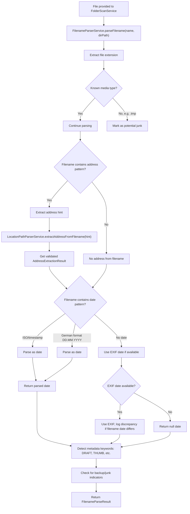
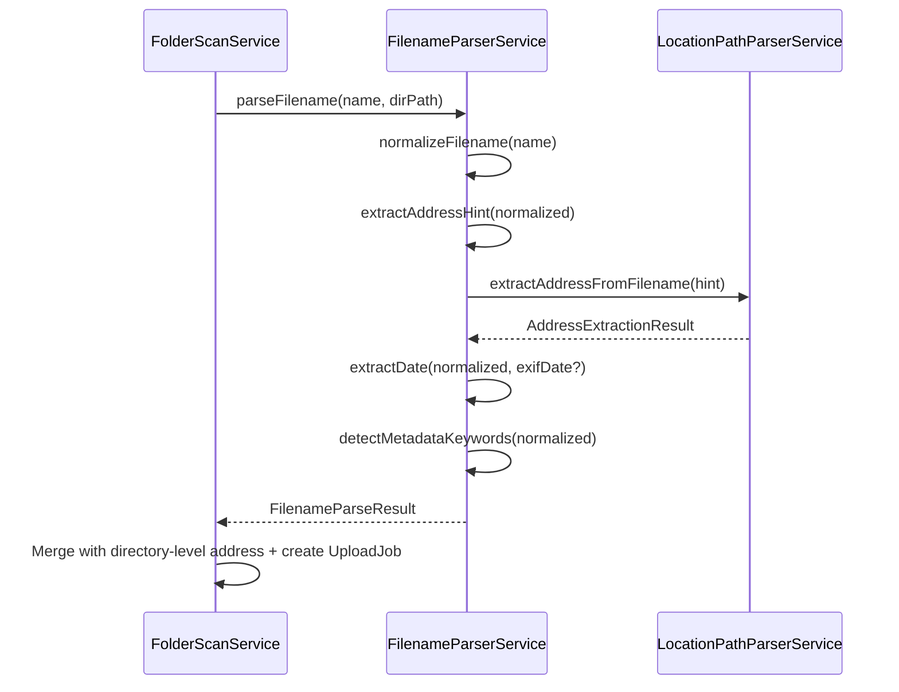

# Filename Parser Service

## What It Is

A utility service that extracts address, date, and metadata signals from filenames before upload. It normalizes filename conventions, detects address-like patterns (e.g., "Denisgasse_12" or "Wien_Brandstätte_7"), extracts capture dates from EXIF or filename timestamps, and delegates address validation to the `LocationPathParserService`.

This service bridges filename semantics to structured upload job metadata and supports folder-import flows where per-file addresses override folder-level hints.

## What It Looks Like

This is infrastructure without UI. The parser receives a filename (with or without directory context) and returns a structured JSON object containing extracted address, parsed date, any metadata hints, and confidence levels for each extraction type.

## Where It Lives

- **Consumed by**: `FolderScanService`, `UploadNewPipelineService`
- **Entry points**:
  - `parseFilename(filename: string, directoryPath?: string)` — main public API
  - `extractDate(filename: string, exifDate?: Date)` — date extraction with EXIF fallback
  - `extractAddressHint(filename: string)` — address signal detection
  - `normalizeFilename(filename: string)` — filename sanitization
- **Called by**: Upload pipeline before `LocationPathParserService` validation

## Actions & Interactions

| #   | Trigger                                        | System Response                                                 | Notes                            |
| --- | ---------------------------------------------- | --------------------------------------------------------------- | -------------------------------- |
| 1   | FolderScanService provides filename + path     | Parses filename; delegates address to LocationPathParserService | Normal multi-file flow           |
| 2   | Filename contains address-like pattern         | Extracts pattern; forwards to LocationPathParser for validation | E.g., "Denisgasse_12.jpg"        |
| 3   | Filename contains date-like pattern            | Parses ISO date, timestamp, or German format (DD.MM.YYYY)       | Fallback to EXIF date if present |
| 4   | Filename has metadata keywords (e.g., "DRAFT") | Records as metadata tag; stores for audit                       | Non-blocking signal              |
| 5   | EXIF date exists and filename date differs     | Prefers EXIF date; logs filename discrepancy                    | EXIF is authoritative            |
| 6   | Filename cannot be parsed for address/date     | Returns null fields; no error thrown                            | Noise-resilient                  |
| 7   | Parsing completes successfully                 | Returns `FilenameParseResult` with all extracted fields         | Normal success case              |

## Component Hierarchy

```
FilenameParserService
  ├── Filename Normalization
  │   └── normalizeFilename(name: string) → string
  ├── Address Extraction & Validation
  │   ├── extractAddressHint(name: string) → string | null
  │   └── LocationPathParserService.extractAddressFromFilename(name)
  ├── Date Extraction
  │   ├── extractDateFromFilename(name: string) → Date | null
  │   └── parseDatePattern(text: string) → Date | null
  ├── Metadata Detection
  │   ├── detectMetadataKeywords(name: string) → string[]
  │   └── isBakFilename(name: string) → boolean
  └── Result Formatting
      └── formatResult() → FilenameParseResult
```

## Data

### Data Flow (Mermaid — Parsing Process)



### Data Structure

| Field / Artifact      | Source                            | Type                     | Notes                                   |
| --------------------- | --------------------------------- | ------------------------ | --------------------------------------- |
| Input filename        | User file selection               | `string`                 | E.g., "Denisgasse_12_2024-03-15.jpg"    |
| Normalized name       | Whitespace/special char cleanup   | `string`                 | Lowercase, hyphens normalized           |
| Extension             | String split on last dot          | `string`                 | "jpg", "png", "pdf", etc.               |
| Raw address hint      | Regex or pattern match            | `string \| null`         | E.g., "Denisgasse_12"                   |
| Validated address     | LocationPathParserService result  | `AddressContext \| null` | Fully parsed location components        |
| Raw date text         | Regex match from filename         | `string \| null`         | E.g., "2024-03-15" or "15.03.2024"      |
| Parsed date           | Date constructor or EXIF fallback | `Date \| null`           | Timezone-aware if possible              |
| EXIF date (reference) | Metadata                          | `Date \| null`           | Used only for validation/override logic |
| Metadata keywords     | Keyword set matching              | `string[]`               | ["DRAFT", "THUMB", "TEMP"], etc.        |
| Backup flag           | Check for ~, .bak, .tmp suffix    | `boolean`                | If true, mark for removal from upload   |

### Output Format

```json
{
  "normalizedFilename": "denisgasse_12_2024-03-15.jpg",
  "extension": "jpg",
  "extractedAddress": {
    "country": null,
    "city": null,
    "zip": null,
    "street": "Denisgasse",
    "house_number": "12",
    "unit": null,
    "confidence_score": 0.4
  },
  "extractedDate": "2024-03-15T00:00:00Z",
  "dateSource": "filename",
  "metadataKeywords": [],
  "isBackupFile": false,
  "confidence": {
    "address": 0.4,
    "date": 0.9
  }
}
```

## State

| Name                | Type                           | Default | Controls                                  |
| ------------------- | ------------------------------ | ------- | ----------------------------------------- |
| `currentFilename`   | `string`                       | `""`    | Filename being processed                  |
| `normalizedName`    | `string`                       | `""`    | Cleaned filename for parsing              |
| `extractedAddress`  | `AddressContext \| null`       | `null`  | Validated address from LocationPathParser |
| `addressConfidence` | `number 0.0–1.0`               | `0.0`   | Address extraction quality                |
| `extractedDate`     | `Date \| null`                 | `null`  | Parsed date from filename or EXIF         |
| `dateSource`        | `'filename' \| 'exif' \| null` | `null`  | Which source provided the date            |
| `dateConfidence`    | `number 0.0–1.0`               | `0.0`   | Date extraction quality                   |
| `metadataKeywords`  | `string[]`                     | `[]`    | Detected metadata hints or flags          |
| `isBackupFile`      | `boolean`                      | `false` | Should be excluded from primary upload    |

## File Map

| File                                              | Purpose                                 |
| ------------------------------------------------- | --------------------------------------- |
| `docs/element-specs/filename-parser/filename-parser.md`           | Service spec (this document)            |
| `core/filename-parser.service.ts`                 | Main service implementation             |
| `core/filename-parser/date-patterns.const.ts`     | ISO, timestamp, and German date regexes |
| `core/filename-parser/metadata-keywords.const.ts` | DRAFT, THUMB, TEMP, and other keywords  |
| `core/filename-parser.util.ts`                    | Shared utilities (normalization, etc.)  |
| `core/filename-parser.service.spec.ts`            | Unit tests for all pattern types        |

## Wiring

### Injected Services

- `LocationPathParserService` — for address extraction and validation

### Inputs

- `filename: string` — The file name (e.g., "Denisgasse_12_2024-03.jpg")
- `directoryPath?: string` (optional) — Full directory path for context

### Outputs

- `FilenameParseResult` — Structured JSON with extracted address, date, metadata

### Consumer Integration (Mermaid — Wiring)



## Acceptance Criteria

- [ ] Service parses common address patterns from filenames (e.g., "Denisgasse_12", "Wien_Brandstätte_7").
- [ ] Address hints are validated through `LocationPathParserService.extractAddressFromFilename()`.
- [ ] Date extraction supports ISO format (YYYY-MM-DD), timestamps, and German format (DD.MM.YYYY).
- [ ] EXIF date takes priority over filename date when both are available.
- [ ] Filenames without date or address patterns return null fields without errors.
- [ ] Metadata keywords are detected (DRAFT, THUMB, TEMP, etc.) and returned as an array.
- [ ] Backup files (~, .bak, .tmp, .swp suffixes) are marked with `isBackupFile: true`.
- [ ] Output always follows `FilenameParseResult` JSON format.
- [ ] Service is composable: address extraction delegates to `LocationPathParserService`.
- [ ] FolderScanService uses per-file parsed results to override folder-level address hints.
