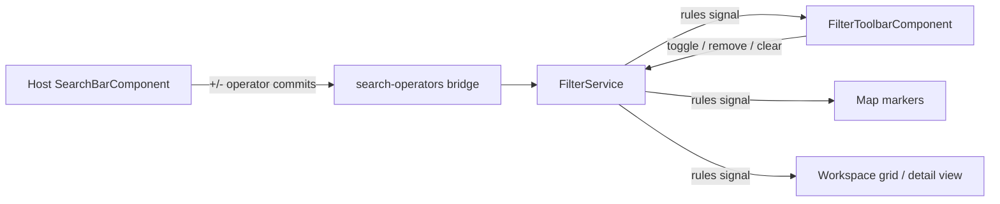
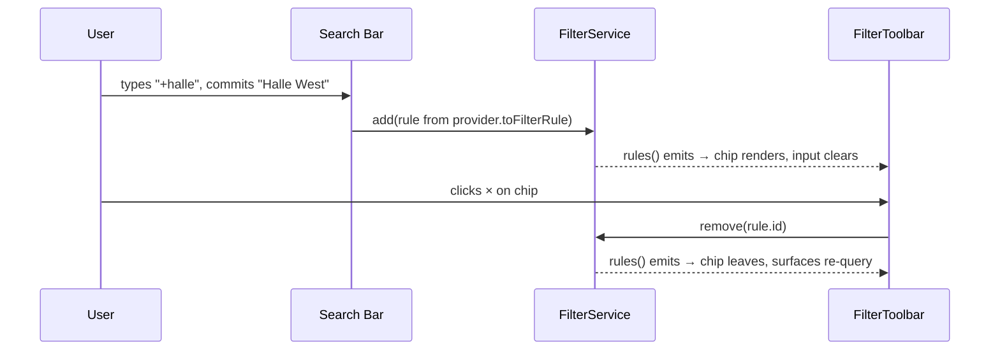

# Filter Toolbar

> **Blueprint:** [implementation-blueprints/universal-search-provider-system.md](../implementation-blueprints/universal-search-provider-system.md)
> **Supersedes:** [active-filter-chips.md](active-filter-chips.md) — do not implement both.

## What It Is

A floating row of filter chips that docks directly below a search bar and shows every active filter as a toggleable, removable pill. It is a reusable component — the map search bar hosts it first, and any future search surface (workspace/image detail, photos page) docks the same component with zero new wiring.

## What It Looks Like

A horizontal flex-wrap row floating just below the host search bar, same width as the search surface, with a small gap so it reads as a separate docked element. Chips are compact pills on `--color-bg-elevated`: a leading provider icon (folder for project, calendar for time range, tag for metadata), a label like "Projekt: Halle West", and a trailing 1rem × button. The chip for a filter created seconds ago animates in with a short fade/slide. The row is invisible when no filters are active — it occupies no space and never renders an empty container. Wraps to multiple lines when needed; on mobile it scrolls horizontally instead of wrapping beyond two lines.

## Where It Lives

- **Route**: wherever its host search bar lives — v1: map page only
- **Parent**: `MapShellComponent` (`features/map/map-shell/map-shell.component.ts`), rendered immediately below `SearchBarComponent` in the Map Zone (z-order below the open results panel so the dropdown overlays the toolbar)
- **Appears when**: `FilterService.activeCount() > 0`
- **Reusability contract**: the component takes no host-specific inputs; docking on a new surface = placing `<app-filter-toolbar/>` under that surface's search bar. Filter state is global (`FilterService`), so all surfaces show the same chips by design.

## Actions

| #   | User Action                                              | System Response                                                                       | Triggers                                |
| --- | -------------------------------------------------------- | -------------------------------------------------------------------------------------- | ---------------------------------------- |
| 1   | Commits `+project` candidate in the search bar           | Chip appears in toolbar with enter animation; search input clears                      | `FilterService.add()` via operator bridge |
| 2   | Clicks a chip's × (or commits `-project` in search bar)  | Chip leaves; filtered surfaces re-evaluate                                             | `FilterService.remove()`                  |
| 3   | Re-selects an entity that is already an active chip      | Chip toggles **off** (operator path and chip path are equivalent)                      | `FilterService.toggle()`                  |
| 4   | Clicks the chip body (not the ×)                         | Chip enters "armed" focus state; Backspace/Delete removes it; Escape disarms           | Keyboard removal affordance               |
| 5   | Activates "Clear all" (shown when ≥ 3 chips)             | All filters removed                                                                    | `FilterService.clear()`                   |
| 6   | Filters change from anywhere else (filter panel, operators) | Toolbar updates reactively; no own copy of state                                     | `rules` signal                            |
| 7   | Last chip removed                                        | Toolbar disappears entirely (no empty shell)                                           | `activeCount() === 0`                     |
| 8   | Tabs into the toolbar                                    | Chips are focusable in order; × reachable; `aria-label` announces filter description    | a11y                                      |

## Component Hierarchy

```
FilterToolbar                              ← flex-wrap row, docked below host search bar, gap-2
├── FilterChip × N                         ← pill, --color-bg-elevated, focusable
│   ├── ProviderIcon                       ← 1rem leading icon by rule property
│   ├── ChipLabel                          ← "Projekt: Halle West", truncates > 12rem
│   └── RemoveButton (×)                   ← 1rem ghost, aria-label "Filter entfernen: …"
└── [≥ 3 chips] ClearAllButton             ← ghost text button "Clear all"
```

### Wiring Flow (Mermaid)



### Data Flow (Mermaid)



## Data

| Field          | Source                                  | Type           |
| -------------- | ---------------------------------------- | -------------- |
| Active filters | `FilterService.rules()` signal           | `FilterRule[]` |
| Chip labels    | Derived: provider noun (i18n) + rule value | `string`     |

No Supabase access — purely a view over `FilterService`.

## State

No own state beyond a transient `armedChipId: string | null` for keyboard removal. Everything else is derived from `FilterService`; the toolbar must remain correct if filters are mutated by any other surface.

## Settings

- **Filter Toolbar**: chip overflow behavior (wrap vs horizontal scroll on mobile) and the chip-count threshold at which "Clear all" appears.

## File Map

| File                                                  | Purpose                                |
| ----------------------------------------------------- | -------------------------------------- |
| `shared/filter-toolbar/filter-toolbar.component.ts`   | Toolbar component (standalone, reusable) |
| `shared/filter-toolbar/filter-toolbar.component.html` | Template                               |
| `shared/filter-toolbar/filter-toolbar.component.scss` | Chip + row styles                      |
| `shared/filter-toolbar/filter-toolbar.component.spec.ts` | Unit tests covering Actions table   |

Placed in `shared/` (not `features/map/`) because the docking contract is host-agnostic.

## Wiring

### Injected Services

- `FilterService` — single source of truth for rules; toolbar calls `add/remove/toggle/clear`.
- `I18nService` — chip noun labels, remove/clear aria-labels (en/de/it).

### Inputs / Outputs

None. (Host-specific positioning is the host's CSS concern; the toolbar only guarantees its own row layout.)

### Subscriptions

- `FilterService.rules()` signal read in template (no manual teardown).

### Supabase Calls

None — delegated to nothing; the toolbar is state-view only.

- Mount in `map-shell.component.html` directly below `<app-search-bar>`.
- `FilterService` gains `toggle(rule)` and stable rule identity (`property + value` equality) so operator commits and chip clicks converge (blueprint phase 3).
- New strings registered per the mandatory i18n workflow.

## Acceptance Criteria

- [ ] Invisible (zero footprint) when no filters are active
- [ ] Chip appears with animation when a `+` operator commit or filter-panel action adds a rule, and the search input clears on operator commits
- [ ] Clicking × removes exactly that filter and all filtered surfaces update
- [ ] Re-selecting an already-active entity (via chip, `+`, or `#`-scoped commit) toggles the chip off — both paths produce identical `FilterService` state
- [ ] `-` operator meta suggestions list current chips and removing via `-` is equivalent to clicking ×
- [ ] Chips wrap gracefully on desktop and scroll horizontally on mobile
- [ ] "Clear all" appears at ≥ 3 chips and removes everything
- [ ] Chips are keyboard-focusable; Backspace/Delete removes an armed chip; aria-labels describe each filter
- [ ] Search actions never reset chips (only explicit removal/clear does)
- [ ] Docking the component under a second search bar requires no changes to the component itself
