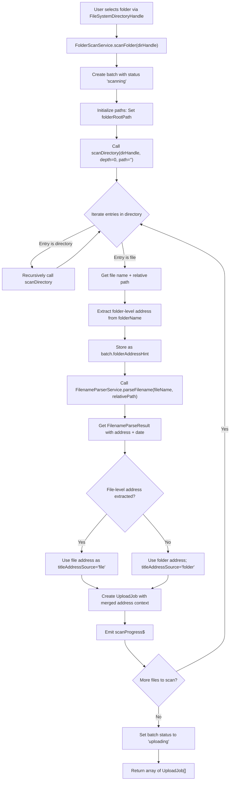
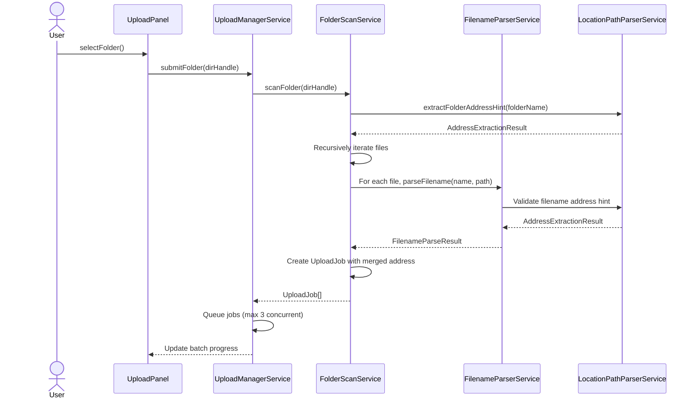

# Folder Scan Service

## What It Is

A utility service that recursively scans selected directories using the File System Access API (Chromium-based browsers), extracts folder-level address hints and per-file metadata, and queues discovered files as upload jobs with address inheritance rules applied.

The service bridges folder selection to the upload pipeline, establishing address precedence where higher-level folder anchors (country/city/ZIP) provide context, folder hints provide defaults, and file-level filename/title signals override conflicting folder data.

## What It Looks Like

This is infrastructure without UI. The scanner receives a `FileSystemDirectoryHandle`, recursively processes all files, extracts addressable segments from folder names and filenames, and creates a batch of jobs with address hints propagated according to hierarchy rules. A scan progress stream tracks discovered files and conversion of "scanning" status to "uploading" status.

## Where It Lives

- **Consumed by**: `UploadManagerService` (folder import entry point)
- **Entry points**:
  - `scanFolder(dirHandle: FileSystemDirectoryHandle)` — main async public API
  - `extractFolderAddressHint(folderName: string)` — folder-level address extraction
  - Stream: `scanProgress$` — emits discovered file counts
- **Calls downstream**: `FilenameParserService`, `LocationPathParserService`

## Actions & Interactions

| #   | Trigger                                   | System Response                                                 | Notes                         |
| --- | ----------------------------------------- | --------------------------------------------------------------- | ----------------------------- |
| 1   | User selects folder via File System API   | Scanner initializes and marks batch status as `scanning`        | Start of folder import flow   |
| 2   | Scanner recursively discovers files       | Emits `scanProgress$` with running count of discovered files    | Real-time UI feedback         |
| 3   | Folder name contains parseable address    | Extracts folder address and stores as `batch.folderAddressHint` | Default for all jobs in batch |
| 4   | Individual file name contains address     | Parsing is delegated to `FilenameParserService`                 | Per-file extraction           |
| 5   | File-level address extracted successfully | File address overrides folder hint for that specific job        | File > Folder precedence      |
| 6   | File has no address-like filename         | Job inherits folder-address hint if present                     | Normal inheritance            |
| 7   | Folder contains subdirectories            | Recursively scans all levels; suppresses directory-only entries | Depth-unlimited recursion     |
| 8   | Scan discovers zero files                 | Emits `scanProgress$` with 0 count; allows empty batch creation | Edge case handled gracefully  |
| 9   | Scan completes                            | Updates batch status to `uploading`; returns array of UploadJob | Ready for pipeline            |
| 10  | User cancels scan mid-process             | Halts recursion and doesn't queue pending jobs                  | Abort signal respected        |

## Component Hierarchy

```
FolderScanService
  ├── Folder Entry Point
  │   └── scanFolder(dirHandle) → Promise<UploadJob[]>
  ├── Recursive Scanning
  │   ├── scanDirectory(dirHandle, depth, path)
  │   ├── isFileEntry(entry) → boolean
  │   └── getRelativePathFromRoot(entry) → string
  ├── Address Extraction (Folder & File Level)
  │   ├── extractFolderAddressHint(folderName) → string | null
  │   └── FilenameParserService.parseFilename(name, dirPath)
  ├── Job Creation & Queueing
  │   ├── createJobFromFileEntry(entry, batch, folderAddressHint)
  │   └── return UploadJob[] to `UploadManagerService` for queueing after scan
  ├── Progress Tracking
  │   └── scanProgress$ : Observable<ScanProgressEvent>
  └── Cancellation Support
      └── cancelScan() → void
```

## Data

### Data Flow (Mermaid — Folder Scanning)



### Data Structure

| Field / Artifact        | Source                                  | Type                        | Notes                                  |
| ----------------------- | --------------------------------------- | --------------------------- | -------------------------------------- |
| Input dirHandle         | User file picker                        | `FileSystemDirectoryHandle` | Requires permissions granted           |
| Folder root path        | dirHandle.name                          | `string`                    | Top-level folder name                  |
| Folder address hint     | `LocationPathParserService` on root     | `string \| null`            | Root folder may contain city/street    |
| Discovered files        | Recursive directory traversal           | `Set<FileSystemFileHandle>` | All files at all depths                |
| Relative file path      | Path from root to file                  | `string`                    | E.g., "Subfolder/Image.jpg"            |
| Scan progress count     | Incremented per file discovered         | `number`                    | Emitted via `scanProgress$`            |
| Per-file address hint   | `FilenameParserService.parseFilename()` | `AddressContext \| null`    | Filename-extracted or null             |
| Address source tracking | 'file' \| 'folder' \| null              | `string \| null`            | Indicates which level provided address |
| Batch status transition | `'scanning'` → `'uploading'`            | `string`                    | Lifecycle marker                       |

### Output Format

After scanning, each discovered file becomes an `UploadJob` with structured address precedence:

```json
{
  "jobId": "uuid",
  "batchId": "batch-uuid",
  "file": "FileSystemFileHandle",
  "fileName": "Denisgasse_12_2024-03-15.jpg",
  "relativePath": "Subfolder/Image.jpg",
  "titleAddressSource": "file",
  "titleAddressCoords": null,
  "folderAddressHint": "Wien",
  "address": {
    "country": null,
    "city": "Wien",
    "zip": null,
    "street": "Denisgasse",
    "house_number": "12",
    "unit": null
  },
  "extractedDate": "2024-03-15T00:00:00Z",
  "mode": "new",
  "status": "queued"
}
```

## State

| Name                    | Type                          | Default     | Controls                               |
| ----------------------- | ----------------------------- | ----------- | -------------------------------------- |
| `currentBatchId`        | `string \| null`              | `null`      | Active batch during scan               |
| `folderRootName`        | `string`                      | `""`        | Top-level folder name                  |
| `folderAddressHint`     | `string \| null`              | `null`      | Extracted from root folder name        |
| `discoveredFileCount`   | `number`                      | `0`         | Running count of found files           |
| `isScanActive`          | `boolean`                     | `false`     | Current scanning state                 |
| `scanCancellationToken` | `AbortSignal \| null`         | `null`      | Allows cancellation mid-process        |
| `relativePaths`         | `Map<string, string>`         | `new Map()` | File ID → relative path mapping        |
| `folderAddressPerLevel` | `Map<number, string \| null>` | `new Map()` | Depth → extracted address (breadcrumb) |

## File Map

| File                                             | Purpose                                   |
| ------------------------------------------------ | ----------------------------------------- |
| `docs/element-specs/folder-scan.md`              | Service spec (this document)              |
| `core/upload/folder-scan.service.ts`             | Main service implementation               |
| `core/upload/folder-scan/scan-progress.types.ts` | Type definitions for scan progress events |
| `core/upload/folder-scan.util.ts`                | Path utilities (relative path calc, etc.) |
| `core/upload/folder-scan.service.spec.ts`        | Unit tests for recursive scanning         |

## Wiring

### Injected Services

- `FilenameParserService` — for per-file address/date extraction
- `LocationPathParserService` — for folder-name address extraction
- `UploadManagerService` — for job queueing
- `UploadBatchService` — for batch progress tracking

### Inputs

- `dirHandle: FileSystemDirectoryHandle` — Selected folder from File System Access API
- `abortSignal?: AbortSignal` (optional) — For cancellation support

### Outputs

- Array of `UploadJob[]` — One job per discovered file
- Stream: `scanProgress$: Observable<{discoveredCount: number}>` — Real-time progress

### Consumer Integration (Mermaid — Wiring)



## Acceptance Criteria

- [ ] Service recursively scans all directories at arbitrary depth.
- [ ] Folder-level address is extracted from the root folder name using `LocationPathParserService`.
- [ ] Per-file address extraction uses `FilenameParserService` for each discovered file.
- [ ] File-level address overrides folder-level address when both are present.
- [ ] Each discovered file produces one `UploadJob` with merged address context.
- [ ] `scanProgress$` emits running count of discovered files in real time.
- [ ] Batch status transitions from `'scanning'` → `'uploading'` when scan completes.
- [ ] Empty folders are handled gracefully (discovered file count = 0).
- [ ] Cancellation signal (AbortSignal) halts scanning and does not queue pending jobs.
- [ ] Relative paths are correctly calculated from root folder to each file.
- [ ] Jobs are queued to `UploadManagerService` after scan completes (not during).
- [ ] Service supports large folders (thousands of files) without UI freezing.
- [ ] All extracted address hints (folder and file level) are marked with `titleAddressSource` for audit.
