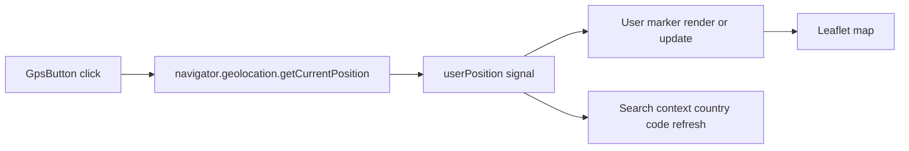
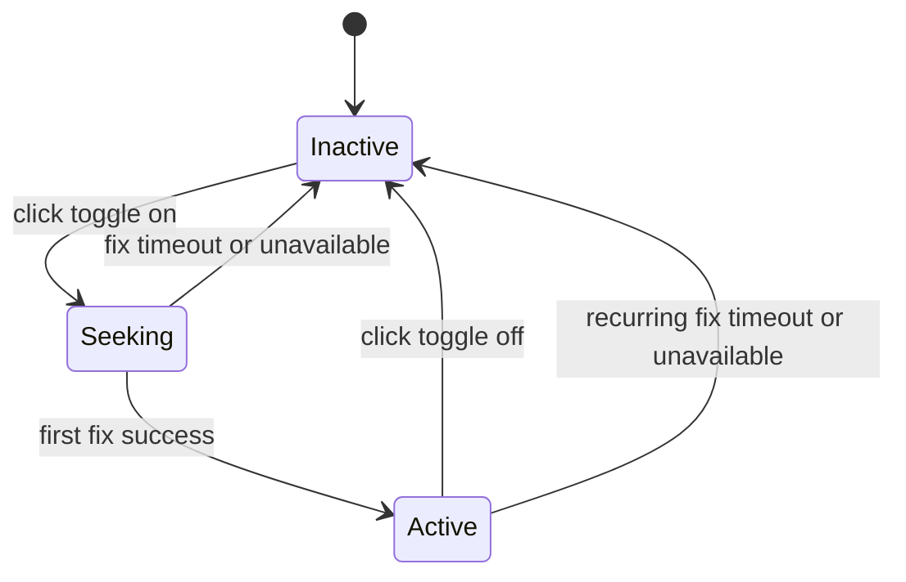
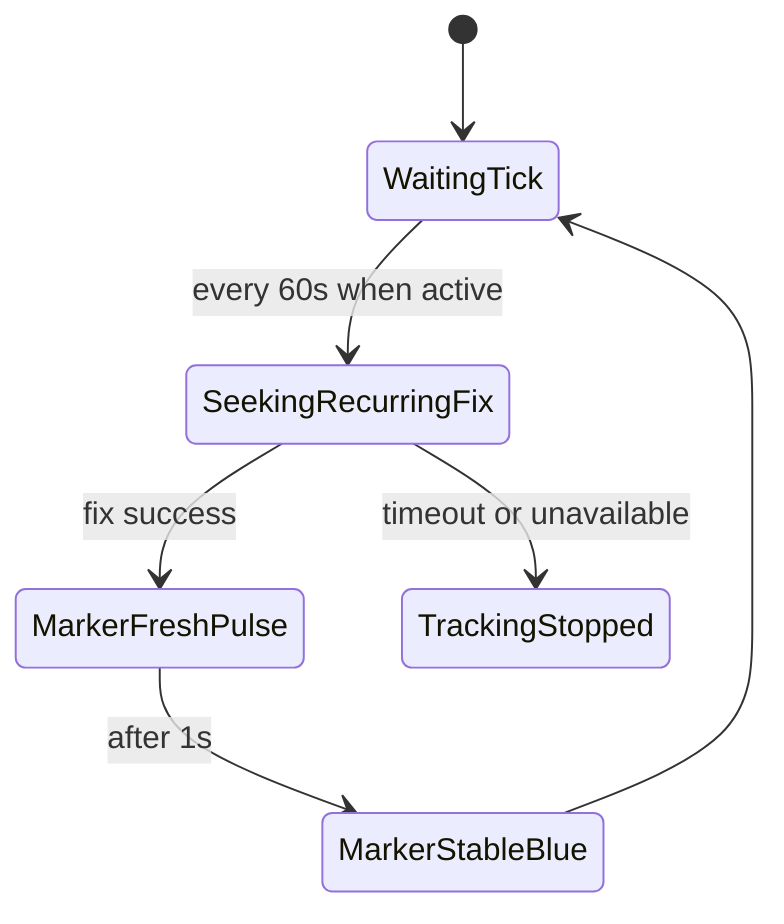
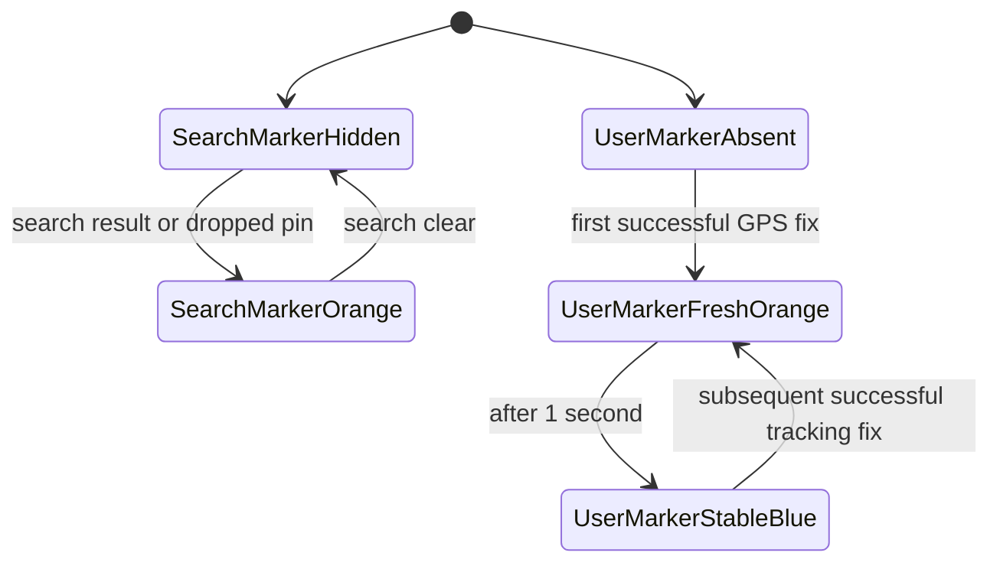
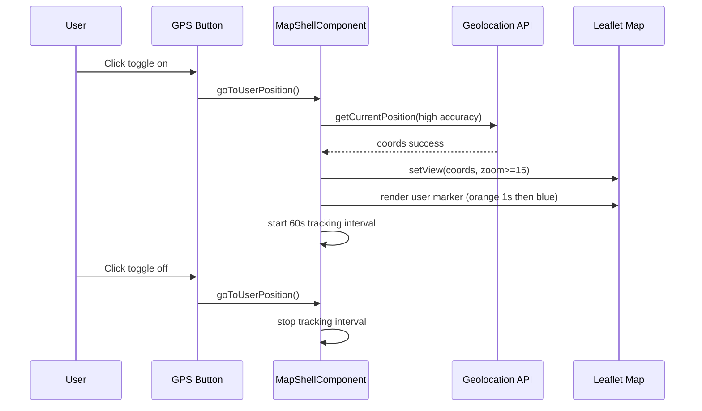

# GPS Button

## What It Is

A floating toggle button in Map Zone that controls GPS tracking mode. On activation it requests a location fix, recenters map only from this explicit click flow, and places/updates the user marker. While active, it refreshes location roughly every minute and emits a short visual pulse when a fix is received.

## What It Looks Like

2.75rem circle (desktop / about 44px) and 3rem circle (mobile / about 48px). Background stays color-bg-surface. Crosshair icon color is text-primary (black/dark) when inactive and color-clay (orange) while active or seeking. Subtle elevation-overlay shadow and spinner while seeking.

User marker visual contract:

- Fresh fix: orange for 1 second
- Stable tracking: blue
- Layering: user marker renders above photo markers

Search marker visual contract:

- Always orange
- Independent from GPS toggle state

Unit note: button geometry uses rem for accessibility scaling; borders and shadows can stay px precision.

## Where It Lives

- **Parent**: Map Zone (floating)
- **Position**: Bottom Right Corner

## Actions

| #   | User Action                                         | System Response                                                                                      | Triggers                                 |
| --- | --------------------------------------------------- | ---------------------------------------------------------------------------------------------------- | ---------------------------------------- |
| 1   | Clicks button while inactive                        | Enters seeking, requests high-accuracy GPS fix                                                       | navigator.geolocation.getCurrentPosition |
| 2   | First fix resolves                                  | Drops/updates user marker, recenters map, marker flashes orange 1s then blue, enters active tracking | gpsTrackingActive true                   |
| 3   | Clicks button while active                          | Disables tracking and stops minute refresh loop; marker remains on map                               | gpsTrackingActive false                  |
| 4   | Active tracking timer fires (~60s)                  | Requests a fresh fix, updates marker position, pulses orange 1s then blue, no forced recenter        | interval tick                            |
| 5   | GPS lookup fails or times out for long              | Exits tracking mode automatically; icon returns to inactive black state                              | geolocation error callback               |
| 6   | App start geolocation resolves without button click | Can cache/update user position and marker, but must not auto-recenter map                            | startup geolocation path                 |

## Component Hierarchy

```
GpsButton                                  ← 2.75rem/3rem circle, floating bottom-right
├── LocationIcon                           ← black when inactive, orange when active/seeking
└── [seeking] Spinner                      ← shown while awaiting fix
```

## Design Tokens

| Token                       | Value                       | Notes                     |
| --------------------------- | --------------------------- | ------------------------- |
| `--touch-target-base`       | `2.75rem` (≈44px)           | Desktop min tap target    |
| `--touch-target-mobile`     | `3rem` (≈48px)              | Mobile min tap target     |
| `--radius-circle`           | `50%`                       | Makes it a circle         |
| `--shadow-float`            | `0 2px 8px rgba(0,0,0,0.2)` | px fine for shadows       |
| `--color-bg-surface`        | (from design system)        | Button background         |
| `--color-text-primary`      | (from design system)        | Inactive icon color       |
| `--color-clay`              | (from design system)        | Active icon/search marker |
| `--color-map-user-marker`   | (from design system)        | Stable user marker (blue) |
| `--color-map-search-marker` | (from design system)        | Search marker (orange)    |

## Data

### Data Flow (Mermaid)



| Field            | Source                  | Type                              |
| ---------------- | ----------------------- | --------------------------------- |
| User position    | Browser Geolocation API | GeolocationPosition               |
| Tracking timer   | Browser timer           | ReturnType setInterval null       |
| GPS button state | Component signals       | gpsTrackingActive and gpsLocating |

## State

| Name                | Type                 | Default | Controls                                               |
| ------------------- | -------------------- | ------- | ------------------------------------------------------ |
| `gpsTrackingActive` | boolean              | false   | Toggle active/inactive mode                            |
| `gpsLocating`       | boolean              | false   | Spinner visibility while awaiting fix                  |
| `userPosition`      | number tuple or null | null    | Known coordinates for immediate recenter on activation |

### GPS Toggle State Machine (Mermaid)



### Tracking Pulse Loop State (Mermaid)



### Marker Visual State Contract (Mermaid)



## File Map

| File                                              | Purpose                                                                |
| ------------------------------------------------- | ---------------------------------------------------------------------- |
| `features/map/map-shell/map-shell.component.ts`   | GPS toggle logic, geolocation calls, minute pulse loop, marker updates |
| `features/map/map-shell/map-shell.component.html` | GPS button bindings and toggle aria state                              |
| `features/map/map-shell/map-shell.component.scss` | GPS button and user/search marker visual states                        |

## Wiring

### Wiring Flow (Mermaid)



## Acceptance Criteria

- [x] Floating bottom-right in Map Zone
- [x] `2.75rem` (≈44px) desktop, `3rem` (≈48px) mobile tap target
- [x] Button is a toggle: first click enables tracking, second click disables tracking
- [x] Map recenters to user location only when GPS button is clicked (not on startup geolocation)
- [x] While active, geolocation refresh runs roughly every 60 seconds
- [x] If geolocation times out or becomes unavailable, tracking deactivates and icon returns inactive color
- [x] Icon color is orange while active or seeking and black when inactive
- [x] User marker flashes orange for 1 second on each successful fix, then becomes blue
- [x] Search marker remains orange at all times
- [x] User marker renders above photo markers
