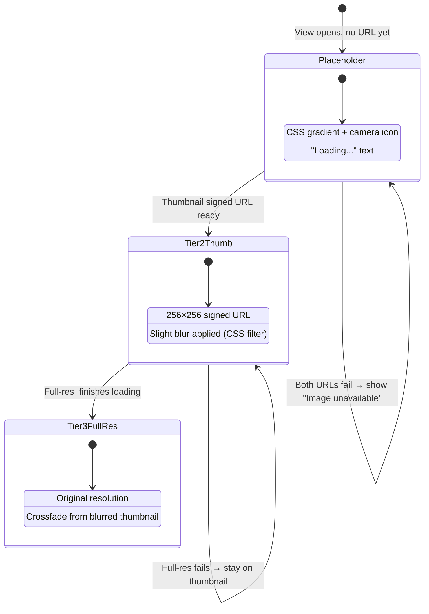
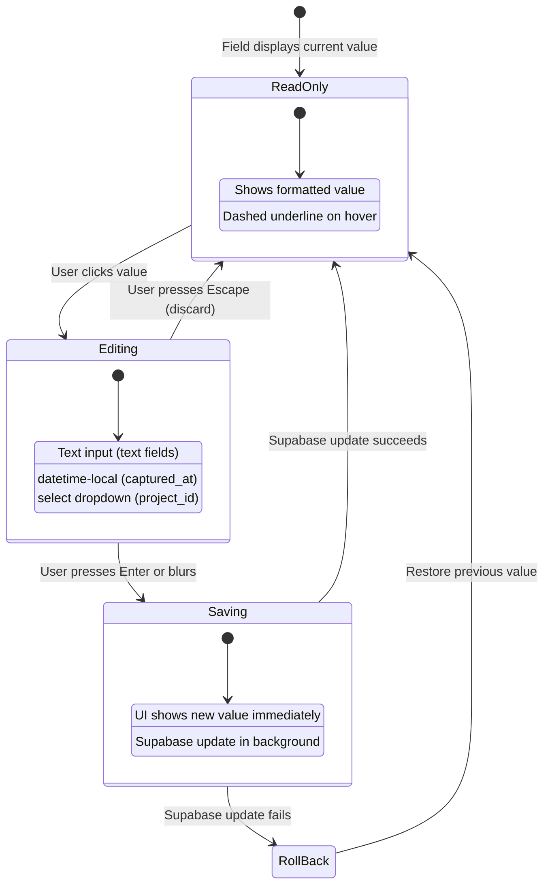
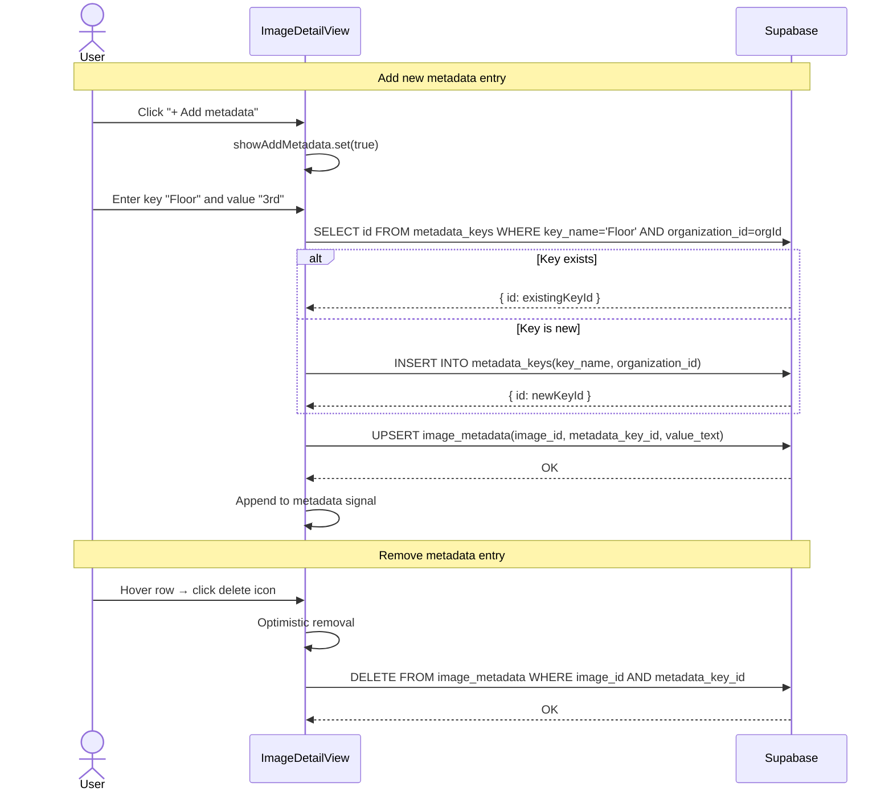

# Image Detail View

> **Blueprint:** [implementation-blueprints/image-detail-view.md](../implementation-blueprints/image-detail-view.md)
> **Photo loading use cases:** [use-cases/photo-loading.md](../use-cases/photo-loading.md)
> **Editing use cases:** [use-cases/image-editing.md](../use-cases/image-editing.md)

## What It Is

The full detail view of a single photo. Shows the full-resolution image with all properties editable inline. Users can modify the address label (title), captured date, project assignment, address components (street, city, district, country), custom metadata key/values, and location. Desktop: replaces the thumbnail grid inside the Workspace Pane (with a back arrow to return). Mobile: full-screen overlay.

## What It Looks Like

**Desktop:** Takes over the Workspace Pane content area. Top: back arrow + editable image title (click to edit inline). Below: full-width image (scrollable if tall). Below image: two sections — "Details" with core image properties in two-column rows (key: value, all editable), and "Custom metadata" with user-defined key/value pairs plus an "Add metadata" button. Coordinates section shows lat/lng + correction indicator. Actions menu at bottom.

**Mobile:** Full-screen overlay with close button top-right. Image at top, metadata scrolls below.

All property rows follow the **Notion pattern**: click the value → inline edit → save on Enter/blur → no separate "Edit" button. Project assignment uses a `<select>` dropdown instead of a text input. Captured date uses a `datetime-local` input. Editable values show a subtle underline-on-hover affordance (dashed bottom border, `--color-primary` on hover).

## Where It Lives

- **Parent**: Workspace Pane (replaces Thumbnail Grid when an image is selected)
- **Appears when**: User clicks a thumbnail card or map marker detail action

## Actions

| #   | User Action                               | System Response                                               | Triggers                         |
| --- | ----------------------------------------- | ------------------------------------------------------------- | -------------------------------- |
| 1   | Clicks back arrow (desktop)               | Returns to Thumbnail Grid                                     | `detailImageId` → null           |
| 2   | Clicks close (mobile)                     | Closes overlay, returns to previous state                     | Overlay dismissed                |
| 3   | Clicks address label (title)              | Title becomes an inline text input                            | `editingField` → `address_label` |
| 4   | Presses Enter or blurs title input        | Saves updated address_label to `images` table                 | Supabase update                  |
| 5   | Clicks captured date value                | Date becomes a `datetime-local` input                         | `editingField` → `captured_at`   |
| 6   | Picks new date/time, blurs                | Saves updated captured_at to `images` table                   | Supabase update                  |
| 7   | Clicks project value                      | Value becomes a `<select>` dropdown with org projects         | `editingField` → `project_id`    |
| 8   | Selects a project                         | Saves project_id to `images` table                            | Supabase update                  |
| 9   | Clicks street/city/district/country value | Value becomes an inline text input                            | `editingField` → field name      |
| 10  | Presses Enter or blurs address input      | Saves updated address component to `images` table             | Supabase update                  |
| 11  | Clicks a custom metadata value            | Value becomes an inline text input                            | Edit mode                        |
| 12  | Presses Enter or blurs input              | Saves updated metadata value via upsert                       | Supabase upsert                  |
| 13  | Clicks "Add metadata" button              | New row with key + value inputs appears                       | `showAddMetadata` → true         |
| 14  | Fills key + value, presses Enter          | Creates metadata_key (if new) + image_metadata row            | Supabase insert/upsert           |
| 15  | Hovers metadata row                       | Reveals delete icon on the right                              | CSS hover                        |
| 16  | Clicks delete icon on metadata row        | Removes the metadata entry (optimistic, then Supabase delete) | Supabase delete                  |
| 17  | Presses Escape during any edit            | Cancels edit, restores original value, no DB write            | `editingField` → null            |
| 18  | Clicks "Edit location"                    | Enters correction mode (drag marker on map)                   | Correction flow                  |
| 19  | Clicks "Add to project"                   | Opens project picker                                          | Project assignment               |
| 20  | Clicks "Delete" in actions menu           | Confirmation dialog, then deletes image                       | Supabase delete                  |
| 21  | Scrolls down                              | Reveals more metadata and coordinate info                     | Scroll                           |

## Component Hierarchy

```
ImageDetailView                            ← fills Workspace Pane content area (desktop) or full-screen (mobile)
├── DetailHeader
│   ├── BackButton (←)                     ← desktop: back to grid; mobile: close overlay
│   ├── ImageTitle                         ← address label, click-to-edit inline
│   │   └── [editing] InlineInput          ← replaces title text, saves on Enter/blur
│   └── ContextMenuTrigger (⋯)
│       └── [open] ContextMenu             ← Delete, Copy coordinates
├── ImageContainer                         ← full-width, aspect-ratio preserved
│   ├── [not loaded] Placeholder            ← CSS gradient + camera icon + "Loading…" text
│   ├── [tier 2] ThumbnailPreview          ← 256×256 signed URL (blurred/scaled up as preview)
│   └── [tier 3] FullResImage              ← original resolution, crossfades over thumbnail
├── DetailsSection                         ← "Details" heading, core image properties
│   ├── EditablePropertyRow "Captured"     ← datetime-local input on edit
│   ├── EditablePropertyRow "Project"      ← <select> dropdown with org projects
│   ├── EditablePropertyRow "Street"       ← inline text input on edit
│   ├── EditablePropertyRow "City"         ← inline text input on edit
│   ├── EditablePropertyRow "District"     ← inline text input on edit
│   ├── EditablePropertyRow "Country"      ← inline text input on edit
│   ├── CoordinatesRow                     ← lat, lng display (read-only, edited via map)
│   │   └── [corrected] CorrectionBadge   ← "Corrected" badge with original EXIF shown below
│   └── TimestampRow "Uploaded"            ← created_at (read-only)
├── MetadataSection                        ← "Custom metadata" heading
│   ├── MetadataPropertyRow × N            ← key (left) | value (right, click-to-edit) | [hover] delete icon
│   │   └── [editing] InlineInput          ← replaces value text
│   ├── [adding] AddMetadataRow            ← key input + value input, appears on "Add metadata" click
│   └── AddMetadataButton                  ← "+ Add metadata" ghost button
├── [corrected] CorrectionHistory
│   ├── OriginalCoords                     ← "Original EXIF: lat, lng"
│   └── CorrectedCoords                    ← "Corrected: lat, lng" + date
├── DetailActions
│   ├── EditLocationButton                 ← ghost button "Edit location"
│   ├── AddToProjectButton                 ← ghost button "Add to project"
│   └── ContextMenu (⋯)                   ← Delete, Copy coordinates, etc.
└── [confirm] DeleteConfirmDialog          ← modal with cancel/confirm
```

## Data

| Field              | Source                                                                                           | Type                             |
| ------------------ | ------------------------------------------------------------------------------------------------ | -------------------------------- |
| Image record       | `supabase.from('images').select('*')`                                                            | `ImageRecord`                    |
| Full-res URL       | Supabase Storage signed URL (original, no transform)                                             | `string`                         |
| Thumbnail URL      | Supabase Storage signed URL (256×256 transform)                                                  | `string`                         |
| Placeholder        | CSS-only, no data source                                                                         | —                                |
| Metadata           | `supabase.from('image_metadata').select('metadata_key_id, value_text, metadata_keys(key_name)')` | `MetadataEntry[]`                |
| Correction history | `images.latitude` ≠ `images.exif_latitude` (corrected via `coordinate_corrections`)              | Coordinate pairs                 |
| Projects list      | `supabase.from('projects').select('id, name').eq('organization_id', orgId)`                      | `{ id: string, name: string }[]` |

## State

| Name                | Type                             | Default | Controls                                     |
| ------------------- | -------------------------------- | ------- | -------------------------------------------- |
| `image`             | `ImageRecord \| null`            | `null`  | The displayed image record                   |
| `metadata`          | `MetadataEntry[]`                | `[]`    | Custom metadata key/value pairs              |
| `editingField`      | `string \| null`                 | `null`  | Which field is currently being edited inline |
| `fullResLoaded`     | `boolean`                        | `false` | Whether full-res image has loaded            |
| `thumbLoaded`       | `boolean`                        | `false` | Whether Tier 2 thumbnail has loaded          |
| `loading`           | `boolean`                        | `false` | Whether data is loading from Supabase        |
| `error`             | `string \| null`                 | `null`  | Error message if load failed                 |
| `saving`            | `boolean`                        | `false` | Whether a save operation is in progress      |
| `projectOptions`    | `{ id: string, name: string }[]` | `[]`    | Available projects for the dropdown          |
| `showAddMetadata`   | `boolean`                        | `false` | Whether the add-metadata row is visible      |
| `showContextMenu`   | `boolean`                        | `false` | Context menu visibility                      |
| `showDeleteConfirm` | `boolean`                        | `false` | Delete confirmation dialog visibility        |

## Progressive Image Loading

The detail view uses a **three-tier progressive loading** strategy to show content as fast as possible:



### Loading Sequence

1. View opens → CSS placeholder shown immediately (no network)
2. Tier 2 thumbnail signed URL fires (`256×256, cover, quality: 60`)
3. Thumbnail `` loads → replaces placeholder with slight blur filter
4. Tier 3 full-res signed URL fires (no transform, or max 2500px)
5. Full-res `` loads in hidden element → crossfade swaps it in
6. If Tier 3 fails, Tier 2 remains visible (adequate quality for metadata editing)
7. If both fail, CSS placeholder stays with "Image unavailable" text

### Signed URL Strategy

- **Tier 2:** `createSignedUrl(thumbnail_path ?? storage_path, 3600, { transform: { width: 256, height: 256, resize: 'cover', quality: 60 } })`
- **Tier 3:** `createSignedUrl(storage_path, 3600)` (no transform — full resolution)

## Inline Editing Flow

All editable fields follow the same interaction pattern:



### Editable Fields Map

| Field           | Input Type       | DB Table         | DB Column       | Validation               |
| --------------- | ---------------- | ---------------- | --------------- | ------------------------ |
| Address label   | `text`           | `images`         | `address_label` | Max 500 chars            |
| Captured date   | `datetime-local` | `images`         | `captured_at`   | Valid ISO date           |
| Project         | `<select>`       | `images`         | `project_id`    | Must be valid project ID |
| Street          | `text`           | `images`         | `street`        | Max 200 chars            |
| City            | `text`           | `images`         | `city`          | Max 200 chars            |
| District        | `text`           | `images`         | `district`      | Max 200 chars            |
| Country         | `text`           | `images`         | `country`       | Max 200 chars            |
| Custom metadata | `text`           | `image_metadata` | `value_text`    | Max 1000 chars           |

### Metadata Management Flow



## File Map

| File                                                              | Purpose                                                 |
| ----------------------------------------------------------------- | ------------------------------------------------------- |
| `features/map/workspace-pane/image-detail-view.component.ts`      | Detail view component                                   |
| `features/map/workspace-pane/image-detail-view.component.html`    | Template                                                |
| `features/map/workspace-pane/image-detail-view.component.scss`    | Styles                                                  |
| `features/map/workspace-pane/image-detail-view.component.spec.ts` | Unit tests                                              |
| `features/map/workspace-pane/metadata-property-row.component.ts`  | Reusable click-to-edit row                              |
| `features/map/workspace-pane/editable-property-row.component.ts`  | Click-to-edit row for image fields (text, date, select) |

## Wiring

- Displayed inside Workspace Pane when `detailImageId` is set
- On desktop: replaces Thumbnail Grid, back arrow returns to grid
- On mobile: opens as full-screen overlay on top of current view
- Metadata edits call `SupabaseService` to update `image_metadata`
- "Edit location" triggers correction mode in `MapShellComponent`

## Acceptance Criteria

- [ ] Desktop: replaces grid in workspace pane, back arrow returns
- [ ] Mobile: full-screen overlay with close button
- [ ] CSS placeholder shown immediately when view opens (gradient + camera icon)
- [ ] Tier 2 thumbnail (256×256 transform) loads and replaces placeholder with slight blur
- [ ] Full-res image loads on demand and crossfades over blurred thumbnail
- [ ] If full-res fails, Tier 2 thumbnail stays visible
- [ ] If both tiers fail, CSS placeholder with "Image unavailable" text remains
- [ ] No broken `` icon ever shown
- [ ] **Address label**: click title → inline text input → save on Enter/blur → updates `images.address_label`
- [ ] **Captured date**: click value → `datetime-local` input → save → updates `images.captured_at`
- [ ] **Project**: click value → `<select>` dropdown → save → updates `images.project_id`
- [ ] **Street/City/District/Country**: click value → inline text input → save → updates `images.[field]`
- [ ] **Custom metadata**: click value → inline edit → save on Enter/blur via upsert
- [ ] **Add metadata**: click "+ Add metadata" → key + value inputs → creates key if new → inserts `image_metadata` row
- [ ] **Remove metadata**: hover row → delete icon → removes `image_metadata` row (optimistic + Supabase)
- [ ] Escape key cancels any active edit without saving
- [ ] Optimistic updates: UI reflects changes immediately, rolls back on error
- [ ] Coordinates displayed with correction indicator if corrected
- [ ] Original EXIF coordinates shown when correction exists (Honesty principle)
- [ ] Edit location button starts marker correction mode
- [ ] Add to project opens project picker
- [ ] Delete confirmation before removal
- [ ] All editable rows show dashed underline hover affordance
- [ ] Projects dropdown loads from `projects` table filtered by `organization_id`
