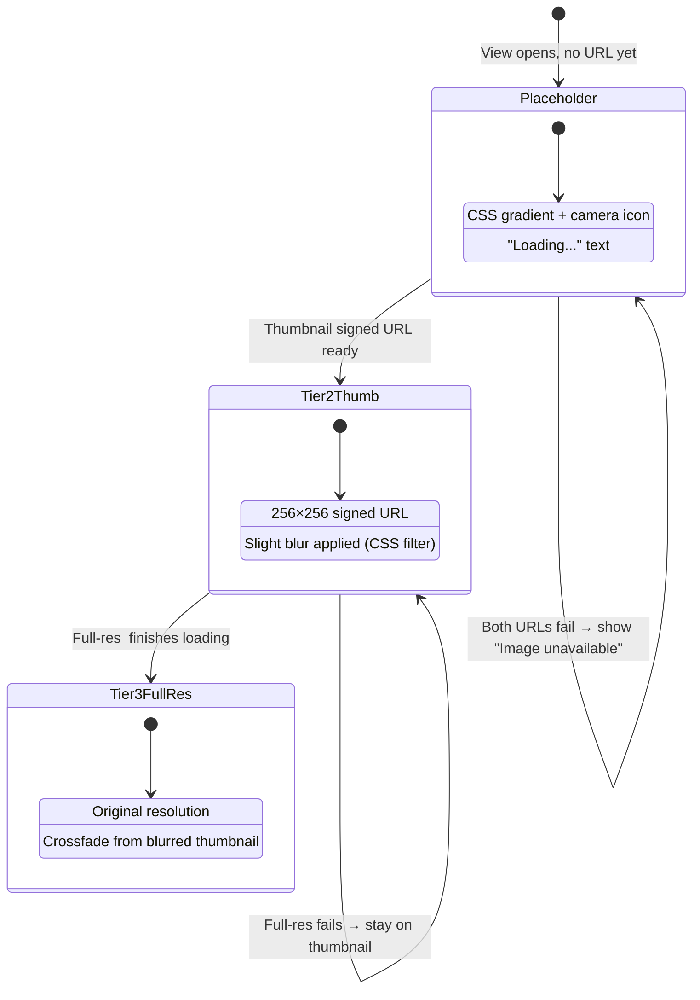

# Image Detail View

> **Blueprint:** [implementation-blueprints/image-detail-view.md](../implementation-blueprints/image-detail-view.md)
> **Photo loading use cases:** [use-cases/photo-loading.md](../use-cases/photo-loading.md)

## What It Is

The full detail view of a single photo. Shows the full-resolution image, metadata properties (editable), coordinates, correction history, and action menu. Desktop: replaces the thumbnail grid inside the Workspace Pane (with a back arrow to return). Mobile: full-screen overlay.

## What It Looks Like

**Desktop:** Takes over the Workspace Pane content area. Top: back arrow + image title. Below: full-width image (scrollable if tall). Below image: metadata property rows in two-column layout (key: value). Coordinates section shows lat/lng + correction indicator. Actions menu at bottom.

**Mobile:** Full-screen overlay with close button top-right. Image at top, metadata scrolls below.

Property rows follow Notion pattern: click the value → inline edit, no separate "Edit" button.

## Where It Lives

- **Parent**: Workspace Pane (replaces Thumbnail Grid when an image is selected)
- **Appears when**: User clicks a thumbnail card or map marker detail action

## Actions

| #   | User Action                     | System Response                             | Triggers               |
| --- | ------------------------------- | ------------------------------------------- | ---------------------- |
| 1   | Clicks back arrow (desktop)     | Returns to Thumbnail Grid                   | `detailImageId` → null |
| 2   | Clicks close (mobile)           | Closes overlay, returns to previous state   | Overlay dismissed      |
| 3   | Clicks a metadata value         | Value becomes an inline text input          | Edit mode              |
| 4   | Presses Enter or blurs input    | Saves updated metadata value                | Supabase update        |
| 5   | Clicks "Edit location"          | Enters correction mode (drag marker on map) | Correction flow        |
| 6   | Clicks "Add to project"         | Opens project picker                        | Project assignment     |
| 7   | Clicks "Delete" in actions menu | Confirmation dialog, then deletes image     | Supabase delete        |
| 8   | Scrolls down                    | Reveals more metadata and coordinate info   | Scroll                 |

## Component Hierarchy

```
ImageDetailView                            ← fills Workspace Pane content area (desktop) or full-screen (mobile)
├── DetailHeader
│   ├── BackButton (←)                     ← desktop: back to grid; mobile: close overlay
│   └── ImageTitle                         ← filename or address label, truncated
├── ImageContainer                         ← full-width, aspect-ratio preserved
│   ├── [not loaded] Placeholder            ← CSS gradient + camera icon + "Loading…" text
│   ├── [tier 2] ThumbnailPreview          ← 256×256 signed URL (blurred/scaled up as preview)
│   └── [tier 3] FullResImage              ← original resolution, crossfades over thumbnail
├── MetadataSection
│   ├── MetadataPropertyRow × N            ← key (left, secondary) | value (right, primary, click-to-edit)
│   │   └── [editing] InlineInput          ← replaces value text
│   ├── CoordinatesRow                     ← lat, lng display
│   │   └── [corrected] CorrectionBadge   ← "Corrected" badge with original EXIF shown below
│   └── TimestampRow                       ← captured_at or created_at
├── DetailActions
│   ├── EditLocationButton                 ← ghost button "Edit location"
│   ├── AddToProjectButton                 ← ghost button "Add to project"
│   └── ContextMenu (⋯)                   ← Delete, Copy coordinates, etc.
└── [corrected] CorrectionHistory
    ├── OriginalCoords                     ← "Original EXIF: lat, lng"
    └── CorrectedCoords                    ← "Corrected: lat, lng" + date
```

## Data

| Field              | Source                                                                                | Type                               |
| ------------------ | ------------------------------------------------------------------------------------- | ---------------------------------- |
| Image record       | `supabase.from('images').select('*')`                                                 | `Image`                            |
| Full-res URL       | Supabase Storage signed URL (original, no transform)                                  | `string`                           |
| Thumbnail URL      | Supabase Storage signed URL (256×256 transform)                                       | `string`                           |
| Placeholder        | CSS-only, no data source                                                              | —                                  |
| Metadata           | `supabase.from('image_metadata').select('key, value')`                                | `{ key: string, value: string }[]` |
| Correction history | `images.corrected_lat`, `images.corrected_lng`, `images.latitude`, `images.longitude` | Coordinate pairs                   |

## State

| Name            | Type             | Default | Controls                                  |
| --------------- | ---------------- | ------- | ----------------------------------------- |
| `image`         | `Image \| null`  | `null`  | The displayed image record                |
| `editingKey`    | `string \| null` | `null`  | Which metadata key is being edited inline |
| `fullResLoaded` | `boolean`        | `false` | Whether full-res image has loaded         |
| `thumbLoaded`   | `boolean`        | `false` | Whether Tier 2 thumbnail has loaded       |

## Progressive Image Loading

The detail view uses a **three-tier progressive loading** strategy to show content as fast as possible:



### Loading Sequence

1. View opens → CSS placeholder shown immediately (no network)
2. Tier 2 thumbnail signed URL fires (`256×256, cover, quality: 60`)
3. Thumbnail `` loads → replaces placeholder with slight blur filter
4. Tier 3 full-res signed URL fires (no transform, or max 2500px)
5. Full-res `` loads in hidden element → crossfade swaps it in
6. If Tier 3 fails, Tier 2 remains visible (adequate quality for metadata editing)
7. If both fail, CSS placeholder stays with "Image unavailable" text

### Signed URL Strategy

- **Tier 2:** `createSignedUrl(thumbnail_path ?? storage_path, 3600, { transform: { width: 256, height: 256, resize: 'cover', quality: 60 } })`
- **Tier 3:** `createSignedUrl(storage_path, 3600)` (no transform — full resolution)

## File Map

| File                                                             | Purpose                    |
| ---------------------------------------------------------------- | -------------------------- |
| `features/map/workspace-pane/image-detail-view.component.ts`     | Detail view component      |
| `features/map/workspace-pane/image-detail-view.component.html`   | Template                   |
| `features/map/workspace-pane/image-detail-view.component.scss`   | Styles                     |
| `features/map/workspace-pane/metadata-property-row.component.ts` | Reusable click-to-edit row |

## Wiring

- Displayed inside Workspace Pane when `detailImageId` is set
- On desktop: replaces Thumbnail Grid, back arrow returns to grid
- On mobile: opens as full-screen overlay on top of current view
- Metadata edits call `SupabaseService` to update `image_metadata`
- "Edit location" triggers correction mode in `MapShellComponent`

## Acceptance Criteria

- [ ] Desktop: replaces grid in workspace pane, back arrow returns
- [ ] Mobile: full-screen overlay with close button
- [ ] CSS placeholder shown immediately when view opens (gradient + camera icon)
- [ ] Tier 2 thumbnail (256×256 transform) loads and replaces placeholder with slight blur
- [ ] Full-res image loads on demand and crossfades over blurred thumbnail
- [ ] If full-res fails, Tier 2 thumbnail stays visible
- [ ] If both tiers fail, CSS placeholder with "Image unavailable" text remains
- [ ] No broken `` icon ever shown
- [ ] Metadata rows: click value → inline edit → save on Enter/blur
- [ ] Coordinates displayed with correction indicator if corrected
- [ ] Original EXIF coordinates shown when correction exists (Honesty principle)
- [ ] Edit location button starts marker correction mode
- [ ] Add to project opens project picker
- [ ] Delete confirmation before removal
