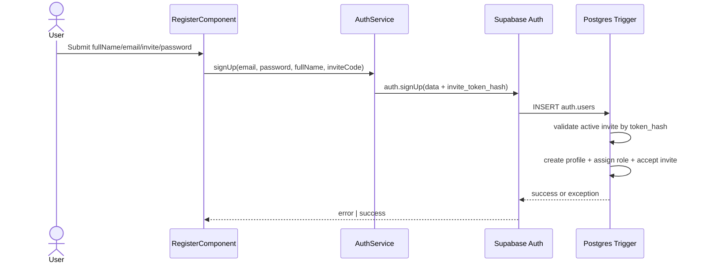
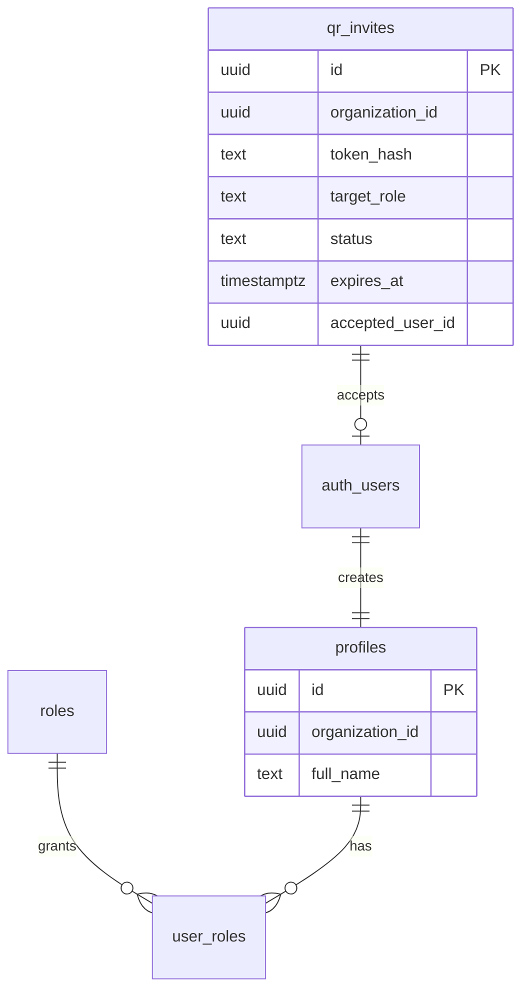
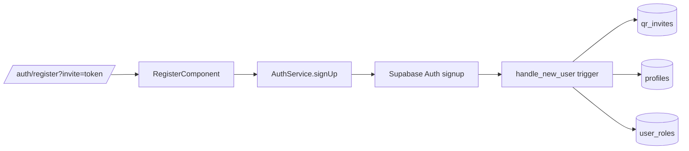

# Invite-Only Registration

## What It Is

An invite-gated registration flow for `/auth/register` where account creation is allowed only with a valid invite code from QR/link sharing. Users can either paste the code manually or open the registration URL with `?invite=<code>` prefilled.

## What It Looks Like

The register card keeps the existing auth map-shell composition and adds an explicit `Invite code` field between `Email` and `Password`. When users arrive via scanned QR link, the field is already populated and editable for correction. Password requirements are clearly stated inline and enforced before submit: minimum `12` characters with uppercase, lowercase, number, and symbol. Error states are shown inline per field and as a form-level alert when server-side invite validation rejects signup. On success, the UI keeps the existing confirmation state (`Check your email`) and does not auto-login.

## Where It Lives

- **Route**: `/auth/register`
- **Parent**: `RegisterComponent`
- **Appears when**: user opens register directly, or follows a QR/link invite with `invite` query param.

## Actions & Interactions

| #   | User Action                                   | System Response                                                                          | Triggers                    |
| --- | --------------------------------------------- | ---------------------------------------------------------------------------------------- | --------------------------- |
| 1   | Opens `/auth/register?invite=<token>`         | `Invite code` input is prefilled with query value                                        | route query param parsing   |
| 2   | Opens `/auth/register` without query          | Empty `Invite code` input is shown                                                       | initial render              |
| 3   | Submits empty invite code                     | Form stays blocked; inline required error shown                                          | reactive form validation    |
| 4   | Submits malformed invite code                 | Form stays blocked; inline format error shown                                            | regex validation            |
| 5   | Submits weak password                         | Form stays blocked; password policy errors shown                                         | password validators         |
| 6   | Submits valid form                            | Auth signup sends `invite_token_hash` metadata                                           | `AuthService.signUp()`      |
| 7   | Backend trigger validates invite              | Profile is created in invite org; invite role assigned; invite status becomes `accepted` | `handle_new_user()` trigger |
| 8   | Backend rejects invite (expired/revoked/used) | Register shows API error alert; account is not created                                   | trigger exception           |



## Component Hierarchy

```text
RegisterComponent (auth shell)
├── AuthMapBackground
├── AuthCard
│   ├── FullNameField
│   ├── EmailField
│   ├── InviteCodeField
│   ├── PasswordField
│   ├── ConfirmPasswordField
│   ├── ErrorBanner (conditional)
│   └── SubmitButton
└── SuccessState (conditional)
```

## Data Requirements

| Field             | Source                                | Type                                               |
| ----------------- | ------------------------------------- | -------------------------------------------------- |
| `inviteCode`      | URL query `invite` or manual input    | `string`                                           |
| `inviteTokenHash` | `sha256(inviteCode)` in auth metadata | `string`                                           |
| `targetRole`      | `qr_invites.target_role`              | `'clerk' \| 'worker'`                              |
| `organizationId`  | `qr_invites.organization_id`          | `uuid`                                             |
| `inviteStatus`    | `qr_invites.status`                   | `'active' \| 'expired' \| 'revoked' \| 'accepted'` |
| `password`        | register form input                   | `string`                                           |



## State

| Name                       | TypeScript Type          | Default             | Controls                           |
| -------------------------- | ------------------------ | ------------------- | ---------------------------------- |
| `form.controls.inviteCode` | `FormControl<string>`    | `''` or query value | invite validation + signup payload |
| `loading`                  | `signal<boolean>`        | `false`             | submit button disabled state       |
| `errorMessage`             | `signal<string \| null>` | `null`              | form-level error banner            |
| `success`                  | `signal<boolean>`        | `false`             | success confirmation view          |

## File Map

| File                                                              | Purpose                                         |
| ----------------------------------------------------------------- | ----------------------------------------------- |
| `apps/web/src/app/features/auth/register/register.component.ts`   | query-prefill + invite field + submit wiring    |
| `apps/web/src/app/features/auth/register/register.component.html` | invite field and validation feedback            |
| `apps/web/src/app/core/auth.service.ts`                           | include invite hash in signup metadata          |
| `supabase/migrations/20260317170000_invite_only_signup.sql`       | trigger-level invite enforcement and acceptance |
| `apps/web/src/app/core/auth/password-policy.ts`                   | shared password-strength validators             |

## Wiring

- `RegisterComponent` reads `ActivatedRoute.snapshot.queryParamMap` for `invite` and pre-fills form state.
- `RegisterComponent.submit()` passes invite code to `AuthService.signUp()`.
- `AuthService.signUp()` hashes invite code and forwards `invite_token_hash` in `options.data`.
- Postgres trigger `public.handle_new_user()` validates invite, provisions profile/org/role, and marks invite accepted.



## Acceptance Criteria

- [x] Registration requires a non-empty invite code.
- [x] Scanning QR/opening invite link pre-fills invite code on register route.
- [x] Invalid invite format is blocked client-side before submit.
- [x] Password policy is enforced at client level: min 12 + upper/lower/number/symbol.
- [x] Password policy is enforced in Supabase auth config.
- [x] New users are assigned to the invite organization (not default org fallback).
- [x] New users are assigned the invite target role (`clerk` or `worker`).
- [x] Invite status flips to `accepted` once registration succeeds.
- [x] Expired/revoked/used invites are rejected server-side.
