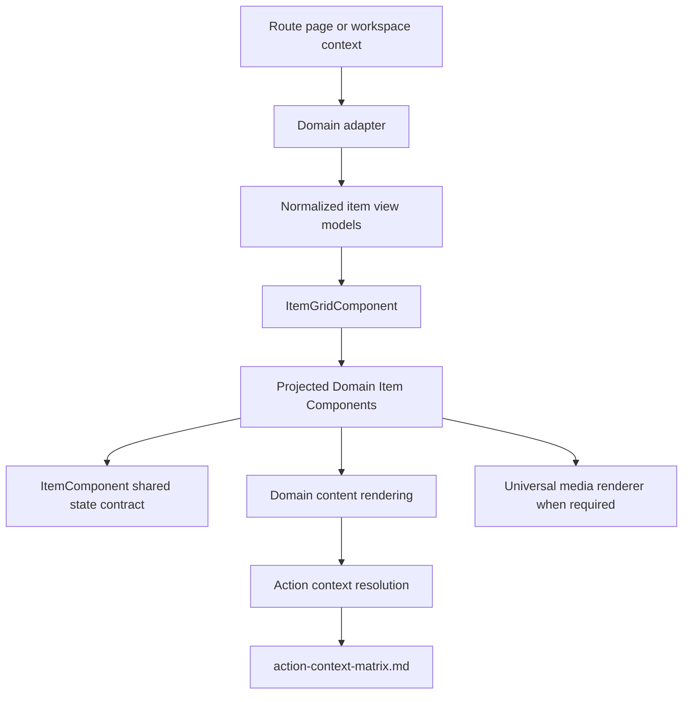
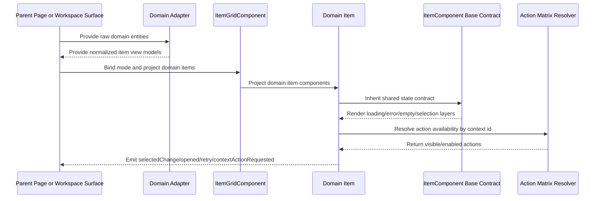

# Item Grid

## What It Is

Item Grid is the universal layout and item-rendering contract for all Feldpost list and grid surfaces. It defines one shared structure for media, projects, and future domain entities so loading, error, empty, and selection behavior stay consistent across pages and workspace contexts.
This system is a full replacement contract: once a surface is migrated, legacy grid/card components for that surface are removed from active wiring and moved to archive for traceability.

## What It Looks Like

The system has two architectural layers: a layout-only `ItemGridComponent` and a state-contract `ItemComponent` base class consumed by domain-specific item components. Layout modes are `grid-sm`, `grid-md`, `grid-lg`, `row`, and `card`, with responsive transitions driven only by design tokens and shared primitives. Item content is projected from domain components; grid layout never renders domain text or actions itself. The unified loading presentation is a centered circular spinner using the same visual recipe as the current Workspace Pane thumbnail loading indicator, but expressed through design tokens so appearance is identical everywhere. All styles use semantic component class names and component-scoped SCSS files.

## Where It Lives

- Shared location: `apps/web/src/app/shared/item-grid/`
- Domain consumers:
  - Media page (`/media`) via media domain item adapter
  - Projects page (`/projects`) via project domain item adapter
  - Workspace pane selected-items area via workspace media domain item adapter
- Trigger: any feature that renders repeated items in list/grid/card layouts

## Actions

| #   | User Action                                                                     | System Response                                                                                                      | Trigger                           |
| --- | ------------------------------------------------------------------------------- | -------------------------------------------------------------------------------------------------------------------- | --------------------------------- |
| 1   | Parent surface sets `mode` to `grid-sm`, `grid-md`, `grid-lg`, `row`, or `card` | ItemGrid applies matching semantic layout class and tokenized geometry                                               | `mode` input change               |
| 2   | Parent projects domain items into ItemGrid                                      | Grid renders projected item slots without domain logic                                                               | Content projection                |
| 3   | Domain item enters loading state                                                | Base ItemComponent renders unified loading circle and blocks domain content region until terminal state              | `loading=true`                    |
| 4   | Domain item enters error state                                                  | Base ItemComponent renders shared error surface and exposes retry output                                             | `error=true`                      |
| 5   | Parent provides empty collection                                                | Parent-level empty region renders using shared empty contract while ItemGrid keeps layout shell stable               | `items.length===0`                |
| 6   | User selects or deselects an item                                               | Base ItemComponent toggles shared selected styling and emits selection event                                         | pointer/keyboard selection action |
| 7   | User opens item action menu on media item                                       | MediaItem action set is resolved from action-context matrix for `ws_grid_thumbnail` contract                         | action trigger in MediaItem       |
| 8   | Viewport crosses tokenized breakpoints                                          | Grid column count and spacing adapt by design token values only                                                      | responsive recalculation          |
| 9   | Migration step for a surface is completed                                       | New item-grid system becomes the only runtime path for that surface; legacy components move to archive, not deletion | migration completion gate         |

## Component Hierarchy

```text
ItemGridSystem
├── ItemGridComponent (layout only, no domain knowledge)
│   ├── mode classes: item-grid--grid-sm | --grid-md | --grid-lg | --row | --card
│   └── <ng-content select="app-*-item"> projected domain items
├── ItemComponent (abstract base class, no layout geometry)
│   ├── Shared state frame
│   │   ├── Loading layer (unified loading circle)
│   │   ├── Error layer
│   │   ├── Empty layer
│   │   └── Selection layer
│   └── Domain content outlet (overridden by subclasses)
├── MediaItemComponent (extends ItemComponent)
│   ├── Media preview (photo/video/document)
│   └── Action set bound to action-context-matrix ws_grid_thumbnail contract
├── ProjectItemComponent (extends ItemComponent)
│   ├── Project metadata and status
│   └── Project actions bound to project context matrix contract
└── JobItemComponent (extends ItemComponent, placeholder contract only)
    └── Not implemented in this phase
```

## Data

Item Grid core does not query backend data directly. Domain adapters provide normalized item view models and action context metadata.

### Data Flow (Mermaid)



| Field             | Source                             | Type                                                     | Purpose                                    |
| ----------------- | ---------------------------------- | -------------------------------------------------------- | ------------------------------------------ |
| `mode`            | Parent page/workspace container    | `'grid-sm' \| 'grid-md' \| 'grid-lg' \| 'row' \| 'card'` | Drives layout mode in ItemGrid             |
| `items`           | Domain adapter output              | `ReadonlyArray<ItemViewModel>`                           | Rendered item collection                   |
| `loading`         | Domain adapter/item async pipeline | `boolean`                                                | Shared loading state in ItemComponent      |
| `error`           | Domain adapter/item async pipeline | `boolean`                                                | Shared error state in ItemComponent        |
| `empty`           | Parent collection state            | `boolean`                                                | Shared empty state signaling               |
| `selected`        | Selection service / parent state   | `boolean`                                                | Shared selected styling and behavior       |
| `actionContextId` | Domain adapter                     | `string`                                                 | Binds item action menus to matrix contract |

## State

| Name              | TypeScript Type                                          | Default     | What it controls                                         |
| ----------------- | -------------------------------------------------------- | ----------- | -------------------------------------------------------- |
| `mode`            | `'grid-sm' \| 'grid-md' \| 'grid-lg' \| 'row' \| 'card'` | `'grid-md'` | ItemGrid layout variant                                  |
| `loading`         | `boolean`                                                | `false`     | Non-overridable loading layer rendering in ItemComponent |
| `error`           | `boolean`                                                | `false`     | Non-overridable error layer rendering in ItemComponent   |
| `empty`           | `boolean`                                                | `false`     | Non-overridable empty layer rendering in ItemComponent   |
| `selected`        | `boolean`                                                | `false`     | Shared selected state styling and ARIA                   |
| `disabled`        | `boolean`                                                | `false`     | Shared interaction gating for unavailable items          |
| `actionContextId` | `string \| null`                                         | `null`      | Resolves domain actions via action matrix                |

### Base Class Contract (Mandatory for all Domain Items)

Every domain item extending ItemComponent must expose these inputs/outputs:

- Inputs:
  - `mode`
  - `loading`
  - `error`
  - `empty`
  - `selected`
  - `disabled`
  - `actionContextId`
  - `itemId`
- Outputs:
  - `selectedChange`
  - `opened`
  - `retryRequested`
  - `contextActionRequested`

Shared state rendering (loading/error/empty/selection) is owned by ItemComponent and is not overridable by domain subclasses.

### Unified Loading Circle Contract

The loading circle visual standard must remain identical to current Workspace Pane thumbnail loading behavior:

- Layer: centered overlay layer above item background
- Shape: circular ring
- Spin: continuous clockwise spin
- Color source: loading foreground token mapped to clay accent

Tokenized spinner definition defaults (must map to current behavior):

- `--item-loading-spinner-size: 1.1rem`
- `--item-loading-spinner-border-width: 2px`
- `--item-loading-spinner-track-alpha: 24%`
- `--item-loading-spinner-duration: 700ms`
- `--item-loading-spinner-color: var(--color-clay)`
- `--item-loading-spinner-radius: var(--radius-full)`

## SCSS Responsibilities

### Single Ownership Rule

- Every SCSS file is responsible for exactly one component.
- Geometry ownership is strictly split:
  - `ItemGridComponent` SCSS defines only grid layout (columns, gaps, breakpoints).
  - `ItemComponent` / `ItemStateFrameComponent` SCSS defines only shared state frame surfaces (loading/error/empty/selection).
  - Domain item SCSS (`MediaItemComponent`, `ProjectItemComponent`, etc.) defines only domain content styling (typography, icons, media affordances).
- Explicitly forbidden: setting the same dimension in multiple component layers.
  - No duplicate `width` / `height` / `max-height` ownership across grid, state-frame, and domain item styles.
  - Each dimension is defined exactly once, at the semantically owning layer.

### SCSS Comment Rule

- Every CSS class, every custom property variable, and every keyframe must have two comment lines directly above it.
  - Line 1: what it does.
  - Line 2: spec reference.

Example:

- `// Defines column layout for grid-md mode with token-based spacing`
- `// @see docs/element-specs/item-grid.md#scss-responsibilities`

## File Map

| File                                                                | Purpose                                                                                       |
| ------------------------------------------------------------------- | --------------------------------------------------------------------------------------------- |
| `apps/web/src/app/shared/item-grid/item-grid.component.ts`          | Layout-only container with mode inputs and projection contract                                |
| `apps/web/src/app/shared/item-grid/item-grid.component.html`        | Semantic layout shell + projection slots                                                      |
| `apps/web/src/app/shared/item-grid/item-grid.component.scss`        | Tokenized grid/row/card geometry classes                                                      |
| `apps/web/src/app/shared/item-grid/item.component.ts`               | Abstract base class defining mandatory inputs/outputs and non-overridable states              |
| `apps/web/src/app/shared/item-grid/item-state-frame.component.ts`   | Shared non-overridable state renderer used by ItemComponent                                   |
| `apps/web/src/app/shared/item-grid/item-state-frame.component.html` | Loading/error/empty/selection frame template                                                  |
| `apps/web/src/app/shared/item-grid/item-state-frame.component.scss` | Unified state visuals including loading circle animation                                      |
| `apps/web/src/app/features/media/media-item.component.ts`           | Domain media item extending ItemComponent                                                     |
| `apps/web/src/app/features/media/media-item.component.html`         | Media-specific content projection region                                                      |
| `apps/web/src/app/features/media/media-item.component.scss`         | Media item local styling only                                                                 |
| `apps/web/src/app/features/projects/project-item.component.ts`      | Domain project item extending ItemComponent                                                   |
| `apps/web/src/app/features/projects/project-item.component.html`    | Project-specific content projection region                                                    |
| `apps/web/src/app/features/projects/project-item.component.scss`    | Project item local styling only                                                               |
| `apps/web/src/app/features/jobs/job-item.component.ts`              | Placeholder contract type extending ItemComponent (no rendering implementation in this phase) |
| `apps/web/src/app/features/jobs/job-item.contract.md`               | Placeholder documentation for future job item rollout                                         |

## Wiring

### Injected Services

- ItemGridComponent: None.
- ItemComponent: None required in base contract.
- MediaItemComponent: domain services for media metadata and action routing.
- ProjectItemComponent: domain services for project actions and metadata.

### Inputs / Outputs

- ItemGridComponent inputs:
  - `mode: 'grid-sm' | 'grid-md' | 'grid-lg' | 'row' | 'card'`
- ItemGridComponent outputs:
  - None (layout component only)
- ItemComponent mandatory inputs:
  - `itemId`, `mode`, `loading`, `error`, `empty`, `selected`, `disabled`, `actionContextId`
- ItemComponent mandatory outputs:
  - `selectedChange`, `opened`, `retryRequested`, `contextActionRequested`

### Subscriptions

- ItemGridComponent: None.
- ItemComponent: None in base class.
- Domain items: optional signal/computed subscriptions owned by each domain component and disposed by Angular lifecycle.

### Supabase Calls

- ItemGridComponent: None.
- ItemComponent: None.
- Domain items: None direct; delegated to domain services.

### Wiring Flow (Mermaid)



## Migration and Archival Policy

- No parallel runtime operation is allowed after a surface migration cutover.
- `universal-media.component.ts` and `card-grid.component.ts` are reference sources during migration, then archived after successful replacement by item-grid domain items.
- All replaced legacy grid/card implementations are archived instead of deleted so implementation history remains inspectable.
- Archive location convention:
  - `apps/web/src/app/archive/item-grid-legacy/<surface>/<original-file>`
  - `<surface>` uses one of: `workspace-pane`, `media-page`, `projects-page`, `shared-primitives`
- A migration is considered complete only when routing/wiring no longer imports the legacy component set for that surface.

### Migration Sequence

1. Build `ItemGridComponent` and `ItemComponent` base contract in isolation.
2. Build `MediaItemComponent`, migrate `/media`, then archive replaced media/grid shared components.
3. Build `ProjectItemComponent`, migrate `/projects`, then archive replaced projects grid/card components.
4. Migrate Workspace Pane selected-items surface, then archive thumbnail grid/card components.

### Legacy Targets to Archive

- Workspace pane:
  - `apps/web/src/app/features/map/workspace-pane/thumbnail-grid.component.ts`
  - `apps/web/src/app/features/map/workspace-pane/thumbnail-card/thumbnail-card.component.ts`
  - `apps/web/src/app/features/map/workspace-pane/thumbnail-card/thumbnail-card-media/thumbnail-card-media.component.ts`
- Media page:
  - `apps/web/src/app/features/media/media-grid.component.ts`
  - `apps/web/src/app/features/media/media-card.component.ts`
  - `apps/web/src/app/features/media/media-loading.component.ts`
- Projects page:
  - `apps/web/src/app/features/projects/projects-grid-view.component.ts`
  - `apps/web/src/app/features/projects/project-card.component.ts`
- Shared primitives:
  - `apps/web/src/app/shared/media/universal-media.component.ts`
  - `apps/web/src/app/shared/ui-primitives/card-grid.component.ts`

## Acceptance Criteria

- [x] ItemGridComponent provides only layout behavior and content projection, with no domain-specific labels, actions, or data dependencies.
- [x] ItemGridComponent supports exactly five modes: `grid-sm`, `grid-md`, `grid-lg`, `row`, `card`.
- [x] Responsive transitions are controlled only by design tokens; no hardcoded breakpoint literals in component SCSS.
- [x] ItemComponent defines one mandatory shared input/output contract for all domain item components.
- [x] Loading, error, empty, and selection visuals are rendered by ItemComponent shared state frame and are not overridable by domain item subclasses.
- [x] Loading circle defaults match current Workspace Pane thumbnail loading behavior (size, border width, alpha, duration, clay color, continuous spin).
- [x] All SCSS uses semantic component names and token-based values; no generic menu/list utility class naming in new item-grid system files.
- [x] SCSS ownership is strict: grid layout in ItemGrid, state visuals in ItemStateFrame, domain visuals in domain item components.
- [x] Every class, custom property variable, and keyframe in item-grid system SCSS files includes a two-line comment with behavior and spec reference.
- [x] MediaItemComponent action exposure references action-context matrix contract for `ws_grid_thumbnail`.
- [ ] ProjectItemComponent defines its action mapping through the action matrix contract for project contexts.
- [ ] JobItemComponent remains a non-rendering placeholder contract in this phase and is not wired into active routes.
- [x] Each migrated surface has exactly one runtime grid/card path (item-grid system); replaced legacy files are archived under `apps/web/src/app/archive/item-grid-legacy/`.

## Comment Convention

Use this comment pattern in all item-grid system implementation files:

- First line explains behavior.
- Second line points to the governing spec section.

Example:

- `// Renders unified loading state for all item types`
- `// @see item-grid.md#state`
