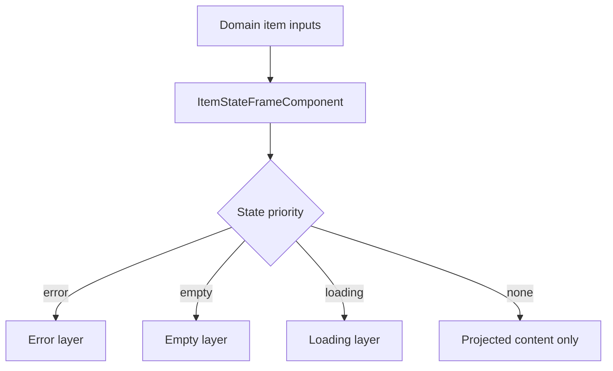
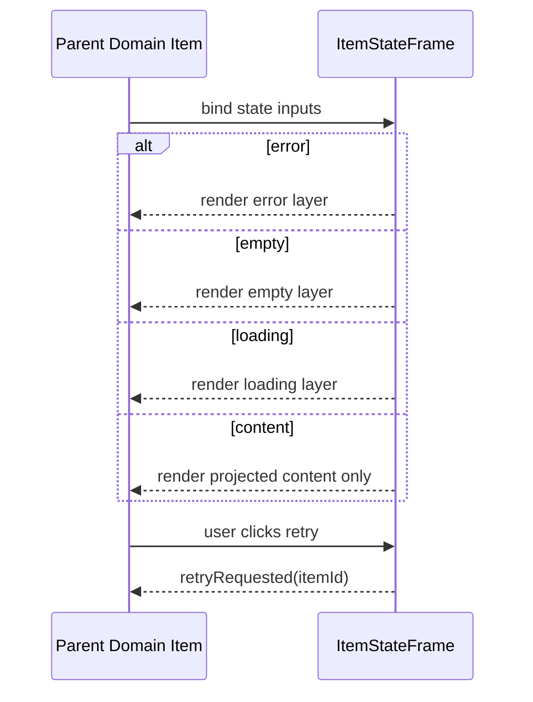

# Item State Frame

## What It Is

Item State Frame is the shared state wrapper for item-grid domain items. It owns only shared loading, error, empty, and disabled presentation and must not own domain-specific geometry or selected-ring visuals.

## What It Looks Like

The component renders projected item content and overlays shared state layers when required by canonical state priority. Loading is a pulse placeholder overlay without spinner. Error and empty overlays are full-surface shared states with token-based colors and spacing. The wrapper itself stays visually neutral and does not draw domain borders, frame radius, or selected emphasis. Visual values use design tokens and semantic class names.

## Where It Lives

- Component root: `apps/web/src/app/shared/item-grid/item-state-frame.component.ts`
- Used by: all domain items extending item-grid contract (for example media item)
- Trigger: parent/domain item binds shared state inputs (`loading`, `error`, `empty`, `disabled`)

## Actions

| #   | User Action / System Trigger | System Response                                       | Trigger                                     |
| --- | ---------------------------- | ----------------------------------------------------- | ------------------------------------------- |
| 1   | Domain item enters loading   | Shared loading layer is shown above projected content | `loading=true` and no higher-priority state |
| 2   | Domain item enters error     | Shared error layer with retry button is shown         | `error=true`                                |
| 3   | Domain item enters empty     | Shared empty layer is shown                           | `empty=true` and `error=false`              |
| 4   | Retry button is clicked      | Retry event is emitted with item id                   | retry button click                          |
| 5   | Domain item is disabled      | Shared disabled visual and pointer-event lock applies | `disabled=true`                             |

## Component Hierarchy

```text
ItemStateFrameComponent
└── article.item-state-frame
    ├── div.item-state-frame__content
    │   └── <ng-content>
    └── div.item-state-frame__state-layer (conditional)
        ├── loading layer
        ├── error layer (+ retry button)
        └── empty layer
```

## Data

The component does not fetch backend data. It consumes parent-provided state inputs only.

| Field      | Source              | Type      | Purpose                           |
| ---------- | ------------------- | --------- | --------------------------------- |
| `itemId`   | parent domain item  | `string`  | identity for retry emission       |
| `loading`  | parent/domain state | `boolean` | loading layer visibility          |
| `error`    | parent/domain state | `boolean` | error layer visibility            |
| `empty`    | parent/domain state | `boolean` | empty layer visibility            |
| `disabled` | parent/domain state | `boolean` | disabled visual/interaction state |



## State

| Name                   | TypeScript Type | Default | What it controls                  |
| ---------------------- | --------------- | ------- | --------------------------------- |
| `showErrorState`       | `boolean`       | `false` | error-layer visibility            |
| `showEmptyState`       | `boolean`       | `false` | empty-layer visibility            |
| `showLoadingState`     | `boolean`       | `false` | loading-layer visibility          |
| `hideProjectedContent` | `boolean`       | `false` | aria-hidden for projected content |

## File Map

| File                                                                | Purpose                                      |
| ------------------------------------------------------------------- | -------------------------------------------- |
| `apps/web/src/app/shared/item-grid/item-state-frame.component.ts`   | shared state-priority logic and retry output |
| `apps/web/src/app/shared/item-grid/item-state-frame.component.html` | projected content host + state overlays      |
| `apps/web/src/app/shared/item-grid/item-state-frame.component.scss` | shared loading/error/empty/disabled visuals  |

## Wiring

### Injected Services

None.

### Inputs / Outputs

- Inputs: `itemId`, `mode`, `loading`, `error`, `empty`, `selected` (compatibility input, no selected visual ownership), `disabled`, labels
- Outputs: `retryRequested`

### Subscriptions

None.

### Supabase Calls

None — delegated to domain services/components.



## Acceptance Criteria

- [ ] ItemStateFrame renders shared loading/error/empty layers by canonical priority.
- [ ] ItemStateFrame does not own selected ring visuals.
- [ ] Retry emits `retryRequested` with bound item id.
- [ ] Disabled state applies shared dimming and interaction lock.

## Visual Behavior Contract

### Ownership Matrix

| Behavior            | Visual Geometry Owner                     | Stacking Context Owner                   | Interaction Hit-Area Owner | Selector(s)                               | Layer (z-index/token) | Test Oracle                                              |
| ------------------- | ----------------------------------------- | ---------------------------------------- | -------------------------- | ----------------------------------------- | --------------------- | -------------------------------------------------------- |
| Loading state layer | `.item-state-frame__state-layer--loading` | `.item-state-frame` (grid overlay stack) | none                       | `.item-state-frame__state-layer--loading` | state/loading (1)     | loading overlay fills projected content area             |
| Error state layer   | `.item-state-frame__state-layer--error`   | `.item-state-frame`                      | `.item-state-frame__retry` | `.item-state-frame__state-layer--error`   | state/error (1)       | retry remains clickable while content is hidden          |
| Empty state layer   | `.item-state-frame__state-layer--empty`   | `.item-state-frame`                      | none                       | `.item-state-frame__state-layer--empty`   | state/empty (1)       | empty message overlays content area without layout shift |
| Disabled state      | `.item-state-frame`                       | `.item-state-frame`                      | none (locked)              | `.item-state-frame--disabled`             | state/disabled        | content is dimmed and non-interactive                    |

### Ownership Triad Declaration

| Behavior            | Geometry Owner                            | State Owner                               | Visual Owner                              | Same element? |
| ------------------- | ----------------------------------------- | ----------------------------------------- | ----------------------------------------- | ------------- |
| Loading state layer | `.item-state-frame__state-layer--loading` | `.item-state-frame__state-layer--loading` | `.item-state-frame__state-layer--loading` | ✅            |
| Error state layer   | `.item-state-frame__state-layer--error`   | `.item-state-frame__state-layer--error`   | `.item-state-frame__state-layer--error`   | ✅            |
| Empty state layer   | `.item-state-frame__state-layer--empty`   | `.item-state-frame__state-layer--empty`   | `.item-state-frame__state-layer--empty`   | ✅            |
| Disabled state      | `.item-state-frame`                       | `.item-state-frame--disabled`             | `.item-state-frame--disabled`             | ✅            |

### Stacking Context

- ItemStateFrame uses one internal overlay stack (`display: grid` + same grid-area) for shared state layers.
- It must not create domain overlay ownership for selected/upload/quiet-actions.

### Layer Order (z-index)

- Shared state layers run on one overlay layer (`z-index: 1`) above projected content.
- No domain-specific overlays are declared in this component.

### State Ownership

- loading pulse: ItemStateFrame
- error surface: ItemStateFrame
- empty surface: ItemStateFrame
- selected ring: Not owned by ItemStateFrame (owned by domain component)

### Pseudo-CSS Contract

```css
.item-state-frame {
  display: grid;
}

.item-state-frame__content,
.item-state-frame__state-layer {
  grid-area: 1 / 1;
}

.item-state-frame--disabled {
  opacity: 0.6;
  pointer-events: none;
}
```
