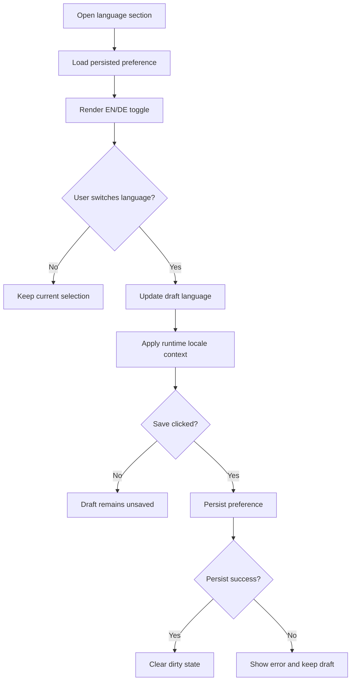
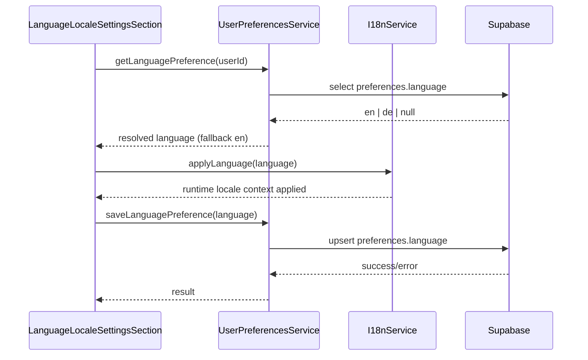
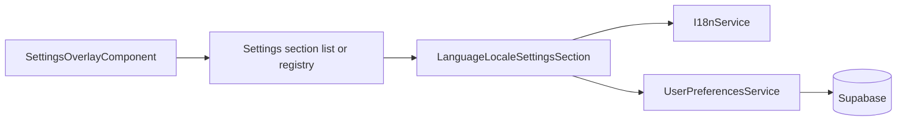

# Language & Locale Settings

## What It Is

A settings section that lets users switch the interface language between English and German. It also defines the active locale used for date/time and number formatting across workspace surfaces.

## What It Looks Like

The section is rendered in the Settings Overlay detail column as a compact card-based form using shared `.ui-container` and `.ui-item` primitives. The primary control is a segmented toggle with two options: `English` and `Deutsch`, each with a minimum hit target of `2.75rem` (44px). A read-only helper row previews the currently active locale behavior (for example date format) so users understand what changes globally. The layout keeps `1rem` vertical rhythm between rows and aligns labels left with controls right on desktop, then stacks on narrow screens.

## Where It Lives

- **Route**: Global settings overlay section (no route segment).
- **Parent**: `SettingsOverlayComponent` via section list/registry.
- **Appears when**: User opens Settings and selects `General` (or `Language & Locale` once sections are split).

## Actions

| #   | User Action                                | System Response                                                                 | Triggers                                   |
| --- | ------------------------------------------ | ------------------------------------------------------------------------------- | ------------------------------------------ |
| 1   | Opens Settings and enters language section | Loads persisted language preference and renders segmented toggle state          | settings section selection                 |
| 2   | Clicks `English`                           | Updates draft language to `en`, applies UI copy in English, marks section dirty | segmented toggle click                     |
| 3   | Clicks `Deutsch`                           | Updates draft language to `de`, applies UI copy in German, marks section dirty  | segmented toggle click                     |
| 4   | Language is applied                        | Sets document language and locale formatting context for UI                     | preference state update                    |
| 5   | Clicks `Save`                              | Persists selected language and clears dirty state                               | save action in settings section            |
| 6   | Clicks `Discard` or closes without saving  | Reverts to last persisted language                                              | discard/dismiss action                     |
| 7   | Persist fails                              | Shows inline error, keeps current draft selection                               | persistence error from preferences service |



## Component Hierarchy

```text
LanguageLocaleSettingsSection (.ui-container in Settings detail area)
|- SectionHeader
|  |- Title: "Language & Locale"
|  `- Description: "Choose UI language for Feldpost"
|- LanguageRow (.ui-item)
|  |- LabelColumn
|  |  |- Label: "Language"
|  |  `- Caption: "Applies across map, workspace, and settings"
|  `- SegmentedControl (2 buttons)
|     |- OptionButton "English" (value: en)
|     `- OptionButton "Deutsch" (value: de)
|- LocalePreviewRow (.ui-item)
|  |- Label: "Formatting preview"
|  `- Value: localized date/number sample from active locale
`- SectionActionRow
   |- DiscardButton
   `- SaveButton
```

## Data



| Field                  | Source                                            | Type                               |
| ---------------------- | ------------------------------------------------- | ---------------------------------- |
| `language`             | `UserPreferencesService.getLanguagePreference()`  | `'en' \| 'de'`                     |
| `locale`               | `I18nService.currentLocale()`                     | `'en-GB' \| 'de-DE'`               |
| `dirty`                | section-local state                               | `boolean`                          |
| `saveResult`           | `UserPreferencesService.saveLanguagePreference()` | `{ ok: boolean; error?: string }`  |
| `formatPreviewSamples` | `I18nService.getPreviewSamples(locale)`           | `{ date: string; number: string }` |

## State

| Name                | Type             | Default | Controls                                      |
| ------------------- | ---------------- | ------- | --------------------------------------------- |
| `language`          | `'en' \| 'de'`   | `'en'`  | active draft language selection               |
| `persistedLanguage` | `'en' \| 'de'`   | `'en'`  | baseline used by discard and dirty checks     |
| `loading`           | `boolean`        | `true`  | initial loading state                         |
| `saving`            | `boolean`        | `false` | save button busy/disabled state               |
| `dirty`             | `boolean`        | `false` | enables/disables save and discard controls    |
| `error`             | `string \| null` | `null`  | inline error rendering for failed persistence |
| `previewDate`       | `string`         | `''`    | locale-formatted date sample                  |
| `previewNumber`     | `string`         | `''`    | locale-formatted numeric sample               |

## File Map

| File                                                                                                  | Purpose                                                           |
| ----------------------------------------------------------------------------------------------------- | ----------------------------------------------------------------- |
| `apps/web/src/app/features/settings-overlay/sections/language-locale-settings-section.component.ts`   | standalone section component for language/locale selection        |
| `apps/web/src/app/features/settings-overlay/sections/language-locale-settings-section.component.html` | template for EN/DE segmented control and preview rows             |
| `apps/web/src/app/features/settings-overlay/sections/language-locale-settings-section.component.scss` | scoped layout/styles for rows, segmented control, action row      |
| `apps/web/src/app/core/i18n/i18n.service.ts`                                                          | runtime language/locale application and formatting preview helper |
| `apps/web/src/app/core/user-preferences.service.ts`                                                   | persistence boundary for language preference                      |
| `apps/web/src/app/features/settings-overlay/settings-section-registry.ts`                             | section registration entry for language/locale                    |

## Wiring

### Injected Services

- `UserPreferencesService`: reads and persists the selected language.
- `I18nService`: applies runtime translation and locale formatting context.
- `AuthService`: resolves authenticated user scope for preference persistence.

### Inputs / Outputs

- **Inputs**: None.
- **Outputs**: None (mounted by settings section host/registry).

### Subscriptions

- Language preference load stream on section mount.
- Save result stream to map success/error UI states.
- Active locale stream to refresh preview rows.

### Supabase Calls

- None directly from the section component.
- Delegated through `UserPreferencesService` to read and write language preference in user settings payload.



## Acceptance Criteria

- [ ] Language setting is visible in Settings and offers exactly two options: `English` and `Deutsch`.
- [ ] Selecting `English` sets language code `en`; selecting `Deutsch` sets language code `de`.
- [ ] Runtime UI language switches immediately after selection.
- [ ] Date/number formatting preview reflects the currently selected locale.
- [ ] Save persists the selected language for the authenticated user.
- [ ] Discard restores the last persisted language value.
- [ ] On load failure, section shows an actionable error state.
- [ ] On save failure, current selection is kept and retry is possible.

## Settings

- **Language / Locale**: UI language switch between English and German plus regional formatting defaults.
