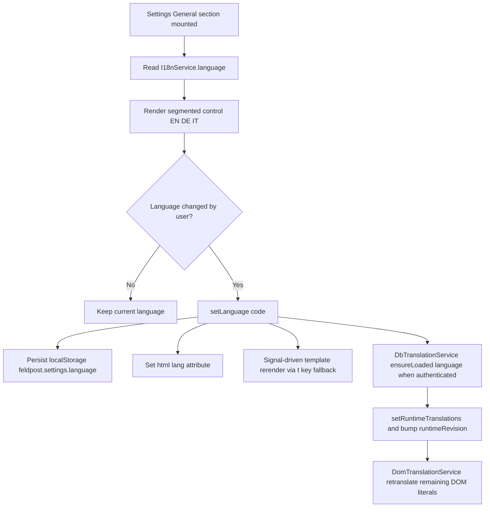
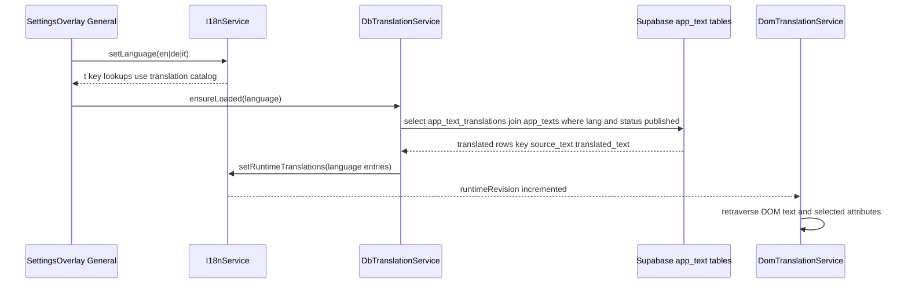
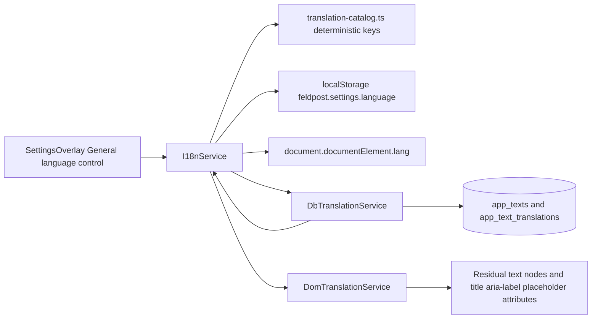
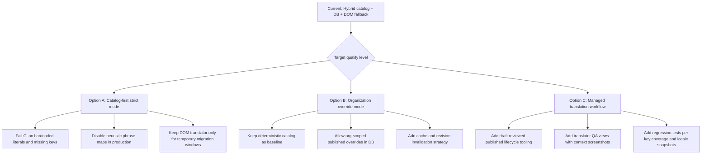

# Language & Locale Settings

## What It Is

A Settings Overlay section and runtime subsystem that control UI language (`en`, `de`, `it`) and locale-aware formatting across Feldpost. It combines deterministic key-based catalog translations with optional DB-provided runtime translations and an environment-gated DOM fallback translator for remaining literals during migration.

## What It Looks Like

In the `General` settings section, language is shown as a compact segmented control with native labels `English`, `Deutsch`, and `Italiano`. Interaction uses shared `.ui-container` and `.ui-item` primitives, and each target keeps at least `2.75rem` (44px) minimum interaction height. Changing language immediately updates translated UI copy and locale formatting behavior (dates/numbers). The visible behavior is instant, without explicit Save/Discard controls in the current implementation.

## Where It Lives

- **Route**: Global settings overlay section (no route segment).
- **Parent**: `SettingsOverlayComponent` in `apps/web/src/app/features/settings-overlay/settings-overlay.component.ts`.
- **Appears when**: User opens Settings and selects `General`.

## Actions

| #   | User Action                                       | System Response                                                                                                  | Triggers                                                |
| --- | ------------------------------------------------- | ---------------------------------------------------------------------------------------------------------------- | ------------------------------------------------------- |
| 1   | Opens Settings and views `General` section        | Reads active language from `I18nService.language()` and renders EN/DE/IT segmented control state                 | section render                                          |
| 2   | Clicks `English`                                  | Calls `setLanguage('en')`, updates signals, persists to `localStorage`, sets `<html lang="en">`                  | segmented control click                                 |
| 3   | Clicks `Deutsch`                                  | Calls `setLanguage('de')`, updates signals, persists to `localStorage`, sets `<html lang="de">`                  | segmented control click                                 |
| 4   | Clicks `Italiano`                                 | Calls `setLanguage('it')`, updates signals, persists to `localStorage`, sets `<html lang="it">`                  | segmented control click                                 |
| 5   | Language signal changes                           | Catalog-backed `t(key)` values re-render deterministically                                                       | Angular signal reactivity                               |
| 6   | Runtime revision changes (DB translations loaded) | DOM translation pass re-runs for remaining raw literals/attributes (`title`, `aria-label`, `placeholder`)        | `DbTranslationService` + `DomTranslationService` effect |
| 7   | User logs in and language is active               | Published rows for selected language are loaded from `app_text_translations` and attached as runtime dictionary  | authenticated preload / language change                 |
| 8   | Legacy fallback mode disabled                     | DOM mutation translator and heuristic phrase fallback are bypassed; key-based + DB runtime entries remain active | `environment.i18n.enableLegacyDomFallback = false`      |



## Component Hierarchy

```text
App
|- App component startup
|  |- DomTranslationService.start()
|  `- DbTranslationService.preload()
|- SettingsOverlayComponent
|  `- General section language control
|     |- Button English (en)
|     |- Button Deutsch (de)
|     `- Button Italiano (it)
`- I18n runtime services
   |- I18nService (catalog, language signal, locale, formatting)
   |- DbTranslationService (published translation rows)
   `- DomTranslationService (DOM literal fallback translation)
```

## Data Requirements



| Field                   | Source                                                                      | Type                                                                  |
| ----------------------- | --------------------------------------------------------------------------- | --------------------------------------------------------------------- |
| `language`              | `I18nService.language()`                                                    | `'en' \| 'de' \| 'it'`                                                |
| `locale`                | `I18nService.locale()`                                                      | `'en-GB' \| 'de-AT' \| 'it-IT'`                                       |
| `catalogEntry`          | `TRANSLATION_BY_KEY[key]`                                                   | `TranslationEntry \| undefined`                                       |
| `runtimeDictionary`     | `I18nService.runtimeDictionaries[language]`                                 | `{ byKey: Record<string,string>; byOriginal: Record<string,string> }` |
| `runtimeRevision`       | `I18nService.runtimeRevision()`                                             | `number`                                                              |
| `dbRows`                | `app_text_translations join app_texts`                                      | `{ key, source_text, translated_text, status, lang }[]`               |
| `langStorage`           | `window.localStorage['feldpost.settings.language']`                         | `'en' \| 'de' \| 'it' \| null`                                        |
| `legacyFallbackEnabled` | `environment.i18n.enableLegacyDomFallback` + optional localStorage override | `boolean`                                                             |

## State

| Name                     | Type                                                              | Default                         | Controls                                                         |
| ------------------------ | ----------------------------------------------------------------- | ------------------------------- | ---------------------------------------------------------------- |
| `languageSignal`         | `WritableSignal<'en' \| 'de' \| 'it'>`                            | browser-derived fallback (`de`) | active language for all key lookups                              |
| `runtimeRevisionSignal`  | `WritableSignal<number>`                                          | `0`                             | forces DOM fallback retraversal after runtime dictionary changes |
| `runtimeDictionaries`    | `WritableSignal<Record<LanguageCode, RuntimeLanguageDictionary>>` | empty dictionaries              | runtime overrides by key and original text                       |
| `settingsModel.language` | `'en' \| 'de' \| 'it'`                                            | `i18nService.language()`        | selected option in Settings segmented control                    |
| `legacyFallbackEnabled`  | `boolean`                                                         | env default (`false` in prod)   | enables legacy DOM/heuristic fallback path                       |

## File Map

| File                                                                         | Purpose                                                                  |
| ---------------------------------------------------------------------------- | ------------------------------------------------------------------------ |
| `apps/web/src/app/features/settings-overlay/settings-overlay.component.ts`   | language control rendering and `setLanguage()` wiring in General section |
| `apps/web/src/app/features/settings-overlay/settings-overlay.component.html` | segmented EN/DE/IT language buttons                                      |
| `apps/web/src/app/core/i18n/i18n.service.ts`                                 | canonical key translation, locale selection, runtime dictionary handling |
| `apps/web/src/app/core/i18n/db-translation.service.ts`                       | fetches published DB translations and pushes runtime entries             |
| `apps/web/src/app/core/i18n/dom-translation.service.ts`                      | DOM-level fallback translation pass                                      |
| `apps/web/src/app/core/i18n/translation-catalog.ts`                          | in-repo deterministic translation catalog                                |
| `apps/web/src/environments/environment.ts`                                   | production i18n fallback mode flag                                       |
| `apps/web/src/environments/environment.development.ts`                       | development i18n fallback mode flag                                      |
| `docs/i18n/translation-workbench.csv`                                        | translator-facing source table used to generate SQL seed                 |
| `scripts/import-i18n-csv-to-sql.mjs`                                         | CSV-to-SQL generator for `app_texts` and `app_text_translations`         |
| `supabase/seed_i18n.sql`                                                     | generated seed payload for translation tables                            |
| `supabase/migrations/20260317150000_i18n_translation_tables.sql`             | i18n schema + RLS baseline                                               |
| `supabase/migrations/20260317193000_i18n_add_italian_language.sql`           | language constraint expansion to include Italian                         |

## Wiring

### Injected Services

- `I18nService`: central language signal, deterministic key translation, locale and formatting methods.
- `DbTranslationService`: loads published translation rows for authenticated users.
- `DomTranslationService`: translates raw DOM literals not yet key-migrated.
- `SupabaseService` (indirect via DB translation service): DB read boundary for translation rows.

### Inputs / Outputs

- **Inputs**: `settingsModel.language` value in `SettingsOverlayComponent`.
- **Outputs**: none; behavior is side-effect-driven via injected services and signals.

### Subscriptions

- Language signal effect in `DbTranslationService` calls `ensureLoaded(language)`.
- Language + runtime revision effect in `DomTranslationService` re-translates document subtree.
- Angular template signal reactivity updates all `t(key, fallback)` usage.
- In production, DOM fallback and heuristic phrase translation are disabled by environment flag by default.

### Supabase Calls

- None directly from settings template/component for language changes.
- `DbTranslationService` selects from `app_text_translations` joined with `app_texts`, filtered by `lang` and `status = 'published'`.
- Runtime DB translations are cached in memory and localStorage per user+language with request dedupe to avoid duplicate fetches.



## Options To Make This Good



1. Option A (recommended short-term): finish key migration and treat DOM fallback as temporary only.
2. Option B (recommended medium-term): keep deterministic catalog but permit controlled organization-level overrides in DB.
3. Option C (recommended long-term): add formal translation operations workflow (review states, audit trail, automated QA).
4. Cross-cutting improvements for all options:

- add lint rule that blocks untranslated literals in templates and component strings.
- add CI check comparing `translation-catalog.ts` keys and `translation-workbench.csv` keys.
- add e2e smoke tests that switch `en/de/it` and verify high-traffic surfaces (auth, map shell, search, settings).

## Acceptance Criteria

- [ ] Language setting is visible in Settings `General` and offers exactly three options: `English`, `Deutsch`, `Italiano`.
- [ ] Language switch labels remain in native form (`English`, `Deutsch`, `Italiano`) independent of active UI locale.
- [ ] Selecting a language applies immediately and updates both rendered copy and document `lang` attribute.
- [ ] Language preference persists in browser storage key `feldpost.settings.language`.
- [ ] `I18nService.t(key, fallback)` resolves catalog keys deterministically for `en/de` and for `it` when catalog value exists.
- [ ] For authenticated users, published DB translations are loaded for active language and update runtime dictionaries.
- [ ] Runtime DB translation loading is deduplicated and cached per user+language.
- [ ] DOM fallback translator updates residual literals only when legacy fallback mode is enabled.
- [ ] App remains functional if DB translation load fails (catalog/fallback behavior continues without crash).

## Settings

- **Language / Locale**: UI language switch between English, German, and Italian with locale-specific formatting and runtime translation fallback behavior.
