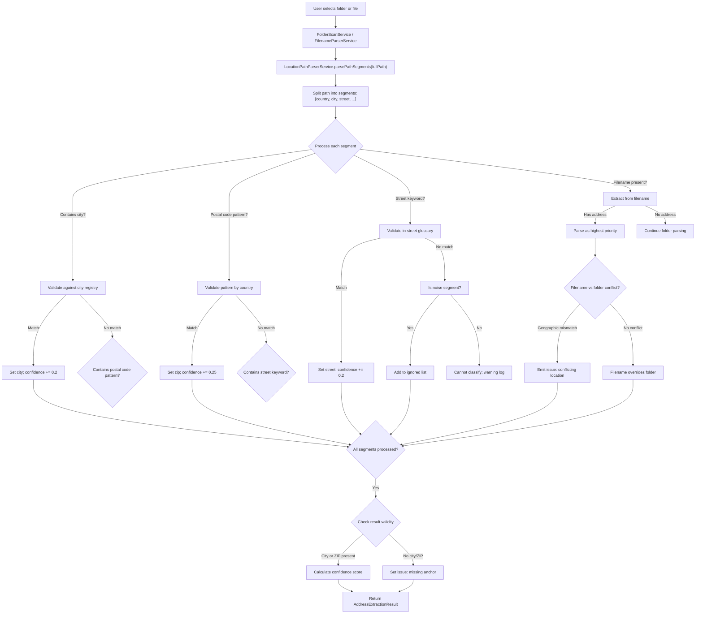
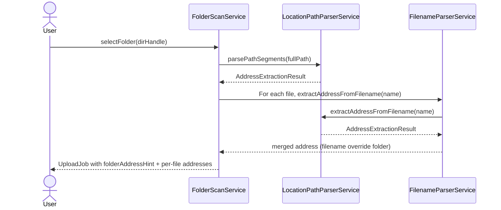

# Location Path Parser Service

## What It Is

A utility service that reconstructs valid address data from hierarchical folder and file structures. It extracts and validates location components (country, city, postal code, street, house number, unit) from directory paths and filenames, following an descending hierarchy (Land > PLZ/Stadt > Straße > Hausnummer > Stiege/Tür > Dateiname).

The service is part of the upload pipeline's folder-import and filename-parsing flow, feeding address context into the geocoding and location reconciliation stages.

## What It Looks Like

This is infrastructure without UI. The parser receives a full file path and returns a structured JSON object containing extracted address components, a confidence score, any conflicts detected, and a list of ignored noise segments. It handles geographic data validation through whitelisting (known cities, postal code patterns, street keywords) and robust noise-resilience (ignores irrelevant folder names like "Fotos von Montag" without errors).

## Where It Lives

- **Consumed by**: `FolderScanService`, `FilenameParserService`, and `UploadNewPipelineService`
- **Entry points**:
  - `parsePathSegments(fullPath: string)` — main public API
  - `extractAddressFromFilename(filename: string)` — filename-specific extraction
  - `validateAddressComponent(segment: string, componentType: string)` — segment validation
- **Configuration**: Lookup tables (postal code patterns, city registry, street keywords) are loaded from constants in `core/location-path-parser/`

## Actions & Interactions

| #   | Trigger                                               | System Response                                                               | Notes                                   |
| --- | ----------------------------------------------------- | ----------------------------------------------------------------------------- | --------------------------------------- |
| 1   | FolderScanService calls `parsePathSegments()`         | Parses path from root to filename; yields structured `AddressContext` object  | Handles folder imports                  |
| 2   | FilenameParserService calls same service              | Extracts and validates each path segment individually                         | Entry point for single filenames        |
| 3   | Segment contains known city name                      | Records segment as city; moves to next segment; confidence += 0.2             | Whitelist lookup                        |
| 4   | Segment is postal code pattern (4–5 digits)           | Records as zip; confidence += 0.25                                            | Regex or lookup table for country       |
| 5   | Segment contains street keyword (Gasse, Str.)         | Records as street; confidence += 0.2                                          | Keyword whitelist matching              |
| 6   | Segment has no address signal                         | Skips segment; adds to ignored list; no error thrown                          | Noise-resilient behavior                |
| 7   | Filename contains address (e.g., "Denisgasse 12.jpg") | Filename data overrides all contradicting upper folder segments               | File > Folder > Country hierarchy       |
| 8   | Filename address conflicts with folder context        | Marks conflict only if geographic mismatch detected (e.g., Wien vs. Berlin)   | Hard conflicts only; no soft warnings   |
| 9   | No city or postal code found in entire path           | Sets `address_context.city` and `address_context.zip` to null; emits issue    | Missing base anchor issue               |
| 10  | Street/housenumber exists in multiple cities          | Runs disambiguation algorithm and computes `confidence_score`                 | Auto-assign if probability >= threshold |
| 11  | Parser finds non-assignable address fragments         | Stores unresolved fragments in `address_notes[]` without dropping text        | No information loss                     |
| 12  | Parsing completes successfully                        | Returns `AddressExtractionResult` with components, score, notes, ignored list | Normal success case                     |

## Component Hierarchy

```
LocationPathParserService
  ├── Configuration
  │   ├── City Registry (lookup table or imported from geo data)
  │   ├── Postal Code Patterns (by country: AT, DE, CH, etc.)
  │   └── Street Keywords (Gasse, Straße, Str., Platz, etc.)
  ├── Segment Extraction & Validation
  │   ├── parsePathSegments(path: string)
  │   ├── extractAddressFromFilename(filename: string)
  │   └── validateAddressComponent(segment: string, type: string)
  ├── Noise Filtering
  │   └── isNoiseSegment(segment: string) → boolean
  ├── Conflict Detection
  │   └── detectGeographicConflict(parsed: AddressContext) → string | null
  └── Output Formatting
      └── formatResult() → AddressExtractionResult
```

## Data

### Data Flow (Mermaid — Parsing Process)



### Data Structure

| Field / Artifact      | Source                             | Type                                                              | Notes                                               |
| --------------------- | ---------------------------------- | ----------------------------------------------------------------- | --------------------------------------------------- |
| Input path            | FolderScanService or user filename | `string`                                                          | Full path: `/root/Austria/1070_Wien/Denisgasse/12/` |
| Segments              | String split and cleaned           | `string[]`                                                        | Normalized: lowercase, trimmed                      |
| City registry         | Import or hardcoded lookup         | `Map<string, CityRecord>`                                         | {Wien, Berlin, Salzburg, ...}                       |
| Postal code patterns  | Country-specific regex             | `Map<string, RegExp>`                                             | AT: `/^[0-9]{4}$/`, DE: `/^[0-9]{5}$/`              |
| Street keywords       | Glossary                           | `Set<string>`                                                     | {Gasse, Straße, Str., Platz, Allee, Weg, ...}       |
| Filename address      | Extracted from filename stem       | `string \| null`                                                  | E.g., "Denisgasse_12" from filename                 |
| Address context       | Parsed and validated components    | `AddressContext`                                                  | See output format below                             |
| Confidence score      | Incremental accumulation           | `0.0–1.0`                                                         | Base 0.5, +0.2 per city/street, +0.25 zip           |
| Disambiguation method | Parser setting                     | `'cluster-majority' \| 'distance-weighted' \| 'bayesian-context'` | Selectable strategy                                 |
| Disambiguation result | Candidate ranking output           | `{ city:string; probability:number }[]`                           | Ranked best-match candidates                        |
| Issues                | Validation failures or conflicts   | `string \| null`                                                  | Only for hard conflicts or missing anchors          |
| Address notes         | Unassigned parsed fragments        | `string[]`                                                        | Preserves useful residual tokens                    |
| Ignored segments      | Noise-filtered path parts          | `string[]`                                                        | ["Fotos von Montag", "Urlaub", ...]                 |

### Output Format

```json
{
  "address_context": {
    "country": "Austria",
    "city": "Wien",
    "zip": "1070",
    "street": "Denisgasse",
    "house_number": "12",
    "unit": null
  },
  "disambiguation": {
    "algorithm": "cluster-majority",
    "chosen_city": "Wien",
    "probability": 0.95,
    "candidates": [
      { "city": "Wien", "probability": 0.95 },
      { "city": "Krems an der Donau", "probability": 0.05 }
    ],
    "auto_assigned": true
  },
  "confidence_score": 0.85,
  "issue": null,
  "address_notes": [
    "Token 'Top 12' could not be mapped to unit format",
    "Unparsed suffix: Hinterhof"
  ],
  "ignored_segments": ["Fotos_von_Montag"],
  "source": {
    "country_source": "folder_level_0",
    "city_source": "folder_level_1",
    "zip_source": "folder_level_1",
    "street_source": "folder_level_2",
    "house_number_source": "folder_level_3",
    "unit_source": null,
    "filename_override": null
  }
}
```

## State

| Name                       | Type                                                              | Default              | Controls                                                        |
| -------------------------- | ----------------------------------------------------------------- | -------------------- | --------------------------------------------------------------- |
| `segments`                 | `string[]`                                                        | `[]`                 | Normalized path parts awaiting classification                   |
| `addressContext`           | `AddressContext`                                                  | `{}`                 | Extracted/validated location components                         |
| `confidenceScore`          | `number 0.0–1.0`                                                  | `0.5`                | Base score; incremented per validated segment                   |
| `disambiguationAlgorithm`  | `'cluster-majority' \| 'distance-weighted' \| 'bayesian-context'` | `'cluster-majority'` | Active strategy for ambiguous addresses                         |
| `autoAssignThreshold`      | `number 0.0–1.0`                                                  | `0.95`               | If top candidate probability >= threshold, choose without modal |
| `candidateCities`          | `{ city:string; probability:number }[]`                           | `[]`                 | Ranked output for ambiguous city matches                        |
| `ignoredSegments`          | `string[]`                                                        | `[]`                 | Noise segments that were skipped                                |
| `addressNotes`             | `string[]`                                                        | `[]`                 | Preserved unmapped address fragments                            |
| `detectedConflict`         | `string \| null`                                                  | `null`               | Hard geographic mismatch issue                                  |
| `filenameAddressExtracted` | `boolean`                                                         | `false`              | Whether filename contained address                              |
| `isFinalResult`            | `boolean`                                                         | `false`              | Ready for return to caller                                      |

## Settings

- **Address Disambiguation Strategy**: Selects ranking mode (`cluster-majority`, `distance-weighted`, `bayesian-context`) for ambiguous street+house matches.
- **Address Auto-Assign Threshold**: Probability threshold (default `0.95`) above which the top-ranked city is selected automatically.
- **Address Review Lower Bound**: Probability lower bound (default `0.70`) below which an issue is emitted instead of soft review.

## File Map

| File                                                      | Purpose                                                 |
| --------------------------------------------------------- | ------------------------------------------------------- |
| `docs/element-specs/location-path-parser.md`              | Service spec (this document)                            |
| `core/location-path-parser.service.ts`                    | Main service implementation                             |
| `core/location-path-parser.util.ts`                       | Shared validation utilities and regexes                 |
| `core/location-path-parser/city-registry.const.ts`        | Hardcoded or imported city lookup table (Austria focus) |
| `core/location-path-parser/postal-code-patterns.const.ts` | Country-specific postal code regex patterns             |
| `core/location-path-parser/street-keywords.const.ts`      | Multilingual street type keywords (Gasse, Str., etc.)   |
| `core/location-path-parser/disambiguation-strategy.ts`    | Strategy interface + algorithm selection                |
| `core/location-path-parser/disambiguation-algorithms.ts`  | Cluster/distance/Bayesian ranking implementations       |
| `core/location-path-parser.service.spec.ts`               | Unit tests covering all segment types and conflicts     |

## Wiring

### Injected Services

- None required; this service is pure parsing + ranking logic

### Inputs

- `fullPath: string` — Complete directory path including filename (e.g., `/Austria/1070_Wien/Denisgasse/12/photo.jpg`)
- `filename: string` (alternative) — Filename only for standalone extraction (e.g., `Denisgasse_12.jpg`)

### Outputs

- `AddressExtractionResult` — Structured JSON with all parsed components, confidence, conflicts, and ignored segments

### Consumer Integration (Mermaid — Wiring)



## Ambiguous Street Disambiguation Algorithms

When strings like `Kremsergasse 5` can map to multiple cities, the parser should avoid prompting by default and first run probabilistic ranking. The three strategies below are intentionally tunable.

### Proposal A: Cluster Majority Prior (`cluster-majority`)

```ts
// Uses batch context: if most nearby files resolve to Wien, ambiguous addresses inherit that cluster prior.
// Fast and stable for folder imports where files usually belong to the same city area.
function rankByClusterMajority(candidates, batchResolvedCities, weights) {
  const cityFrequency = countCities(batchResolvedCities);
  return candidates
    .map((candidate) => {
      const prior = normalizeFrequency(cityFrequency[candidate.city] ?? 0);
      // feature score includes zip/country agreement and parser confidence
      const feature =
        weights.zipMatch * (candidate.zipMatch ? 1 : 0) +
        weights.countryMatch * (candidate.countryMatch ? 1 : 0) +
        weights.parserConfidence * candidate.parserConfidence;
      return { city: candidate.city, probability: squash(prior + feature) };
    })
    .sort((a, b) => b.probability - a.probability);
}
```

### Proposal B: Distance-Weighted Context (`distance-weighted`)

```ts
// Uses already-geocoded neighboring uploads from the active batch/project.
// Candidate city gets higher probability if candidate centroid is close to existing cluster centroid.
function rankByDistanceWeighted(candidates, clusterCentroid, weights) {
  return candidates
    .map((candidate) => {
      const km = haversineKm(candidate.cityCentroid, clusterCentroid);
      const distanceScore = Math.exp(-weights.distanceDecay * km);
      const feature =
        weights.streetExact * (candidate.streetExact ? 1 : 0) +
        weights.houseNumberExact * (candidate.houseNumberExact ? 1 : 0) +
        weights.zipMatch * (candidate.zipMatch ? 1 : 0);
      return {
        city: candidate.city,
        probability: normalize(distanceScore + feature),
      };
    })
    .sort((a, b) => b.probability - a.probability);
}
```

### Proposal C: Bayesian Context Fusion (`bayesian-context`)

```ts
// Combines multiple weak signals as Bayesian factors.
// Best for mixed datasets where one folder can still contain different cities.
function rankByBayesianContext(candidates, context) {
  return candidates
    .map((candidate) => {
      const prior = context.cityPrior[candidate.city] ?? context.defaultPrior;
      const likelihood =
        pZipGivenCity(candidate, context) *
        pStreetGivenCity(candidate, context) *
        pHouseGivenStreet(candidate, context) *
        pProjectGivenCity(candidate, context);
      return {
        city: candidate.city,
        probability: normalizePosterior(prior * likelihood),
      };
    })
    .sort((a, b) => b.probability - a.probability);
}
```

Decision policy:

- Auto-assign when `topProbability >= autoAssignThreshold` (default `0.95`).
- Mark as `needs_review` when `0.70 <= topProbability < 0.95`.
- Emit issue when `topProbability < 0.70` or hard geo-conflict exists.

## Acceptance Criteria

- [x] Service parses a multi-segment path and extracts city, zip, street, house number, and unit separately.
- [x] City validation uses a whitelist lookup (hardcoded or imported); non-matches skip without error.
- [x] Postal code validation uses country-specific regex patterns (AT: 4 digits, DE: 5 digits, etc.).
- [x] Street keyword detection supports plurals and abbreviations (Gasse/Gassen, Str./Straße, Platz/Plätze).
- [x] Noise segments (e.g., "Fotos von Montag", "Urlaub", "Neu") are skipped and added to ignored list without errors.
- [x] Confidence score starts at 0.5 and increments: +0.2 per city/street match, +0.25 per postal code match.
- [x] Filename addresses are extracted as highest-priority overrides to folder-level context.
- [x] Filename-to-folder conflicts are detected only if geographic mismatch is found (e.g., Wien vs. Berlin).
- [x] Missing city or postal code generates an issue flag (address cannot be anchored).
- [x] Ambiguous street+house matches run one of three ranking strategies (`cluster-majority`, `distance-weighted`, `bayesian-context`).
- [x] Auto-assignment only happens when top probability meets configurable threshold (default `0.95`).
- [x] Addresses below threshold are marked `needs_review` instead of silently forced.
- [x] Output always follows the `AddressExtractionResult` JSON format with all required fields.
- [x] Service is country-agnostic; lookup tables can be swapped for different regions.
- [x] FolderScanService receives folder-level address hint and applies it to jobs without file-level override.
- [x] FilenameParserService calls `extractAddressFromFilename()` for individual files and receives filename-prioritized results.
- [x] Ignored segments are tracked and returned so upstream consumers can audit noise filtering.
- [x] Non-assignable address fragments are preserved in `address_notes[]` so no parsed signal is lost.
- [x] Hard conflicts (geographic mismatches) are logged but do not prevent upload; soft mismatches (distance) are handled separately by geocoding service.
