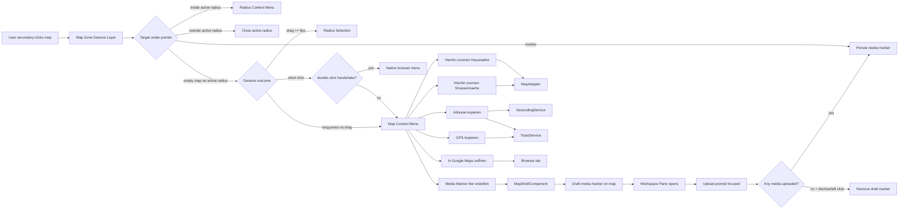
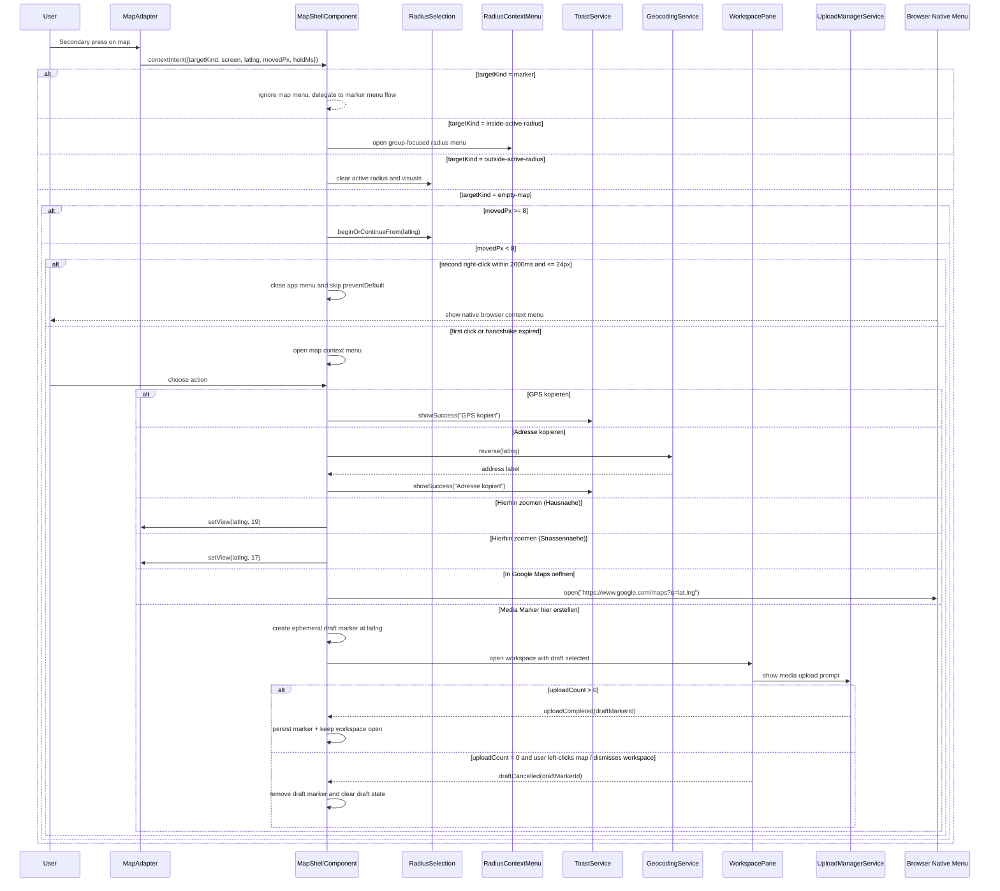

# Map Context Menu

> **Use cases:** [use-cases/map-context-menu.md](../use-cases/map-context-menu.md)

## What It Is

A contextual action menu opened by secondary click on an empty map position. It gives fast map-local actions (for example "Create Media Marker Here") without entering a full-screen mode or losing map context.

Primary use cases are: quick media marker drafting at exact coordinates, fast map zoom-in to a practical working scale (house or street proximity), and utility actions like copying address/GPS or opening Google Maps. The interaction uses a two-step desktop handshake: first right-click opens the app menu, second right-click (nearby and shortly after) allows the native browser menu. A secondary-click drag continues to start Radius Selection.

## What It Looks Like

The menu is a compact floating surface anchored near the pointer position, using the shared elevated menu shell and `dd-*` action rows. It uses `--color-bg-elevated`, `1px` border (`--color-border`), `--elevation-dropdown`, and `--radius-lg`. Default width is `14rem` (224px) with item rows at `2.75rem` (44px) minimum touch target height. Items use leading icons (`1rem`) and labels (`0.8125rem`) with warm clay hover (`color-mix(in srgb, var(--color-clay) 8%, transparent)`). On narrow mobile viewports, the same actions render as a bottom action sheet instead of a tiny anchored popover. The app menu uses normal viewport clamping only; there is no special "mirror against browser menu" placement logic.

## Where It Lives

- **Route**: Global within map route `/`
- **Parent**: Map Zone in `MapShellComponent`
- **Appears when**: User performs a short secondary click on empty map area (desktop) or long-press without drag on empty map area (mobile)
- **Precedence note**: When an active radius exists, secondary clicks inside radius open Radius Context Menu (group actions). Secondary clicks outside radius close the radius on the first click.

## Actions & Interactions

| #   | User Action                                                    | System Response                                                                                             | Triggers                                                       |
| --- | -------------------------------------------------------------- | ----------------------------------------------------------------------------------------------------------- | -------------------------------------------------------------- |
| 0   | Active radius exists + right-click inside radius               | Radius Context Menu wins (group actions), map menu does not open                                            | radius hit-test precedence                                     |
| 0a  | Active radius exists + short right-click outside radius        | Radius closes immediately; map menu does not open on that same click                                        | outside-radius dismiss rule                                    |
| 1   | First short right-click on empty map (desktop)                 | Opens Map Context Menu at pointer coordinates and suppresses native browser menu                            | `MapAdapter` context event + no marker target                  |
| 2   | Second short right-click near same point within `2000ms`       | Closes app menu and allows native browser context menu (no `preventDefault`)                                | double-secondary-click handshake                               |
| 3   | Second right-click outside handshake window                    | Treated as a new first click; app menu re-anchors and native menu is suppressed                             | handshake reset                                                |
| 4   | Right-click and drag beyond movement threshold (`8px`)         | Cancels menu opening, starts Radius Selection interaction                                                   | Radius Selection gesture recognizer                            |
| 5   | Long-press on empty map without drag (mobile, `>= 380ms`)      | Opens action sheet variant of Map Context Menu                                                              | Touch long-press recognizer                                    |
| 6   | Long-press then drag beyond threshold (`8px`)                  | Suppresses menu and starts Radius Selection                                                                 | Radius Selection gesture recognizer                            |
| 7   | Selects `Media Marker hier erstellen`                          | Creates an ephemeral media-marker draft at clicked lat/lng, opens Workspace Pane, and focuses upload prompt | `MapShellComponent` + `WorkspacePane` + `UploadManagerService` |
| 8   | Selects `Hierhin zoomen (Hausnaehe)`                           | Centers clicked point and zooms to building-level context                                                   | `MapAdapter.setView(latlng, 19)`                               |
| 9   | Selects `Hierhin zoomen (Strassennaehe)`                       | Centers clicked point and zooms to street-level context                                                     | `MapAdapter.setView(latlng, 17)`                               |
| 10  | Selects `Adresse kopieren`                                     | Resolves human-readable address for clicked point and copies to clipboard                                   | `GeocodingService.reverse()` + clipboard + toast               |
| 11  | Selects `GPS kopieren`                                         | Copies `lat, lng` to clipboard and shows toast                                                              | `navigator.clipboard.writeText` + `ToastService`               |
| 12  | Selects `In Google Maps oeffnen`                               | Opens a new browser tab with Google Maps at clicked coordinates                                             | `window.open(https://www.google.com/maps?q=lat,lng)`           |
| 13  | Uploads at least one media file in opened draft workspace      | Draft marker is promoted to persistent media marker, remains visible on map                                 | Upload completion event + marker reconciliation                |
| 14  | Left-clicks map (or presses Escape) while draft has no uploads | Workspace draft session closes and empty draft marker is removed immediately                                | Draft cancel handler                                           |
| 15  | Clicks outside / presses Escape / taps backdrop (menu only)    | Closes context menu with no action                                                                          | dismiss handler                                                |
| 16  | Right-clicks on marker instead of empty map                    | Marker context menu wins; map context menu does not open                                                    | target disambiguation                                          |
| 17  | Right-clicks near viewport edges/corners                       | App menu is clamped to viewport bounds; browser menu placement is left to browser                           | clamp-only positioning                                         |

## Component Hierarchy

```
MapContextMenuHost (inside MapShellComponent)
├── [desktop] MapContextPopover                      ← anchored to pointer, z above map overlays
│   └── .dd-items
│       ├── .dd-item "Media Marker hier erstellen"
│       ├── .dd-item "Hierhin zoomen (Hausnaehe)"
│       ├── .dd-item "Hierhin zoomen (Strassennaehe)"
│       ├── .dd-item "Adresse kopieren"
│       ├── .dd-item "GPS kopieren"
│       ├── .dd-divider
│       └── .dd-item "In Google Maps oeffnen"
├── [mobile] MapContextActionSheet                  ← bottom sheet variant for touch reliability
│   └── .dd-items                                   ← same action set/order as desktop
└── ContextBackdrop                                 ← click/tap outside closes menu
```

## Data Requirements

### Data Flow (Mermaid)



| Field              | Source                                    | Type                                             |
| ------------------ | ----------------------------------------- | ------------------------------------------------ |
| `anchorScreen`     | Pointer event (`clientX`, `clientY`)      | `{ x: number; y: number }`                       |
| `anchorLatLng`     | `MapAdapter.containerPointToLatLng()`     | `{ lat: number; lng: number }`                   |
| `targetKind`       | Hit test from map event target            | `'empty-map' \| 'photo-marker' \| 'user-marker'` |
| `isTouch`          | Pointer/touch capability detection        | `boolean`                                        |
| `clipboardPayload` | Formatted from `anchorLatLng` (`lat,lng`) | `string`                                         |

No direct Supabase query is required to open the menu. Actions may trigger existing flows that already persist data (for example placement/upload flows).

## State

| Name                    | TypeScript Type                                                               | Default | Controls                                                 |
| ----------------------- | ----------------------------------------------------------------------------- | ------- | -------------------------------------------------------- |
| `mapContextMenuOpen`    | `boolean`                                                                     | `false` | Visibility of popover/sheet                              |
| `mapContextAnchor`      | `{ x: number; y: number; lat: number; lng: number } \| null`                  | `null`  | Position and coordinates for actions                     |
| `secondaryPressStartAt` | `number \| null`                                                              | `null`  | Distinguishes short click vs long-press                  |
| `secondaryPressMovedPx` | `number`                                                                      | `0`     | Gesture arbitration with Radius Selection                |
| `mapContextSource`      | `'mouse' \| 'touch' \| null`                                                  | `null`  | Chooses desktop popover vs mobile sheet                  |
| `draftMediaMarker`      | `{ markerId: string; lat: number; lng: number; uploadCount: number } \| null` | `null`  | Ephemeral marker/session created from map context action |
| `lastSecondaryClickAt`  | `number \| null`                                                              | `null`  | Desktop second-click handshake timing                    |
| `lastSecondaryClickPos` | `{ x: number; y: number } \| null`                                            | `null`  | Desktop second-click handshake distance                  |
| `copiedAddress`         | `string \| null`                                                              | `null`  | Last reverse-geocoded address copied to clipboard        |

## File Map

| File                                                               | Purpose                                                      |
| ------------------------------------------------------------------ | ------------------------------------------------------------ |
| `apps/web/src/app/features/map/map-shell/map-shell.component.ts`   | Hold menu state, gesture arbitration, and action handlers    |
| `apps/web/src/app/features/map/map-shell/map-shell.component.html` | Render popover/sheet and menu actions in Map Zone            |
| `apps/web/src/app/features/map/map-shell/map-shell.component.scss` | Positioning, shell geometry, responsive behavior             |
| `apps/web/src/app/core/map/map-adapter.ts`                         | Add context-click/long-press event contract                  |
| `apps/web/src/app/core/map/leaflet-map.adapter.ts`                 | Emit normalized map context events + target hit metadata     |
| `docs/element-specs/media-marker-draft-flow.md`                    | Define draft lifecycle from create action to persist/remove  |
| `docs/element-specs/map-zone.md`                                   | Cross-reference gesture precedence (menu vs radius drag)     |
| `docs/element-specs/radius-selection.md`                           | Clarify drag-threshold behavior when secondary press is used |

## Wiring

### Wiring Flow (Mermaid)



- Gesture arbitration happens before menu render.
- Marker-target context actions are handled by marker-specific menus, not this map menu.
- Active radius has higher precedence than map context menu for inside/outside hit results.
- `MapShellComponent` is the single source of truth for visibility and anchor coordinates.
- Desktop native-menu fallback is explicitly supported through the second-right-click handshake.
- No dedicated browser-menu placement algorithm is used; browser chooses native placement.

## Acceptance Criteria

- [ ] First short right-click on empty map opens the map context menu at cursor position.
- [ ] With active radius, right-click inside radius opens Radius Context Menu instead of map context menu.
- [ ] With active radius, short right-click outside radius closes radius immediately and does not open map menu on same click.
- [ ] Second short right-click within `2000ms` and within `24px` of prior right-click opens native browser menu.
- [ ] If second click is outside handshake window (time or distance), app menu behavior repeats as first click.
- [ ] Right-click drag (movement `>= 8px`) starts Radius Selection and never flashes the map context menu.
- [ ] Long-press without drag on mobile opens the action-sheet variant.
- [ ] Long-press + drag on mobile starts Radius Selection instead of opening menu.
- [ ] `Create Media Marker Here` creates an ephemeral draft marker at clicked coordinates and opens Workspace Pane with upload prompt.
- [ ] If user dismisses the draft session without uploading any media, the draft marker is removed immediately.
- [ ] If at least one media file is uploaded, the marker is persisted and remains visible.
- [ ] `Hierhin zoomen (Hausnaehe)` zooms to building-level context around clicked point.
- [ ] `Hierhin zoomen (Strassennaehe)` zooms to street-level context around clicked point.
- [ ] `Adresse kopieren` resolves and copies a human-readable address.
- [ ] `GPS kopieren` copies coordinates and shows success feedback.
- [ ] `In Google Maps oeffnen` opens external map at clicked coordinates.
- [ ] Clicking outside, backdrop tap, and Escape close the menu.
- [ ] Right-click on a photo marker opens marker context menu only (no double menu).
- [ ] Near top/right/bottom/left edges and corners, app menu remains fully visible via viewport clamping.
- [ ] Native browser menu placement is not overridden by app-specific placement rules.
