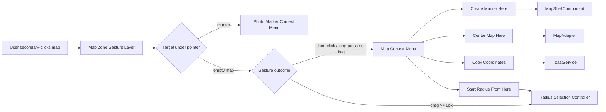
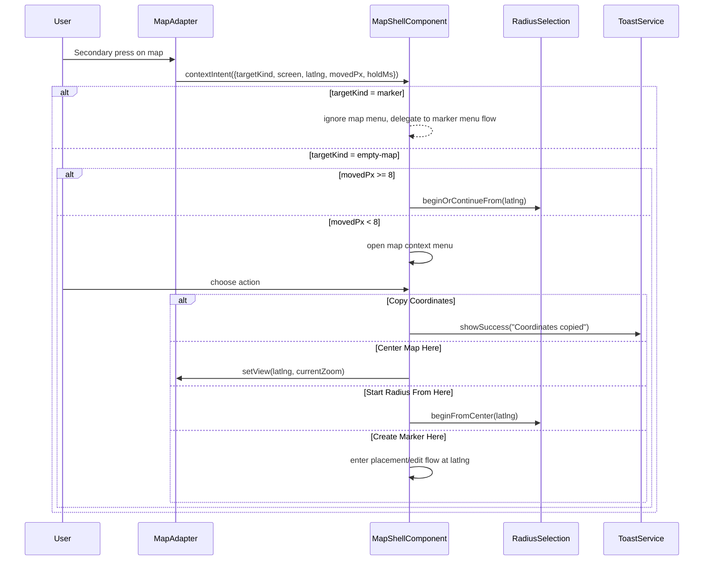

# Map Context Menu

## What It Is

A contextual action menu opened by secondary click on an empty map position. It gives fast map-local actions (for example "Create marker here") without entering a full-screen mode or losing map context.

Primary use cases are: quick marker creation at exact coordinates, map navigation actions at pointer position, and utility actions like copying coordinates. A short secondary click opens the menu, while a secondary-click drag continues to start Radius Selection.

## What It Looks Like

The menu is a compact floating surface anchored near the pointer position, using the shared elevated menu shell and `dd-*` action rows. It uses `--color-bg-elevated`, `1px` border (`--color-border`), `--elevation-dropdown`, and `--radius-lg`. Default width is `14rem` (224px) with item rows at `2.75rem` (44px) minimum touch target height. Items use leading icons (`1rem`) and labels (`0.8125rem`) with warm clay hover (`color-mix(in srgb, var(--color-clay) 8%, transparent)`). On narrow mobile viewports, the same actions render as a bottom action sheet instead of a tiny anchored popover.

## Where It Lives

- **Route**: Global within map route `/`
- **Parent**: Map Zone in `MapShellComponent`
- **Appears when**: User performs a short secondary click on empty map area (desktop) or long-press without drag on empty map area (mobile)

## Actions & Interactions

| #   | User Action                                               | System Response                                                                   | Triggers                                             |
| --- | --------------------------------------------------------- | --------------------------------------------------------------------------------- | ---------------------------------------------------- |
| 1   | Short right-click on empty map (desktop)                  | Opens Map Context Menu at pointer coordinates                                     | `MapAdapter` context event + no marker target        |
| 2   | Right-click and drag beyond movement threshold (`8px`)    | Cancels menu opening, starts Radius Selection interaction                         | Radius Selection gesture recognizer                  |
| 3   | Long-press on empty map without drag (mobile, `>= 380ms`) | Opens action sheet variant of Map Context Menu                                    | Touch long-press recognizer                          |
| 4   | Long-press then drag beyond threshold (`8px`)             | Suppresses menu and starts Radius Selection                                       | Radius Selection gesture recognizer                  |
| 5   | Selects `Create Marker Here`                              | Creates a marker draft at clicked lat/lng and enters placement/edit flow          | `MapShellComponent` + upload/placement orchestration |
| 6   | Selects `Center Map Here`                                 | Pans map center to clicked lat/lng, keeps zoom                                    | `MapAdapter.setView(center, currentZoom)`            |
| 7   | Selects `Copy Coordinates`                                | Copies `lat, lng` to clipboard and shows toast                                    | `navigator.clipboard.writeText` + `ToastService`     |
| 8   | Selects `Start Radius From Here`                          | Arms Radius Selection with fixed center at clicked point, then drag to set radius | Radius Selection state machine                       |
| 9   | Clicks outside / presses Escape / taps backdrop           | Closes menu with no action                                                        | dismiss handler                                      |
| 10  | Right-clicks on marker instead of empty map               | Marker context menu wins; map context menu does not open                          | target disambiguation                                |

## Component Hierarchy

```
MapContextMenuHost (inside MapShellComponent)
├── [desktop] MapContextPopover                      ← anchored to pointer, z above map overlays
│   └── .dd-items
│       ├── .dd-item "Create Marker Here"
│       ├── .dd-item "Center Map Here"
│       ├── .dd-item "Copy Coordinates"
│       ├── .dd-divider
│       └── .dd-item "Start Radius From Here"
├── [mobile] MapContextActionSheet                  ← bottom sheet variant for touch reliability
│   └── .dd-items                                   ← same action set/order as desktop
└── ContextBackdrop                                 ← click/tap outside closes menu
```

## Data Requirements

### Data Flow (Mermaid)



| Field              | Source                                    | Type                                             |
| ------------------ | ----------------------------------------- | ------------------------------------------------ |
| `anchorScreen`     | Pointer event (`clientX`, `clientY`)      | `{ x: number; y: number }`                       |
| `anchorLatLng`     | `MapAdapter.containerPointToLatLng()`     | `{ lat: number; lng: number }`                   |
| `targetKind`       | Hit test from map event target            | `'empty-map' \| 'photo-marker' \| 'user-marker'` |
| `isTouch`          | Pointer/touch capability detection        | `boolean`                                        |
| `clipboardPayload` | Formatted from `anchorLatLng` (`lat,lng`) | `string`                                         |

No direct Supabase query is required to open the menu. Actions may trigger existing flows that already persist data (for example placement/upload flows).

## State

| Name                    | TypeScript Type                                              | Default | Controls                                  |
| ----------------------- | ------------------------------------------------------------ | ------- | ----------------------------------------- |
| `mapContextMenuOpen`    | `boolean`                                                    | `false` | Visibility of popover/sheet               |
| `mapContextAnchor`      | `{ x: number; y: number; lat: number; lng: number } \| null` | `null`  | Position and coordinates for actions      |
| `secondaryPressStartAt` | `number \| null`                                             | `null`  | Distinguishes short click vs long-press   |
| `secondaryPressMovedPx` | `number`                                                     | `0`     | Gesture arbitration with Radius Selection |
| `mapContextSource`      | `'mouse' \| 'touch' \| null`                                 | `null`  | Chooses desktop popover vs mobile sheet   |

## File Map

| File                                                               | Purpose                                                      |
| ------------------------------------------------------------------ | ------------------------------------------------------------ |
| `apps/web/src/app/features/map/map-shell/map-shell.component.ts`   | Hold menu state, gesture arbitration, and action handlers    |
| `apps/web/src/app/features/map/map-shell/map-shell.component.html` | Render popover/sheet and menu actions in Map Zone            |
| `apps/web/src/app/features/map/map-shell/map-shell.component.scss` | Positioning, shell geometry, responsive behavior             |
| `apps/web/src/app/core/map/map-adapter.ts`                         | Add context-click/long-press event contract                  |
| `apps/web/src/app/core/map/leaflet-map.adapter.ts`                 | Emit normalized map context events + target hit metadata     |
| `docs/element-specs/map-zone.md`                                   | Cross-reference gesture precedence (menu vs radius drag)     |
| `docs/element-specs/radius-selection.md`                           | Clarify drag-threshold behavior when secondary press is used |

## Wiring

### Wiring Flow (Mermaid)



- Gesture arbitration happens before menu render.
- Marker-target context actions are handled by marker-specific menus, not this map menu.
- `MapShellComponent` is the single source of truth for visibility and anchor coordinates.

## Acceptance Criteria

- [ ] Short right-click on empty map opens the map context menu at cursor position.
- [ ] Right-click drag (movement `>= 8px`) starts Radius Selection and never flashes the map context menu.
- [ ] Long-press without drag on mobile opens the action-sheet variant.
- [ ] Long-press + drag on mobile starts Radius Selection instead of opening menu.
- [ ] `Create Marker Here` creates a draft marker/placement at the clicked coordinates.
- [ ] `Center Map Here` recenters map without changing zoom.
- [ ] `Copy Coordinates` copies coordinates and shows a success toast.
- [ ] `Start Radius From Here` starts radius mode centered on the clicked point.
- [ ] Clicking outside, backdrop tap, and Escape close the menu.
- [ ] Right-click on a photo marker opens marker context menu only (no double menu).
