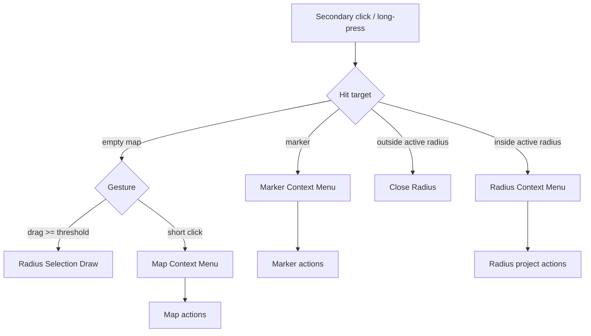
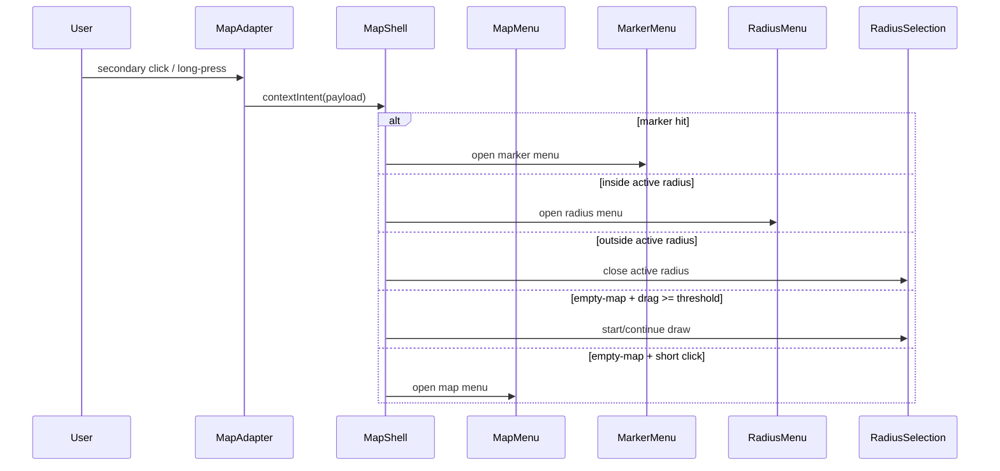

# Map Secondary-Click System

> **Use cases:** [use-cases/map-secondary-click-system.md](../use-cases/map-secondary-click-system.md)
> **Child specs:** [map-context-menu](map-context-menu.md), [photo-marker-context-menu](photo-marker-context-menu.md), [radius-selection](radius-selection.md)

## What It Is

A unified interaction system for secondary-click (right-click / long-press) behavior on the map. It defines which menu opens for map, marker, and active-radius targets and prevents conflicting behavior.

This system is the source of truth for precedence, gesture arbitration, and option sets across all three context menus.

## What It Looks Like

All secondary-click menus use the shared dropdown/action-sheet shell (`dd-*` rows, `--color-bg-elevated`, `--elevation-dropdown`, `--radius-lg`). Desktop menus anchor to cursor/marker/radius hit zone. Mobile uses bottom action sheets for touch reliability.

Map menu focuses creation/navigation utilities. Marker menu focuses item-level operations. Radius menu focuses project actions on in-radius result sets.

## Where It Lives

- **Route**: Global in map route `/`
- **Parent**: `MapShellComponent`
- **Scope**: Empty map targets, marker targets, active-radius targets

## Actions & Interactions

### Precedence Matrix

| Priority | Target / Gesture                                     | Result                                   |
| -------- | ---------------------------------------------------- | ---------------------------------------- |
| 1        | Secondary click on marker                            | Open Marker Context Menu                 |
| 2        | Active radius + secondary click inside radius        | Open Radius Context Menu                 |
| 3        | Active radius + short secondary click outside radius | Close radius (no map menu on same click) |
| 4        | Empty map + secondary drag >= threshold              | Start/continue Radius Selection draw     |
| 5        | Empty map + short secondary click                    | Open Map Context Menu                    |

### Map Context Menu Options

| Option                           | Effect                                             |
| -------------------------------- | -------------------------------------------------- |
| `Media Marker hier erstellen`    | Create draft marker, open workspace upload context |
| `Hierhin zoomen (Hausnaehe)`     | `setView(latlng, 19)`                              |
| `Hierhin zoomen (Strassennaehe)` | `setView(latlng, 17)`                              |
| `Adresse kopieren`               | Reverse geocode + copy address                     |
| `GPS kopieren`                   | Copy `lat,lng`                                     |
| `In Google Maps oeffnen`         | Open external map tab                              |

### Marker Context Menu Options

| Option                           | Availability     | Effect                      |
| -------------------------------- | ---------------- | --------------------------- |
| `Details oeffnen`                | Single marker    | Open detail view            |
| `Auswahl oeffnen`                | Cluster marker   | Load cluster selection      |
| `Hierhin zoomen (Hausnaehe)`     | Single + cluster | `setView(markerLatLng, 19)` |
| `Hierhin zoomen (Strassennaehe)` | Single + cluster | `setView(markerLatLng, 17)` |
| `Projekt hinzufuegen...`         | Single + cluster | Open assign-to-project flow |
| `Adresse kopieren`               | Single + cluster | Reverse geocode + copy      |
| `GPS kopieren`                   | Single + cluster | Copy `lat,lng`              |
| `In Google Maps oeffnen`         | Single + cluster | Open external map tab       |
| `Foto loeschen`                  | Single marker    | Confirm + delete            |

### Radius Context Menu Options

| Option                     | Effect                                          |
| -------------------------- | ----------------------------------------------- |
| `Neues Projekt aus Radius` | Create project from in-radius result set        |
| `Zu Projekt zuweisen...`   | Assign in-radius result set to existing project |

## Component Hierarchy

```
MapShellComponent
├── MapContextMenuHost
│   └── MapContextMenu
├── MarkerContextMenuHost
│   └── PhotoMarkerContextMenu
└── RadiusContextMenuHost
    └── RadiusContextMenu
```

## Data Requirements

### System Flow (Mermaid)



| Field              | Source                 | Type                                                             |
| ------------------ | ---------------------- | ---------------------------------------------------------------- |
| `targetKind`       | hit-test result        | `'marker' \| 'inside-radius' \| 'outside-radius' \| 'empty-map'` |
| `anchorLatLng`     | map event              | `{ lat: number; lng: number }`                                   |
| `anchorScreen`     | pointer event          | `{ x: number; y: number }`                                       |
| `radiusActive`     | radius selection state | `boolean`                                                        |
| `secondaryMovedPx` | gesture tracker        | `number`                                                         |

## State

| Name                    | TypeScript Type                                 | Default | What it controls       |
| ----------------------- | ----------------------------------------------- | ------- | ---------------------- |
| `mapContextMenuOpen`    | `boolean`                                       | `false` | Map menu visibility    |
| `markerContextMenuOpen` | `boolean`                                       | `false` | Marker menu visibility |
| `radiusContextMenuOpen` | `boolean`                                       | `false` | Radius menu visibility |
| `pendingSecondaryPress` | `{ startPoint; startLatLng; additive } \| null` | `null`  | Gesture arbitration    |
| `radiusDrawActive`      | `boolean`                                       | `false` | Radius drawing mode    |

## File Map

| File                                                               | Purpose                                        |
| ------------------------------------------------------------------ | ---------------------------------------------- |
| `apps/web/src/app/features/map/map-shell/map-shell.component.ts`   | Secondary-click precedence and action dispatch |
| `apps/web/src/app/features/map/map-shell/map-shell.component.html` | Render all context menu surfaces               |
| `docs/element-specs/map-context-menu.md`                           | Map menu details                               |
| `docs/element-specs/photo-marker-context-menu.md`                  | Marker menu details                            |
| `docs/element-specs/radius-selection.md`                           | Radius draw + radius menu details              |
| `docs/use-cases/map-secondary-click-system.md`                     | End-to-end interaction scenarios               |

## Wiring

### Precedence Sequence (Mermaid)



- Exactly one context menu may be visible at a time.
- Radius has target precedence over empty-map menu while active.
- Drag threshold always wins over short-click menu opening.

## Acceptance Criteria

- [ ] Secondary-click precedence is deterministic across marker, radius, and empty-map targets.
- [ ] Marker target opens marker menu and never map menu.
- [ ] Active-radius inside-click opens radius menu.
- [ ] Active-radius outside-click closes radius on first click without opening map menu on same click.
- [ ] Empty-map short secondary click opens map menu.
- [ ] Empty-map secondary drag starts radius draw, not menu.
- [ ] Map menu includes: create marker, two zoom levels, copy address, copy GPS, open Google Maps.
- [ ] Marker menu includes: details/selection, two zoom levels, project assignment, copy address/GPS, open Google Maps, single-only delete.
- [ ] Radius menu includes: create project from radius and assign to existing project.
