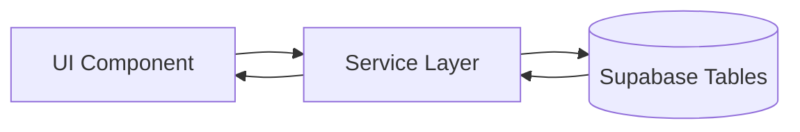
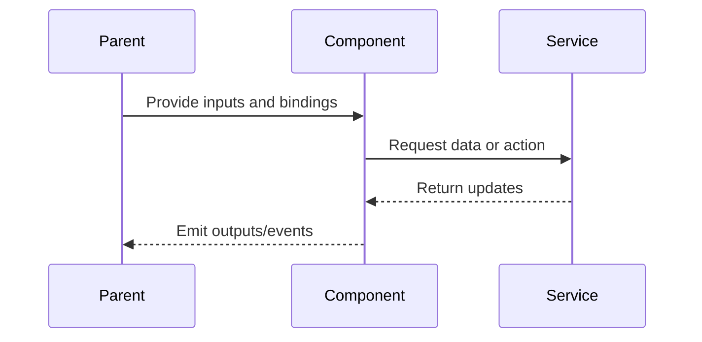

# Map Shell

## What It Is

The top-level full-screen host component for the map page. It's the main screen of Feldpost — everything the user sees after login lives inside Map Shell.

**Related docs:**

- Interaction scenarios: [use-cases/map-shell.md](../use-cases/map-shell.md)
- Implementation blueprint: [implementation-blueprints/map-shell.md](../implementation-blueprints/map-shell.md)
- Child specs: [workspace-pane](workspace-pane.md), [drag-divider](drag-divider.md), [search-bar](search-bar.md), [upload-button-zone](upload-button-zone.md), [photo-marker](photo-marker.md)
- Product use cases: UC1 (Technician on Site — view nearby history), UC2 (Clerk Preparing a Quote — evidence gathering), UC3 (Upload and Correct a New Image)

## What It Looks Like

Full viewport, horizontal flex row. Left: Sidebar. Center: Map Zone (fills remaining space). Right: Workspace Pane (slides in when opened). Background: `--color-bg-base`. No chrome, no header bar — the map dominates.

## Where It Lives

- **Route**: `/` (default route, guarded by auth)
- **Parent**: `AppComponent` via router outlet
- **Component**: `MapShellComponent` at `features/map/map-shell/`

## Actions

| #   | User Action                             | System Response                                                                                         | Triggers                                                                     |
| --- | --------------------------------------- | ------------------------------------------------------------------------------------------------------- | ---------------------------------------------------------------------------- |
| 1   | Navigates to `/` (authenticated)        | Renders full map shell with sidebar, map, floating controls                                             | Map init via `MapAdapter`                                                    |
| 2   | Resizes browser window                  | Layout reflows: sidebar collapses to bottom bar on mobile (<768px), workspace pane becomes bottom sheet | Responsive breakpoint                                                        |
| 3   | Opens workspace pane                    | Drag Divider appears, map zone shrinks via clip-path reveal                                             | Workspace Pane slides in; see [workspace-pane spec](workspace-pane.md) §1/1b |
| 4   | Enters placement mode                   | Map Container gets crosshair cursor, Placement Banner appears                                           | `placementActive` signal                                                     |
| 5   | Requests pin-drop from search bar       | Map enters pin-drop mode (crosshair cursor, placement banner with "Click the map to drop a pin")        | `searchPlacementActive` signal                                               |
| 6   | Closes workspace pane                   | Workspace pane slides out (clip-path reverse), Drag Divider removed, map zone expands                   | `workspacePaneOpen` → false; see [workspace-pane spec](workspace-pane.md) §3 |
| 7   | Clicks empty map area                   | Deselects the active marker (selection highlight clears); workspace pane stays open                     | `selectedMarkerKey` → null                                                   |
| 8   | GPS geolocation resolves during startup | Stores/updates user position and marker without forced recenter                                         | startup geolocation flow                                                     |
| 9   | GPS toggle is active                    | Runs periodic GPS refresh (~60s) and keeps user marker above photo markers                              | `gpsTrackingActive` signal + Leaflet z-index offset                          |

## Component Hierarchy

```
MapShell                                   ← full viewport, flex row, --color-bg-base
├── [future] Sidebar                       ← left rail (desktop) or bottom bar (mobile)
├── UploadButtonZone                       ← fixed top-right, z-20 (visually over map)
├── MapZone                                ← flex-1, holds map + all floating elements
│   ├── MapContainer                       ← div where Leaflet mounts
│   ├── SearchBar                          ← floating top-center, z-30
│   ├── GPSButton                          ← floating bottom-right
│   ├── [future] ActiveFilterChips         ← strip below search bar (when filters active)
│   └── [placement] PlacementBanner        ← bottom-center pill
├── [workspace open] DragDivider           ← resize handle (see drag-divider spec)
└── [workspace open] WorkspacePane         ← right panel (desktop) or bottom sheet (mobile)
```

## Data

### Data Flow (Mermaid)



| Field            | Source                                                   | Type            |
| ---------------- | -------------------------------------------------------- | --------------- |
| Viewport markers | `supabase.rpc('viewport_markers', { bounds, zoom })`     | `ViewportRow[]` |
| User images      | `supabase.from('images').select('*').eq('user_id', uid)` | `ImageRecord[]` |

## State

| Name                    | Type                       | Default | Controls                                             |
| ----------------------- | -------------------------- | ------- | ---------------------------------------------------- |
| `placementActive`       | `boolean`                  | `false` | Crosshair cursor on map, placement banner visibility |
| `searchPlacementActive` | `boolean`                  | `false` | Crosshair cursor on map for search pin-drop          |
| `uploadPanelOpen`       | `boolean`                  | `false` | Upload panel expanded/collapsed                      |
| `workspacePaneOpen`     | `boolean`                  | `false` | Workspace pane visibility + drag divider             |
| `gpsLocating`           | `boolean`                  | `false` | GPS spinner state while awaiting fix                 |
| `gpsTrackingActive`     | `boolean`                  | `false` | GPS toggle active state and periodic refresh loop    |
| `userPosition`          | `[number, number] \| null` | `null`  | Latest known user coordinates                        |

## File Map

| File                                              | Purpose                         |
| ------------------------------------------------- | ------------------------------- |
| `features/map/map-shell/map-shell.component.ts`   | Host component (already exists) |
| `features/map/map-shell/map-shell.component.html` | Template (already exists)       |
| `features/map/map-shell/map-shell.component.scss` | Layout styles (already exists)  |

## Wiring

### Wiring Flow (Mermaid)



- Loaded via Angular Router at `/` with `authGuard`
- Initializes Leaflet in `afterNextRender` (browser-only)
- All child floating components are positioned via CSS within Map Zone
- Never calls Leaflet directly from template — uses `MapAdapter`
- WorkspacePane close button emits `(closed)` → MapShell sets `workspacePaneOpen` → false
- Clicking empty map deselects the active marker but does **not** close the workspace pane

## Acceptance Criteria

- [ ] Full viewport with no scrollbars
- [ ] Sidebar on left (desktop) / bottom (mobile)
- [ ] Map fills remaining space
- [ ] Floating controls (search, upload, GPS) don't overlap each other
- [ ] Startup geolocation does not auto-zoom to user location
- [ ] GPS recenter is only triggered by explicit GPS button activation
- [ ] User location marker is rendered above photo markers
- [ ] Workspace pane slides in from right without pushing sidebar
- [ ] Placement mode adds crosshair cursor to map
- [ ] Workspace pane has a close button that hides the pane
- [ ] Clicking empty map deselects marker but keeps pane open
- [ ] Works on mobile: sidebar → bottom bar, workspace → bottom sheet
