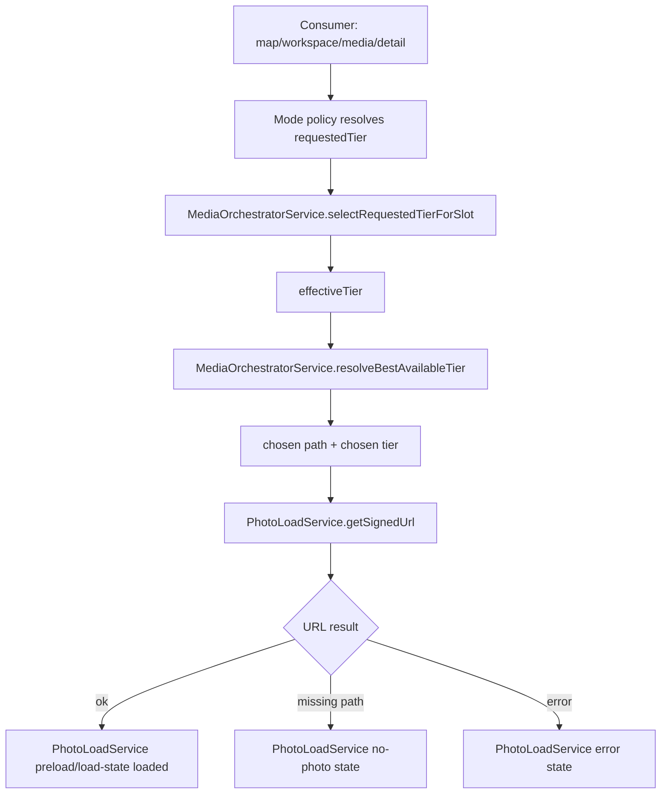
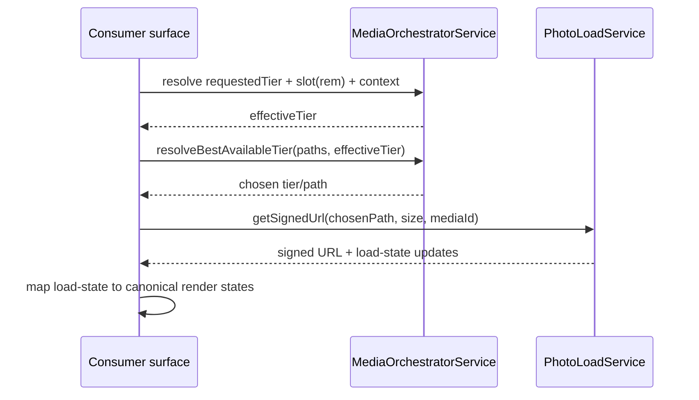

# Media Delivery Orchestrator

> Related specs: [item-grid](item-grid.md), [media-item](media-item.md), [photo-load-service](photo-load-service.md), [media-detail-view](media-detail-view.md), [action-context-matrix](action-context-matrix.md)

## What It Is

Media Delivery Orchestrator is the global render-delivery contract for media previews and detail assets.
It combines tier selection (`MediaOrchestratorService`) and signed-URL/load-state handling (`PhotoLoadService`) so every surface uses one deterministic media loading path.

## What It Looks Like

This is a headless contract, not a visual component. Its visible effect is consistency: map markers, workspace selected-items, media grid cards, and detail previews request tiers the same way and resolve fallback URLs by one shared policy. Loading visuals are still rendered by each consumer, but delivery state comes from the same source of truth. Ratio handling remains consumer-owned (for example row-mode ratio fallback), while URL and tier decisions stay centralized.

## Where It Lives

- Contract docs: `docs/element-specs/media-delivery-orchestrator.md`
- Services:
  - `apps/web/src/app/core/media/media-orchestrator.service.ts`
  - `apps/web/src/app/core/photo-load.service.ts`
- Current/target consumers:
  - `apps/web/src/app/features/map/map-shell/map-shell.component.ts`
  - `apps/web/src/app/features/map/workspace-pane/media-detail-view.component.ts`
  - `apps/web/src/app/features/media/media-item.component.ts`
  - Workspace selected-items domain item runtime after item-grid cutover
- Trigger: any work that changes media tier mapping, URL fallback order, or load-state semantics

## Actions & Interactions

| #   | Trigger                                    | System response                                                                                    | Output contract                     |
| --- | ------------------------------------------ | -------------------------------------------------------------------------------------------------- | ----------------------------------- |
| 1   | Consumer receives media record + slot size | Resolve requested tier from consumer mode policy                                                   | `requestedTier`                     |
| 2   | Slot size is known (`rem`)                 | Clamp/adapt requested tier by slot short edge and context floor                                    | `effectiveTier`                     |
| 3   | Tier has no available URL                  | Walk deterministic fallback chain (`requested -> lower tiers`)                                     | first available tier URL            |
| 4   | Storage path exists                        | Request signed URL through `PhotoLoadService`                                                      | signed URL + load-state updates     |
| 5   | Storage path missing                       | Mark no-media state via `PhotoLoadService`                                                         | `no-photo` load-state               |
| 6   | Asset loading fails                        | Publish error state without consumer-specific drift                                                | `error` load-state                  |
| 7   | Consumer is map/workspace/media/detail     | Reuse same orchestrator + photo-load chain                                                         | consistent behavior across surfaces |
| 8   | Consumer is row mode and ratio unknown     | Keep delivery chain unchanged; consumer uses ratio fallback (square) until metadata ratio resolves | stable geometry + shared delivery   |

## Component Hierarchy

```text
MediaDeliveryOrchestratorContract
├── MediaOrchestratorService (tier and fallback policy)
│   ├── context floor policy (map/grid/upload/detail)
│   ├── slot-size short-edge mapping
│   └── tier fallback chain
├── PhotoLoadService (URL signing, cache, load-state)
│   ├── getSignedUrl
│   ├── preload
│   ├── getLoadState
│   └── cache invalidation
└── Consumers
    ├── map marker media surfaces
    ├── workspace selected-items media items
    ├── media page item grid
    └── media detail viewer
```

## Data

### Delivery Data Flow (Mermaid)



| Field            | Source                     | Type                                                       | Purpose                                  |
| ---------------- | -------------------------- | ---------------------------------------------------------- | ---------------------------------------- |
| `requestedTier`  | consumer mode policy       | `MediaTier`                                                | Initial quality request from UI mode     |
| `slotWidthRem`   | consumer measurement       | `number \| null`                                           | Width input for adaptive tier selection  |
| `slotHeightRem`  | consumer measurement       | `number \| null`                                           | Height input for adaptive tier selection |
| `context`        | consumer                   | `'map' \| 'grid' \| 'upload' \| 'detail'`                  | Context floor for tier clamping          |
| `effectiveTier`  | `MediaOrchestratorService` | `MediaTier`                                                | Slot-aware tier after clamping           |
| `fallbackChain`  | `MediaOrchestratorService` | `ReadonlyArray<MediaTier>`                                 | Deterministic lower-tier fallback order  |
| `signedUrl`      | `PhotoLoadService`         | `string \| null`                                           | Renderable URL for chosen path           |
| `photoLoadState` | `PhotoLoadService`         | `'idle' \| 'loading' \| 'loaded' \| 'error' \| 'no-photo'` | Canonical load state                     |

## State

| Name             | TypeScript type                                            | Default          | What it controls                           |
| ---------------- | ---------------------------------------------------------- | ---------------- | ------------------------------------------ |
| `contextFloor`   | `Record<MediaContext, MediaTier>`                          | service constant | Minimum allowed tier per context           |
| `requestedTier`  | `MediaTier`                                                | consumer-defined | Target tier before slot adaptation         |
| `effectiveTier`  | `MediaTier`                                                | computed         | Slot-aware tier for current render request |
| `fallbackChain`  | `ReadonlyArray<MediaTier>`                                 | service constant | Tier downgrade order                       |
| `photoLoadState` | `'idle' \| 'loading' \| 'loaded' \| 'error' \| 'no-photo'` | `'idle'`         | Consumer-facing load semantics             |

## File Map

| File                                                                          | Purpose                                           |
| ----------------------------------------------------------------------------- | ------------------------------------------------- |
| `docs/element-specs/media-delivery-orchestrator.md`                           | Canonical media-delivery contract across surfaces |
| `apps/web/src/app/core/media/media-orchestrator.service.ts`                   | Tier selection and fallback-chain policy          |
| `apps/web/src/app/core/media/media-renderer.types.ts`                         | Shared tier/context type contract                 |
| `apps/web/src/app/core/photo-load.service.ts`                                 | URL signing/cache/load-state source of truth      |
| `apps/web/src/app/features/media/media-item.component.ts`                     | Grid/media consumer implementation                |
| `apps/web/src/app/features/map/map-shell/map-shell.component.ts`              | Map consumer implementation                       |
| `apps/web/src/app/features/map/workspace-pane/media-detail-view.component.ts` | Detail consumer implementation                    |

### Merge vs Archive Matrix (Media Renderer)

Use this matrix as the execution checklist for legacy media-renderer consolidation.

| Legacy/current asset                                                                                                 | Decision                          | Merge target (active)                                                                                                           | Archive target / gate                                                               |
| -------------------------------------------------------------------------------------------------------------------- | --------------------------------- | ------------------------------------------------------------------------------------------------------------------------------- | ----------------------------------------------------------------------------------- |
| `apps/web/src/app/core/media/media-orchestrator.service.ts`                                                          | Keep and standardize              | Global policy owner for tier selection + fallback chain                                                                         | Not archived                                                                        |
| `apps/web/src/app/core/photo-load.service.ts`                                                                        | Keep and standardize              | Global owner for signed URL + cache + load-state                                                                                | Not archived                                                                        |
| `apps/web/src/app/core/media/media-renderer.types.ts` (`MediaTier`, `MediaContext`, `MediaTierSelectionInput`)       | Keep and reuse                    | Shared type contract across map/workspace/media/detail                                                                          | Not archived                                                                        |
| `apps/web/src/app/core/media/media-renderer.types.ts` (`MediaRenderStatus`, `MediaRenderState` legacy shape)         | Merge then retire                 | Normalize render states in domain components (`loading/content/error/no-media`)                                                 | Archive/retire after all consumers stop using `placeholder/icon-only/loaded`        |
| `apps/web/src/app/shared/media/universal-media.component.ts`                                                         | Archive (reference only)          | Behavior split into active domain consumers (`media-item-render-surface`, detail viewer, upload item renderer where applicable) | Archive once no active runtime import remains                                       |
| `apps/web/src/app/features/map/workspace-pane/thumbnail-card/thumbnail-card-media/thumbnail-card-media.component.ts` | Archive after workspace cutover   | `apps/web/src/app/features/media/media-item-render-surface.component.ts` + `MediaItemComponent` pipeline                        | Archive when workspace selected-items top-level no longer uses `app-thumbnail-grid` |
| `apps/web/src/app/features/map/workspace-pane/thumbnail-grid.component.ts` media-render wiring                       | Archive after one-shot cutover    | Workspace selected-items via `ItemGridComponent` + projected `MediaItemComponent`                                               | Archive when one-shot cutover is complete                                           |
| `apps/web/src/app/features/map/map-shell/map-shell.component.ts` ad-hoc thumbnail signing path                       | Merge to shared delivery contract | Keep map consumer but enforce same orchestrator + photo-load chain as other surfaces                                            | Do not archive file; remove ad-hoc delivery branches during refactor                |
| `apps/web/src/app/features/map/workspace-pane/media-detail-view.component.ts` local delivery decisions               | Merge to shared delivery contract | Keep detail consumer with shared orchestrator + photo-load policy                                                               | Do not archive file; remove consumer-specific delivery drift                        |

### Ordered Migration Batches (Code + Spec + Archive)

Execute batches in order. Each batch is complete only when code, specs, and archive gates are all green.

| Batch                         | Primary code changes                                                                                                                                    | Required spec updates                                                                             | Archive gate                                                                                        |
| ----------------------------- | ------------------------------------------------------------------------------------------------------------------------------------------------------- | ------------------------------------------------------------------------------------------------- | --------------------------------------------------------------------------------------------------- |
| 1. Type normalization         | Introduce canonical media render-state mapping (`loading/content/error/no-media`) at consumer boundaries; keep compatibility adapters for legacy states | `media-item.md` state mapping verified; `item-grid.md` acceptance remains aligned                 | None                                                                                                |
| 2. Media page consumer        | Complete `MediaItemComponent` render-state normalization and remove legacy per-consumer state drift on `/media`                                         | `media-item.md` + `item-grid.md` acceptance checkboxes updated after implementation               | None                                                                                                |
| 3. Detail consumer            | Align `media-detail-view.component.ts` delivery path to shared orchestrator + photo-load chain only                                                     | `media-detail-photo-viewer.md` references active delivery parent                                  | None                                                                                                |
| 4. Workspace one-shot cutover | Replace active top-level `app-thumbnail-grid` selected-items runtime with `ItemGridComponent` + projected `MediaItemComponent`                          | `workspace-pane.md`, `item-grid.md`, and `media-delivery-orchestrator.md` migration notes updated | `thumbnail-grid.component.ts` and `thumbnail-card-media.component.ts` no longer active runtime path |
| 5. Map consumer alignment     | Remove ad-hoc map delivery branches so map markers use same delivery chain policy                                                                       | `photo-load-service.md` and delivery spec references validated                                    | None                                                                                                |
| 6. Archive and cleanup        | Archive `universal-media.component.ts` runtime role and remove stale imports/comments; keep archival references only                                    | Spec index and blueprint index mark legacy renderer specs/components as archived                  | No active runtime imports of archived renderer wrappers                                             |

### Decision Rule

- Archive UI wrappers/components that duplicate renderer behavior (`universal-media`, `thumbnail-card-media`, legacy thumbnail-grid runtime paths).
- Keep and consolidate policy/services (`MediaOrchestratorService`, `PhotoLoadService`, shared tier/context types).
- Treat `media-renderer.types.ts` as partially keep + partially retire: keep tier/context contracts, retire legacy render-status vocabulary after consumer migration.

## Wiring

### Integration Sequence (Mermaid)



- Tier selection and URL fallback policy are centralized and must not be duplicated per surface.
- Consumers may own visual geometry decisions (ratio and loading layer style), but not delivery policy.
- Consumer state mapping must normalize internal statuses to canonical render-state contracts in the owning component spec.

## Acceptance Criteria

- [ ] `MediaOrchestratorService` is the only source for requested/effective tier clamping and fallback-chain selection.
- [ ] `PhotoLoadService` is the only source for signed URL retrieval and load-state lifecycle.
- [ ] Map, workspace, `/media`, and detail consumers all use the same delivery chain.
- [ ] Consumer-specific ratio logic (for example row mode) does not bypass centralized tier/URL policy.
- [ ] Missing-path behavior resolves to canonical `no-photo` state via `PhotoLoadService`.
- [ ] Delivery failures resolve to canonical `error` state and do not invent per-surface error semantics.
- [ ] Spec references in item/media/workspace contracts point to this document for delivery-policy ownership.
- [ ] Merge vs archive matrix is fully executed: all marked archive targets have no active runtime imports, and all marked keep targets are the only active delivery policy source.
