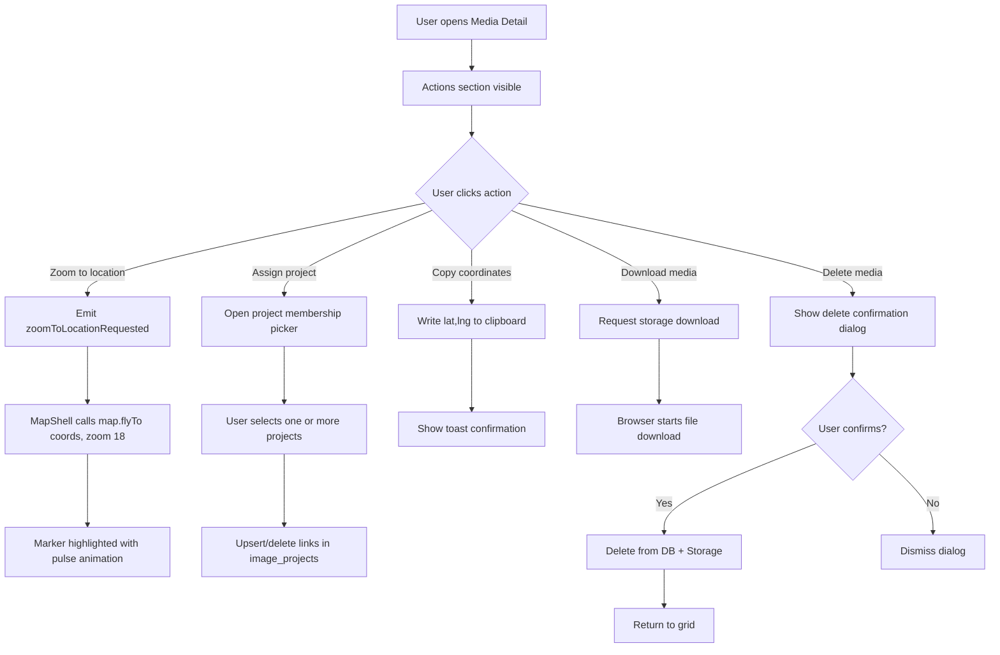

# Media Detail — Actions & Marker Sync

> **Parent spec:** [media-detail-view](media-detail-view.md)
> **Upload manager use cases:** [use-cases/upload-manager.md](../use-cases/upload-manager.md)
> **Map shell use cases:** [use-cases/map-shell.md](../use-cases/map-shell.md)

## What It Is

The actions section at the bottom of the Media Detail View and the marker synchronization system that keeps map markers up to date when media properties change. Actions include zooming to the photo's map location, assigning the media to a project, coordinate copying, download, and media deletion.

This surface consumes the canonical matrix actions `zoom_house`, `zoom_street`, `copy_address`, `copy_gps`, `assign_to_project`, `open_in_media`, and `delete_media`.

## What It Looks Like

Actions use **`dd-item`** button styling — not bordered outline buttons. Each action is a full-width row with a leading Material icon (`1rem`, `--color-text-secondary`), label text (`0.8125rem`), `dd-item` hover (warm clay tint), and `--radius-sm` border radius. A `dd-divider` separates destructive actions from normal ones. The delete action uses `dd-item--danger` style (red icon + label).

```pseudo
┌─ [icon] Zoom to location    ─┐   ← dd-item style, clay hover
├─ 📁  Assign project          ─┤   ← dd-item style, clay hover
├─ 📋  Copy coordinates        ─┤   ← dd-item style, clay hover
├─ ⬇️  Download media          ─┤   ← dd-item style, clay hover
├──────────────────────────────-─┤   ← dd-divider
└─ 🗑️  Delete media            ─┘   ← dd-item--danger style
```

## Where It Lives

- **Parent**: `MediaDetailViewComponent` — ActionsSection at bottom of metadata column
- **Appears when**: Media detail view is open and media data is loaded

## Actions

| #   | User Action               | System Response                                                       | Triggers            |
| --- | ------------------------- | --------------------------------------------------------------------- | ------------------- |
| 1   | Clicks "Zoom to location" | Pans & zooms map to photo's coordinates, highlights marker with pulse | Map flyTo + marker  |
| 2   | Clicks "Assign project"   | Opens project membership picker (multi-select)                        | Project memberships |
| 3   | Clicks "Copy coordinates" | Copies coordinates to clipboard, shows toast confirmation             | Clipboard + toast   |
| 4   | Clicks "Download media"   | Downloads the current media file                                      | Storage download    |
| 5   | Clicks "Delete media"     | Shows delete confirmation dialog                                      | `showDeleteConfirm` |
| 6   | Confirms delete           | Deletes media from DB and storage, returns to grid                    | Supabase delete     |
| 7   | Cancels delete            | Dismisses dialog                                                      | Dialog dismissed    |

## Marker Sync — Live Updates

When the user makes changes in the detail view, the corresponding **photo marker on the map must update** without a full viewport refresh:

| Change Type                | Channel                                  | Marker Effect                                        |
| -------------------------- | ---------------------------------------- | ---------------------------------------------------- |
| Media replaced             | `UploadManagerService.imageReplaced$`    | Marker DivIcon rebuilt with new thumbnail            |
| Media uploaded (photoless) | `UploadManagerService.imageAttached$`    | Marker DivIcon updated: placeholder → real thumbnail |
| Coordinate correction      | Correction mode in MapShell (user drags) | Marker already at new position from drag             |
| Address / metadata edits   | DB update only                           | No marker update needed                              |

### Key Design Principle

The detail view **does not emit output events for marker sync**. Instead:

- **Media changes** → delegate to `UploadManagerService` → manager emits `imageReplaced$` / `imageAttached$` → `MapShellComponent` subscribes directly
- **Coordinate changes** → handled by correction mode in `MapShellComponent` (marker drag is a map-layer operation)
- **Metadata edits** → saved to DB; no immediate marker visual change needed

## Component Hierarchy

```
ActionsSection                         ← dd-section-label "Actions", dd-item styled rows
├── ZoomToLocationAction               ← dd-item: my_location icon + "Zoom to location"
├── AssignProjectAction                ← dd-item: folder_open icon + "Assign project"
├── CopyCoordinatesAction              ← dd-item: content_copy icon + "Copy coordinates"
├── DownloadAction                     ← dd-item: download icon + "Download media"
├── dd-divider
└── DeleteAction                       ← dd-item--danger: delete icon + "Delete media"

[confirm] DeleteConfirmDialog          ← modal with cancel/confirm
```

## State

| Name                | Type      | Default | Controls                              |
| ------------------- | --------- | ------- | ------------------------------------- |
| `showDeleteConfirm` | `boolean` | `false` | Delete confirmation dialog visibility |
| `showContextMenu`   | `boolean` | `false` | Context menu visibility               |

## Interaction Flow



## Acceptance Criteria

- [x] Actions use **dd-item** button styling (not bordered outline buttons)
- [x] Each action: leading icon + label text, `0.8125rem` font
- [x] Hover uses warm clay tint matching all dropdown items
- [x] Delete action uses `dd-item--danger` style (red icon + label)
- [x] `dd-divider` separates destructive actions from normal ones
- [x] Zoom to location pans & zooms map to photo coordinates (flyTo, zoom 18)
- [x] Zoom to location highlights the target marker with a pulse animation
- [x] Zoom to location is disabled when media has no coordinates
- [ ] Assign project opens project membership picker (multi-select)
- [x] Copy coordinates writes to clipboard with toast confirmation
- [ ] Download media starts file download for the current media item
- [x] Delete confirmation dialog shown before removal
- [x] Replace media triggers marker thumbnail update via `UploadManagerService.imageReplaced$` (not direct output events)
- [x] Media upload to photoless row triggers marker update via `UploadManagerService.imageAttached$`
- [x] Coordinate edit handled by MapShell directly — marker already at new position from drag
- [x] No output events for marker sync — flows through service layer
- [x] Metadata edits saved to DB only — no immediate marker visual change needed
