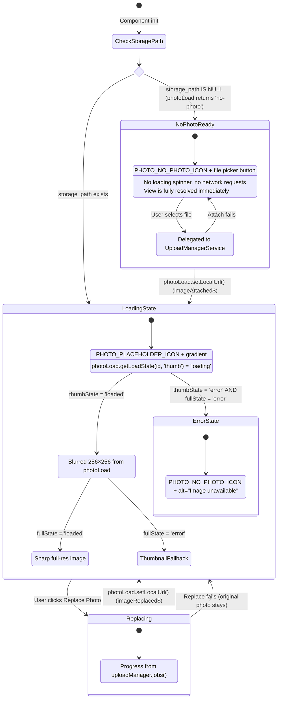
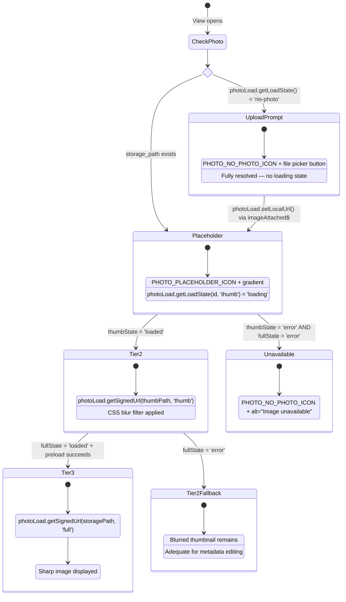
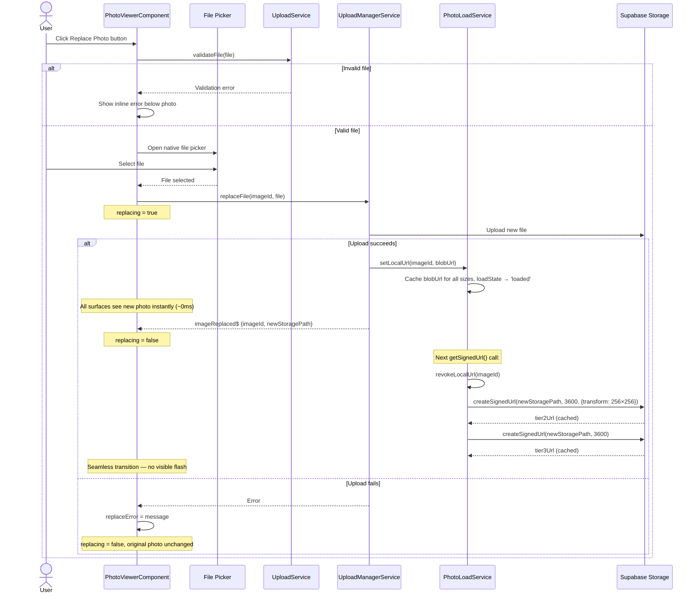
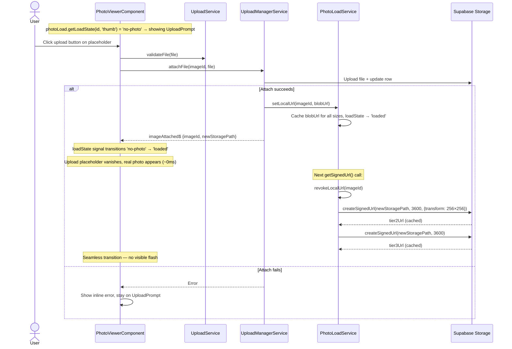
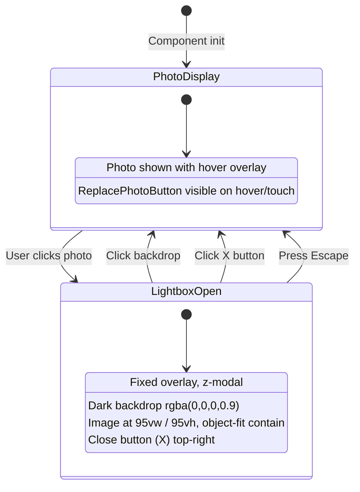
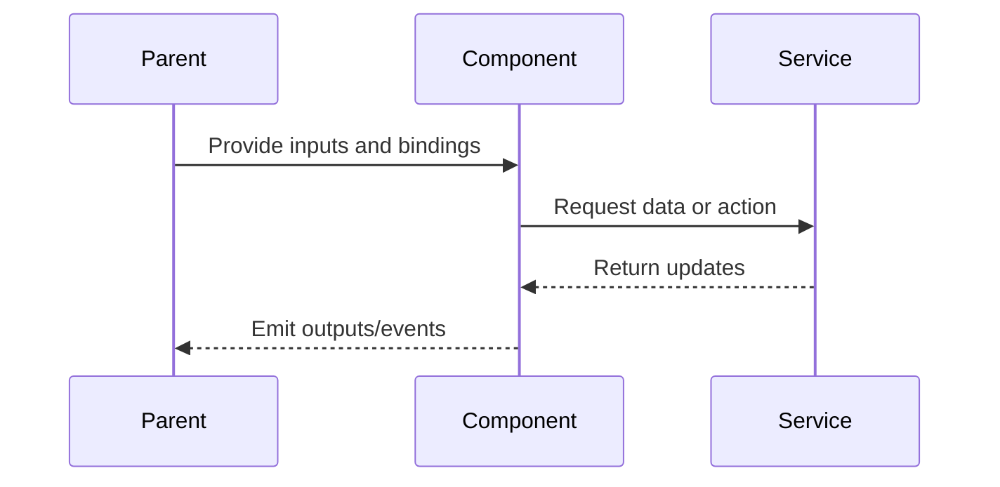

# Media Detail — Media Viewer

> **Parent spec:** [media-detail-view](media-detail-view.md)
> **Architecture parent:** [media-renderer-system](media-renderer-system.md)
> **Photo loading service:** [photo-load-service](photo-load-service.md)
> **Photo loading use cases:** [use-cases/photo-loading.md](../use-cases/photo-loading.md)
> **Editing use cases:** [use-cases/image-editing.md](../use-cases/image-editing.md) (IE-10)

## What It Is

The hero photo area inside the Media Detail View. Handles progressive image loading (placeholder → thumbnail → full-res), lightbox enlargement, and photo replacement/upload for photoless datapoints. Delegates all signed-URL generation and load-state tracking to `PhotoLoadService`; delegates file uploads to `UploadManagerService`.

## What It Looks Like

A rounded-corner image (`--radius-lg`) centered with side margins (`--spacing-4`). Fixed to approximately **1/3 of viewport height** (`max-height: 33vh`), 4:3 aspect ratio. On hover, a subtle `--color-primary` ring appears. A Replace Photo edit-icon button sits in the **top-right corner**, overlaid with a semi-transparent dark scrim (`rgba(0,0,0,0.5)`), visible on hover (desktop) or always (touch). When `storage_path IS NULL`, an upload prompt/placeholder is shown instead.

## Where It Lives

- **Parent**: `MediaDetailViewComponent` — placed in PhotoColumn (wide layout) or top of SingleColumnLayout (narrow)
- **Appears when**: Image detail view is open

## Actions

| #   | User Action                     | System Response                                                                                                                                                          | Triggers               |
| --- | ------------------------------- | ------------------------------------------------------------------------------------------------------------------------------------------------------------------------ | ---------------------- |
| 1   | Clicks photo                    | Opens full-screen lightbox overlay (dark backdrop, `rgba(0,0,0,0.9)`). Image at `95vw / 95vh`, `object-fit: contain`. Close button (X) top-right.                        | Lightbox opens         |
| 2   | Clicks lightbox backdrop / X    | Closes lightbox                                                                                                                                                          | Lightbox closes        |
| 3   | Presses Escape in lightbox      | Closes lightbox                                                                                                                                                          | Lightbox closes        |
| 4   | Clicks Replace Photo button     | Opens file picker; delegates to `uploadManager.replaceFile(imageId, file)`                                                                                               | `replacing` → true     |
| 5   | Replace upload succeeds         | `imageReplaced$` fires → `UploadManagerService` calls `photoLoad.setLocalUrl(imageId, blobUrl)` → all surfaces see new photo instantly → service re-signs on next access | `replacing` → false    |
| 6   | Replace upload fails            | Inline error below photo; no DB/storage changes                                                                                                                          | `replaceError` set     |
| 7   | Clicks upload button (no photo) | Opens file picker; delegates to `uploadManager.attachFile(imageId, file)`                                                                                                | Attach pipeline starts |
| 8   | Attach upload succeeds          | `imageAttached$` fires → `UploadManagerService` calls `photoLoad.setLocalUrl(imageId, blobUrl)` → switches from upload placeholder to photo display                      | Photo display shown    |
| 9   | Right-clicks detail thumbnail   | Opens the same detail context action menu as the header 3-dot trigger                                                                                                    | Detail context menu    |

## Component Hierarchy

```
PhotoViewer                                ← object-fit: contain, background: #111
├── [not loaded] Placeholder               ← CSS gradient + camera icon + "Loading…"
├── [tier 2] ThumbnailPreview             ← 256×256 signed URL (blurred via CSS filter)
├── [tier 3] FullResImage                 ← original res, crossfades over thumbnail
├── [hover / touch] ReplacePhotoButton     ← edit icon, scrim overlay, top-right
├── [no storage_path] UploadPrompt         ← Placeholder with file picker button
└── [lightbox open] LightboxOverlay        ← fixed, dark backdrop, z-modal
    ├── FullResImage                       ← 95vw / 95vh, object-fit: contain
    └── CloseButton (X)                    ← top-right
```

## State Machine

Load-state tracking is delegated to `PhotoLoadService`. The component reads `photoLoad.getLoadState(imageId, size)` signals and maps them to visual tiers.



### No-Photo Fast Path

When `storage_path IS NULL`, the PhotoViewer **immediately** enters the `NoPhotoReady` state:

- No CSS loading placeholder is shown
- No signed URL requests are made
- No loading spinner or "Loading…" text appears
- The upload prompt is the **final resolved state** — not a loading intermediate
- The parent `ImageDetailView.loading` signal is `false` as soon as the record fetch completes

This prevents photoless items from appearing stuck in a perpetual loading state.

## Progressive Image Loading

Three-tier strategy to show content as fast as possible, fully delegated to `PhotoLoadService`. **Only invoked when `storage_path` exists.** When `storage_path IS NULL`, `photoLoad.getLoadState()` returns `'no-photo'` immediately and the component shows the upload prompt (see [No-Photo Fast Path](#no-photo-fast-path) above).

Adaptive tier policy: the component measures the active viewer slot, converts dimensions to `rem`, and forwards them to `MediaOrchestratorService.selectRequestedTierForSlot(...)` to derive the requested tier for this render cycle. Service logic remains UI-agnostic and must not access DOM directly.

1. **Check** → `photoLoad.getLoadState(imageId, 'thumb')` returns `'no-photo'` → skip to upload prompt
2. **View opens with photo** → CSS placeholder shown using `PHOTO_PLACEHOLDER_ICON` (no network)
3. **Tier 2** → `photoLoad.getSignedUrl(thumbPath, 'thumb')` → service returns cached or freshly signed URL
4. Thumbnail `` loads → replaces placeholder with slight blur filter
5. **Tier 3** → `photoLoad.getSignedUrl(storagePath, 'full')` → service returns full-res URL
6. `photoLoad.preload(fullUrl)` → hidden preload → crossfade swaps it in
7. If Tier 3 fails (`fullState = 'error'`), Tier 2 remains visible (adequate quality for metadata editing)
8. If both fail, `PHOTO_NO_PHOTO_ICON` shown with `alt="Image unavailable"`



### Signed URL Strategy (via PhotoLoadService)

The component never calls Supabase Storage directly. All signing is delegated to `PhotoLoadService`:

- **Tier 2:** `photoLoad.getSignedUrl(thumbnail_path ?? storage_path, 'thumb')` → service applies `{ width: 256, height: 256, resize: 'cover' }` transform
- **Tier 3:** `photoLoad.getSignedUrl(storage_path, 'full')` → service returns original resolution (no transform)
- **Preload:** `photoLoad.preload(fullUrl)` → hidden `Image()` element confirms download before crossfade
- **Caching:** Service handles cache lookup, staleness (50 min threshold), and re-signing — component does not manage URL expiry

### Replace Photo — Loading Restart

When `imageReplaced$` fires:

1. `UploadManagerService` calls `photoLoad.setLocalUrl(imageId, blobUrl)` → blob URL injected into service cache at all sizes → all surfaces see the new photo instantly (~0ms)
2. Component reads `photoLoad.getLoadState(imageId, 'thumb')` / `photoLoad.getLoadState(imageId, 'full')` — both show `'loaded'` (blob URL)
3. On next access, `photoLoad.invalidate(imageId)` clears blob → service re-signs Tier 2 and Tier 3 from new `storagePath`
4. `photoLoad.revokeLocalUrl(imageId)` frees the `ObjectURL` memory
5. Seamless transition — no visible flash between blob and signed URL



### Attach Photo — Placeholder to Photo

When `imageAttached$` fires:

1. `UploadManagerService` calls `photoLoad.setLocalUrl(imageId, blobUrl)` → blob URL injected at all sizes, `loadState` → `'loaded'`
2. Component detects state transition from `'no-photo'` → `'loaded'` → switches from upload prompt to photo display
3. All surfaces see the new photo instantly via the service's shared cache
4. On next access, service re-signs from new `storagePath` and calls `revokeLocalUrl()` to free memory



> See [PL-7 / PL-8](../use-cases/photo-loading.md#pl-7-replace-photo--loading-state-reset) for detailed sequence diagrams.

## PhotoViewer Sizing

| Layout | Rule                                                                                                    |
| ------ | ------------------------------------------------------------------------------------------------------- |
| Wide   | `height: 100%`, `max-height: calc(100vh - 60px)`, `object-fit: contain`, `background: #111` (letterbox) |
| Narrow | `width: 100%`, `max-height: 55vw`, `object-fit: contain`                                                |

## Lightbox



## State

| Name           | Type                     | Default | Controls                                                                        |
| -------------- | ------------------------ | ------- | ------------------------------------------------------------------------------- |
| `thumbState`   | `Signal<PhotoLoadState>` | —       | Read from `photoLoad.getLoadState(imageId, 'thumb')` — drives placeholder/thumb |
| `fullState`    | `Signal<PhotoLoadState>` | —       | Read from `photoLoad.getLoadState(imageId, 'full')` — drives full-res crossfade |
| `lightboxOpen` | `boolean`                | `false` | Whether lightbox overlay is visible                                             |
| `replacing`    | `boolean`                | `false` | Whether a replace operation is in progress                                      |
| `replaceError` | `string \| null`         | `null`  | Error message if replace failed                                                 |

> **Removed:** `fullResLoaded`, `thumbLoaded`, `heroSrc` — replaced by `PhotoLoadState` signals from `PhotoLoadService`. The component no longer manages signed URLs or loading booleans directly.

## Wiring

### Wiring Flow (Mermaid)



- Injects `PhotoLoadService` — calls `getSignedUrl(path, 'thumb')`, `getSignedUrl(path, 'full')`, `preload(url)`, and reads `getLoadState(imageId, size)` signals. **Does not call Supabase Storage directly.**
- Uses `PHOTO_PLACEHOLDER_ICON` (camera icon) and `PHOTO_NO_PHOTO_ICON` (crossed-out image) from `PhotoLoadService` for consistent placeholder visuals across all surfaces.
- Injects `UploadManagerService` — calls `replaceFile()` or `attachFile()`. Does **not** manage upload lifecycle directly.
- Injects `UploadService` for file validation (`validateFile()`) and MIME type constants.
- Subscribes to `imageReplaced$` / `imageAttached$` to detect state transitions — signed URL refresh is handled by `PhotoLoadService` (via `setLocalUrl` / `revokeLocalUrl`).
- Injects `WorkspaceViewService` to update the grid cache after Replace Photo.

## Acceptance Criteria

### PhotoLoadService Integration

- [x] All signed-URL generation delegated to `PhotoLoadService` — component never calls `supabase.client.storage.from('images').createSignedUrl` directly
- [x] Tier 2 thumbnail obtained via `photoLoad.getSignedUrl(thumbPath, 'thumb')` with `{ width: 256, height: 256, resize: 'cover' }` transform
- [x] Tier 3 full-res obtained via `photoLoad.getSignedUrl(storagePath, 'full')` with no transform
- [x] Full-res preloaded via `photoLoad.preload(fullUrl)` before crossfade
- [x] Component reads `photoLoad.getLoadState(imageId, 'thumb')` and `photoLoad.getLoadState(imageId, 'full')` signals — no local `thumbLoaded` / `fullResLoaded` booleans
- [x] When `storage_path IS NULL`: `photoLoad.getLoadState()` returns `'no-photo'` → upload prompt shown immediately, no signed URL requests
- [x] Uses `PHOTO_PLACEHOLDER_ICON` from `PhotoLoadService` for loading/idle placeholder (gradient + camera icon)
- [x] Uses `PHOTO_NO_PHOTO_ICON` from `PhotoLoadService` for error/no-photo state (crossed-out image, 0.55 opacity)
- [ ] Placeholder visuals are identical across photo viewer, thumbnail cards, and map markers

### Progressive Loading

- [x] When `storage_path IS NULL`: parent view `loading` resolves to `false` as soon as record fetch completes
- [x] When `storage_path` exists: CSS placeholder shown immediately (gradient + camera icon)
- [x] Tier 2 thumbnail (256×256 transform) loads and replaces placeholder with slight blur
- [x] Full-res image loads and crossfades over blurred thumbnail
- [x] If full-res fails (`fullState = 'error'`), Tier 2 thumbnail stays visible
- [x] If both tiers fail, `PHOTO_NO_PHOTO_ICON` shown with `alt="Image unavailable"`
- [x] Component forwards measured viewer slot size in `rem` to orchestrator for adaptive tier selection

### Upload Integration

- [x] Edit icon overlay on hero photo opens file picker
- [x] File validated before upload (size + MIME type via `UploadService.validateFile()`)
- [x] Delegates to `UploadManagerService.replaceFile(imageId, file)` — does not manage upload lifecycle directly
- [x] Spinner/progress shown by reading job state from `uploadManager.jobs()` signal
- [x] On `imageReplaced$`: `UploadManagerService` calls `photoLoad.setLocalUrl(imageId, blobUrl)` → all surfaces update instantly
- [x] On `imageAttached$`: `UploadManagerService` calls `photoLoad.setLocalUrl(imageId, blobUrl)` → component transitions from upload prompt to photo
- [x] `localObjectUrl` freed via `photoLoad.revokeLocalUrl()` after signed URL takes over — no memory leaks
- [x] Upload survives component destruction (user can navigate away mid-replace)

### General

- [x] Lightbox opens on photo click with dark backdrop
- [x] Lightbox closes on X, backdrop click, or Escape
