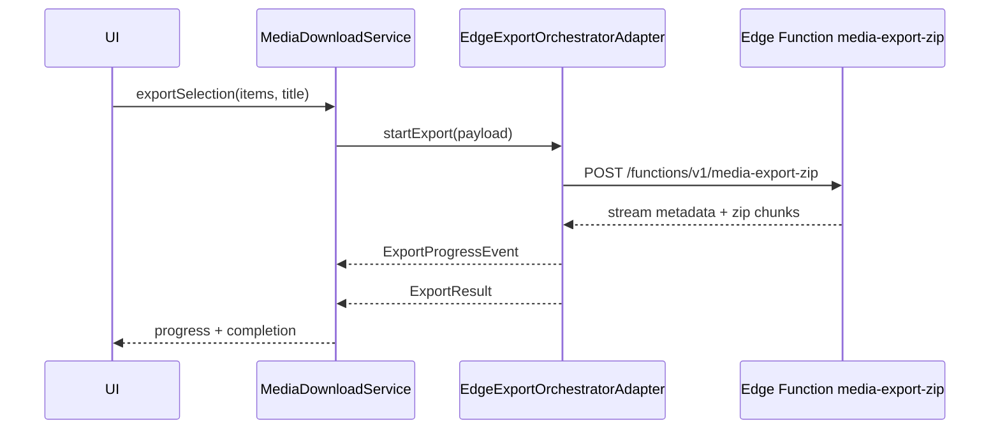

# Media Download Adapter - Edge Export Orchestrator

> Parent spec: [../media-download-service.md](../media-download-service.md)
> Related specs: [../../workspace/workspace-actions-bar.md](../../workspace/workspace-actions-bar.md), [../../action-context-matrix.md](../../action-context-matrix.md)

## What It Is

Edge Export Orchestrator adapter owns ZIP export request orchestration against an edge function and streams progress/result back to the client.

## What It Looks Like

Headless adapter. Client sends export payload once, edge function resolves binaries and streams archive chunks with progress metadata.

## Where It Lives

- Spec: `docs/element-specs/media-download/adapters/edge-export-orchestrator.adapter.md`
- Runtime target: `apps/web/src/app/core/media-download/adapters/edge-export-orchestrator.adapter.ts`
- Edge target: `supabase/functions/media-export-zip/index.ts`

## Actions & Interactions

| #   | Trigger                    | Adapter Response                             | Output           |
| --- | -------------------------- | -------------------------------------------- | ---------------- |
| 1   | Export invoked from UI     | POST export request to edge endpoint         | stream opened    |
| 2   | Edge emits stream metadata | Forward as `ExportProgressEvent`             | progress updates |
| 3   | Edge streams ZIP chunks    | Pipe to browser download stream              | binary output    |
| 4   | Edge partial failure       | Return structured failures with retryability | `ExportResult`   |
| 5   | Edge terminal failure      | Emit failed phase and terminal error         | `ExportResult`   |

## Component Hierarchy

```text
EdgeExportOrchestratorAdapter
├── RequestBuilder (ids/title/options)
├── EdgeClient (POST + stream reader)
├── ProgressMapper (stream metadata -> ExportProgressEvent)
├── ResultMapper (success/partial/failure)
└── BrowserDownloadSink
```

## Data Requirements



| Field                       | Type                  | Purpose                     |
| --------------------------- | --------------------- | --------------------------- | --------- | ---------- | --------- | ------- | ------------ |
| `ExportProgressEvent.phase` | `queued               | edge-started                | streaming | finalizing | completed | failed` | Stream state |
| `bytesStreamed`             | `number \| undefined` | Throughput display          |
| `itemsProcessed`            | `number \| undefined` | Item completion display     |
| `failures[]`                | structured entries    | Partial failure diagnostics |

## State

| Name            | Type                             | Default  | Controls           |
| --------------- | -------------------------------- | -------- | ------------------ |
| `phase`         | `ExportProgressEvent['phase']`   | `queued` | Export lifecycle   |
| `streamOpen`    | `boolean`                        | `false`  | Active stream flag |
| `terminalError` | `MediaDeliveryErrorCode \| null` | `null`   | Stop vs retry      |

## File Map

| File                                                                                | Purpose                             |
| ----------------------------------------------------------------------------------- | ----------------------------------- |
| `docs/element-specs/media-download/adapters/edge-export-orchestrator.adapter.md`    | Edge export adapter contract        |
| `apps/web/src/app/core/media-download/adapters/edge-export-orchestrator.adapter.ts` | New adapter file                    |
| `supabase/functions/media-export-zip/index.ts`                                      | Edge function implementation target |
| `apps/web/src/app/core/zip-export/zip-export.service.ts`                            | Previous client ZIP path (retired)  |

## Wiring

- Facade delegates all ZIP execution to this adapter.
- No ZIP assembly logic remains in UI components.
- Previous `ZipExportService` compatibility wrapper has been removed after consumer migration.

## Acceptance Criteria

- [ ] Export starts with one POST to edge endpoint.
- [ ] Progress is stream-based, not client loop based.
- [ ] Partial failures are surfaced without silent drops.
- [ ] Terminal failures return non-retryable error metadata.
- [x] Adapter replaced legacy ZipExportService without UI API break.
