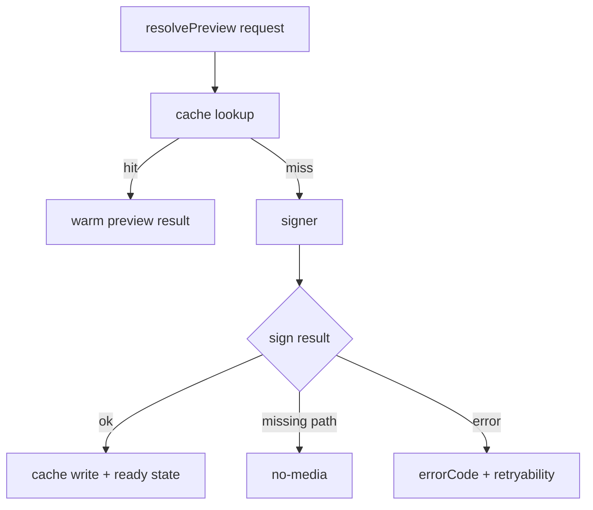

# Media Download Adapter - Signed URL Cache

> Parent spec: [../media-download-service.md](../media-download-service.md)
> Related specs: [../../media-marker/media-marker.md](../../media-marker/media-marker.md), [../../media-item.md](../../media-item.md), [../../media-detail/media-detail-media-viewer.md](../../media-detail/media-detail-media-viewer.md)

## What It Is

Signed URL Cache adapter owns URL signing, multi-tier cache lifecycle, state signaling, local blob injection, and staleness invalidation.

## What It Looks Like

Headless adapter with route-stable cache behavior. It supports warm preview reuse and terminal/transient error mapping with retryability metadata.

## Where It Lives

- Spec: `docs/element-specs/media-download/adapters/signed-url-cache.adapter.md`
- Runtime target: `apps/web/src/app/core/media-download/adapters/signed-url-cache.adapter.ts`
- Initial implementation source: `apps/web/src/app/core/photo-load.service.ts`

## Actions & Interactions

| #   | Trigger                                  | Adapter Response                             | Output                |
| --- | ---------------------------------------- | -------------------------------------------- | --------------------- |
| 1   | Preview request arrives                  | Lookup cache by mediaId+tier                 | warm hit or miss      |
| 2   | Miss                                     | Sign URL with bucket fallback                | signed URL or error   |
| 3   | Path missing                             | Return terminal no-media                     | `no-media`            |
| 4   | Blob injected from upload replace/attach | Set local URL for all tiers                  | immediate ready state |
| 5   | Local URL revoked                        | Clear blob and reset tier states             | idle/refetch path     |
| 6   | Staleness sweep                          | Clear outdated signed URLs, keep local blobs | cleared count         |

## Component Hierarchy

```text
SignedUrlCacheAdapter
├── CacheStore (mediaId:tier entries)
├── Signer (bucket fallback media -> images)
├── StateEmitter (signals + events)
├── LocalBlobBridge (inject/revoke)
└── StalenessPolicy
```

## Data Requirements



| Field        | Type                                                  | Purpose               |
| ------------ | ----------------------------------------------------- | --------------------- |
| `cacheKey`   | `${mediaId}:${tier}`                                  | Shared identity key   |
| `cacheEntry` | `{ url: string; signedAt: number; isLocal: boolean }` | URL lifecycle data    |
| `state`      | `MediaDeliveryItemState`                              | Consumer state source |
| `errorCode`  | `MediaDeliveryErrorCode`                              | Retry policy source   |

## State

| Name               | Type                                                  | Default     | Controls         |
| ------------------ | ----------------------------------------------------- | ----------- | ---------------- |
| `cache`            | `Map<string, CacheEntry>`                             | empty       | URL reuse        |
| `stateStore`       | `Map<string, WritableSignal<MediaDeliveryItemState>>` | empty       | Per-tier state   |
| `staleThresholdMs` | `number`                                              | `3_000_000` | Age invalidation |

## File Map

| File                                                                        | Purpose                           |
| --------------------------------------------------------------------------- | --------------------------------- |
| `docs/element-specs/media-download/adapters/signed-url-cache.adapter.md`    | Signed URL/cache adapter contract |
| `apps/web/src/app/core/media-download/adapters/signed-url-cache.adapter.ts` | New adapter file                  |
| `apps/web/src/app/core/photo-load.service.ts`                               | Source logic to migrate           |
| `apps/web/src/app/core/photo-load.model.ts`                                 | Source types to migrate/alias     |

## Wiring

- Adapter is called by facade only.
- Existing consumers are rerouted through facade while `PhotoLoadService` remains compatibility bridge.
- Error mapping sets `isRetryable` to drive terminal/transient transitions.

## Acceptance Criteria

- [ ] Cache namespace remains shared across map/workspace/media/detail.
- [ ] Local blob URLs are never stale-evicted.
- [ ] `no-media` is terminal for missing path.
- [ ] Retryability metadata is emitted with error results.
- [ ] Bucket fallback order remains `media` then `images`.
