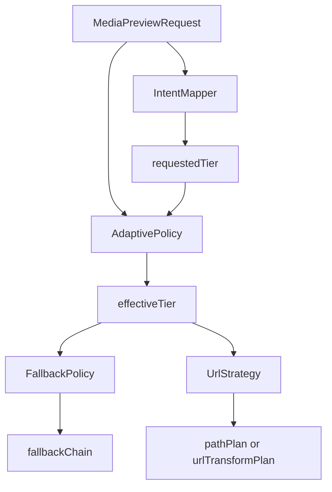

# Media Download Adapter - Tier Resolver

> Parent spec: [../media-download-service.md](../media-download-service.md)
> Related specs: [../../media-item.md](../../media-item.md), [../../item-grid.md](../../item-grid.md), [../../media-detail-media-viewer.md](../../media-detail-media-viewer.md)

## What It Is

Tier Resolver is the adapter contract that maps consumer size intent into a deterministic media tier and fallback chain. It owns all tier math so UI components pass intent, not resolution logic.

## What It Looks Like

Headless adapter. Consumers pass `desiredSize` and optional `boxPixels`; adapter returns stable tier decisions. It supports both static storage paths and dynamic transformation URLs to remain proxy-ready (for example Cloudinary/Imgix).

## Where It Lives

- Spec: `docs/element-specs/media-download/adapters/tier-resolver.adapter.md`
- Runtime target: `apps/web/src/app/core/media-download/adapters/tier-resolver.adapter.ts`
- Initial implementation source: `apps/web/src/app/core/media/media-orchestrator.service.ts`

## Actions & Interactions

| #   | Trigger                                | Adapter Response                          | Output             |
| --- | -------------------------------------- | ----------------------------------------- | ------------------ |
| 1   | Preview request includes `desiredSize` | Map desired size to baseline tier         | `requestedTier`    |
| 2   | `boxPixels` present                    | Apply adaptive clamp and context floor    | `effectiveTier`    |
| 3   | Requested tier unavailable             | Resolve deterministic fallback list       | `fallbackChain`    |
| 4   | Proxy mode enabled                     | Build dynamic transformation URL strategy | `urlTransformPlan` |
| 5   | Static mode enabled                    | Keep path-based signed URL strategy       | `pathPlan`         |

## Component Hierarchy

```text
TierResolverAdapter
├── IntentMapper (desiredSize -> requestedTier)
├── AdaptivePolicy (boxPixels/context -> effectiveTier)
├── FallbackPolicy (effectiveTier -> fallbackChain)
└── UrlStrategy
    ├── StaticPathStrategy
    └── DynamicTransformStrategy
```

## Data Requirements



| Field              | Type                                             | Purpose                        |
| ------------------ | ------------------------------------------------ | ------------------------------ |
| `desiredSize`      | `'marker' \| 'thumb' \| 'detail' \| 'full'`      | UI size intent                 |
| `boxPixels`        | `{ width: number; height: number } \| undefined` | Optional adaptive input        |
| `context`          | `'map' \| 'grid' \| 'upload' \| 'detail'`        | Floor policy selector          |
| `requestedTier`    | `MediaTier`                                      | Baseline target                |
| `effectiveTier`    | `MediaTier`                                      | Resolved target                |
| `fallbackChain`    | `readonly MediaTier[]`                           | Downgrade order                |
| `urlTransformPlan` | `{ width?: number; quality?: number } \| null`   | Proxy-ready transform contract |

## State

| Name           | Type                                   | Default          | Controls                |
| -------------- | -------------------------------------- | ---------------- | ----------------------- |
| `contextFloor` | `Record<MediaContext, MediaTier>`      | service constant | Minimum tier by context |
| `tierOrder`    | `readonly MediaTier[]`                 | service constant | Ranking and clamp       |
| `strategyMode` | `'static-path' \| 'dynamic-transform'` | `'static-path'`  | URL strategy backend    |

## File Map

| File                                                                     | Purpose                 |
| ------------------------------------------------------------------------ | ----------------------- |
| `docs/element-specs/media-download/adapters/tier-resolver.adapter.md`    | Tier adapter contract   |
| `apps/web/src/app/core/media-download/adapters/tier-resolver.adapter.ts` | New adapter file        |
| `apps/web/src/app/core/media/media-orchestrator.service.ts`              | Source logic to migrate |
| `apps/web/src/app/core/media/media-renderer.types.ts`                    | Shared tier types       |

## Wiring

- Called only by `MediaDownloadService` facade.
- No component may call tier internals directly once migration is complete.
- Adapter exposes deterministic API for both static signed URL paths and dynamic transformation URL providers.

## Acceptance Criteria

- [ ] UI passes only `desiredSize` and optional `boxPixels`.
- [ ] Adapter returns deterministic `effectiveTier` + `fallbackChain`.
- [ ] Context floors remain centralized in adapter.
- [ ] Dynamic transformation URL mode can be enabled without consumer API changes.
- [ ] No tier math remains in consumer components.
