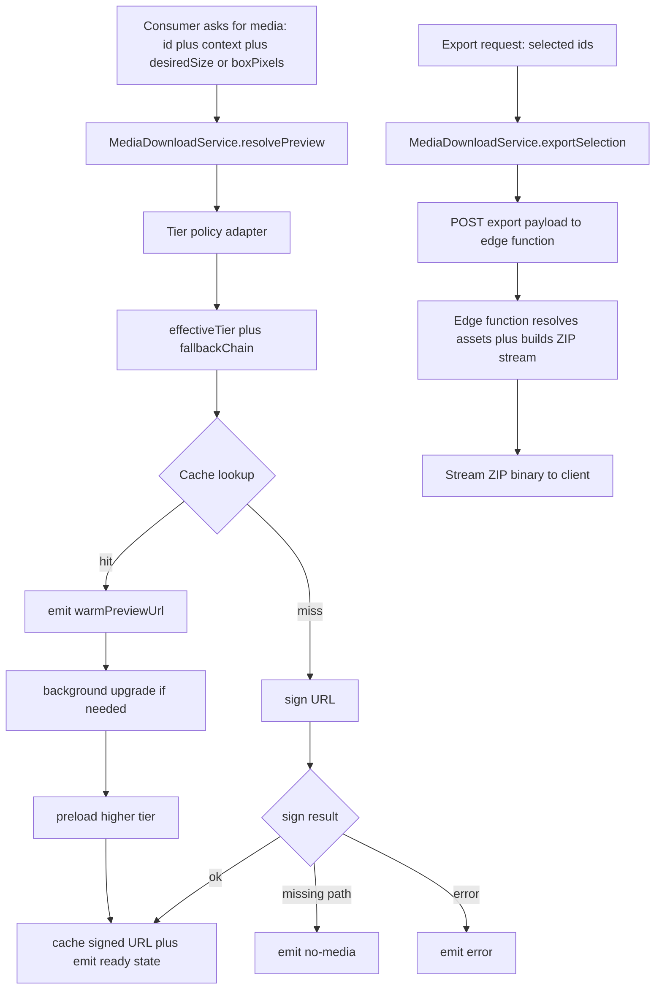
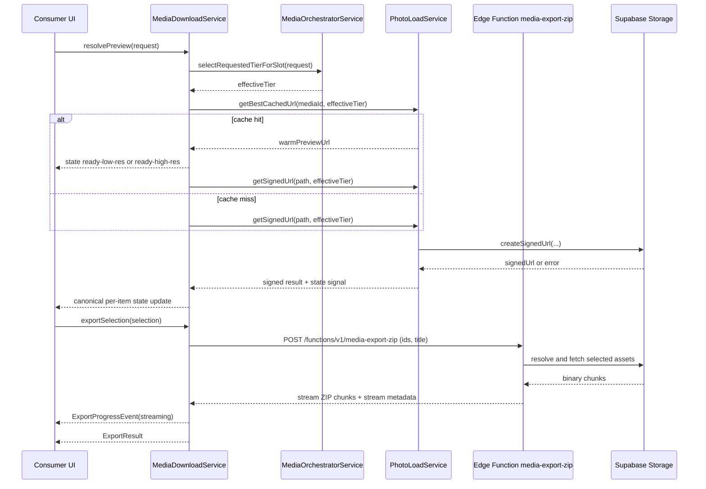
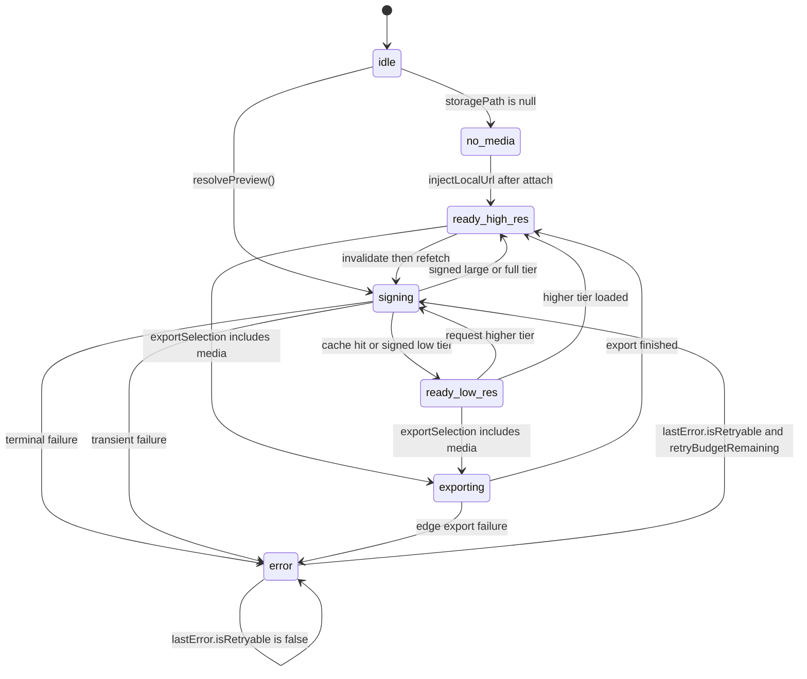

# Media Download Service

> Related specs: [item-grid](../item-grid.md), [media-item](../media-item.md), [media-detail-media-viewer](../media-detail-media-viewer.md), [workspace-export-bar](../workspace-export-bar.md), [upload-manager](../upload-manager.md), [action-context-matrix](../action-context-matrix.md)
> Adapter sub-specs: [tier-resolver.adapter](adapters/tier-resolver.adapter.md), [signed-url-cache.adapter](adapters/signed-url-cache.adapter.md), [edge-export-orchestrator.adapter](adapters/edge-export-orchestrator.adapter.md)

## What It Is

Media Download Service is the unified facade contract for all media retrieval concerns: signed URL loading, high/low-resolution tier selection, cache reuse, preloading, binary download, edge-orchestrated ZIP export, and canonical error signaling.
It consolidates responsibilities currently split across `PhotoLoadService`, `MediaOrchestratorService`, `ZipExportService`, and direct download helper methods so every media consumer follows one deterministic pipeline, while adapter implementation details are delegated to dedicated adapter specs.

## What It Looks Like

This is not a visual component. Its visible impact is consistency across map marker previews, workspace thumbnails, media detail hero, `/media` cards, upload replacement previews, and ZIP export flow. The same media can appear instantly as a warm cached preview on one surface after it was loaded on another surface, then upgrade in place to the requested tier without layout shift. Error handling is uniform: missing path resolves to no-media, signing/fetch failures resolve to explicit error states, and export errors expose retry-safe outcomes. High-resolution fetch is always demand-driven and never blocks first render when a lower cached tier exists.

## Where It Lives

- Contract doc: `docs/element-specs/media-download/media-download-service.md`
- Runtime ownership target (service facade + adapters):
  - `apps/web/src/app/core/media-download/media-download.service.ts` (target facade)
  - `apps/web/src/app/core/photo-load.service.ts` (existing signed-url/cache backend)
  - `docs/archive/code-legacy/2026-04-04-media-download-symmetry/media-orchestrator.service.legacy.ts` (legacy tier policy snapshot)
  - `docs/archive/code-legacy/2026-04-04-media-download-symmetry/zip-export.service.legacy.ts` (legacy export snapshot)
  - `supabase/functions/media-export-zip/index.ts` (target edge export orchestrator)
- Adapter spec split:
  - `docs/element-specs/media-download/adapters/tier-resolver.adapter.md`
  - `docs/element-specs/media-download/adapters/signed-url-cache.adapter.md`
  - `docs/element-specs/media-download/adapters/edge-export-orchestrator.adapter.md`
- Scope: root singleton (`providedIn: 'root'`) with route-stable cache behavior
- Trigger: any change to media loading policy, tier/fallback behavior, cache TTL, download semantics, or export retrieval

## Adapter Decomposition

| Adapter                  | Spec                                                                             | Primary ownership                                                                 |
| ------------------------ | -------------------------------------------------------------------------------- | --------------------------------------------------------------------------------- |
| Tier Resolver            | `docs/element-specs/media-download/adapters/tier-resolver.adapter.md`            | desiredSize/boxPixels mapping, tier selection, fallback order, proxy URL strategy |
| Signed URL Cache         | `docs/element-specs/media-download/adapters/signed-url-cache.adapter.md`         | signing, cache lifecycle, no-media/error state mapping, blob bridge               |
| Edge Export Orchestrator | `docs/element-specs/media-download/adapters/edge-export-orchestrator.adapter.md` | edge POST orchestration, stream progress mapping, export result contract          |

## Phase 1 - Inventory and Audit

### Existing Spec Coverage Audit

| Existing spec                                       | Covered concern                                                 | Target adapter or facade ownership            | Decision                                     |
| --------------------------------------------------- | --------------------------------------------------------------- | --------------------------------------------- | -------------------------------------------- |
| `docs/element-specs/item-grid.md`                   | Cross-surface preview consistency and tier/fallback consumption | Facade + Tier Resolver                        | Keep, reference new parent                   |
| `docs/element-specs/media-item.md`                  | `/media` preview state mapping and tier usage                   | Facade + Signed URL Cache                     | Keep, reference new parent                   |
| `docs/element-specs/media-detail-media-viewer.md`   | Detail progressive loading and shared cache contract            | Facade + Signed URL Cache                     | Keep, reference new parent                   |
| `docs/element-specs/photo-marker.md`                | Marker preview loading runtime dependency                       | Facade + Signed URL Cache                     | Keep, point to runtime file/service boundary |
| `docs/element-specs/workspace-export-bar.md`        | Export trigger behavior and UX expectations                     | Facade + Edge Export Orchestrator             | Keep, consume edge export contract           |
| `docs/element-specs/upload-manager.md`              | Upload attach/replace blob bridge into media retrieval          | Facade + Signed URL Cache                     | Keep, reference new parent                   |
| `docs/element-specs/upload-panel.md`                | Upload area file actions and integration context                | Facade + Signed URL Cache                     | Keep, reference new parent                   |
| `docs/element-specs/file-type-chips.md`             | Upload area architecture parent linkage                         | Facade                                        | Keep, reference new parent                   |
| `docs/element-specs/media-delivery-orchestrator.md` | Legacy combined tier+delivery policy contract                   | Replaced by facade + adapter split            | Archive as deprecated                        |
| `docs/element-specs/photo-load-service.md`          | Legacy signed URL/cache headless contract                       | Replaced by signed-url-cache adapter contract | Archive as deprecated                        |

### Affected Code Audit (Migration Scope)

| Current file                                                                                            | Concern                               | Target destination or integration path           |
| ------------------------------------------------------------------------------------------------------- | ------------------------------------- | ------------------------------------------------ |
| `apps/web/src/app/core/photo-load.service.ts`                                                           | Signed URL, cache, load states        | Signed URL Cache adapter behind facade           |
| `docs/archive/code-legacy/2026-04-04-media-download-symmetry/media-orchestrator.service.legacy.ts`      | Former tier and fallback policy       | Tier Resolver adapter behind facade              |
| `docs/archive/code-legacy/2026-04-04-media-download-symmetry/zip-export.service.legacy.ts`              | Former client ZIP orchestration       | Edge Export Orchestrator adapter + edge function |
| `docs/archive/code-legacy/2026-04-04-media-download-symmetry/zip-export.helpers.legacy.ts`              | Former ZIP helper ownership           | Media-download helper ownership                  |
| `apps/web/src/app/core/upload/upload.service.ts`                                                        | Direct download/sign helpers          | Facade delegation and API consolidation          |
| `apps/web/src/app/core/workspace-view.service.ts`                                                       | Batch preview signing consumer        | Facade `resolveBatchPreviews` integration        |
| `apps/web/src/app/features/map/map-shell/map-shell.component.ts`                                        | Marker preview and staleness consumer | Facade preview + staleness calls                 |
| `apps/web/src/app/features/media/media-item.component.ts`                                               | Grid preview consumer                 | Facade preview and state binding                 |
| `apps/web/src/app/features/map/workspace-pane/media-detail-view.component.ts`                           | Detail thumb/full preview consumer    | Facade preview/state calls                       |
| `apps/web/src/app/features/map/workspace-pane/thumbnail-grid.component.ts`                              | ZIP export trigger                    | Facade edge export call                          |
| `apps/web/src/app/features/map/workspace-pane/workspace-pane-footer/workspace-pane-footer.component.ts` | ZIP export dialog trigger             | Facade edge export call                          |
| `apps/web/src/app/features/upload/upload-panel-job-file-actions.service.ts`                             | Single-file download action           | Facade download API                              |

## Phase 2 - Spec Restructure and Archive Status

| Work item                             | Status | Result                                                                                                 |
| ------------------------------------- | ------ | ------------------------------------------------------------------------------------------------------ |
| Create canonical facade spec          | Done   | `docs/element-specs/media-download/media-download-service.md` is active parent contract                |
| Split adapter sub-specs               | Done   | `tier-resolver.adapter.md`, `signed-url-cache.adapter.md`, `edge-export-orchestrator.adapter.md` added |
| Retarget active cross-spec references | Done   | Active consumers now reference media-download-service as parent contract                               |
| Archive legacy orchestrator spec      | Done   | Archived at `docs/archive/element-specs-legacy/media-delivery-orchestrator.md` with DEPRECATED banner  |
| Archive legacy photo-load spec        | Done   | Archived at `docs/archive/element-specs-legacy/photo-load-service.md` with DEPRECATED banner           |

## Actions & Interactions

| #   | User/System Trigger                                  | System Response                                                   | Output Contract                                |
| --- | ---------------------------------------------------- | ----------------------------------------------------------------- | ---------------------------------------------- |
| 1   | Any surface requests media preview by media identity | Resolve desired size input through internal tier policy           | `effectiveTier`                                |
| 2   | Cache contains matching or lower tier                | Return warm cached URL immediately                                | `warmPreviewUrl`                               |
| 3   | Requested tier is not cached                         | Start signing for deterministic best path                         | item state `signing`                           |
| 4   | Signed URL is returned                               | Emit ready state and cache entry                                  | item state `ready-low-res` or `ready-high-res` |
| 5   | Signed URL fetch/preload fails                       | Emit canonical error with reason code                             | item state `error`                             |
| 6   | Storage path is missing/null                         | Emit no-media immediately, no network call                        | item state `no-media`                          |
| 7   | Upload attach/replace emits local blob URL           | Inject local URL to all tiers and mark ready                      | item state `ready-high-res`                    |
| 8   | Local blob is superseded by persisted storage path   | Re-sign in background and revoke object URL                       | item state remains ready                       |
| 9   | Surface requests full-res while low-res is visible   | Keep low-res visible, fetch full-res async, then upgrade in place | state `ready-low-res` -> `ready-high-res`      |
| 10  | User triggers single-file download                   | Resolve signed URL and fetch blob with retry policy               | `DownloadBlobResult`                           |
| 11  | User triggers ZIP export                             | Send POST to edge export orchestrator and stream ZIP response     | `ExportProgressEvent` (stream phases)          |
| 12  | Edge export fails partially                          | Emit partial-failure summary with retryability metadata           | `ExportResult` with failures                   |
| 13  | Route changes between map/workspace/media/detail     | Keep cache namespace stable, avoid forced cache reset             | route-stable cache                             |
| 14  | Staleness sweep runs                                 | Remove stale signed URLs, preserve local object URLs              | cleared entry count                            |
| 15  | Consumer subscribes to item state stream             | Receive deterministic transitions and terminal outcomes           | `MediaDeliveryStateChangedEvent`               |

## Component Hierarchy

```text
MediaDownloadServiceContract
├── MediaDownloadService (pure facade only)
│   ├── TierResolver adapter (existing MediaOrchestratorService; static path + dynamic transformation URL strategy)
│   ├── SignedUrlCache adapter (existing PhotoLoadService)
│   ├── BinaryDownload adapter (storage fetch/download)
│   ├── EdgeExportOrchestrator adapter (edge function POST + stream)
│   └── StateStore (per-media identity + tier)
├── Consumer surfaces
│   ├── Map marker preview flow
│   ├── Workspace selected-items grid
│   ├── Media page item grid
│   ├── Media detail viewer and lightbox
│   ├── Upload replace/attach instant preview bridge
│   └── Workspace export actions (ZIP)
└── External boundary
  ├── Supabase Storage signed URL + download APIs
  ├── Edge Function ZIP stream endpoint
  └── Future image proxy URL transformers (Cloudinary/Imgix-compatible)
```

## Data Requirements

### Data Flow (Mermaid)



### Wiring Sequence (Mermaid)



### Service Interfaces (Contract)

| Interface                                   | Signature                                                                                                                                                                                                                                     | Purpose                                                                |
| ------------------------------------------- | --------------------------------------------------------------------------------------------------------------------------------------------------------------------------------------------------------------------------------------------- | ---------------------------------------------------------------------- |
| `MediaPreviewRequest`                       | `{ mediaId: string; storagePath: string \| null; thumbnailPath?: string \| null; desiredSize?: 'marker' \| 'thumb' \| 'detail' \| 'full'; boxPixels?: { width: number; height: number }; context: 'map' \| 'grid' \| 'upload' \| 'detail'; }` | Single deterministic preview request contract with UI-decoupled sizing |
| `MediaPreviewResult`                        | `{ url: string \| null; resolvedTier: 'inline' \| 'small' \| 'mid' \| 'mid2' \| 'large' \| 'full' \| null; source: 'cache' \| 'signed' \| 'local' \| 'none'; state: MediaDeliveryItemState; errorCode?: MediaDeliveryErrorCode; }`            | Consumer-facing preview outcome                                        |
| `MediaDownloadService.resolvePreview`       | `(request: MediaPreviewRequest) => Promise<MediaPreviewResult>`                                                                                                                                                                               | Main preview retrieval method                                          |
| `MediaDownloadService.resolveBatchPreviews` | `(requests: MediaPreviewRequest[]) => Promise<Map<string, MediaPreviewResult>>`                                                                                                                                                               | Batch preload/sign for visible collections                             |
| `MediaDownloadService.getItemState`         | `(mediaId: string, tier: 'inline' \| 'small' \| 'mid' \| 'mid2' \| 'large' \| 'full') => WritableSignal<MediaDeliveryItemState>`                                                                                                              | Per-item state signal API                                              |
| `MediaDownloadService.invalidate`           | `(mediaId: string) => void`                                                                                                                                                                                                                   | Drop all cached tiers for identity                                     |
| `MediaDownloadService.invalidateStale`      | `(maxAgeMs?: number) => number`                                                                                                                                                                                                               | Stale sweep policy                                                     |
| `MediaDownloadService.injectLocalUrl`       | `(mediaId: string, blobUrl: string) => void`                                                                                                                                                                                                  | Attach/replace instant preview path                                    |
| `MediaDownloadService.revokeLocalUrl`       | `(mediaId: string) => void`                                                                                                                                                                                                                   | Memory-safe blob cleanup                                               |
| `MediaDownloadService.downloadBlob`         | `(storagePath: string) => Promise<{ ok: true; blob: Blob } \| { ok: false; errorCode: MediaDeliveryErrorCode; message: string }>`                                                                                                             | Single media binary download                                           |
| `ExportProgressEvent`                       | `{ phase: 'queued' \| 'edge-started' \| 'streaming' \| 'finalizing' \| 'completed' \| 'failed'; bytesStreamed?: number; totalBytesHint?: number; itemsProcessed?: number; itemsTotal?: number; }`                                             | Server-stream status event model                                       |
| `MediaDownloadService.exportSelection`      | `(items: WorkspaceMedia[], title: string, onProgress?: (event: ExportProgressEvent) => void) => Promise<ExportResult>`                                                                                                                        | ZIP/export orchestration via edge stream                               |

### Data Sources and Dependencies

| Artifact              | Source                                                  | Type                                             | Purpose                                          |
| --------------------- | ------------------------------------------------------- | ------------------------------------------------ | ------------------------------------------------ |
| `storage_path`        | `media_items.storage_path`                              | `string \| null`                                 | Original media storage object path               |
| `thumbnail_path`      | media projection model                                  | `string \| null`                                 | Pre-generated thumbnail path if available        |
| `desiredSize`         | consumer input                                          | `'marker' \| 'thumb' \| 'detail' \| 'full'`      | UI intent without tier math leakage              |
| `boxPixels`           | consumer measurement                                    | `{ width: number; height: number } \| undefined` | Optional geometry hint in px for adaptive policy |
| Signed URL rows       | Supabase Storage `createSignedUrl` / `createSignedUrls` | remote API result                                | Time-limited render/download URL                 |
| Dynamic transform URL | tier resolver adapter                                   | `string \| null`                                 | Proxy-compatible URL strategy (`?w=...&q=...`)   |
| Cached entry          | in-memory cache key `${mediaId}:${tier}`                | `{ url; signedAt; isLocal }`                     | Cross-surface reuse and staleness control        |
| Export selection      | workspace selection service                             | `WorkspaceMedia[]`                               | Export input set                                 |
| Edge export endpoint  | edge function API                                       | `POST` stream response                           | Server-side ZIP assembly and streaming           |
| File naming metadata  | media metadata + helper util                            | `string`                                         | ZIP filename normalization                       |

## State

### Canonical Per-Media State

| State            | Type                     | Default | Controls                                 |
| ---------------- | ------------------------ | ------- | ---------------------------------------- |
| `idle`           | `MediaDeliveryItemState` | `idle`  | No retrieval started                     |
| `signing`        | `MediaDeliveryItemState` | -       | Signed URL request active                |
| `downloading`    | `MediaDeliveryItemState` | -       | Binary transfer active                   |
| `ready-low-res`  | `MediaDeliveryItemState` | -       | Inline/small/mid tier ready for display  |
| `ready-high-res` | `MediaDeliveryItemState` | -       | Large/full tier ready for display        |
| `exporting`      | `MediaDeliveryItemState` | -       | Item is in active export pipeline        |
| `error`          | `MediaDeliveryItemState` | -       | Retrieval failed with mapped error code  |
| `no-media`       | `MediaDeliveryItemState` | -       | Missing storage path, terminal non-error |

### State Type Contract

- `MediaDeliveryItemState = 'idle' | 'signing' | 'downloading' | 'ready-low-res' | 'ready-high-res' | 'exporting' | 'error' | 'no-media'`
- `MediaDeliveryErrorCode = { code: 'auth' | 'forbidden' | 'not-found' | 'sign-failed' | 'fetch-failed' | 'timeout' | 'rate-limited' | 'unknown'; isRetryable: boolean }`

### Retryability Policy

| Error code                               | isRetryable       | Behavior                                                                  |
| ---------------------------------------- | ----------------- | ------------------------------------------------------------------------- |
| `forbidden`, `not-found`, `auth`         | `false`           | Terminal: enter `error` and stay there until explicit user retry          |
| `timeout`, `rate-limited`                | `true`            | Transient: follow `error -> signing` retry loop with bounded retry budget |
| `sign-failed`, `fetch-failed`, `unknown` | context-dependent | Retryable when classified as transient transport/backend failure          |

### State Machine (Mermaid)



## File Map

| File                                                                                                    | Purpose                                                                             |
| ------------------------------------------------------------------------------------------------------- | ----------------------------------------------------------------------------------- |
| `docs/element-specs/media-download/media-download-service.md`                                           | Canonical unified contract for media loading/download/export/caching/error handling |
| `apps/web/src/app/core/photo-load.service.ts`                                                           | Existing signed URL and cache backend to be adapted behind unified facade           |
| `docs/archive/code-legacy/2026-04-04-media-download-symmetry/media-orchestrator.service.legacy.ts`      | Legacy tier policy snapshot retained for traceability                               |
| `docs/archive/code-legacy/2026-04-04-media-download-symmetry/zip-export.service.legacy.ts`              | Legacy export snapshot retained for traceability                                    |
| `supabase/functions/media-export-zip/index.ts`                                                          | Target edge orchestrator for ZIP assembly and streaming                             |
| `apps/web/src/app/core/upload/upload.service.ts`                                                        | Existing direct download method to be re-routed through unified service contract    |
| `apps/web/src/app/core/workspace-view.service.ts`                                                       | Existing batch thumbnail signing consumer                                           |
| `apps/web/src/app/features/map/map-shell/map-shell.component.ts`                                        | Existing marker signing and preload consumer                                        |
| `apps/web/src/app/features/media/media-item.component.ts`                                               | Existing `/media` preview consumer                                                  |
| `apps/web/src/app/features/map/workspace-pane/media-detail-view.component.ts`                           | Existing detail preview consumer                                                    |
| `apps/web/src/app/features/map/workspace-pane/thumbnail-grid.component.ts`                              | Existing ZIP export trigger consumer                                                |
| `apps/web/src/app/features/map/workspace-pane/workspace-pane-footer/workspace-pane-footer.component.ts` | Existing ZIP export dialog and trigger consumer                                     |
| `apps/web/src/app/core/photo-load.model.ts`                                                             | Existing state and event types to evolve toward unified item state vocabulary       |
| `apps/web/src/app/core/media-download/media-download.service.spec.ts`                                   | Target unified contract tests (new)                                                 |

## Phase 3 - Migration Ledger

## Implementation Tracking

| Current File Name                                                                                       | Target File Name / Target Location                                                                                                                                                                                                                  | Migration Status | Breaking Changes                                                                                                 |
| ------------------------------------------------------------------------------------------------------- | --------------------------------------------------------------------------------------------------------------------------------------------------------------------------------------------------------------------------------------------------- | ---------------- | ---------------------------------------------------------------------------------------------------------------- |
| `(new)` `apps/web/src/app/core/media-download/media-download.service.ts`                                | `apps/web/src/app/core/media-download/media-download.service.ts` (facade bridge phase)                                                                                                                                                              | Done             | New facade exists and bridges to legacy services; consumer imports remain unchanged in this phase                |
| `apps/web/src/app/core/photo-load.service.ts`                                                           | `apps/web/src/app/core/media-download/adapters/signed-url-cache.adapter.ts` + `docs/archive/code-legacy/2026-04-04-media-download-symmetry/photo-load.service.legacy.ts`                                                                            | ARCHIVED         | `PhotoLoadService` remains as thin deprecated compatibility wrapper; full legacy implementation moved to archive |
| `apps/web/src/app/core/photo-load.model.ts`                                                             | `apps/web/src/app/core/media-download/media-download.types.ts` (shared module contracts)                                                                                                                                                            | In Progress      | `MediaDelivery*` facade types introduced; alias extraction into module types still pending                       |
| `apps/web/src/app/core/media/media-orchestrator.service.ts`                                             | `apps/web/src/app/core/media-download/adapters/tier-resolver.adapter.ts` + `docs/archive/code-legacy/2026-04-04-media-download-symmetry/media-orchestrator.service.legacy.ts`                                                                       | ARCHIVED         | Deprecated compatibility wrapper removed after all runtime consumers were migrated                               |
| `apps/web/src/app/core/media/media-renderer.types.ts`                                                   | `apps/web/src/app/core/media-download/media-download.types.ts` (shared module contracts)                                                                                                                                                            | Pending          | `MediaTier` ownership shifts; exports kept via barrel during transition                                          |
| `apps/web/src/app/core/zip-export/zip-export.service.ts`                                                | `apps/web/src/app/core/media-download/adapters/edge-export-orchestrator.adapter.ts` (client) + `docs/archive/code-legacy/2026-04-04-media-download-symmetry/zip-export.service.legacy.ts` + `supabase/functions/media-export-zip/index.ts` (server) | ARCHIVED         | Deprecated compatibility wrapper removed after all runtime consumers were migrated                               |
| `apps/web/src/app/core/zip-export/zip-export.helpers.ts`                                                | `apps/web/src/app/core/media-download/media-download.helpers.ts` (shared module helpers)                                                                                                                                                            | ARCHIVED         | Helper ownership shifted into media-download module and legacy helper snapshot archived                          |
| `apps/web/src/app/core/upload/upload.service.ts` (`getSignedUrl`, `downloadFile`)                       | `apps/web/src/app/core/media-download/media-download.service.ts` facade delegation                                                                                                                                                                  | Pending          | Upload service methods become pass-through and later removable from public upload API                            |
| `apps/web/src/app/core/workspace-view.service.ts`                                                       | Facade calls (`batchSign`, `getSignedUrl`)                                                                                                                                                                                                          | Done             | Direct typed dependency now points to `MediaDownloadService`                                                     |
| `apps/web/src/app/features/map/map-shell/map-shell.component.ts`                                        | Facade calls (`getSignedUrl`, `invalidateStale`, `preload`)                                                                                                                                                                                         | Done             | Direct typed dependency now points to `MediaDownloadService`                                                     |
| `apps/web/src/app/features/media/media-item.component.ts`                                               | Facade calls (`getLoadState`, `getSignedUrl`, tier/file-type helpers)                                                                                                                                                                               | Done             | Direct typed dependencies now point to `MediaDownloadService`                                                    |
| `apps/web/src/app/features/map/workspace-pane/media-detail-view.component.ts`                           | Facade calls for thumb/full + state                                                                                                                                                                                                                 | Done             | Detail flow now uses unified facade dependency                                                                   |
| `apps/web/src/app/features/map/workspace-pane/media-detail-data.facade.ts`                              | Facade calls for thumb/full signing                                                                                                                                                                                                                 | Done             | Direct typed dependency now points to `MediaDownloadService`                                                     |
| `apps/web/src/app/features/map/workspace-pane/thumbnail-grid.component.ts`                              | Facade edge export call                                                                                                                                                                                                                             | Done             | `ZipExportService` dependency removed                                                                            |
| `apps/web/src/app/features/map/workspace-pane/workspace-pane-footer/workspace-pane-footer.component.ts` | Facade edge export call                                                                                                                                                                                                                             | Done             | `ZipExportService` dependency removed                                                                            |
| `apps/web/src/app/features/upload/upload-panel-job-file-actions.service.ts`                             | Facade single-file download call                                                                                                                                                                                                                    | Pending          | `uploadService.downloadFile` replaced by unified media download API                                              |

## Wiring

The unified service is an orchestration boundary only; consumers must not call Supabase Storage directly for signed URL retrieval or media downloads.

MediaDownloadService is a pure facade. It must contain orchestration and contract mapping only.

- Consumers ask only the unified contract for preview/download/export operations.
- Tier policy stays in one place (tier resolver adapter), never duplicated per component or in facade internals.
- Signed URL and cache policy stay in one place (signed-url/cache adapter), never duplicated per component or in facade internals.
- Binary fetch and stream handling stay in dedicated download/export adapters, never in facade internals.
- Export retrieval is edge-orchestrated and uses the same error taxonomy as preview retrieval.
- Consumer UI state mappings remain local, but source states must come from this contract.
- Tier resolver may emit static bucket paths or dynamic transformation URLs (`?w=...&q=...`) so storage backends can be swapped without consumer API changes.

## Phase 4 - Practical Refactoring Instructions

## Refactoring Instructions

1. Create facade and adapter files first while keeping existing services intact.
2. Introduce compatibility wrappers:

- `PhotoLoadService` delegates internally to signed-url-cache adapter.
- `MediaOrchestratorService` delegates to tier-resolver adapter.
- `ZipExportService` delegates to edge-export-orchestrator adapter where available.

3. Re-route consumers incrementally by feature slice (map -> media grid -> detail -> export UI -> upload file actions).
4. After each slice, run `get_errors()` and `ng build` before continuing.
5. Only when all call sites use facade APIs, mark legacy service classes as deprecated in code and remove direct imports.
6. Final cleanup:

- remove dead helper methods,
- collapse compatibility aliases,
- update tests to target facade + adapter boundaries.

## Acceptance Criteria

- [ ] There is exactly one documented canonical contract for media loading, download, export, and caching: this spec.
- [ ] The unified contract explicitly covers all four existing concerns: tier policy, signing/cache, binary download, ZIP export.
- [ ] ZIP export orchestration is edge-first (POST plus streaming response), not client-side ZIP assembly.
- [ ] The contract defines deterministic fallback order for all tiers from `full` down to `inline`.
- [ ] The contract defines route-stable cache behavior and forbids blanket route-change cache resets.
- [ ] The contract defines missing-path handling as `no-media` without network request.
- [ ] The contract defines canonical signing failure handling as `error` with mapped `MediaDeliveryErrorCode`.
- [ ] `MediaDeliveryErrorCode` includes `isRetryable: boolean` and drives retry behavior.
- [ ] Terminal errors (`forbidden`, `not-found`, `auth`) enter `error` and do not auto-loop.
- [ ] Transient errors (`timeout`, `rate-limited`) follow `error -> signing` retry loop with bounded retries.
- [ ] The contract defines warm-preview behavior when low tier is cached and high tier is requested.
- [ ] The contract defines background high-tier upgrade without layout ownership changes.
- [ ] The contract defines local blob injection for attach/replace and explicit local blob revocation.
- [ ] The contract defines stale sweep semantics and excludes local blob URLs from age-based eviction.
- [ ] The contract defines a strict per-media state type (`MediaDeliveryItemState`) with explicit values.
- [ ] The contract defines `MediaDeliveryErrorCode` values and their usage scope.
- [ ] `MediaPreviewRequest` interface is fully specified and only exposes `desiredSize` and/or `boxPixels` for size intent.
- [ ] `MediaPreviewResult` interface is fully specified and exposes source + resolved tier + state.
- [ ] The contract includes a signal-based state API for per-media state observation.
- [ ] The contract includes batch preview retrieval for list/grid performance.
- [ ] The contract includes single-file download API and ZIP export API under one boundary.
- [ ] The contract requires identical bucket fallback order (`media` then `images`) for preview and export retrieval.
- [ ] `ExportProgressEvent` models edge stream phases (`queued`, `edge-started`, `streaming`, `finalizing`, `completed`, `failed`).
- [ ] Consumers listed in File Map cover all current runtime preview and export callers.
- [ ] Map marker preview flow is listed as a first-class consumer.
- [ ] Workspace selected-items flow is listed as a first-class consumer.
- [ ] `/media` grid flow is listed as a first-class consumer.
- [ ] Media detail viewer flow is listed as a first-class consumer.
- [ ] Workspace export footer and selected-items ZIP actions are listed as first-class consumers.
- [ ] Upload attach/replace preview path is listed as first-class integration.
- [x] The spec includes at least two Mermaid diagrams: one data flow and one wiring sequence.
- [ ] The spec provides explicit transition behavior for `ready-low-res -> ready-high-res`.
- [ ] The spec provides explicit retry path `error -> signing`.
- [ ] The spec provides explicit `no-media -> ready-high-res` transition after attach.
- [ ] Export partial-failure behavior is explicitly modeled as non-silent outcome.
- [x] Wiring explicitly states that MediaDownloadService is a pure facade and forbids adapter logic duplication in facade file.
- [x] Tier resolver contract explicitly allows dynamic transformation URLs for image-proxy migration without breaking consumers.
- [x] This spec is referenced as architecture parent from media delivery consumers.
- [x] Legacy `media-delivery-orchestrator.md` is archived after this spec is introduced.
- [x] Legacy archived `photo-load-service.md` remains archived and is treated as historical reference only.
- [x] Active docs no longer point to `media-delivery-orchestrator.md` as canonical parent.
- [x] Spec and implementation blueprints reference this contract as active replacement.
