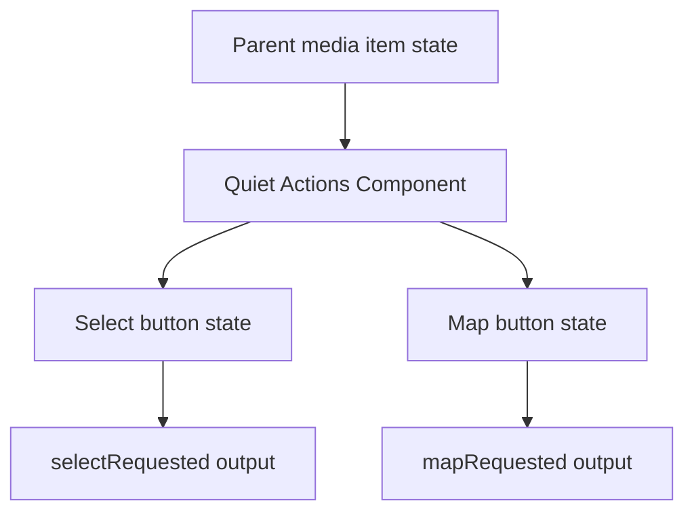
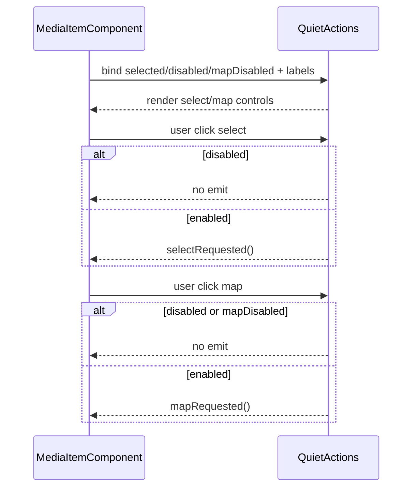

# Media Item Quiet Actions

## What It Is

Media Item Quiet Actions is the corner-action presenter for media item selection and map-jump affordances. It is an overlay-layer control surface that reveals via parent hover/focus logic.

## What It Looks Like

The component exposes two compact icon-only buttons: select (top-left) and map (top-right). The select control can show active selected styling and check icon. The map control uses the same small action style and supports disabled state when no location is available. Buttons support keyboard focus-visible outlines and are rendered within the media-frame action layer. Visual values use token-based spacing and colors.

## Where It Lives

- Component root: `apps/web/src/app/features/media/media-item-quiet-actions.component.ts`
- Used by: `MediaItemComponent`
- Trigger: always rendered as action layer; visibility controlled by parent state selectors

## Actions

| #   | User Action / System Trigger  | System Response                                         | Trigger             |
| --- | ----------------------------- | ------------------------------------------------------- | ------------------- |
| 1   | User clicks select action     | Emits `selectRequested` if not disabled                 | select button click |
| 2   | User clicks map action        | Emits `mapRequested` if not disabled and map is enabled | map button click    |
| 3   | Item is selected              | Select button receives active selected style            | `selected=true`     |
| 4   | Map action disabled           | Map button is disabled and non-interactive              | `mapDisabled=true`  |
| 5   | Keyboard focus enters actions | Focus-visible ring appears on focused button            | keyboard navigation |

## Component Hierarchy

```text
MediaItemQuietActionsComponent
└── div.media-item-quiet-actions
    ├── button.media-item-quiet-actions__button--select
    │   └── span.material-icons (optional check)
    └── button.media-item-quiet-actions__button--map
        └── span.material-icons (map)
```

## Data

The component consumes parent-provided booleans and labels, and emits action outputs.

| Field         | Source              | Type      | Purpose                                |
| ------------- | ------------------- | --------- | -------------------------------------- |
| `selected`    | parent media item   | `boolean` | selected visual state on select button |
| `disabled`    | parent media item   | `boolean` | disables all actions                   |
| `mapDisabled` | parent media item   | `boolean` | disables map action                    |
| `selectLabel` | i18n parent binding | `string`  | aria-label for select action           |
| `mapLabel`    | i18n parent binding | `string`  | aria-label for map action              |



## State

| Name          | TypeScript Type | Default | What it controls           |
| ------------- | --------------- | ------- | -------------------------- |
| `selected`    | `boolean`       | `false` | select button active style |
| `disabled`    | `boolean`       | `false` | global action lock         |
| `mapDisabled` | `boolean`       | `false` | map action availability    |

## File Map

| File                                                                      | Purpose                                    |
| ------------------------------------------------------------------------- | ------------------------------------------ |
| `apps/web/src/app/features/media/media-item-quiet-actions.component.ts`   | action input/output handling               |
| `apps/web/src/app/features/media/media-item-quiet-actions.component.html` | two-button quiet-action markup             |
| `apps/web/src/app/features/media/media-item-quiet-actions.component.scss` | corner button positioning and state styles |

## Wiring

### Injected Services

None.

### Inputs / Outputs

- Inputs: `selected`, `disabled`, `mapDisabled`, `selectLabel`, `mapLabel`
- Outputs: `selectRequested`, `mapRequested`

### Subscriptions

None.

### Supabase Calls

None — delegated to parent/domain services.



## Acceptance Criteria

- [ ] Quiet actions render select and map controls with proper aria labels.
- [ ] Select action emits only when component is enabled.
- [ ] Map action emits only when component and map action are enabled.
- [ ] Focus-visible ring is present for keyboard navigation.
- [ ] Select active style is applied when `selected=true`.

## Visual Behavior Contract

### Ownership Matrix

| Behavior                   | Visual Geometry Owner                     | Stacking Context Owner | Interaction Hit-Area Owner | Selector(s)                                                         | Layer (z-index/token) | Test Oracle                                          |
| -------------------------- | ----------------------------------------- | ---------------------- | -------------------------- | ------------------------------------------------------------------- | --------------------- | ---------------------------------------------------- |
| Action control positioning | `app-media-item:host` action layer bounds | `app-media-item:host`  | action buttons             | `.media-item__quiet-actions` + `.media-item-quiet-actions__button*` | overlay/actions (3)   | buttons stay in top-left and top-right frame corners |
| Select active style        | select button                             | same as above          | select button              | `.media-item-quiet-actions__button--select-active`                  | actions/select-active | selected state shows highlighted select control      |
| Focus ring                 | focused button                            | same as above          | focused button             | `.media-item-quiet-actions__button:focus-visible`                   | actions/focus         | focus ring appears only on keyboard focus            |

### Stacking Context

- Parent media item host provides stacking and absolute overlay placement.
- Quiet-actions component provides internal button layout only.

### Layer Order (z-index)

- Quiet-actions host layer uses parent-assigned action layer z-order (`3`).
- Internal buttons do not create competing global layers.

### State Ownership

- hover/focus reveal: Parent media item selector rules
- select active visual: quiet-actions component select button
- map disabled visual: quiet-actions component map button

### Pseudo-CSS Contract

```css
:host {
  display: block;
}

.media-item-quiet-actions__button {
  position: absolute;
  inset-block-start: var(--spacing-2);
}

.media-item-quiet-actions__button--select {
  inset-inline-start: var(--spacing-2);
}

.media-item-quiet-actions__button--map {
  inset-inline-end: var(--spacing-2);
}
```
