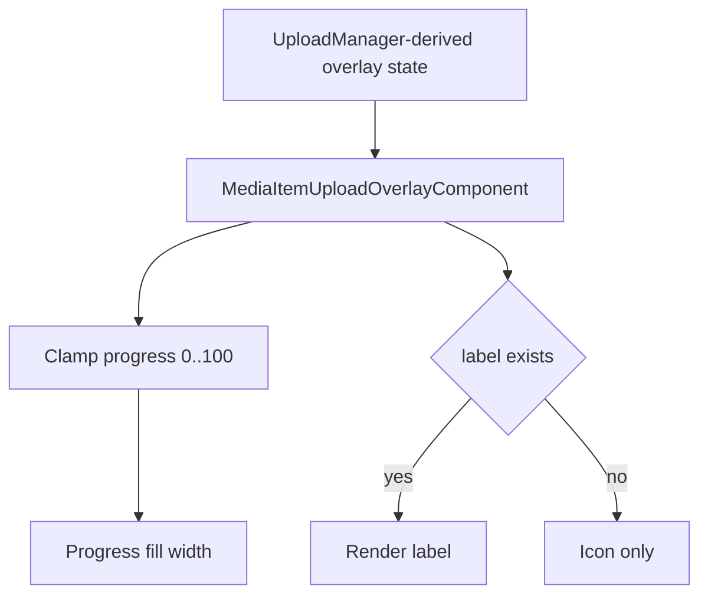
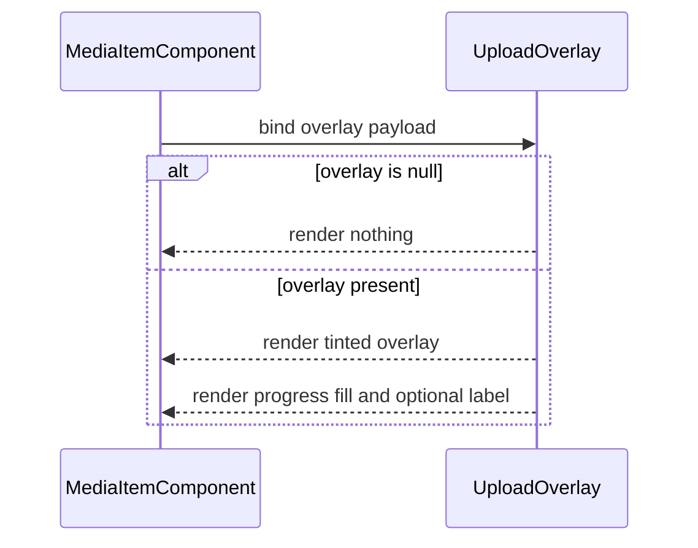

# Media Item Upload Overlay

## What It Is

Media Item Upload Overlay is the dedicated overlay presenter for upload phase/progress visuals on a media item. It is a passive layer and never owns selection or quiet-action behavior.

## What It Looks Like

The overlay fills the media frame bounds and displays a subtle tinted surface while upload is active. A bottom progress fill visualizes completion percentage. An icon and optional label are rendered in a compact strip above the progress bar. The overlay is non-interactive (`pointer-events: none`) and stays below quiet actions. All visual values use design tokens.

## Where It Lives

- Component root: `apps/web/src/app/features/media/media-item-upload-overlay.component.ts`
- Used by: `MediaItemComponent`
- Trigger: upload state resolves to non-null overlay payload

## Actions

| #   | User Action / System Trigger | System Response                                 | Trigger                 |
| --- | ---------------------------- | ----------------------------------------------- | ----------------------- |
| 1   | Upload overlay state exists  | Upload overlay layer is rendered                | `overlay != null`       |
| 2   | Progress value changes       | Progress fill width updates to clamped percent  | upload progress updates |
| 3   | Optional label exists        | Label text is rendered in overlay content strip | `overlay.label` present |
| 4   | Quiet actions are visible    | Upload overlay remains behind quiet actions     | z-layer contract        |

## Component Hierarchy

```text
MediaItemUploadOverlayComponent
└── div.media-item-upload-overlay
    ├── div.media-item-upload-overlay__fill
    └── div.media-item-upload-overlay__content
        ├── span.media-item-upload-overlay__icon
        └── span.media-item-upload-overlay__label (optional)
```

## Data

The component consumes upload overlay payload only and does not query backend data.

| Field             | Source                           | Type                         | Purpose                         |
| ----------------- | -------------------------------- | ---------------------------- | ------------------------------- |
| `overlay`         | MediaItem upload mapping         | `UploadOverlayState \| null` | upload phase + progress + label |
| `progressPercent` | computed from `overlay.progress` | `number`                     | fill width binding (`0..100`)   |



## State

| Name              | TypeScript Type              | Default | What it controls               |
| ----------------- | ---------------------------- | ------- | ------------------------------ |
| `overlay`         | `UploadOverlayState \| null` | `null`  | whether overlay is rendered    |
| `progressPercent` | `number`                     | `0`     | progress fill width percentage |

## File Map

| File                                                                       | Purpose                                      |
| -------------------------------------------------------------------------- | -------------------------------------------- |
| `apps/web/src/app/features/media/media-item-upload-overlay.component.ts`   | overlay input + clamped progress computation |
| `apps/web/src/app/features/media/media-item-upload-overlay.component.html` | upload overlay structure                     |
| `apps/web/src/app/features/media/media-item-upload-overlay.component.scss` | upload overlay visuals                       |

## Wiring

### Injected Services

None.

### Inputs / Outputs

- Inputs: `overlay`
- Outputs: None.

### Subscriptions

None.

### Supabase Calls

None — delegated to upload/domain services.



## Acceptance Criteria

- [ ] Overlay renders only when upload payload exists.
- [ ] Progress fill width is clamped to `0..100`.
- [ ] Overlay remains passive (`pointer-events: none`).
- [ ] Overlay stays below quiet actions in z-order.

## Visual Behavior Contract

### Ownership Matrix

| Behavior            | Visual Geometry Owner                 | Stacking Context Owner                                 | Interaction Hit-Area Owner | Selector(s)                                              | Layer (z-index/token) | Test Oracle                                               |
| ------------------- | ------------------------------------- | ------------------------------------------------------ | -------------------------- | -------------------------------------------------------- | --------------------- | --------------------------------------------------------- |
| Upload tint surface | `.media-item-upload-overlay`          | `app-media-item:host` (provided by parent layer class) | none (passive)             | `.media-item__upload-overlay .media-item-upload-overlay` | overlay/upload (1)    | overlay covers frame bounds and does not intercept clicks |
| Progress fill       | `.media-item-upload-overlay__fill`    | `.media-item-upload-overlay`                           | none                       | `.media-item-upload-overlay__fill`                       | overlay/upload-detail | fill width tracks clamped progress value                  |
| Status strip        | `.media-item-upload-overlay__content` | `.media-item-upload-overlay`                           | none                       | `.media-item-upload-overlay__content`                    | overlay/upload-detail | icon/label stay readable above tint                       |

### Ownership Triad Declaration

| Behavior            | Geometry Owner                        | State Owner                           | Visual Owner                          | Same element? |
| ------------------- | ------------------------------------- | ------------------------------------- | ------------------------------------- | ------------- |
| Upload tint surface | `.media-item-upload-overlay`          | `.media-item-upload-overlay`          | `.media-item-upload-overlay`          | ✅            |
| Progress fill       | `.media-item-upload-overlay__fill`    | `.media-item-upload-overlay__fill`    | `.media-item-upload-overlay__fill`    | ✅            |
| Status strip        | `.media-item-upload-overlay__content` | `.media-item-upload-overlay__content` | `.media-item-upload-overlay__content` | ✅            |

### Stacking Context

- Parent (`app-media-item`) owns stacking context and absolute placement.
- Upload overlay component owns only internal content layout within provided bounds.

### Layer Order (z-index)

- Parent layer class `.media-item__upload-overlay` owns z-order (`1`).
- Internal elements do not declare competing global z-index.

### State Ownership

- upload phase/progress visuals: Media Item Upload Overlay
- selection visuals: Not owned here
- quiet actions reveal: Not owned here

### Pseudo-CSS Contract

```css
:host {
  display: block;
}

.media-item-upload-overlay {
  inline-size: 100%;
  block-size: 100%;
  pointer-events: none;
}

.media-item-upload-overlay__fill {
  position: absolute;
  inset-inline-start: 0;
  inset-block-end: 0;
}
```
