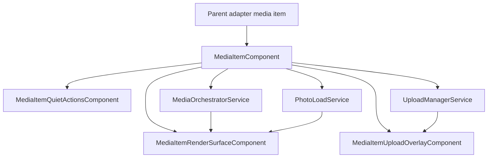
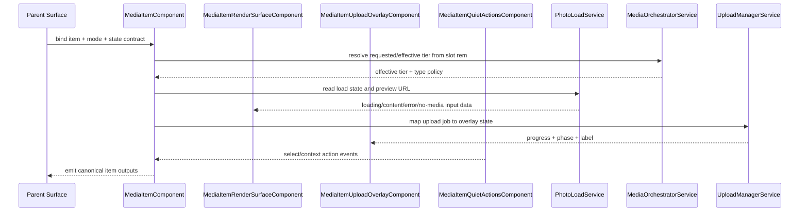

# Media Item

## What It Is

Media Item is the domain-specific item contract for rendering a single media entity inside Item Grid surfaces. It owns media preview state transitions, mode-specific aspect behavior, upload overlays, and action affordances for the `ws_grid_thumbnail` context. Media delivery (tier choice + URL fallback + signed URL load-state) is consumed through the shared media-delivery service contract so map, workspace, media page, and detail remain consistent.

## What It Looks Like

The component renders a plain square media slot and keeps layout stable across all render states. The slot is the only owner of thumbnail border and radius styling (no outer frame styling on the state wrapper), and media is rendered with native aspect ratio using `object-fit: contain` inside that square. Initial loading uses a neutral gray placeholder surface (no spinner, no camera/image icon). If a lower tier is already cached from another surface (for example map marker/detail), the component may show that cached bitmap as a soft blurred preview while the requested tier loads in memory. Border/radius/hover affordances, quiet-action corners, and file-type chip placement are anchored to the rendered media frame inside the square slot, not to the full tile bounds. Quiet actions are hidden at rest and reveal on hover/focus in 80ms: select in the upper-left and map (icon-only) in the upper-right. Both quiet actions use the shared primitive small button style; select is circular and map has visible background. During loading, a known ratio must already be applied; if no ratio is available yet, fallback is the square slot from the active grid mode. Visual tokens come from shared color, spacing, and radius custom properties; accessibility-sensitive dimensions use `rem`.

## Where It Lives

- Parent spec: `docs/element-specs/item-grid.md`
- Delivery policy owner: `docs/element-specs/media-delivery-orchestrator.md`
- Child component root: `apps/web/src/app/features/media/media-item.component.ts`
- Child specs:
  - `docs/element-specs/media-item-upload-overlay.md`
  - `docs/element-specs/media-item-quiet-actions.md`
  - `docs/element-specs/item-state-frame.md`
- Route consumers:
  - `/media`
  - Workspace pane selected-items grid on `/map` via `ItemGridComponent`
- Trigger: projected media-domain item inside `ItemGridComponent`

## Actions & Interactions

| #   | User Action / System Trigger                                  | System Response                                                                                                                                                            | Trigger                                     |
| --- | ------------------------------------------------------------- | -------------------------------------------------------------------------------------------------------------------------------------------------------------------------- | ------------------------------------------- |
| 1   | Item is instantiated in loading state                         | Render neutral gray placeholder layer; no spinner and no media glyph/icon; keep known slot ratio if available, else fallback to mode square                                | `loading=true`                              |
| 2   | Asset resolves successfully                                   | Decode image off-screen/in memory, then dissolve from placeholder (or warm blurred preview) to sharp content with no layout shift                                          | `renderState='content'`                     |
| 3   | Asset load fails                                              | Render deterministic error layer and expose retry path through parent contract                                                                                             | `renderState='error'`                       |
| 4   | No photo is available                                         | Render deterministic no-media layer (non-error)                                                                                                                            | `renderState='no-media'`                    |
| 5   | Mode changes to `grid-sm` or `grid-md`                        | Keep square slot geometry and apply tier mapping for compact grid                                                                                                          | `mode` input change                         |
| 6   | File type is A4-suitable document                             | Apply A4 portrait behavior (`1 / 1.414`) for preview slot independent of grid mode (except row mode override)                                                              | file-type suitability policy                |
| 7   | File type is not A4-suitable                                  | Apply non-A4 preview behavior using orchestrator type policy                                                                                                               | file-type suitability policy                |
| 8   | Mode changes to `row`                                         | Derive slot ratio from media metadata and apply fade transition on ratio-relevant source change; if metadata ratio is unavailable, fallback to square until ratio resolves | `mode='row'`                                |
| 9   | Mode changes to `card`                                        | Use card preview behavior with stable slot frame                                                                                                                           | `mode='card'`                               |
| 10  | Upload phase/progress is active for this media                | Render upload overlay under quiet actions with progress fill, icon, and label                                                                                              | upload phase update                         |
| 11  | User hovers/focuses media item                                | Reveal quiet actions in 80ms; keep keyboard access for all exposed controls                                                                                                | hover/focus                                 |
| 12  | User triggers selection/map action                            | Emit canonical action event for `ws_grid_thumbnail` contract (`select` and map jump)                                                                                       | action click/keyboard                       |
| 13  | Media item enters visible content/no-media state              | Show file-type chip (icon + text) in lower-right corner of rendered media frame                                                                                            | render layer visible                        |
| 14  | Slot dimensions change                                        | Convert slot size to `rem`, resolve requested/effective tier via orchestrator                                                                                              | resize observer                             |
| 15  | User views a video item                                       | Show play-indicator overlay in content state                                                                                                                               | file type is video                          |
| 16  | `/media` appends large result sets                            | Insert rows progressively in deterministic batches `columns x 3`                                                                                                           | list append/pagination                      |
| 17  | Same media was already loaded on `/map` or detail             | Reuse cached lower/higher tier immediately, show warm blurred preview when needed, and avoid full cold-start placeholder path                                              | shared photo-load cache hit                 |
| 18  | Item is document-like and slot size crosses preview threshold | Render generated first-page document thumbnail when available (instead of generic file icon), then upgrade quality via tier policy                                         | `slotShortEdgeRem >= documentPreviewMinRem` |

### State Normalization Decision (Mandatory)

`MediaItemRenderSurfaceComponent` exposes only canonical `renderState` values:

- `loading`
- `content`
- `error`
- `no-media`

Legacy/internal loader statuses may still exist in services, but they must be normalized before render-surface binding.

| Internal loader status | Canonical `renderState` | Notes                                                |
| ---------------------- | ----------------------- | ---------------------------------------------------- |
| `placeholder`          | `loading`               | Placeholder is a visual style, not a public state    |
| `icon-only`            | `content`               | Non-image icon presentation belongs to content layer |
| `loading`              | `loading`               | Direct mapping                                       |
| `loaded`               | `content`               | Direct mapping                                       |
| `error`                | `error`                 | Direct mapping                                       |
| `no-photo`             | `no-media`              | Explicit non-error no-media contract                 |

### Loading Ownership Decision (Mandatory)

- Media loading visuals are owned by `MediaItemRenderSurfaceComponent`.
- `ItemStateFrameComponent` remains owner for shared error/empty framing.
- Double-loading overlays are forbidden: the media item must not render a second spinner/pulse layer above an already active media loading layer.

## Component Hierarchy

```text
MediaItemComponent
├── ItemStateFrame binding (shared state frame contract)
│   └── Domain content outlet
├── MediaItemRenderSurfaceComponent
│   ├── Slot frame (mode/type-aware ratio)
│   ├── Layer: loading (neutral gray placeholder, optional warm blurred cached preview)
│   ├── Layer: content (asset + optional video play indicator)
│   ├── Layer: error
│   └── Layer: no-media
├── MediaItemUploadOverlayComponent
│   └── Progress fill + icon + label (z-index below quiet actions)
├── MediaItemQuietActionsComponent
│   ├── Select action
│   ├── Map action (icon-only)
│   └── Keyboard focusable controls
```

## Data

Media Item does not call Supabase directly. It consumes media data from domain adapters and rendering state from services.

### Data Flow (Mermaid)



| Field                  | Source                                     | Type                                                       | Purpose                                                |
| ---------------------- | ------------------------------------------ | ---------------------------------------------------------- | ------------------------------------------------------ |
| `itemId`               | parent adapter                             | `string`                                                   | Stable identity for events and state lookup            |
| `mediaType`            | orchestrator file-type resolution          | `'image' \| 'video' \| 'document' \| 'audio' \| 'other'`   | Drives icon, overlays, and ratio behavior              |
| `renderState`          | media state mapping                        | `'loading' \| 'content' \| 'error' \| 'no-media'`          | Selects active render layer                            |
| `thumbnailUrl`         | `PhotoLoadService`                         | `string \| null`                                           | Loaded preview asset URL                               |
| `warmPreviewUrl`       | `PhotoLoadService` cache lookup            | `string \| null`                                           | Immediately reusable lower/higher tier hint            |
| `documentThumbnailUrl` | `PhotoLoadService` / preview path resolver | `string \| null`                                           | Generated first-page thumbnail for document-like files |
| `photoLoadState`       | `PhotoLoadService`                         | `'idle' \| 'loading' \| 'loaded' \| 'error' \| 'no-photo'` | Canonical load semantics                               |
| `slotWidthRem`         | resize measurement                         | `number \| null`                                           | Tier selection input                                   |
| `slotHeightRem`        | resize measurement                         | `number \| null`                                           | Tier selection input                                   |
| `requestedTier`        | mode mapping                               | `MediaTier`                                                | Requested preview quality                              |
| `effectiveTier`        | `MediaOrchestratorService`                 | `MediaTier`                                                | Resolved tier after clamping/fallback                  |
| `uploadOverlay`        | `UploadManagerService`                     | `UploadOverlayState \| null`                               | Upload phase/progress layer                            |
| `actions`              | action-context resolver                    | `ReadonlyArray<ActionId>`                                  | Visible/enabled quiet actions                          |
| `gridColumns`          | parent grid resolver                       | `number`                                                   | Progressive append calculation                         |
| `batchInsertSize`      | parent progressive renderer                | `number`                                                   | Deterministic `columns x 3` batch                      |

## State

| Name                      | TypeScript Type                                          | Default     | What it controls                                                 |
| ------------------------- | -------------------------------------------------------- | ----------- | ---------------------------------------------------------------- |
| `mode`                    | `'grid-sm' \| 'grid-md' \| 'grid-lg' \| 'row' \| 'card'` | `'grid-md'` | Visual mode mapping                                              |
| `renderState`             | `'loading' \| 'content' \| 'error' \| 'no-media'`        | `'loading'` | Active media layer                                               |
| `warmPreviewVisible`      | `boolean`                                                | `false`     | Whether blurred cached tier is currently shown                   |
| `documentPreviewEligible` | `boolean`                                                | `false`     | Whether slot size and filetype allow first-page document preview |
| `isVideo`                 | `boolean`                                                | `false`     | Play-indicator visibility                                        |
| `slotRatio`               | `number \| null`                                         | `null`      | Mode/type-aware slot ratio                                       |
| `slotWidthRem`            | `number \| null`                                         | `null`      | Tier selection input                                             |
| `slotHeightRem`           | `number \| null`                                         | `null`      | Tier selection input                                             |
| `requestedTier`           | `MediaTier`                                              | `'small'`   | Requested quality                                                |
| `effectiveTier`           | `MediaTier`                                              | `'small'`   | Resolved quality                                                 |
| `uploadOverlay`           | `UploadOverlayState \| null`                             | `null`      | Upload progress/state layer                                      |
| `quietActionsVisible`     | `boolean`                                                | `false`     | Hover/focus action reveal                                        |
| `batchInsertSize`         | `number \| null`                                         | `null`      | Progressive append batch size                                    |

### Aspect-Ratio Behavior by Mode

| Mode      | Ratio contract                                                                  |
| --------- | ------------------------------------------------------------------------------- |
| `grid-sm` | Square slot (`1 / 1`, default about `8rem` x `8rem`, approx. `128px` x `128px`) |
| `grid-md` | Square slot (`1 / 1`)                                                           |
| `grid-lg` | Tier-driven large preview behavior from orchestrator/type policy                |
| `row`     | Dynamic ratio from media metadata (source dimensions), transitioned by fade     |
| `card`    | Stable framed card preview slot with metadata region below                      |

### Document Preview Suitability Contract (Mandatory)

A4 portrait behavior is controlled by file-type suitability, not by grid mode.

- A4-suitable types: PDF and document-like office formats whose natural preview expectation is portrait-page reading.
- Non A4-suitable types: spreadsheets, presentations, and media-native formats.
- Row mode keeps row-ratio behavior as highest priority; when row metadata ratio is known, it overrides A4 suitability.

### Document Thumbnail Generation Contract (Mandatory)

When document-like uploads provide a generated first-page thumbnail, media item renderers must prefer that thumbnail over icon-only fallback once slot size is large enough.

- Threshold gate: first-page document thumbnail rendering activates at `documentPreviewMinRem` (default `12rem`, about `192px` short edge).
- Small tiles remain icon-only for performance and scanability.
- If generated thumbnail is missing or failed, fallback remains deterministic icon/no-media behavior.
- Generated first-page thumbnails follow the same shared cache namespace and tier-upgrade contract as image thumbnails.

### Ratio Fallback Contract (Mandatory)

For all modes, including loading state:

- Preferred source: explicit media metadata ratio (`width/height`).
- Secondary source: file-type suitability policy ratio (for example A4-suitable document type).
- Final fallback: square slot (`1 / 1`) from the active grid mode.

This guarantees no geometry jump from loading to content.

## Visual Behavior Contract

### Ownership Matrix

| Behavior             | Visual Geometry Owner                           | Stacking Context Owner             | Interaction Hit-Area Owner                   | Selector(s)                                                          | Layer (z-index/token)        | Test Oracle                                                        |
| -------------------- | ----------------------------------------------- | ---------------------------------- | -------------------------------------------- | -------------------------------------------------------------------- | ---------------------------- | ------------------------------------------------------------------ |
| Content media frame  | `.media-item-render-surface__media-frame`       | `app-media-item:host`              | `.media-item__open`                          | `.media-item__preview` and `.media-item-render-surface__media-frame` | layer/content (0)            | rendered media frame defines visible thumbnail bounds              |
| Loading fallback     | `.media-item-render-surface__fallback--loading` | `.media-item-render-surface__slot` | none (passive state)                         | `.media-item-render-surface__fallback--loading`                      | layer/content (0)            | loading placeholder stays inside slot bounds and matches mode size |
| Upload overlay       | media frame bounds                              | `app-media-item:host`              | none (passive overlay)                       | `.media-item__upload-overlay`                                        | layer/upload (1)             | upload overlay covers frame bounds and remains below quiet actions |
| Selected emphasis    | `.media-item-render-surface__media-frame`       | `app-media-item:host`              | `.media-item__open` and quiet-action buttons | `.media-item-render-surface__media-frame--selected`                  | layer/selected (frame-level) | selected ring appears only around media frame, never full tile     |
| Quiet actions reveal | quiet action controls                           | `app-media-item:host`              | `.media-item-quiet-actions__button*`         | `.media-item__quiet-actions`                                         | layer/actions (3)            | hover/focus reveals action controls in frame corners               |

### Ownership Triad Declaration

| Behavior             | Geometry Owner                                  | State Owner                                         | Visual Owner                                        | Same element?                                                                          |
| -------------------- | ----------------------------------------------- | --------------------------------------------------- | --------------------------------------------------- | -------------------------------------------------------------------------------------- |
| Loading fallback     | `.media-item-render-surface__fallback--loading` | `.media-item-render-surface__fallback--loading`     | `.media-item-render-surface__fallback--loading`     | ✅                                                                                     |
| Upload overlay       | `.media-item__upload-overlay`                   | `.media-item__upload-overlay`                       | `.media-item__upload-overlay`                       | ✅                                                                                     |
| Selected emphasis    | `.media-item-render-surface__media-frame`       | `.media-item-render-surface__media-frame--selected` | `.media-item-render-surface__media-frame--selected` | ✅                                                                                     |
| Quiet actions reveal | `.media-item__quiet-actions`                    | `.media-item--selected` (parent state gate)         | `.media-item__quiet-actions`                        | ⚠️ exception — reveal is intentionally controlled by parent hover/focus/selected state |

### Stacking Context

- `app-media-item` `:host` is the sole stacking-context owner for domain overlays.
- `app-item-state-frame` is a transparent state wrapper and must not create a competing stacking context.
- `app-media-item-upload-overlay` and `app-media-item-quiet-actions` are absolute host-child overlays using `inset: 0`.
- Selected visual emphasis is rendered by the visual geometry owner (`.media-item-render-surface__media-frame`), not by tile-level wrapper shadow.

### Layer Order (z-index)

| Layer          | z-index              | Element                                             |
| -------------- | -------------------- | --------------------------------------------------- |
| Content layer  | 0                    | `.media-item__preview` / rendered media content     |
| Upload overlay | 1                    | `.media-item__upload-overlay`                       |
| Selected ring  | frame-level emphasis | `.media-item-render-surface__media-frame--selected` |
| Quiet actions  | 3                    | `.media-item__quiet-actions`                        |

No additional undeclared z-index values are permitted for media-item visual layers.

### State Ownership

| Visual state             | Owner element                                       | Behavior contract                                      |
| ------------------------ | --------------------------------------------------- | ------------------------------------------------------ |
| Loading pulse            | `.media-item-render-surface__fallback--loading`     | Media loading placeholder state                        |
| Error surface            | `app-item-state-frame` error layer                  | Shared retry-capable error state                       |
| Empty/no-content surface | `app-item-state-frame` empty layer                  | Shared empty state                                     |
| Selected ring            | `.media-item-render-surface__media-frame--selected` | Domain selected emphasis aligned to media frame bounds |
| Hover/focus reveal       | `app-media-item-quiet-actions`                      | Quiet actions fade in/out in 80ms                      |

### Pseudo-CSS Contract

```css
:host {
  display: block;
  position: relative; /* sole stacking context owner */
}

.media-item__preview {
  position: relative;
  z-index: 0;
}

.media-item__upload-overlay,
.media-item__quiet-actions,
.media-item__open {
  position: absolute;
  inset: 0;
}

.media-item__upload-overlay {
  z-index: 1;
}
.media-item__quiet-actions {
  z-index: 3;
}

.media-item-render-surface__media-frame--selected {
  outline: 2px solid var(--color-clay);
  filter: drop-shadow(
    0 1px 2px color-mix(in srgb, var(--color-clay) 32%, transparent)
  );
}

img {
  width: 100%;
  height: 100%;
  object-fit: contain;
  object-position: top center;
}
```

## File Map

| File                                                                       | Purpose                                    |
| -------------------------------------------------------------------------- | ------------------------------------------ |
| `apps/web/src/app/features/media/media-item.component.ts`                  | Media item orchestration and state mapping |
| `apps/web/src/app/features/media/media-item.component.html`                | Media item composition template            |
| `apps/web/src/app/features/media/media-item.component.scss`                | Media item domain styling                  |
| `apps/web/src/app/features/media/media-item-render-surface.component.ts`   | Render-surface state presentation logic    |
| `apps/web/src/app/features/media/media-item-render-surface.component.html` | Loading/content/error/no-media layers      |
| `apps/web/src/app/features/media/media-item-render-surface.component.scss` | Render-surface visuals and ratio behavior  |
| `apps/web/src/app/features/media/media-item-upload-overlay.component.ts`   | Upload overlay state presenter             |
| `apps/web/src/app/features/media/media-item-upload-overlay.component.html` | Upload overlay template                    |
| `apps/web/src/app/features/media/media-item-upload-overlay.component.scss` | Upload overlay visuals and z-order         |
| `apps/web/src/app/features/media/media-item-quiet-actions.component.ts`    | Quiet actions presenter and outputs        |
| `apps/web/src/app/features/media/media-item-quiet-actions.component.html`  | Quiet actions controls                     |
| `apps/web/src/app/features/media/media-item-quiet-actions.component.scss`  | Quiet actions reveal and focus styles      |
| `apps/web/src/app/features/media/media-item-slot.utils.ts`                 | Slot measurement and tier utility helpers  |
| `apps/web/src/app/features/media/media-item-upload.utils.ts`               | Upload overlay mapping helpers             |

## Wiring

### Injected Services

- `PhotoLoadService`: load-state and signed URL source
- `MediaOrchestratorService`: requested/effective tier resolution and type policy
- `UploadManagerService`: upload overlay phase/progress source
- `I18nService`: labels and localized metadata formatting

### Inputs / Outputs

- Inputs:
  - `itemId`, `mode`, `loading`, `error`, `empty`, `selected`, `disabled`, `actionContextId`
  - `item` (domain media record)
- Outputs:
  - `selectedChange`
  - `opened`
  - `retryRequested`
  - `contextActionRequested`

### Subscriptions

- `PhotoLoadService` load-state updates for active `itemId`
- Upload job stream mapping to `uploadOverlay`
- `ResizeObserver` for slot width/height in `rem`
- Progressive append scheduler for `/media` rows (`columns x 3` batches)

### Supabase Calls

- None direct in component
- Delegated through domain/orchestration services

### Wiring Flow (Mermaid)



## Acceptance Criteria

- [ ] Render state chain is exactly `loading -> content | error | no-media` and all four states have deterministic visuals.
- [ ] Legacy/internal statuses (`placeholder`, `icon-only`, `loaded`, `no-photo`) are normalized to canonical render states before render-surface binding.
- [ ] Loading state uses neutral gray placeholder surface with no spinner and no loading icon.
- [ ] Media loading visual ownership is singular: render-surface owns loading visuals; shared state frame does not duplicate a second loading overlay for media items.
- [ ] `grid-sm` and `grid-md` use square media slot behavior.
- [ ] Media tile border/radius styling is owned by the media slot container, not by outer state-frame wrapper geometry.
- [ ] A4 portrait ratio is applied by file-type suitability policy, independent of grid mode (row ratio override allowed).
- [ ] `row` mode derives ratio from media metadata and fades on ratio-relevant source changes.
- [ ] Loading state uses known ratio when available; otherwise fallback ratio is square (`1 / 1`) until metadata ratio resolves.
- [ ] Asset transition is decode-first and dissolve-based (placeholder/warm preview -> sharp image), not top-to-bottom visual fill.
- [ ] If a cached lower/higher tier exists from map/workspace/detail, media grid uses it immediately as warm preview before requested tier resolves.
- [ ] `card` mode keeps stable framed preview behavior.
- [ ] Document-like media with generated first-page thumbnail renders that thumbnail when slot short edge is at least `12rem`; otherwise icon fallback remains valid.
- [ ] Video content state shows play-indicator overlay.
- [ ] File-type chip (icon + text) is anchored lower-right in rendered media frame bounds.
- [ ] Upload overlay appears below quiet actions and keeps correct z-order.
- [ ] Quiet actions reveal in 80ms on hover/focus and are fully keyboard accessible (select top-left, map top-right icon-only).
- [ ] Select and map quiet actions use shared primitive small button styling.
- [ ] Select quiet action is circular; map quiet action has visible background surface.
- [ ] Quiet actions are anchored to rendered media frame corners, not full square-tile corners.
- [ ] Requested/effective tier is resolved from `slotWidthRem`/`slotHeightRem` through orchestrator only.
- [ ] `/media` progressive insertion uses deterministic batch size `columns x 3`.
- [ ] File map and wiring match the defined sub-components and service ownership exactly.
- [ ] Workspace pane selected-items uses this Media Item contract through `ItemGridComponent`, not legacy thumbnail-grid runtime wiring.
