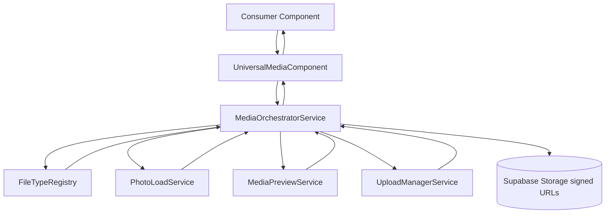
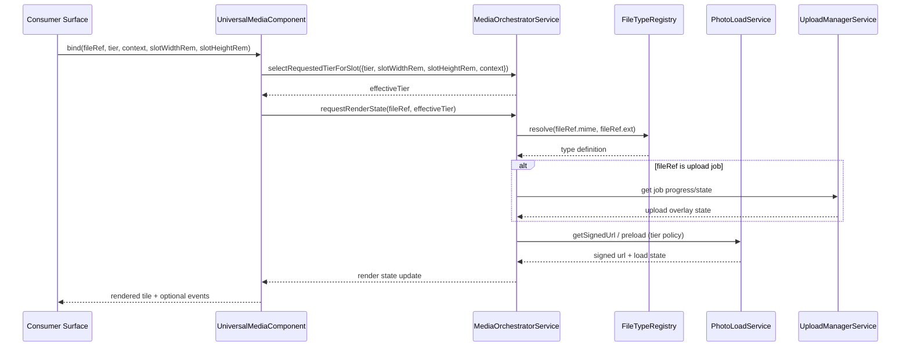

# Media Renderer System

> **Related specs:** [photo-load-service](photo-load-service.md), [upload-manager](upload-manager.md), [upload-panel](upload-panel.md), [thumbnail-card](thumbnail-card.md), [media-detail-photo-viewer](media-detail-photo-viewer.md), [file-type-chips](file-type-chips.md)

## What It Is

The Media Renderer System is the canonical contract for rendering file previews across Feldpost. It defines one File Type Registry, one universal media component API, and one orchestration service so every surface (upload rows, grids, map markers, detail view) uses the same loading and fallback rules.

## What It Looks Like

This is a mixed system spec (service plus UI contract). Visual output is a framed media tile with type-aware border color and aspect-ratio slot behavior, while content layers switch progressively from placeholder to final media asset. File-type colors must come from CSS custom properties (for example `--filetype-document`) and never from hardcoded literals in components. Mid to large previews keep media in its native ratio using `object-fit: contain` and `object-position: top center` inside the tier slot. Full-tier rendering can hand off to document, video, or audio viewers while preserving the same loading-state model.

## Where It Lives

- Scope: Shared cross-feature architecture contract
- Spec root: `docs/element-specs/media-renderer-system.md`
- Angular workspace: `apps/web/src/app/`
- Parent surfaces: Upload Panel, Thumbnail Grid, Media Page cards, Image Detail viewer, map markers

## Actions

| #   | Trigger                                                       | System Response                                                                                                                | Output                        |
| --- | ------------------------------------------------------------- | ------------------------------------------------------------------------------------------------------------------------------ | ----------------------------- |
| 1   | A component requests media render for `{ fileRef, tier }`     | Resolve file type from registry and derive color, icon, and aspect ratio                                                       | Render config object          |
| 2   | Tier requests thumbnail asset                                 | Orchestrator returns state chain `placeholder -> icon -> loading -> loaded` with fallback to lower tier when needed            | `MediaRenderState` update     |
| 3   | Upload item is in progress                                    | Orchestrator exposes upload progress overlay state through the same API                                                        | Overlay metadata              |
| 4   | High tier requested but missing                               | Service requests prerender generation and keeps lower-tier asset visible                                                       | Deferred upgrade state        |
| 5   | File is updated/replaced                                      | Service invalidates caches and emits fresh state                                                                               | Invalidation event            |
| 6   | Consumer switches context (`map`, `grid`, `upload`, `detail`) | Same component API is reused; only style variants differ                                                                       | Stable markup + variant class |
| 7   | Component slot size changes                                   | Component forwards slot width/height in `rem` to orchestrator; orchestrator selects effective tier and clamps to requested cap | Adaptive tier selection       |

## Component Hierarchy

```text
MediaRendererSystem
├── FileTypeRegistry
│   ├── file-type ids
│   ├── mime aliases
│   ├── aspect ratio policy
│   └── color token + icon token
├── MediaOrchestratorService
│   ├── tier resolver
│   ├── thumbnail state stream
│   ├── upload state bridge
│   ├── cache and invalidation
│   └── prerender request bridge
└── UniversalMediaComponent
    ├── Frame (type color, radius, variant)
    ├── AspectSlot (tier ratio)
    ├── Layer: placeholder/icon/loading/asset/error
    └── Overlay: upload progress and status badges
```

## Data

### Data Flow (Mermaid)



| Field                   | Source                                  | Type                 |
| ----------------------- | --------------------------------------- | -------------------- | ----- |
| File type definition    | FileTypeRegistry                        | `FileTypeDefinition` |
| Media tier              | Universal input                         | `MediaTier`          |
| Thumbnail URL candidate | PhotoLoadService or MediaPreviewService | `string              | null` |
| Upload progress         | UploadManagerService                    | `number              | null` |
| Render state            | MediaOrchestratorService                | `MediaRenderState`   |

## State

| Name            | Type                                 | Default       | Controls                                            |
| --------------- | ------------------------------------ | ------------- | --------------------------------------------------- | ------------------------------------------ |
| `typeRegistry`  | `Record<string, FileTypeDefinition>` | required      | Visual and behavior mapping per file type           |
| `renderState`   | `Signal<MediaRenderState>`           | `placeholder` | Layer currently rendered by the universal component |
| `requestedTier` | `MediaTier`                          | `small`       | Target quality and slot policy                      |
| `resolvedTier`  | `MediaTier`                          | `small`       | Actual tier currently available after fallback      |
| `slotWidthRem`  | `number \| null`                     | `null`        | Measured render slot width in `rem` from component  |
| `slotHeightRem` | `number \| null`                     | `null`        | Measured render slot height in `rem` from component |
| `uploadOverlay` | `Signal<UploadOverlayState           | null>`        | `null`                                              | Upload badge/progress on top of media tile |

## File Map

| File                                                           | Purpose                                                                                 |
| -------------------------------------------------------------- | --------------------------------------------------------------------------------------- |
| `apps/web/src/app/core/media/file-type-registry.ts`            | Single source of truth for file type metadata (color, icon, aspect-ratio, mime mapping) |
| `apps/web/src/app/core/media/media-orchestrator.service.ts`    | Unified state orchestration for thumbnail and upload rendering                          |
| `apps/web/src/app/shared/media/universal-media.component.ts`   | One reusable media renderer component for all surfaces                                  |
| `apps/web/src/app/shared/media/universal-media.component.html` | Stable DOM structure with layered rendering                                             |
| `apps/web/src/app/shared/media/universal-media.component.scss` | Tier/context visual variants and slot behavior                                          |
| `docs/element-specs/media-renderer-system.md`                  | Architecture contract and acceptance criteria                                           |

## Wiring

### Injected Services

- `PhotoLoadService`: signed URL retrieval, cache, and preload behavior
- `MediaPreviewService`: immediate/deferred local preview generation during upload intake
- `UploadManagerService`: upload phase and progress bridge
- `FileTypeRegistry` provider: file-type metadata lookups

### Inputs / Outputs

- Universal component inputs:
  - `fileRef: FeldpostFile | UploadJob`
  - `tier: MediaTier`
  - `context: 'map' | 'grid' | 'upload' | 'detail'`
  - `slotWidthRem?: number | null`
  - `slotHeightRem?: number | null`
- Universal component outputs:
  - `assetReady`
  - `assetFailed`
  - `clicked`

### Subscriptions

- Subscribe to orchestrator render state stream per `fileRef + tier`
- Subscribe to upload state stream when `fileRef` is an in-progress upload job
- Re-run tier selection when component slot size changes (for example via `ResizeObserver`)
- Unsubscribe through Angular signal lifecycle / destroy hooks (no manual leak paths)

### Supabase Calls

- None direct in component.
- Delegated to `PhotoLoadService` and upload pipeline services.

### Wiring Flow (Mermaid)



## Acceptance Criteria

- [ ] A single FileTypeRegistry exists and is the only source for file type label, color token, icon token, mime aliases, and aspect ratio policy.
- [ ] No feature component keeps duplicate file-type switch maps after migration.
- [ ] A universal media component exists and is used by upload list rows, thumbnail cards, media cards, and detail viewer preview slot.
- [ ] The universal component supports contexts (`map`, `grid`, `upload`, `detail`) without forking behavior logic.
- [x] A shared tier model is defined (`inline`, `small`, `mid`, `mid2`, `large`, `full`).
- [ ] Mid to large image rendering uses `object-fit: contain` and `object-position: top center` inside tier slots.
- [ ] Render-state transitions are provided by one orchestrator service instead of per-component ad-hoc logic.
- [ ] Upload progress overlays are exposed through the same render contract as thumbnail loading states.
- [ ] High-tier misses fall back to lower tiers and trigger prerender requests without UI blank states.
- [x] Adaptive tier selection contract exists: components provide measured slot dimensions, orchestrator decides effective tier.
- [ ] Tier decision logic remains UI-agnostic: no direct DOM access inside orchestrator/service layer.
- [ ] Components do not call Supabase Storage directly for rendering; they delegate through shared services.
- [x] Existing file-type color tokens are reused through registry mapping (no token reset required).
- [ ] The migration can run incrementally surface-by-surface with no required big-bang switch.
