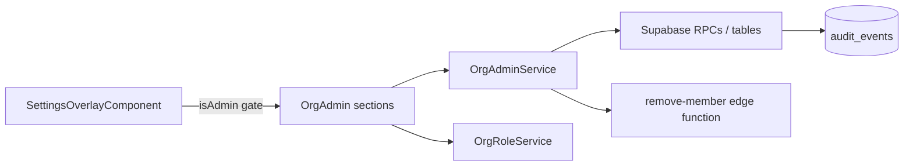
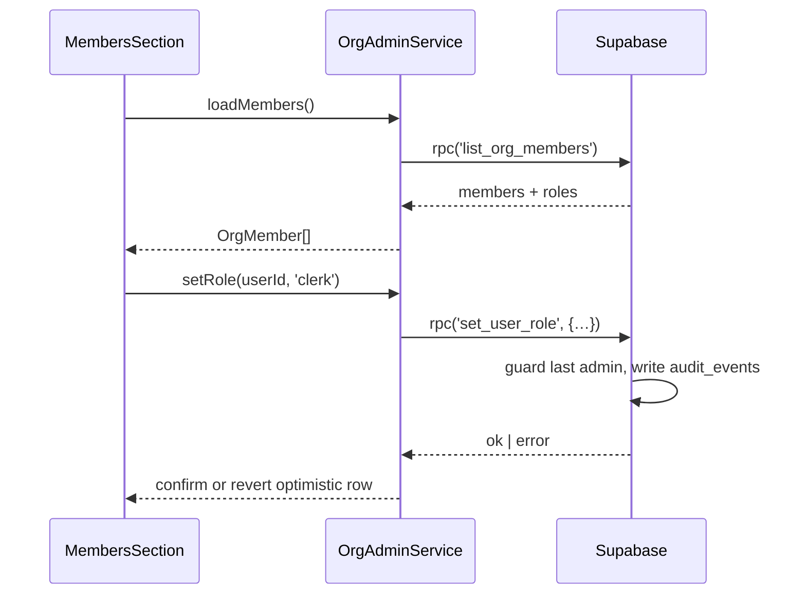

# Org Administration Section

> **Audit & plan:** [org-administration-audit.md](../org-administration-audit.md) — read it first for the DB/RLS gaps each sub-section depends on.

## What It Is

A group of admin-only settings overlay sections — **Members**, **Sharing**, **Activity**, and **Organization** — that let an org admin manage membership and roles, revoke share links, review the audit trail, and rename the organization. Visible only to users with the `admin` role.

## What It Looks Like

Each sub-section is a standard settings overlay section: section header with icon + title + subtitle, followed by `.ui-container` panels of `.ui-item` rows. Members render as rows with an avatar-initial media slot, name + email label column, a role dropdown (shared dropdown primitive), and a ⋯ menu. Share sets and invites render as rows with monospace `token_prefix`, creator and expiry meta text, and a ghost "Revoke" button that turns into a confirm state on first click. Activity renders as a reverse-chronological list of compact rows: action icon, human-readable sentence, relative timestamp. Calm, warm styling consistent with existing sections — destructive actions use `--color-danger` text, never filled red buttons.

## Where It Lives

- **Route**: none — sections inside the Settings Overlay
- **Parent**: `SettingsOverlayComponent` at `features/settings-overlay/settings-overlay.component.ts`
- **Appears when**: settings overlay is open AND `OrgRoleService.isAdmin()` is true; the section entries are filtered out of `sectionList` for non-admins (UX only — RLS remains the security boundary)

## Actions

| #   | User Action                                   | System Response                                                                                  | Triggers                                  |
| --- | --------------------------------------------- | ------------------------------------------------------------------------------------------------ | ----------------------------------------- |
| 1   | Opens "Members" section                       | Loads member list via `list_org_members()` RPC                                                   | Supabase RPC                              |
| 2   | Changes a member's role in the dropdown       | Calls `set_user_role()`; row updates optimistically, reverts on error                            | Supabase RPC + audit row                  |
| 3   | Tries to demote/remove the last admin         | Action blocked with inline error "An organization needs at least one admin"                      | RPC error surfaced (DB-enforced)          |
| 4   | Clicks ⋯ → "Remove from organization"         | Confirm dialog (shared `confirm-dialog`); on confirm calls `remove-member` edge function          | Edge function + audit row                 |
| 5   | Opens "Sharing" section                       | Lists active share sets (creator, item count, created, expires)                                  | Supabase select on `share_sets`           |
| 6   | Clicks "Revoke" on a share set, then confirms | Sets `revoked_at = now()`; row moves to the revoked group; existing links stop resolving         | Supabase update + audit row               |
| 7   | Toggles "Show revoked & expired"              | Includes inactive share sets in the list (admin-read-all policy)                                 | Re-query                                  |
| 8   | Opens "Activity" section                      | Loads latest 50 `audit_events`, newest first; "Load more" appends pages                          | Supabase select                           |
| 9   | Filters activity by action type               | List re-queries with `action` filter                                                             | Re-query                                  |
| 10  | Opens "Organization" section                  | Shows org name (editable), org id, member count                                                  | Supabase select                           |
| 11  | Renames the org and saves                     | Updates `organizations.name`; toast confirms; audit row written                                  | Supabase update + audit row               |
| 12  | Non-admin opens settings overlay              | None of these sections appear in the section list                                                | `sectionList` filtered by `isAdmin()`     |

## Component Hierarchy

```
SettingsOverlay (existing)
└── [isAdmin] OrgAdminSections                ← four new entries in sectionList
    ├── MembersSection                        ← `.ui-container`
    │   ├── MemberRow × N                     ← `.ui-item`
    │   │   ├── AvatarInitial                 ← fixed square media slot
    │   │   ├── NameAndEmail                  ← `.ui-item-label`, two lines
    │   │   ├── RoleDropdown                  ← shared dropdown primitive (admin/clerk/user/worker/viewer)
    │   │   └── RowMenu (⋯)                   ← "Remove from organization"
    │   └── [loading] SkeletonRows
    ├── SharingSection                        ← `.ui-container`
    │   ├── ShareSetRow × N                   ← token_prefix (mono) + creator/count/expiry meta + Revoke
    │   ├── ShowInactiveToggle                ← reveals revoked/expired group
    │   └── [empty] EmptyState                ← "No active share links"
    ├── ActivitySection                       ← `.ui-container`
    │   ├── ActionTypeFilter                  ← shared dropdown, "All actions" default
    │   ├── AuditRow × N                      ← icon + sentence + relative time
    │   └── LoadMoreButton                    ← ghost, paginated
    └── OrganizationSection                   ← `.ui-container`
        ├── OrgNameField                      ← inline edit + Save
        └── OrgMetaRows                       ← org id (copyable), member count (read-only)
```

### Wiring Flow (Mermaid)



### Data Flow (Mermaid)



## Data

| Field            | Source                                                                       | Type              |
| ---------------- | ---------------------------------------------------------------------------- | ----------------- |
| Members          | `supabase.rpc('list_org_members')` (new, admin-only, security definer)       | `OrgMember[]`     |
| Role change      | `supabase.rpc('set_user_role', { target_user_id, role_name })` (new)         | `void`            |
| Member removal   | `remove-member` edge function (new, service role)                            | `void`            |
| Share sets       | `supabase.from('share_sets').select('id, token_prefix, created_by, expires_at, revoked_at, created_at, share_set_items(count)')` | `ShareSetRow[]`   |
| Share-set revoke | `supabase.from('share_sets').update({ revoked_at })` (existing RLS: creator or admin) | `void`     |
| Audit events     | `supabase.from('audit_events').select(…)` (new table, admin org read)        | `AuditEvent[]`    |
| Org profile      | `supabase.from('organizations').select('id, name')` / `.update({ name })` (new admin-update RLS policy) | `Organization` |

Required new DB objects (see audit doc P1/P2/P4/P5): `list_org_members()`, `set_user_role()`, `audit_events`, `organizations` admin-update policy, `share_sets` admin-read-all policy, `remove-member` edge function.

## State

| Name              | Type                          | Default  | Controls                               |
| ----------------- | ----------------------------- | -------- | --------------------------------------- |
| `members`         | `OrgMember[]`                 | `[]`     | Members list                            |
| `pendingRoleEdit` | `string \| null`              | `null`   | Row showing optimistic role change      |
| `shareSets`       | `ShareSetRow[]`               | `[]`     | Sharing list                            |
| `showInactive`    | `boolean`                     | `false`  | Include revoked/expired share sets      |
| `auditEvents`     | `AuditEvent[]`                | `[]`     | Activity list (paged)                   |
| `actionFilter`    | `string \| null`              | `null`   | Activity action-type filter             |
| `orgName`         | `string`                      | `''`     | Org rename field                        |
| `loading`         | `Record<SectionId, boolean>`  | all false| Per-section skeletons                   |

`OrgRoleService` (new, `core/org-role.service.ts`) provides `roles`, `isAdmin`, `isViewer` signals loaded once per session.

## Settings

- **Members & Roles**: member list visibility, role assignment, and member removal controls (admin-only).
- **Sharing Administration**: org-wide share-link listing and revocation, including inactive-link visibility (admin-only).
- **Activity Log**: audit event visibility, pagination size, and action-type filters (admin-only).
- **Organization Profile**: organization rename and identity metadata display (admin-only).

## File Map

| File                                                                          | Purpose                                  |
| ----------------------------------------------------------------------------- | ---------------------------------------- |
| `core/org-role.service.ts`                                                    | Session role signals (`isAdmin` etc.)    |
| `core/org-admin.service.ts`                                                   | Members/sharing/audit/org data access    |
| `features/settings-overlay/sections/members-section.component.ts/.html/.scss` | Members sub-section                      |
| `features/settings-overlay/sections/sharing-admin-section.component.ts/.html/.scss` | Sharing sub-section                |
| `features/settings-overlay/sections/activity-section.component.ts/.html/.scss`| Activity sub-section                     |
| `features/settings-overlay/sections/organization-section.component.ts/.html/.scss` | Organization sub-section            |
| `supabase/migrations/<ts>_org_admin_rpcs.sql`                                 | `list_org_members`, `set_user_role`, `audit_events`, new policies |
| `supabase/functions/remove-member/index.ts`                                   | Service-role member removal              |

## Wiring

### Injected Services

- `OrgRoleService` — admin gating signal for section visibility.
- `OrgAdminService` — all Supabase calls for these sections.
- `I18nService` — section titles, row text, confirmations (en/de/it per i18n workflow).
- `ToastService` (existing toast system) — success/error feedback.

### Inputs / Outputs

None — sections are mounted by `SettingsOverlayComponent` like existing sections.

### Subscriptions

- `OrgRoleService.isAdmin` signal read in `sectionList` computed (no manual teardown).
- Section data loads are promise-based on section open; no long-lived subscriptions.

### Supabase Calls

None in components — delegated to `OrgAdminService` (tables/RPCs listed in Data).

- Extend `sectionList` in `settings-overlay.component.ts` with the four entries carrying `adminOnly: true`, filtered through `OrgRoleService.isAdmin()`.
- Register all new user-facing strings in `docs/i18n/translation-workbench.csv` and regenerate `supabase/seed_i18n.sql`.

## Acceptance Criteria

- [ ] Sections are absent from the settings overlay for non-admin users (and Search Tuning gains the same `adminOnly` gate)
- [ ] Members list shows every org member with name, email, and current roles
- [ ] Changing a role persists via `set_user_role()` and reverts visually on error
- [ ] Demoting or removing the last admin fails with a clear inline message (enforced by the DB, surfaced by the UI)
- [ ] Removing a member requires a confirm dialog and deletes the user per the lifecycle cascade
- [ ] Sharing section lists all active share sets org-wide with creator, item count, and expiry
- [ ] Revoking a share set stops `?share=` resolution immediately and moves the row to the inactive group
- [ ] Activity section shows audit rows for role changes, removals, invite/share lifecycle, and org rename
- [ ] Org rename persists and is reflected after reload
- [ ] All RLS/RPC guards hold when called directly against the API with a non-admin JWT (frontend gating is UX only)
