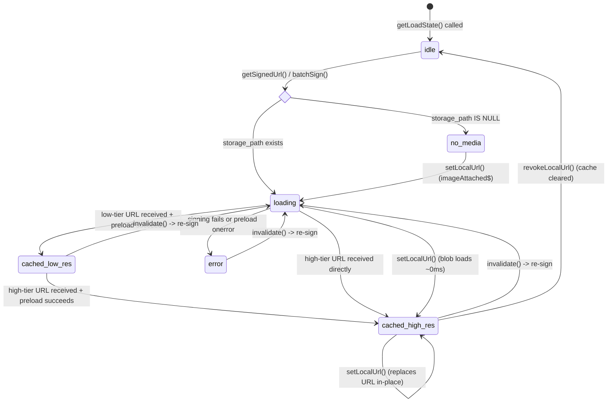
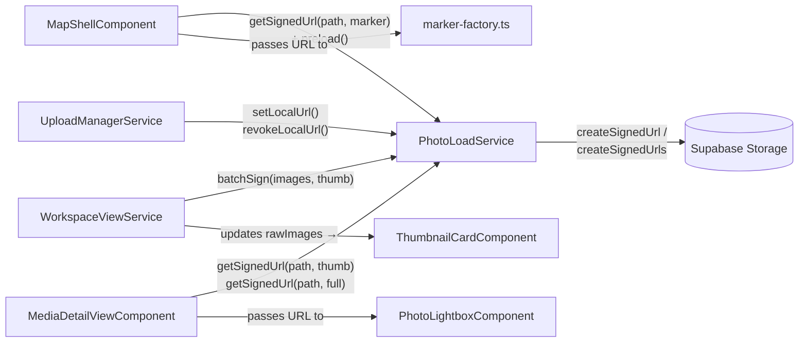
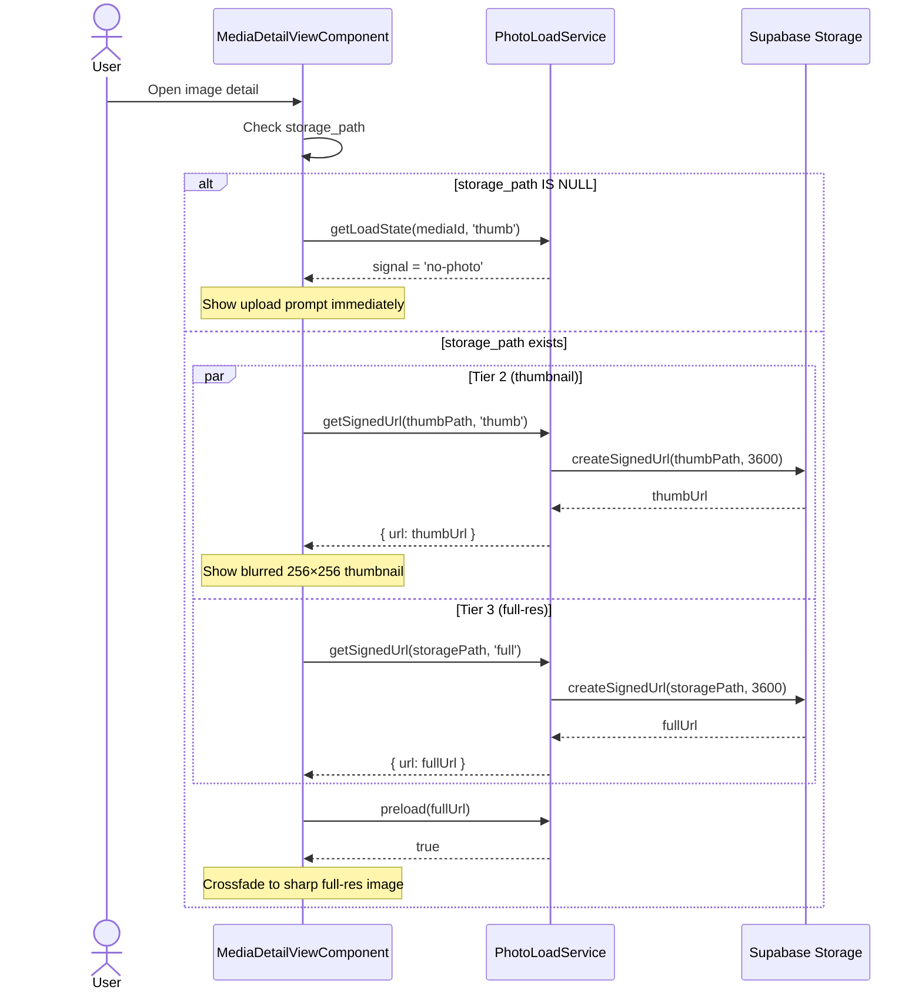
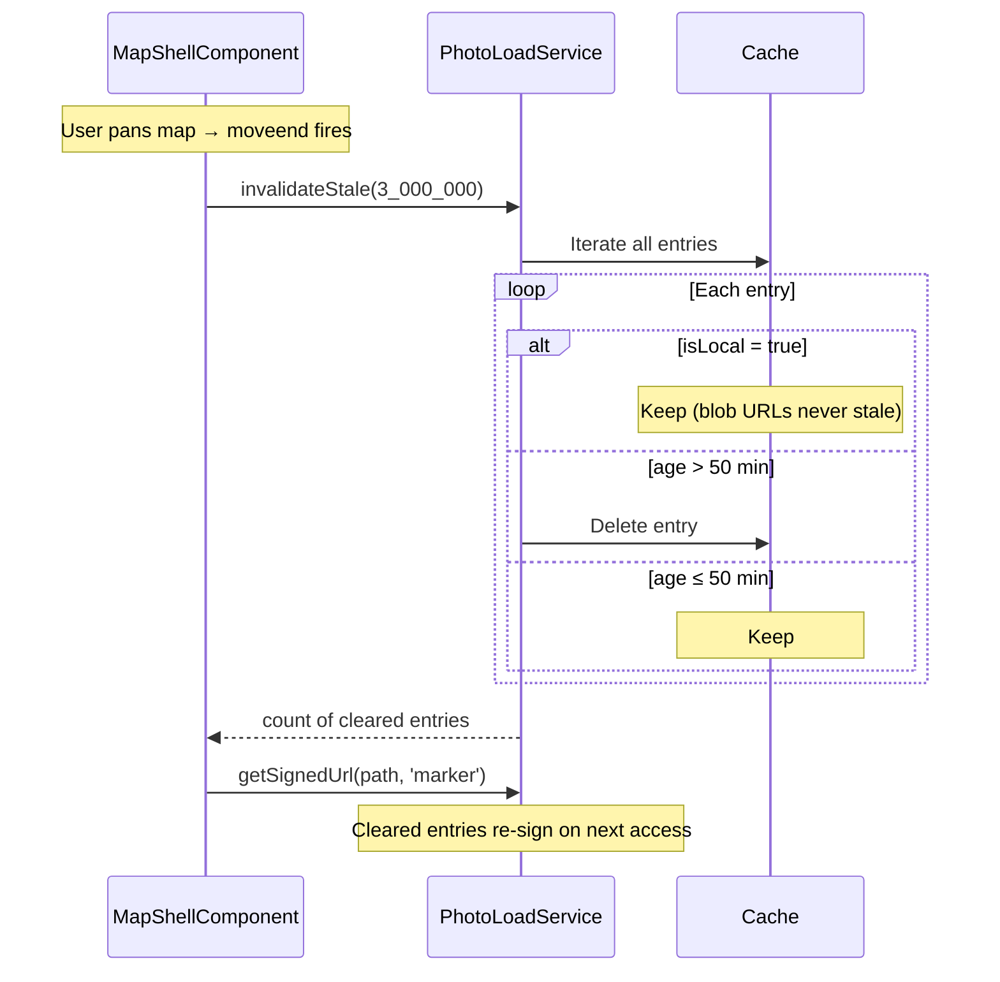
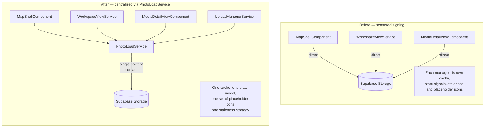

# Photo Load Service

> **Related specs:** [media-delivery-orchestrator](media-delivery-orchestrator.md), [item-grid](item-grid.md), [media-item](media-item.md), [photo-marker](photo-marker.md), [media-detail-media-viewer](media-detail-media-viewer.md), [image-detail-view](media-detail-view.md)
> **Use cases:** [use-cases/photo-loading.md](../use-cases/photo-loading.md)

## What It Is

A centralized Angular service that owns all media signed-URL generation, caching, preloading, and loading-state management. Every surface that displays media (map markers, thumbnail cards, detail view, lightbox) uses this service instead of calling Supabase Storage directly. It replaces the scattered signing logic currently duplicated across `WorkspaceViewService`, `MapShellComponent`, and `MediaDetailViewComponent`.
The service scope now covers media previews beyond photos as well (for example generated first-page document thumbnails), while preserving existing API compatibility.

## What It Looks Like

Not a visual element — this is a headless service. However, it standardizes the visual loading states that consumers render:

- **`idle`** — no URL requested yet; consumer shows nothing or a static placeholder
- **`loading`** — signed URL requested or `` downloading; consumer shows neutral gray placeholder (icon-free baseline, 1200-1400ms soft pulse optional)
- **`cached-low-res`** — low-tier media is available from cache and rendered as warm preview while higher tier resolves
- **`cached-high-res`** — requested or effective high-tier media is available and rendered as the final sharp state
- **`error`** — signing or download failed; consumer shows static no-media icon (crossed-out image, 0.55 opacity)
- **`no-media`** — `storage_path IS NULL`; consumer shows upload prompt or permanent no-media icon immediately (no loading phase)

Compatibility note: runtime internals may still expose `loaded`/`no-photo` as legacy values. Consumer specs must normalize these to `cached-low-res`/`cached-high-res` and `no-media` before rendering.

The service provides canonical assets for no-photo/error visuals and supports warm cached preview reuse so every consumer can render identical transition behavior.

### Load-State Machine



## Where It Lives

- **Scope**: `providedIn: 'root'` singleton
- **File**: `core/photo-load.service.ts`
- **Used by**: `MapShellComponent`, `WorkspaceViewService`, `ThumbnailCardComponent`, `MediaDetailViewComponent`, `PhotoLightboxComponent`, `marker-factory.ts`

## Actions

| #   | Consumer calls                            | Service response                                                                                                      | Returns / emits                         |
| --- | ----------------------------------------- | --------------------------------------------------------------------------------------------------------------------- | --------------------------------------- |
| 1   | `getSignedUrl(storagePath, size)`         | Checks cache → if valid, returns cached URL; else signs via Supabase Storage with size-appropriate transform          | `Promise<SignedUrlResult>`              |
| 2   | `batchSign(items[], size)`                | Groups items by thumbnail-path vs storage-path; batch-signs where possible, individual-signs with transform otherwise | `Promise<Map<string, SignedUrlResult>>` |
| 3   | `getLoadState(mediaId, size)`             | Returns a readonly signal tracking the current `PhotoLoadState` for this image+size pair                              | `Signal<PhotoLoadState>`                |
| 4   | `preload(url)`                            | Creates a hidden `Image()` element, resolves when loaded or rejects on error                                          | `Promise<boolean>`                      |
| 5   | `invalidate(mediaId)`                     | Clears all cached URLs for this image (all sizes); next `getSignedUrl` will re-sign                                   | `void`                                  |
| 6   | `invalidateStale(maxAgeMs)`               | Clears entries older than `maxAgeMs`; called on interval or before batch operations                                   | `number` (entries cleared)              |
| 7   | `setLocalUrl(mediaId, blobUrl)`           | Injects a local `ObjectURL` (from upload) into the cache at all sizes — loads in ~0ms, no network                     | `void`                                  |
| 8   | `revokeLocalUrl(mediaId)`                 | Calls `URL.revokeObjectURL` on the cached blob and clears it; next access re-signs from storage                       | `void`                                  |
| 9   | `getBestCachedUrl(mediaId, tier)`         | Returns best immediately available cached URL for same media (exact tier or deterministic fallback)                   | `string \| null`                        |
| 10  | `getSignedUrl(..., decodeFirst)`          | Resolves URL and pre-decodes when requested so consumer can crossfade without progressive top-to-bottom paint         | `Promise<SignedUrlResult>`              |
| 11  | `getSignedUrl(documentPreviewPath, size)` | Signs generated first-page document thumbnail path and serves it through same cache/state pipeline                    | `Promise<SignedUrlResult>`              |

### Event Streams

| #   | Observable       | Payload                                                       | Fires when                                                                  |
| --- | ---------------- | ------------------------------------------------------------- | --------------------------------------------------------------------------- |
| 9   | `urlChanged$`    | `{ mediaId: string, size: PhotoSize, url: string }`           | A new signed URL or local blob URL is set for any image+size pair           |
| 10  | `stateChanged$`  | `{ mediaId: string, size: PhotoSize, state: PhotoLoadState }` | Any `PhotoLoadState` transition occurs (idle→loading, loading→loaded, etc.) |
| 11  | `batchComplete$` | `{ mediaIds: string[], size: PhotoSize }`                     | A `batchSign()` call finishes (success or partial failure)                  |

## Component Hierarchy

Not applicable — headless service. No template or DOM.

## State

| Name                  | Type                                          | Default     | Controls                                                   |
| --------------------- | --------------------------------------------- | ----------- | ---------------------------------------------------------- |
| `cache`               | `Map<string, CacheEntry>`                     | empty       | Stores signed URLs keyed by `${mediaId}:${size}`           |
| `loadStates`          | `Map<string, WritableSignal<PhotoLoadState>>` | empty       | Per image+size loading state; consumers read these signals |
| `routeStableCache`    | `boolean`                                     | `true`      | Prevents forced cache clearing during route switches       |
| `STALE_THRESHOLD_MS`  | `number`                                      | `3_000_000` | 50 minutes — matches current map-shell staleness window    |
| `SIGN_EXPIRY_SECONDS` | `number`                                      | `3600`      | Supabase signed URL TTL                                    |

## File Map

| File                              | Purpose                                                                                        |
| --------------------------------- | ---------------------------------------------------------------------------------------------- |
| `core/photo-load.service.ts`      | Service: signing, caching, state management, preloading                                        |
| `core/photo-load.service.spec.ts` | Unit tests                                                                                     |
| `core/photo-load.model.ts`        | Shared types: `PhotoLoadState`, `PhotoSize`, `CacheEntry`, `SignedUrlResult`, event interfaces |

## Wiring

### Consumer Integration Overview



### Detail View Progressive Loading via Service



### Invalidation & Staleness



### New consumers (inject service)

All components that currently sign URLs directly will `inject(PhotoLoadService)` and delegate to it:

- **`WorkspaceViewService`** — replace `batchSignThumbnails()` internals with `photoLoad.batchSign(images, 'thumb')`
- **`MapShellComponent`** — replace `lazyLoadThumbnail()` internals with `photoLoad.getSignedUrl(path, 'marker')` + `photoLoad.preload(url)`
- **`MediaDetailViewComponent`** — replace `loadSignedUrls()` with `photoLoad.getSignedUrl(path, 'thumb')` + `photoLoad.getSignedUrl(path, 'full')`
- **`PhotoLightboxComponent`** — receive URL from parent (no change), but parent uses service to sign
- **`marker-factory.ts`** — no direct injection (pure function), but receives pre-signed URLs from `MapShellComponent`

### Upload integration

- **`UploadManagerService`** — on `imageAttached$` / `imageReplaced$`, calls `photoLoad.setLocalUrl(mediaId, blobUrl)` so every surface updates instantly
- After storage upload completes and next batch-sign runs, the local URL is replaced; service calls `revokeLocalUrl` to free memory

### Staleness management

- `MapShellComponent.maybeLoadThumbnails()` calls `photoLoad.invalidateStale(STALE_THRESHOLD_MS)` before re-signing visible markers
- Alternatively, the service can run an internal `setInterval` cleanup (implementation choice)
- Route changes (`/map` <-> `/media` <-> detail/workspace contexts) must not call blanket cache clear; staleness/explicit invalidation are the only clear paths.

### Placeholder assets

The service exports canonical assets that consumers use for consistent visuals:

```typescript
/** Crossed-out image SVG data-URI — used in error/no-photo placeholders */
export const PHOTO_NO_PHOTO_ICON: string;

/** Optional media symbol SVG data-URI — not used for default /media cold placeholders */
export const PHOTO_PLACEHOLDER_ICON: string;
```

These replace the inline SVG data-URIs currently duplicated in `thumbnail-card.component.scss`, `map-shell.component.scss`, and `media-detail-view.component.scss`. The `/media` default cold-start placeholder remains neutral gray and icon-free.

### Before / After Architecture



## Acceptance Criteria

- [x] `getSignedUrl('path', 'marker')` returns a signed URL with `{ width: 80, height: 80, resize: 'cover' }` transform
- [x] `getSignedUrl('path', 'thumb')` returns a signed URL with `{ width: 256, height: 256, resize: 'cover' }` transform
- [x] `getSignedUrl('path', 'full')` returns a signed URL with no transform
- [x] Repeated calls for the same path+size within the staleness window return the cached URL without a new Supabase request
- [x] `batchSign()` uses `createSignedUrls` (batch) for items with `thumbnailPath`, individual `createSignedUrl` with transform for others
- [x] `getLoadState(mediaId, size)` returns a signal that transitions: `idle` -> `loading` -> `cached-low-res` or `cached-high-res` or `error`
- [ ] Default loading placeholder contract is neutral gray and icon-free for media-grid cold start.
- [x] When `storage_path` is null, `getLoadState` returns a signal with value `no-media` immediately — no network request
- [x] `preload(url)` resolves `true` when the image loads, `false` on error
- [ ] Decode-first transition contract is available so consumers can dissolve to sharp image without top-to-bottom fill artifacts.
- [x] `invalidate(mediaId)` clears all size variants; next call re-signs
- [x] `invalidateStale(ms)` only clears entries older than the threshold
- [x] `setLocalUrl(mediaId, blobUrl)` makes all sizes return the blob URL immediately
- [x] `revokeLocalUrl(mediaId)` calls `URL.revokeObjectURL` and clears the cache entry
- [ ] Cache survives route switches; navigation between `/map` and `/media` reuses already loaded URLs when still valid.
- [ ] Service can return warm cached tier for immediate preview while requested tier resolves.
- [ ] `PHOTO_NO_PHOTO_ICON` remains canonical for error/no-media surfaces; `PHOTO_PLACEHOLDER_ICON` is optional and not required for `/media` cold-start loading.
- [ ] Generated first-page document thumbnail paths are treated as first-class media sources in the same signing/cache/state flow.
- [x] After integration, no component calls `supabase.client.storage.from('images').createSignedUrl` directly — all go through `PhotoLoadService`
- [x] `urlChanged$` emits `{ mediaId, size, url }` whenever a signed URL or local blob is cached
- [x] `stateChanged$` emits on every `PhotoLoadState` transition (idle→loading, loading→loaded, etc.)
- [x] `batchComplete$` emits `{ mediaIds[], size }` when `batchSign()` finishes
- [x] Signals are updated before events fire — both mechanisms stay in sync
- [x] All 4 surfaces (marker, thumbnail card, detail view, lightbox) render identical placeholder/error visuals

## Naming Evolution

Current runtime class name stays `PhotoLoadService` for compatibility with existing injections and tests.

- Preferred target name: `MediaLoadService`
- Migration rule: introduce `MediaLoadService` as primary export and keep `PhotoLoadService` as a compatibility alias until consumers are migrated.
- Contract rule: both names reference the same singleton cache/store during transition (no split caches).
