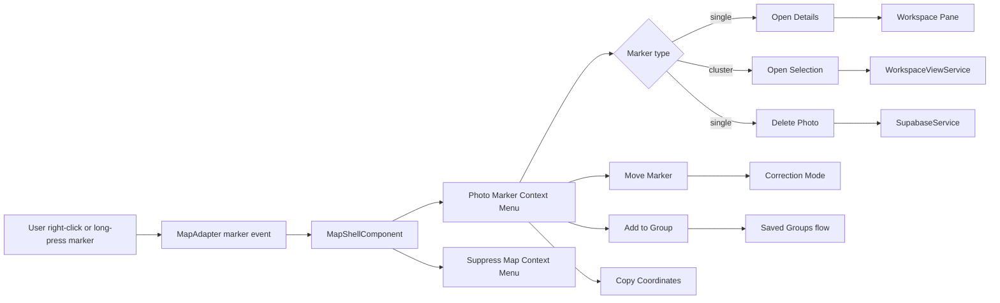
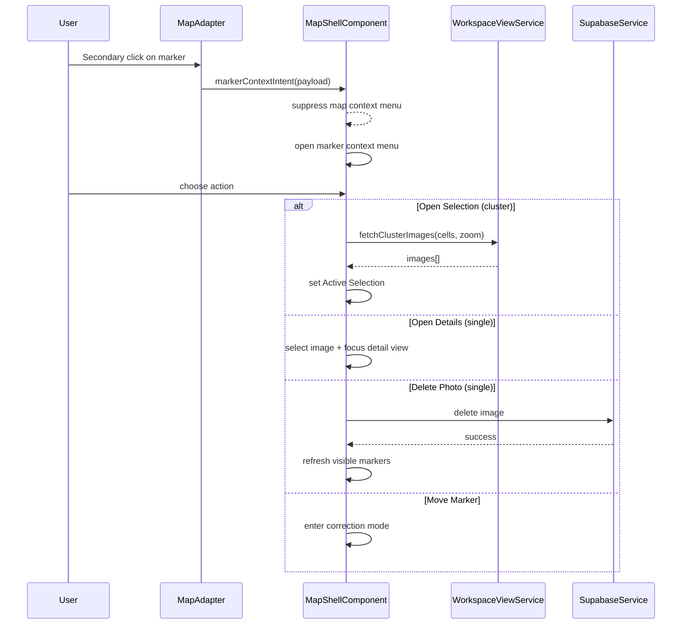

# Photo Marker Context Menu

## What It Is

A contextual action menu opened on a photo marker (single image or cluster) via right-click on desktop or long-press on touch. It enables marker-scoped actions without navigating away from the map.

Primary use cases are: quick inspection (`Open details`), spatial correction (`Move marker`), curation (`Add to group`), and destructive cleanup (`Delete photo` for single-image markers only).

## What It Looks Like

Desktop uses a compact popover anchored to the marker hit zone. Mobile uses a bottom action sheet with the same action order. The surface follows the shared dropdown shell: `--color-bg-elevated`, `1px` border (`--color-border`), `--elevation-dropdown`, `--radius-lg`. Action rows use `.dd-item` primitives with `2.75rem` (44px) minimum row height and `0.8125rem` labels. Destructive rows use `.dd-item--danger`.

For cluster markers, the menu header shows a compact summary (for example: `12 photos here`) and hides single-image-only actions. For single markers, the header can include thumbnail + capture time preview when available.

## Where It Lives

- **Route**: Global within map route `/`
- **Parent**: Map Zone (`MapShellComponent`) / marker overlay layer
- **Appears when**: Secondary click or long-press is performed on a marker target

## Actions & Interactions

| #   | User Action                                       | System Response                                        | Triggers                                       |
| --- | ------------------------------------------------- | ------------------------------------------------------ | ---------------------------------------------- |
| 1   | Right-clicks single marker (desktop)              | Opens marker context menu anchored to marker           | marker target hit-test                         |
| 2   | Long-presses single marker (mobile)               | Opens action-sheet marker menu                         | touch long-press recognizer                    |
| 3   | Selects `Open Details` (single)                   | Opens Workspace Pane and focuses image detail          | selection + detail routing state               |
| 4   | Selects `Open Selection` (cluster)                | Loads cluster images into Active Selection             | `WorkspaceViewService.fetchClusterImages(...)` |
| 5   | Selects `Move Marker`                             | Enters marker correction mode for that marker          | map correction interaction state               |
| 6   | Selects `Add to Group...`                         | Opens group assignment flow for selected marker images | group assignment UI                            |
| 7   | Selects `Copy Coordinates`                        | Copies marker lat/lng and shows success toast          | clipboard + toast                              |
| 8   | Selects `Delete Photo` (single only)              | Opens confirmation, then deletes image on confirm      | delete flow                                    |
| 9   | Clicks outside / presses Escape / taps backdrop   | Closes menu without side effects                       | dismiss handler                                |
| 10  | Starts drag instead of long-press hold completion | Cancels menu and continues map gesture                 | gesture arbitration                            |

## Component Hierarchy

```
PhotoMarkerContextMenuHost (owned by MapShellComponent)
├── [desktop] MarkerContextPopover                   ← anchored to marker screen point
│   ├── MarkerContextHeader                          ← thumbnail/count summary
│   └── .dd-items
│       ├── .dd-item "Open Details" (single)
│       ├── .dd-item "Open Selection" (cluster)
│       ├── .dd-item "Move Marker"
│       ├── .dd-item "Add to Group..."
│       ├── .dd-item "Copy Coordinates"
│       ├── .dd-divider
│       └── .dd-item.dd-item--danger "Delete Photo" (single only)
├── [mobile] MarkerContextActionSheet                ← same actions as popover, touch-safe
└── MarkerContextBackdrop                            ← outside click/tap close
```

## Data Requirements

### Data Flow (Mermaid)



| Field                | Source                                    | Type                                  |
| -------------------- | ----------------------------------------- | ------------------------------------- |
| `markerKey`          | Marker event payload                      | `string`                              |
| `markerType`         | Marker visual state                       | `'single' \| 'cluster'`               |
| `anchorLatLng`       | Marker coordinates                        | `{ lat: number; lng: number }`        |
| `anchorScreen`       | Marker container point                    | `{ x: number; y: number }`            |
| `clusterSourceCells` | Cluster merge metadata (if cluster)       | `Array<{ lat: number; lng: number }>` |
| `imageIds`           | Single marker id or cluster lookup result | `string[]`                            |

## State

| Name                      | TypeScript Type                                                                                                    | Default | Controls                                  |
| ------------------------- | ------------------------------------------------------------------------------------------------------------------ | ------- | ----------------------------------------- |
| `markerContextOpen`       | `boolean`                                                                                                          | `false` | Menu visibility                           |
| `markerContextPayload`    | `{ markerKey: string; markerType: 'single' \| 'cluster'; lat: number; lng: number; x: number; y: number } \| null` | `null`  | Action availability and anchoring         |
| `markerContextSource`     | `'mouse' \| 'touch' \| null`                                                                                       | `null`  | Popover vs action-sheet variant           |
| `markerContextBusyAction` | `'delete' \| 'open-selection' \| 'move' \| null`                                                                   | `null`  | Disables duplicate taps while action runs |

## File Map

| File                                                               | Purpose                                                  |
| ------------------------------------------------------------------ | -------------------------------------------------------- |
| `apps/web/src/app/features/map/map-shell/map-shell.component.ts`   | Manage marker-context state and action dispatch          |
| `apps/web/src/app/features/map/map-shell/map-shell.component.html` | Render marker context popover/action-sheet               |
| `apps/web/src/app/features/map/map-shell/map-shell.component.scss` | Positioning and responsive styles for marker menu        |
| `apps/web/src/app/core/map/map-adapter.ts`                         | Add marker-context intent event contract                 |
| `apps/web/src/app/core/map/leaflet-map.adapter.ts`                 | Emit normalized marker secondary-click/long-press events |
| `docs/element-specs/photo-marker.md`                               | Cross-reference marker menu behavior from marker spec    |
| `docs/element-specs/map-context-menu.md`                           | Define precedence between map and marker context menus   |

## Wiring

### Wiring Flow (Mermaid)



- Marker context menu has higher priority than map context menu when the pointer target is a marker.
- Action availability is type-dependent (`single` vs `cluster`).
- The menu should close immediately after a successful action dispatch.

## Acceptance Criteria

- [ ] Right-click on a single marker opens marker context menu at marker position.
- [ ] Long-press on a single marker opens the mobile action-sheet variant.
- [ ] Cluster marker menu shows `Open Selection` and hides single-only actions.
- [ ] `Open Details` focuses the selected image in the Workspace Pane.
- [ ] `Move Marker` enters correction mode for the targeted marker.
- [ ] `Add to Group...` opens group assignment flow for marker image set.
- [ ] `Copy Coordinates` copies coordinates and shows success feedback.
- [ ] `Delete Photo` appears only for single markers and requires confirmation.
- [ ] Clicking outside, backdrop tap, and Escape close the menu.
- [ ] Marker menu wins over map menu when right-click target is a marker.
