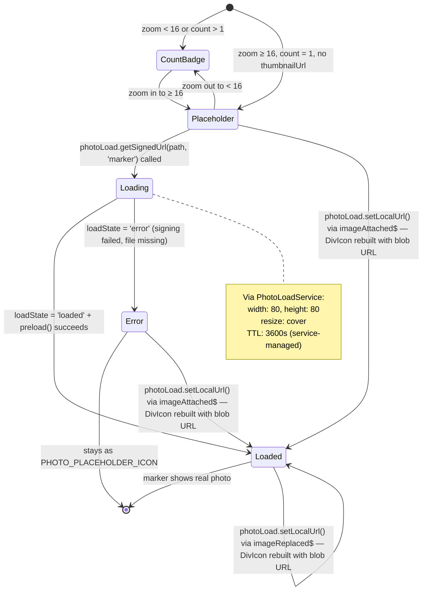
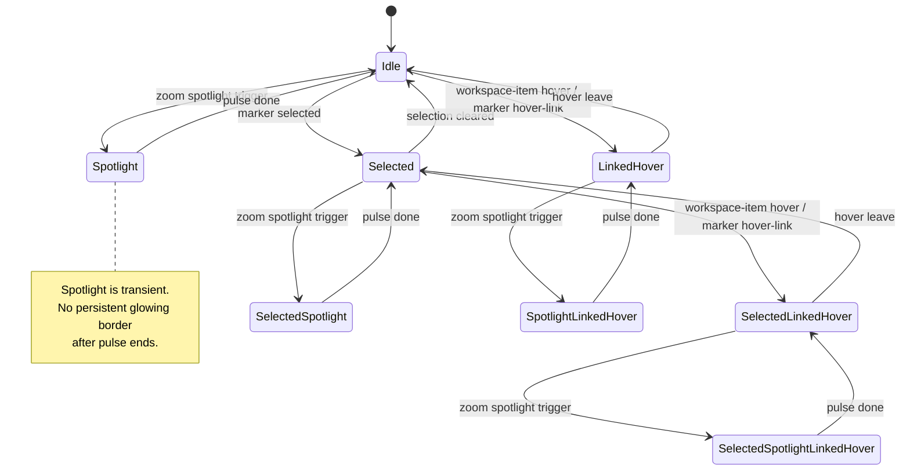
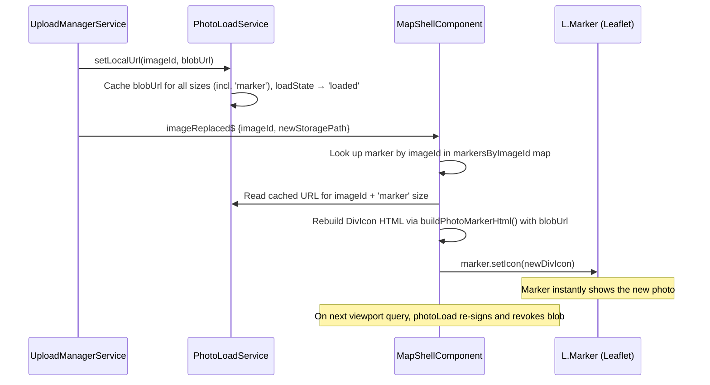
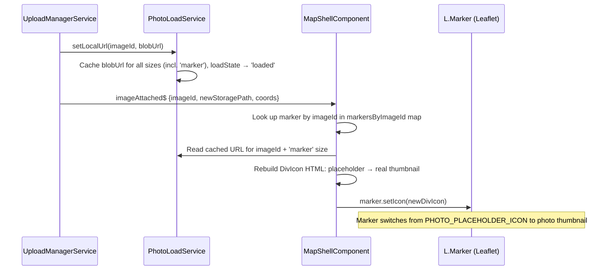
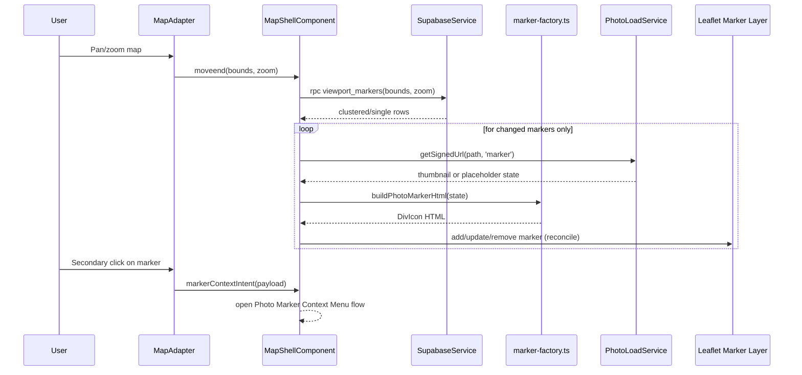

# Photo Marker

> **Blueprint:** [implementation-blueprints/photo-marker.md](../implementation-blueprints/photo-marker.md)
> **Photo loading service:** [photo-load-service](photo-load-service.md)

## What It Is

The map pin representing either a single Image or a proximity-based Cluster of nearby Images. It is always a custom square thumbnail marker centered exactly on its GPS coordinate — no pointer tail — never the default Leaflet blue pin, and it reflects selection, correction, and upload state through CSS classes applied to Leaflet DivIcon HTML.

Markers are **Leaflet DivIcon elements**, not Angular components. Marker HTML is generated by a utility function (`marker-factory.ts`) so large marker sets do not become Angular component trees. All marker state is held in services or the Map Shell and reflected through CSS classes on the generated HTML.
Marker thumbnail URLs and load states are sourced from the shared `PhotoLoadService` cache namespace that is also used by Workspace Pane detail viewer and `/media` item grid consumers.

## What It Looks Like

The marker body geometry is derived from the shared media token system: `--photo-marker-body-size: calc(var(--ui-item-media-size-default) * 1.25)` (40px), with `--ui-item-media-size-default` seeded from the shared UI item token in `styles.scss`. Single markers render a thumbnail inside a square body with `border-radius: var(--radius-md)`, a 2px white outline, and a persistent shadow for readability on light and dark tiles. **The marker body is centered exactly on the GPS coordinate** — `iconAnchor` is set to half the `iconSize` (`[20, 20]`), so the center of the hit zone sits directly on the location point. There is no pointer tail. Cluster markers are anchored at the centroid of their grid cell. Cluster markers reuse the same body geometry but with `width: auto; min-width: --photo-marker-body-size` to accommodate the count label without overflow: white background, black text (`0.875rem` bold), with counts capped at a maximum display of `999+`. The count text turns orange (`--color-clay`) when the marker is selected. Selected markers add a clear accent ring and a slight scale lift, while zoom-level classes (`.map-photo-marker--zoom-far`, `.map-photo-marker--zoom-mid`, `.map-photo-marker--zoom-near`) slightly adjust visual prominence without changing the underlying marker structure. Newly added markers fade in quickly (about `220ms`) when they enter the layer. During cluster split (large marker to smaller markers), newly created child markers originate from the previous parent-cluster centroid and glide to their new positions so the motion reads as one continuous split. When clustering reconciliation repositions a surviving marker, its map position transitions smoothly to the new coordinate (approximately `220ms`, ease-out) instead of popping to the new location. On desktop, the Direction Cone appears on hover when bearing data exists; on touch devices, the same affordance appears on long press.

## Where It Lives

- **Route**: Global within the Map Shell at `/`
- **Parent**: Map Zone via Leaflet DivIcon rendering in the map layer
- **Appears when**: Images are loaded for the current viewport or newly uploaded onto the current map

## Actions & Interactions

| #   | User Action                                      | System Response                                                                                                                                                | Triggers                                       |
| --- | ------------------------------------------------ | -------------------------------------------------------------------------------------------------------------------------------------------------------------- | ---------------------------------------------- |
| 1   | Clicks single marker                             | Adds image to Active Selection, opens Workspace Pane                                                                                                           | Selection state                                |
| 2   | Ctrl+clicks marker (desktop)                     | Adds image to Active Selection without clearing previous selection                                                                                             | Multi-select                                   |
| 2b  | Long-press + tap marker (mobile)                 | Mobile equivalent of Ctrl+click multi-select                                                                                                                   | Multi-select                                   |
| 3   | Clicks cluster marker                            | Fetches all images in cluster, loads them into Active Selection, opens Workspace Pane                                                                          | `SelectionService`, `workspacePaneOpen` → true |
| 4   | Hovers single marker (desktop)                   | Shows Direction Cone (if bearing available)                                                                                                                    | CSS `:hover`                                   |
| 5   | Long-presses single marker (touch)               | Shows Direction Cone (if bearing available)                                                                                                                    | Touch fallback                                 |
| 6   | Right-clicks marker (desktop)                    | Opens context menu (view detail, edit location, manage projects)                                                                                               | Context menu                                   |
| 6b  | Long-press marker (mobile)                       | Mobile equivalent of right-click context menu                                                                                                                  | Context menu                                   |
| 7   | Drags marker in correction mode                  | Moves marker to new position, stores corrected coordinates                                                                                                     | Correction flow                                |
| 8   | Detail view requests zoom to image               | Map recenters at detail zoom, then marker spotlight runs after marker DOM is ready; if single marker is clustered, nearest cluster receives spotlight fallback | Deferred spotlight lifecycle in Map Shell      |
| 9   | Hovers matching item in Workspace Pane           | Marker enters linked-hover highlight (secondary emphasis) while hover is active                                                                                | Cross-surface hover link                       |
| 10  | Hovers marker on map                             | Matching Workspace Pane item enters linked-hover state                                                                                                         | Cross-surface hover link                       |
| 11  | Same media opens in Workspace Detail or `/media` | Marker thumbnail URL is reused from shared cache when available; no forced re-signing purely due to route/surface switch                                       | Shared `PhotoLoadService` cache                |

## Component Hierarchy

```
PhotoMarker                                      ← Leaflet DivIcon, custom HTML, not an Angular component
├── MarkerHitZone                                ← 2.5rem × 2.5rem touch target, centered on GPS coordinate (no tail)
│   ├── MarkerBody                               ← square body (32px) sized by `--photo-marker-body-size`, rounded with `--radius-md`
│   │   ├── [single + loaded] ThumbnailImage     ← signed thumbnail URL (80×80 transform), object-fit cover
│   │   ├── [single + not loaded] Placeholder    ← CSS gradient + camera icon (SVG mask), no  tag
│   │   └── [cluster] CountLabel                 ← count (max display: 999+) at 0.875rem bold; white body auto-widens, black text, orange when selected
│   ├── [corrected] CorrectionDot                ← 8px circle, `--color-accent`, top-right corner
│   ├── [uploading] PendingRing                  ← pulsing ring, `--color-warning`
│   └── [bearing + hover-or-long-press] DirectionCone ← 30° semi-transparent directional wedge
└── [selected] SelectedRing                      ← accent outline + slight scale lift
```

## Thumbnail Loading & Placeholders

> **Full use cases:** [use-cases/photo-loading.md](../use-cases/photo-loading.md)

Single-image markers at near zoom (≥ 16) display a real photo thumbnail inside the marker body. Thumbnails are **lazy-loaded** via `PhotoLoadService` — only fetched for visible markers in the current viewport. The Map Shell calls `photoLoad.getSignedUrl(path, 'marker')` which returns a Supabase Storage signed URL with server-side image transformation (`80 × 80 px`, `cover` mode, auto-WebP). The service handles caching, staleness (50 min threshold), and re-signing automatically. When no real file exists in storage (seed data, deleted files), `photoLoad.getLoadState()` returns `'error'` and the marker renders the canonical `PHOTO_PLACEHOLDER_ICON` from `PhotoLoadService` — no broken `` icon ever appears.
This marker cache is shared with Workspace Pane detail and `/media` consumers by media identity, so already loaded media can be reused immediately across surfaces.

### Loading States

| State      | Visual                                                              | CSS Class                                     | Trigger                                                                              |
| ---------- | ------------------------------------------------------------------- | --------------------------------------------- | ------------------------------------------------------------------------------------ |
| Not loaded | Count badge (clusters) or CSS placeholder (single, no thumbnailUrl) | `.map-photo-marker--count` or `--placeholder` | Initial render                                                                       |
| Loading    | CSS placeholder with subtle pulse animation                         | `.map-photo-marker--placeholder.is-loading`   | `photoLoad.getSignedUrl(path, 'marker')` called, `loadState = 'loading'`             |
| Loaded     | Real photo `` with `object-fit: cover`                         | `.map-photo-marker--single`                   | `loadState = 'loaded'` + `photoLoad.preload(url)` succeeds                           |
| Error      | CSS placeholder (permanent, no retry)                               | `.map-photo-marker--placeholder`              | `loadState = 'error'` (signing failed, file missing)                                 |
| Optimistic | Local `ObjectURL` from fresh upload (no signed URL needed)          | `.map-photo-marker--single`                   | `photoLoad.setLocalUrl()` via `imageUploaded$` / `imageReplaced$` / `imageAttached$` |

### Thumbnail Loading Flow



> **Replace / Attach shortcut:** When `imageReplaced$` or `imageAttached$` fires, `UploadManagerService` calls `photoLoad.setLocalUrl(imageId, blobUrl)`, which injects the blob URL into the service cache at all sizes (including `'marker'`). The Map Shell reads the URL from the service cache and rebuilds the DivIcon immediately. The marker skips the loading/placeholder cycle because the blob URL is available at build time — `buildPhotoMarkerHtml()` emits an `` tag directly. On the next viewport query, normal `photoLoad.getSignedUrl()` re-signs from storage, `photoLoad.revokeLocalUrl()` frees the blob, and the signed URL takes over. See [PL-7 / PL-8](../use-cases/photo-loading.md#pl-7-replace-photo--loading-state-reset) for full interaction diagrams.

### Placeholder Design

The placeholder is a pure-CSS element — no network request, no `` tag. It uses the canonical `PHOTO_PLACEHOLDER_ICON` from `PhotoLoadService` (camera icon SVG data-URI) centered on a neutral gradient background (`--color-bg-subtle` to `--color-bg-muted`). The placeholder matches the marker body geometry exactly (same `border-radius`, same dimensions). This ensures identical placeholder visuals across markers, thumbnail cards, and the detail view.

### Signed URL Strategy (via PhotoLoadService)

The Map Shell never calls Supabase Storage directly for marker thumbnails. All signing is delegated to `PhotoLoadService`:

- **Tier 1 (marker):** `photoLoad.getSignedUrl(thumbnailSourcePath, 'marker')` → service applies `{ width: 80, height: 80, resize: 'cover' }` transform
- **Caching:** Service handles cache lookup, staleness (50 min threshold), and re-signing — the Map Shell does not manage URL expiry or `thumbnailUrl` age
- **Preload:** `photoLoad.preload(signedUrl)` confirms the image downloads before DivIcon rebuild
- **Batch signing:** For visible markers, the Map Shell calls `photoLoad.batchSign(items, 'marker')` to process all markers in a single pass
- **Staleness cleanup:** `photoLoad.invalidateStale(STALE_THRESHOLD_MS)` called before re-signing on `moveend` — replaces the manual 50-minute age check

> **Removed from Map Shell:** Direct `createSignedUrl` calls, per-marker URL caching in `PhotoMarkerState.thumbnailUrl`, manual 50-minute staleness checks, and `lazyLoadThumbnail()` — all replaced by service delegation.

## Data

| Field           | Source                                           | Type                          |
| --------------- | ------------------------------------------------ | ----------------------------- |
| Image data      | Viewport query via `SupabaseService`             | `Image[]` from `images` table |
| Cluster groups  | Server-side `ST_SnapToGrid` (zoom ≤ 14)          | `{ lat, lng, count }[]`       |
| Thumbnails      | `PhotoLoadService` signed URLs (80×80 transform) | `string` (URL)                |
| Placeholder     | CSS-only, no data source                         | —                             |
| Selection state | Map/workspace selection service or shell state   | `string[]` / marker key state |
| Bearing data    | EXIF-derived `direction` column                  | `number \| null`              |
| Corrected flag  | `latitude`/`longitude` ≠ EXIF originals          | `boolean`                     |

## State

Markers are stateless DOM elements. State is held in services or the map shell and reflected through CSS classes on the marker HTML.

| Name                   | Type                       | Default | Controls                                                                                                                                                                                                                                                                                                                  |
| ---------------------- | -------------------------- | ------- | ------------------------------------------------------------------------------------------------------------------------------------------------------------------------------------------------------------------------------------------------------------------------------------------------------------------------- |
| `selectedMarkerKey`    | `string \| null`           | `null`  | Which single marker renders the selected ring                                                                                                                                                                                                                                                                             |
| `markerZoomLevel`      | `'far' \| 'mid' \| 'near'` | `'mid'` | Which zoom modifier class is applied                                                                                                                                                                                                                                                                                      |
| `isCorrected`          | `boolean`                  | `false` | Whether the correction dot renders                                                                                                                                                                                                                                                                                        |
| `isUploading`          | `boolean`                  | `false` | Whether the pending ring renders. Driven by `UploadManagerService.jobPhaseChanged$`: set to `true` when a job targeting this marker's coordinates enters `uploading` phase; reset to `false` when the job reaches `complete` or `error`. During batch uploads, multiple markers may show the pending ring simultaneously. |
| `bearing`              | `number \| null`           | `null`  | Whether the Direction Cone can render                                                                                                                                                                                                                                                                                     |
| `linkedHoverMarkerKey` | `string \| null`           | `null`  | Secondary cross-surface highlight from Workspace Pane hover (or map hover reflection)                                                                                                                                                                                                                                     |
| `spotlightMarkerKey`   | `string \| null`           | `null`  | Transient zoom spotlight target; emits one outgoing ring animation, then returns to previous visual state                                                                                                                                                                                                                 |

### Marker Visual Priority

1. Base marker (`none`)
2. Selected marker (`selected`) — persistent
3. Linked hover (`linked-hover`) — while pointer is over corresponding item/marker
4. Spotlight (`spotlight`) — one-shot emphasis pulse for zoom-to-location

`spotlight` can be layered on top of `selected` so already selected markers can still receive extra emphasis.

### Marker Interaction State Machine



## Viewport-Driven Marker Lifecycle

Markers are loaded based on the current map viewport, not once at initialization. This section defines the lifecycle that replaces the current load-once-at-init approach. See `architecture.md` §8 for the canonical viewport query contract.

### Trigger

The Map Shell listens to Leaflet's `moveend` event (fires after pan or zoom completes). It does **not** listen to `move` or `zoomanim` — no marker work happens while the camera is animating.

### Flow

1. `moveend` fires → start a 300 ms debounce timer.
2. If another `moveend` fires within 300 ms, reset the timer (rapid pan/pinch coalescing).
3. On debounce expiry, abort any in-flight query (`AbortController`) and issue a new viewport query.
4. The query bounds are the current viewport expanded by 10% on each edge (pre-fetch buffer).
5. The server returns **clusters** at zoom ≤ 14 (`ST_SnapToGrid`) or **individual markers** at zoom ≥ 15.
6. On response:
   - **Reconcile**, don't replace: diff incoming marker keys against the current `uploadedPhotoMarkers` map.
   - **Keep** markers that still match (same key, same count) — do not recreate their DivIcon.

- **Reuse and move** outgoing markers whenever possible — first by identity match, then by nearest-marker fallback — reassign to the new key and animate `setLatLng()` so as many markers as possible glide to the new centroid.
- **Add** new markers that entered the viewport.
- **Remove** markers that left the viewport (call `marker.remove()` and delete from the map).
- **Update** markers whose count or thumbnail changed (set a new icon via `setIcon()`).

7. During the query flight, existing markers remain visible (optimistic retention).

### Constraints

- **Max 2000 results per viewport.** Beyond this the server must return clusters.
- **No marker DOM work during zoom animation.** The `zoomend` handler must not call `refreshAllPhotoMarkers()` if a viewport query is about to fire — defer to the `moveend` debounce instead.
- **Reuse marker DOM elements.** When a marker key survives across viewport changes, keep the existing `L.Marker` instance and only call `setIcon()` if the rendered state actually changed.
- Freshly uploaded markers (from `ImageUploadedEvent`) are added optimistically on the client and survive until the next viewport query reconciles them.

### Zoom-Level Behaviour (from architecture.md §8)

| Zoom Level            | Server Returns                          | Client Renders                                |
| --------------------- | --------------------------------------- | --------------------------------------------- |
| 1–10 (country/region) | Clusters only (grid-based, large cells) | Cluster markers with count badges             |
| 11–14 (city/district) | Clusters (smaller cells)                | Cluster markers; dense areas remain clustered |
| 15–17 (street)        | Individual markers + small clusters     | Individual pins; nearby pins clustered        |
| 18–19 (building)      | Individual markers only                 | Individual pins                               |

## Clustering

Clustering is proximity-based and adapts to zoom level. It is **not** tied to fixed address or administrative zoom bands.

### Server-Side Clustering (target architecture)

At zoom ≤ 14 the database returns pre-aggregated clusters using `ST_SnapToGrid` with a grid cell size that shrinks as zoom increases:

| Zoom Range | Approximate Grid Cell | Result                        |
| ---------- | --------------------- | ----------------------------- |
| 1–8        | ~10 km                | Country/region-level clusters |
| 9–11       | ~1 km                 | City-level clusters           |
| 12–14      | ~100 m                | Neighbourhood-level clusters  |

At zoom ≥ 15 the server returns individual image rows. If a grid cell at zoom 15–17 contains more images than a threshold (e.g., > 50), the server still returns a cluster for that cell.

### Client-Side Clustering (current interim implementation)

The current implementation uses `toMarkerKey()` which rounds coordinates to 4 decimal places (~11 m precision). This groups images within ~11 m of each other into a single marker regardless of zoom level. This approach:

- Works for small datasets but does **not** adapt grid size to zoom level.
- Does **not** split clusters as the user zooms in.
- Should be replaced by the server-side approach above once `ViewportQueryService` is wired.

### Cluster Expansion

When the user zooms past the cluster's grid threshold, the cluster must split into its constituent markers on the next viewport query. The client reconciles this by removing the old cluster marker and adding the new individual markers during the diff step.

### Cluster Click Behaviour

Cluster click **never zooms**. Regardless of zoom level or cluster size, clicking a cluster always opens the Workspace Pane with the cluster's images pre-loaded into the Active Selection tab.

| Cluster State               | Click Result                                                                            |
| --------------------------- | --------------------------------------------------------------------------------------- |
| Any cluster                 | Fetch all image IDs in the cluster cell, populate Active Selection, open Workspace Pane |
| Large cluster (> 50 images) | Show count badge in pane header; thumbnails load progressively as the pane scrolls      |

The map does **not** zoom or re-center on cluster click. The map stays at its current view, preserving the user's spatial context.

## Reactive Updates from Upload Manager

When the user replaces a photo or attaches a photo to a photoless row through the **Image Detail View**, the `UploadManagerService` handles the upload pipeline and emits events on success. The `MapShellComponent` subscribes to these events and applies marker changes without a full viewport refresh.

### Update Types

| Event Source                  | Marker Action                                                                  |
| ----------------------------- | ------------------------------------------------------------------------------ |
| `imageReplaced$`              | Rebuild DivIcon with new thumbnail (local ObjectURL) via `setIcon()`           |
| `imageAttached$`              | Rebuild DivIcon: placeholder → real thumbnail via `setIcon()`                  |
| `imageUploaded$` (new upload) | Creates a new optimistic marker (existing behaviour)                           |
| Correction mode drag          | Marker already at new position from drag — update key mapping + corrected flag |

### Replace Photo Flow



### Attach Photo Flow (Photoless → Photo)



### Key Mapping

Markers are keyed by coordinate-based `markerKey` (from `toMarkerKey()`). When coordinates change:

1. Remove the old `markerKey → marker` entry from the markers map.
2. Compute the new `markerKey` from the updated coordinates.
3. If the new key collides with an existing marker (another image at the same rounded location), merge into a cluster.
4. Otherwise, insert the marker under the new key.

The Map Shell also maintains a **secondary index** `markersByImageId: Map<string, L.Marker>` for O(1) lookups when handling detail view events. This index is populated during marker creation and cleaned up during marker removal.

## Performance Rules

These rules exist to prevent marker lag during map pan/zoom interactions.

1. **No marker work during camera animation.** Marker creation, icon regeneration, and DOM updates must not run during `move`, `zoom`, or `zoomanim` events. All marker work fires on `moveend` only, after a 300 ms debounce.
2. **Reconcile, don't rebuild.** On each viewport query response, diff the new marker set against the existing set. Only add/remove/update markers that actually changed. Do not clear and recreate all markers.
3. **Limit `setIcon()` calls.** Only regenerate DivIcon HTML when the marker's rendered state (count, thumbnail, selected, zoom level, corrected, uploading) actually changed. Compare the relevant fields before calling `setIcon()`.
4. **Cap DOM elements.** The map should never hold more than 2000 marker DOM elements. The server enforces this via the max-results-per-viewport cap and forced clustering at high density.
5. **Batch thumbnail signing.** When loading individual markers, batch signed-URL requests rather than issuing one per marker. Consider pre-signing URLs server-side in the viewport query response.
6. **Keep markers as DivIcon, not Angular components.** Marker HTML is raw strings from `buildPhotoMarkerHtml()`. Pulling markers into Angular's change detection tree would degrade performance.

## Settings

- **Map Marker Motion**: toggles marker fade-in and centroid glide transitions during cluster reconciliation (`Off` or `Smooth`).

## File Map

| File                                                               | Purpose                                                                        |
| ------------------------------------------------------------------ | ------------------------------------------------------------------------------ |
| `apps/web/src/app/core/map/marker-factory.ts`                      | Generates marker HTML and marker class variants for single and cluster markers |
| `apps/web/src/app/features/map/map-shell/map-shell.component.ts`   | Applies marker state, click behavior, and Leaflet marker updates               |
| `apps/web/src/app/features/map/map-shell/map-shell.component.scss` | Defines token-driven marker geometry and state styles                          |
| `apps/web/src/styles.scss`                                         | Defines shared marker sizing variables derived from the UI media token system  |

## Wiring

### Wiring Flow (Mermaid)



- The Map Shell creates Leaflet markers and delegates DivIcon HTML generation to `marker-factory.ts`.
- Marker sizing variables are declared in `styles.scss` so marker geometry derives from shared design tokens instead of hardcoded body sizes.
- The Map Shell listens to `moveend`, debounces 300 ms, then issues a viewport query. On response, it reconciles the marker set (add/remove/update) rather than rebuilding all markers.
- Freshly uploaded markers from `ImageUploadedEvent` are placed optimistically and reconciled on the next viewport query.
- **All thumbnail signing is delegated to `PhotoLoadService`.** The Map Shell calls `photoLoad.getSignedUrl(path, 'marker')` for individual markers and `photoLoad.batchSign(items, 'marker')` for batch operations. It calls `photoLoad.invalidateStale(STALE_THRESHOLD_MS)` on `moveend` before re-signing visible markers. The Map Shell **does not** call `supabase.client.storage.from('images').createSignedUrl` directly, manage per-marker URL caches, or track URL age. The service handles caching, staleness, and re-signing.
- Placeholder icons use `PHOTO_PLACEHOLDER_ICON` from `PhotoLoadService` for consistent visuals across all surfaces.
- The Map Shell passes `corrected` and `uploading` flags to `buildPhotoMarkerHtml()` when building or refreshing marker icons. `corrected` is derived from comparing current coordinates to EXIF originals. `uploading` is set during the upload lifecycle and cleared on completion or error.
- The Map Shell includes the `direction` column in the initial-load and viewport queries so that bearing-based direction cones render for all markers, not only freshly uploaded ones.
- Marker click handling opens the Workspace Pane for both single markers and cluster markers. Single marker click selects one image; cluster marker click fetches all image IDs for the cluster cell, populates Active Selection with those IDs, and signals the Workspace Pane to open. The map never zooms or re-centers on cluster click.
- Zoom-to-location intent from Image Detail View recenters map at detail zoom and starts a deferred spotlight. Spotlight starts only when marker DOM is render-ready; pending requests are re-flushed after viewport marker reconciliation.
- If the exact image marker is unavailable due to clustering, spotlight falls back to the nearest eligible cluster marker.
- Cross-surface hover-link wiring is bidirectional: Workspace Pane hover highlights marker; map marker hover highlights the matching workspace item.
- Hover direction cones are driven by CSS `:hover` on desktop. Touch long-press direction cones require a Leaflet pointer-event listener (~500 ms threshold) that toggles a `data-long-pressed` attribute or class.
- The Map Shell subscribes to `UploadManagerService.imageReplaced$` to update marker thumbnails when a photo is replaced in the detail view. On event, it looks up the marker via `markersByImageId`, reads the blob URL from `PhotoLoadService` cache, rebuilds the DivIcon, and calls `marker.setIcon()`.
- The Map Shell subscribes to `UploadManagerService.imageAttached$` to update markers when a photo is attached to a photoless row. Same lookup and rebuild flow as `imageReplaced$`, reading the blob URL from `PhotoLoadService`.
- The Map Shell maintains a `markersByImageId` secondary index (`Map<string, L.Marker>`) for O(1) lookups when applying upload manager events. This index is populated during marker creation and cleaned up during marker removal.

## Acceptance Criteria

### Marker Rendering

- [x] Never shows default Leaflet blue pin — `marker-factory.ts` uses `L.divIcon()` with custom HTML
- [x] Marker geometry derives from `--ui-item-media-size-default` — `styles.scss` defines `--photo-marker-body-size: var(--ui-item-media-size-default)` (32px)
- [x] Single markers show thumbnail — `marker-factory.ts` renders `` for `count === 1` with thumbnail URL
- [x] Cluster markers show count badge — white auto-width body, `0.875rem` bold black text; counts > 999 display as "999+"; text turns `--color-clay` (orange) when `--selected`
- [x] Cluster markers reuse the same base geometry as single markers — both share `.map-photo-marker__body` sizing
- [x] All markers have 2px white outline + drop shadow — `map-shell.component.scss` applies `border: 2px solid var(--color-bg-surface)` + `box-shadow`
- [x] Marker body center is the GPS coordinate — no tail; `iconAnchor: [20, 20]` centers the `[40, 40]` hit zone on the location point; cluster markers are anchored at grid cell centroid
- [x] Readable on both light and dark map tiles — full dark-mode token coverage in `styles.scss`

### Selection & Interaction

- [x] Click selects image and opens workspace pane — `handlePhotoMarkerClick()` calls `setSelectedMarker()` + `photoPanelOpen.set(true)`
- [x] Selected markers have a clear visual state — `.map-photo-marker--selected` applies accent ring + `scale(1.05)`
- [ ] Linked hover state exists as a secondary emphasis independent from selection (`linked-hover` class/signal)
- [ ] Zoom spotlight is transient: one outgoing pulse only, no persistent glow when pulse completes
- [ ] Zoom spotlight executes after render-ready (marker exists, visible, map movement settled)
- [ ] If target image is clustered, nearest cluster marker receives spotlight fallback
- [ ] Hovering a workspace item highlights the corresponding map marker
- [ ] Hovering a map marker highlights the corresponding workspace item
- [ ] Ctrl+click adds to Active Selection without clearing previous selection (blocked — requires `SelectionService`)
- [ ] Long-press + tap provides mobile equivalent of multi-select (blocked — requires `SelectionService`)
- [ ] Right-click opens context menu (view detail, edit location, manage projects) — see `photo-marker-context-menu.md`
- [ ] Long-press opens context menu on mobile — see `photo-marker-context-menu.md`
- [ ] Drag marker in correction mode to update coordinates (blocked — requires correction mode handler)

### Viewport-Driven Loading

- [x] Markers load based on current viewport bounds, not once at init — `moveend` + 350 ms debounce triggers viewport query
- [x] Previous in-flight viewport query is aborted when a new one starts (`AbortController`)
- [x] Query bounds expand by 10% on each edge for pre-fetch buffer
- [x] Marker set is reconciled (add/remove/update) on each viewport response — existing markers are reused, not rebuilt
- [x] Markers that leave the viewport are removed from the map
- [x] Newly uploaded markers persist optimistically until the next viewport query reconciles them
- [ ] Max 2000 markers on the map at any time; server returns clusters beyond this cap (server-side enforcement)

### Clustering

- [x] Cluster click never zooms — `map.setView()` is NOT called on cluster click
- [ ] Cluster click fetches all image IDs within the cluster cell and populates Active Selection (blocked — requires `SelectionService`)
- [x] Cluster click opens the Workspace Pane with Active Selection tab active
- [x] Zoom modifier classes adjust prominence without changing marker structure — `.map-photo-marker--zoom-far/mid/near` CSS classes applied
- [x] Client-side clustering via coordinate rounding to 7 decimal places (`toMarkerKey()`) + pixel-distance overlap merge — interim implementation
- [ ] Server-side clustering via `ST_SnapToGrid` with zoom-dependent grid cell size (server-side, not yet wired)
- [ ] Cluster grid cell size adapts to zoom level (large cells at low zoom, small cells at high zoom) (server-side)
- [ ] Clusters expand into individual markers when user zooms past the cluster's grid threshold (server-side)
- [x] Collision offsets prevent overlapping marker bodies when nearby but not clustered — `mergeOverlappingClusters()` pixel-distance merge
- [x] When clustering reconciliation shifts a surviving marker to a new centroid, it transitions smoothly to the new position (about 220 ms ease-out) instead of remove/add popping
- [x] Newly created and reused/re-keyed markers fade in on reconciliation (about 220 ms), while reduced-motion users get no fade animation
- [x] On cluster split, child markers visually emerge from the previous parent-cluster centroid before settling at their final positions

### Performance

- [x] No marker DOM work during zoom animation — all updates fire on `moveend` only (`zoomAnimating` flag)
- [x] DivIcon HTML is not regenerated when rendered state has not changed (`refreshPhotoMarker` dirty-checks via `lastRendered` snapshot)
- [x] `refreshAllPhotoMarkers()` on `zoomend` is replaced by viewport-query-driven reconciliation (`handleMoveEnd` debounce)
- [ ] Thumbnail signed-URL requests are batched via `photoLoad.batchSign(items, 'marker')`, not issued per-marker

### Thumbnail Loading & Placeholders

- [x] Single markers at near zoom show `PHOTO_PLACEHOLDER_ICON` from `PhotoLoadService` while thumbnail URL is loading
- [x] Placeholder uses gradient background + `PHOTO_PLACEHOLDER_ICON` (SVG data-URI), no `` tag
- [x] Placeholder matches marker body geometry exactly (same border-radius, dimensions)
- [ ] Thumbnail signing delegated to `PhotoLoadService` via `photoLoad.getSignedUrl(path, 'marker')` — Map Shell does not call `createSignedUrl` directly
- [ ] Service applies `transform: { width: 80, height: 80, resize: 'cover' }` for marker size preset
- [x] Error from signing (file missing) leaves `PHOTO_PLACEHOLDER_ICON` visible — no broken `` icon
- [x] Freshly uploaded markers use local `ObjectURL` as thumbnail via `photoLoad.setLocalUrl()` — no placeholder needed
- [ ] Signed URLs cached by `PhotoLoadService` — Map Shell does not maintain per-marker `thumbnailUrl` age tracking
- [ ] Marker cache entries are shared with Workspace Pane detail and `/media` media-item consumers using the same media identity key.
- [ ] Staleness managed by `photoLoad.invalidateStale(STALE_THRESHOLD_MS)` called on `moveend` — replaces manual 50-minute age check
- [ ] Batch signing via `photoLoad.batchSign(items, 'marker')` for visible markers in a single pass
- [ ] Preload via `photoLoad.preload(signedUrl)` confirms image downloads before DivIcon rebuild
- [x] On `imageReplaced$`: blob URL from `PhotoLoadService` cache used to rebuild DivIcon instantly — no placeholder flash
- [x] On `imageAttached$`: blob URL from `PhotoLoadService` cache used to rebuild DivIcon — placeholder → real thumbnail
- [ ] `localObjectUrl` freed via `photoLoad.revokeLocalUrl()` after signed URL takes over on next viewport query

### State Affordances

- [x] Correction dot visible only for corrected markers — `corrected` flag passed from `map-shell.component.ts` to `buildPhotoMarkerHtml()`
- [ ] Pending upload ring pulses during upload — requires `uploadStarted` event from UploadPanel (blocked — UploadPanel only emits after success)
- [x] Direction cone appears on hover when bearing data exists — CSS `:hover` rule works; bearing flows from `ImageUploadedEvent`
- [x] Direction cone appears on long press when bearing data exists on touch devices — `pointerdown` 500 ms timer toggles `.map-photo-marker--long-pressed`; CSS shows cone for that class
- [x] Direction cone rendered for database-loaded markers — `direction` column included in initial load query
- [x] Direction cone rotates to reflect actual bearing — inline `transform:rotate(bearing-90deg)` set in `buildPhotoMarkerHtml()`

### Reactive Updates from Upload Manager

- [x] `markersByImageId` secondary index maintained for O(1) marker lookups by image UUID
- [x] `MapShellComponent` subscribes to `UploadManagerService.imageReplaced$` — reads blob URL from `PhotoLoadService` cache, rebuilds marker DivIcon on photo replace
- [x] `MapShellComponent` subscribes to `UploadManagerService.imageAttached$` — reads blob URL from `PhotoLoadService` cache, updates marker from placeholder to real thumbnail on photo attach
- [x] Marker thumbnail uses blob URL from `PhotoLoadService` for instant display (no signed-URL delay); replaced by signed URL on next `photoLoad.getSignedUrl()` call
- [ ] Correction mode drag updates `corrected` flag, shows correction dot, and updates `markerKey` mapping — handled by MapShell directly, not through Upload Manager
- [ ] Coordinate change from correction mode updates the `markerKey` mapping (remove old key, insert new key)
- [x] Upload Manager events and correction mode edits do not trigger a viewport query — changes are applied locally and reconciled on the next natural `moveend`
