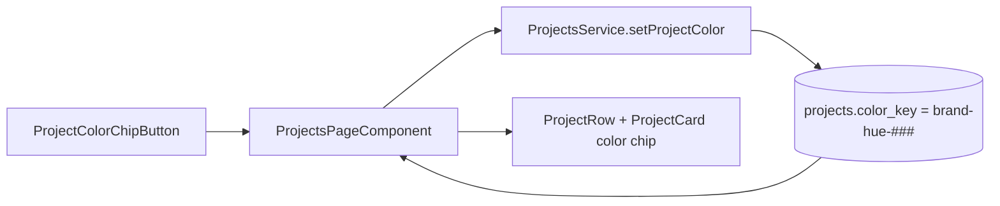
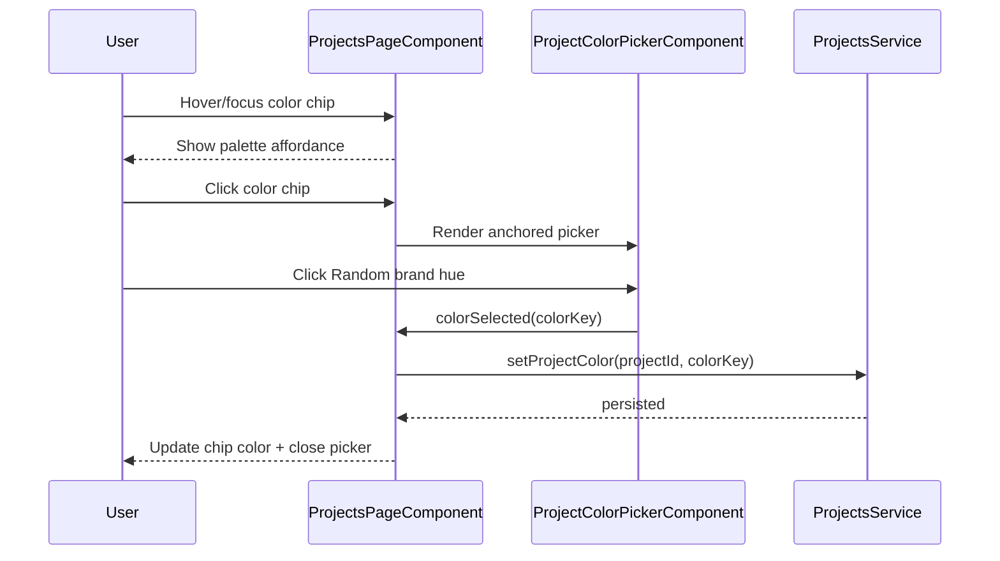

# Project Color Picker

## What It Is

A compact color-selection overlay for project tagging on the Projects page. It opens from the project color chip and, in the temporary phase, provides a single quick action that assigns a random hue derived from the Feldpost brand orange.

## What It Looks Like

The trigger is a larger circular color chip inside project rows and cards. On hover/focus, a palette affordance appears over the chip to communicate editability. On click/tap, an anchored floating panel opens near the chip and uses the same visual language as existing dropdowns (`dd-*` primitives). The panel currently contains one action row, "Random brand hue", with a live swatch preview.

## Where It Lives

- Route: /projects
- Parent: ProjectsPageComponent
- Trigger condition: User hovers/focuses a project color chip (affordance only) and clicks/taps it (opens picker)

## Actions & Interactions

| # | User Action | System Response | Triggers |
| --- | --- | --- | --- |
| 1 | Hovers color chip | Shows palette affordance on chip | CSS hover state |
| 2 | Focuses chip via keyboard | Shows same affordance and focus ring | `:focus-visible` |
| 3 | Clicks/taps color chip | Opens picker anchored to that project item | `coloringProjectId` |
| 4 | Clicks "Random brand hue" | Generates and persists `brand-hue-###`, updates chip color in list/card | `ProjectsService.setProjectColor` |
| 5 | Clicks outside picker | Closes picker without changing color | click outside handler |
| 6 | Presses Escape while open | Closes picker | escape handler |

## Component Hierarchy

```
ProjectsPageComponent
├── ProjectRow / ProjectCard
│   ├── ProjectColorChipButton
│   │   ├── ProjectColorDot
│   │   └── PaletteAffordanceIcon (hover/focus only)
│   └── [coloringProjectId===project.id] ProjectColorPickerComponent
│       └── RandomBrandHueButton
```

## Data Requirements

### Data Flow



| Field | Source | Type |
| --- | --- | --- |
| `projects.color_key` | `projects` table | `ProjectColorKey` |
| `selectedColor` | Current project row/card model | `ProjectColorKey` |
| `coloringProjectId` | Local UI state | `string \| null` |

Supported keys include semantic values (`clay`, `accent`, `success`, `warning`) and generated brand-hue values (`brand-hue-###`, where ### is 0-359).

## State

| Name | Type | Default | Controls |
| --- | --- | --- | --- |
| `coloringProjectId` | `string \| null` | `null` | Which row/card currently shows an open picker |
| `projects[].colorKey` | `ProjectColorKey` | `clay` | Current swatch color in list/cards |

## File Map

| File | Purpose |
| --- | --- |
| `apps/web/src/app/features/projects/projects-page.component.html` | Color chip trigger markup in row/card layouts |
| `apps/web/src/app/features/projects/projects-page.component.scss` | Trigger sizing, hover affordance, and anchor placement |
| `apps/web/src/app/features/projects/project-color-picker.component.ts` | Picker option UI and color selection output |
| `apps/web/src/app/features/projects/projects-page.component.ts` | Open/close + persist color-selection behavior |
| `apps/web/src/app/features/projects/projects-page.component.spec.ts` | Interaction and overlay behavior tests |

## Wiring

### Integration Sequence



- The trigger lives in both project list rows and project cards.
- The picker is anchored to the clicked project item and uses existing click-outside + escape handling from Projects page overlays.
- Selection closes the picker after successful persistence.

## Acceptance Criteria

- [ ] Color chip trigger is larger than status dots and visually discoverable in both list and card layouts.
- [ ] Hover and keyboard focus reveal a palette affordance on the color chip.
- [ ] Clicking/tapping the chip opens a single anchored picker for that project.
- [ ] Picker surface uses the same dropdown visual primitives as other toolbar dropdowns.
- [ ] Clicking the single random action persists `brand-hue-###` and updates UI immediately.
- [ ] Clicking outside or pressing Escape closes the picker.
- [ ] Picker remains keyboard-accessible (`button` trigger + focus-visible states).

## Settings

- **Project Color Palette**: temporary one-click random brand-hue generation (`brand-hue-###`) derived from brand orange by varying hue.
