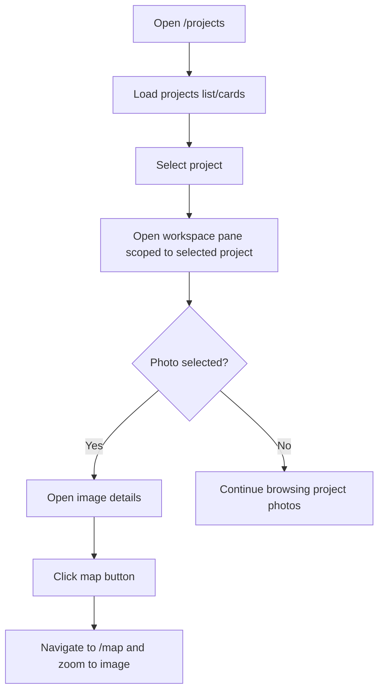

# Project Details View

## What It Is

A project-scoped workspace detail mode inside the Projects Page. It opens when a project is selected and reuses the existing workspace/image-detail experience to browse only that project's photos while remaining on `/projects`.

## What It Looks Like

The layout is projects-first: project list/cards remain the primary surface and a workspace pane opens with the selected project context. The pane shows the project's photos in the existing grid/collection presentation and can open image details inline. No embedded map is shown in this view. Map linkage is provided by the image-details map action, which opens `/map` and zooms to the selected image location. Surfaces use shared `.ui-container` geometry and tokenized spacing.

## Where It Lives

- **Route**: `/projects`
- **Parent**: `ProjectsPage`
- **Appears when**: User clicks a project row/card or "Open in workspace"

## Actions

| #   | User Action                                    | System Response                                                                 | Triggers                         |
| --- | ---------------------------------------------- | ------------------------------------------------------------------------------- | -------------------------------- |
| 1   | Opens `/projects`                              | Loads projects list/cards and related metadata                                  | Router + projects data service   |
| 2   | Clicks a project row/card                      | Sets selected project and opens workspace pane scoped to that project           | `selectedProjectId` + pane state |
| 3   | Clicks "Open in workspace"                     | Opens the same project-scoped workspace pane (no route change)                  | Shared open action               |
| 4   | Clicks a photo thumbnail in the workspace pane | Opens image details for the selected photo                                      | Existing image detail state      |
| 5   | Clicks map button in image details             | Navigates to `/map` and centers/zooms to the selected image location            | Router + map focus payload       |
| 6   | Closes workspace pane                          | Returns to projects list/cards context while preserving search/filter/view mode | Pane close action                |

### Interaction Flowchart



## Component Hierarchy

```
ProjectsPage (host route)
├── ProjectsList / ProjectsCardGrid
└── WorkspacePaneComponent (reused)
    ├── PaneHeader
    │   ├── Project context title
    │   └── CloseButton
    ├── PhotoGrid / CollectionThumbnails (reused)
    └── ImageDetailView (reused)
        └── MapButton → navigate `/map` and focus selected image
```

## Data

| Field                   | Source                                                            | Type                 |
| ----------------------- | ----------------------------------------------------------------- | -------------------- | ----- |
| Active project          | Selected project from projects list/cards + projects table        | `string` / `Project` |
| Project-scoped images   | Existing map/workspace data pipeline filtered by project ID       | `Image[]`            |
| Selected image location | Existing image record geo fields used by image details map action | `LatLng \\           | null` |

## State

| Name                | Type                                                    | Default | Controls                            |
| ------------------- | ------------------------------------------------------- | ------- | ----------------------------------- |
| `selectedProjectId` | `string \| null`                                        | `null`  | Active project scope                |
| `workspacePaneOpen` | `boolean`                                               | `false` | Workspace visibility                |
| `selectedImageId`   | `string \| null`                                        | `null`  | Active image details                |
| `mapFocusPayload`   | `{ imageId: string; lat: number; lng: number } \| null` | `null`  | Navigation payload for `/map` focus |

## File Map

| File                                                                       | Purpose                                                      |
| -------------------------------------------------------------------------- | ------------------------------------------------------------ |
| `apps/web/src/app/features/projects/projects-page.component.ts`            | Host page state for project selection + workspace visibility |
| `apps/web/src/app/features/map/workspace-pane/workspace-pane.component.ts` | Reused pane for project-scoped photo browsing                |
| `apps/web/src/app/features/image-detail/image-detail-view.component.ts`    | Reused details view with map action                          |
| `apps/web/src/app/features/projects/projects-page.component.spec.ts`       | Integration tests for in-page project details behavior       |

## Wiring

- Keep route as `{ path: 'projects', component: ProjectsPageComponent }`.
- On project open action, set selected project scope in page/workspace state without route transition.
- Reuse existing Workspace Pane and Image Details components for project-scoped photo browsing.
- Wire image-details map action to navigate to `/map` with selected image coordinates and id so map can zoom/focus target photo.

## Acceptance Criteria

- [ ] Clicking a project in `/projects` opens project details in the workspace pane without leaving `/projects`.
- [ ] Existing workspace grid/collection and image details components are reused (no duplicate implementations).
- [ ] Workspace content is filtered to the selected project photos.
- [ ] Image details map button navigates to `/map` and zooms/focuses the selected photo location.
- [ ] Closing the workspace pane preserves prior projects-page search/filter/view-mode state.
