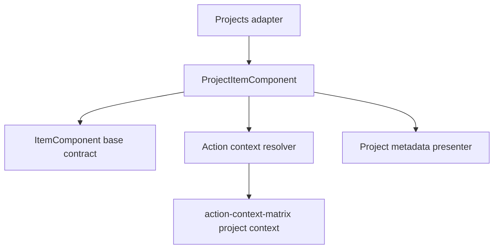
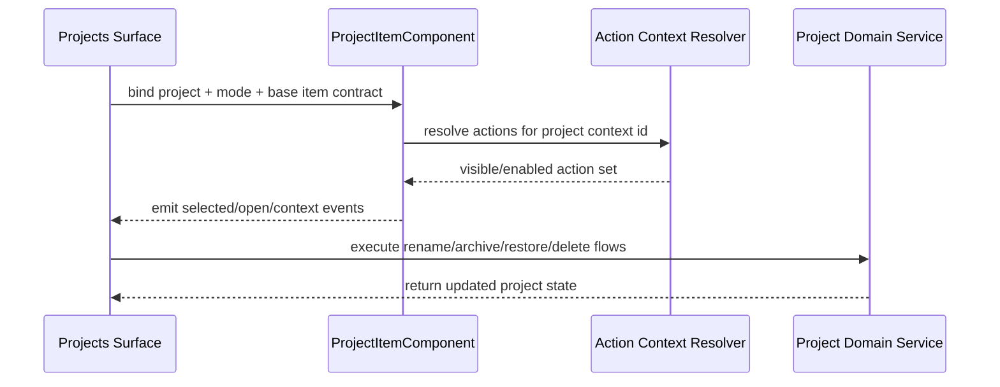

# Project Item

## What It Is

Project Item is the domain-specific item contract for rendering one project entry inside Item Grid surfaces used by `/projects` and related project-selection contexts. It defines mode-specific visuals, metadata presentation, and project actions mapped through the action-context matrix contract.

## What It Looks Like

The component renders a tokenized project frame with name, counts, status, and activity metadata in a stable structure across modes. `row` emphasizes dense, scanable metadata with inline actions; grid/card modes prioritize visual grouping with a clear status region. Active and archived project states use deterministic token-based accents and badges. The item inherits shared loading/error/empty behavior from ItemComponent, while selected emphasis is project-domain owned. Sizing and spacing use `rem` for interactive and layout-sensitive dimensions.

## Where It Lives

- Parent spec: `docs/element-specs/item-grid.md`
- Related page contract: `docs/element-specs/projects-page.md`
- Child component root: `apps/web/src/app/features/projects/project-item.component.ts`
- Route consumers:
  - `/projects`
  - Project-selection panels/dialogs that use Item Grid contracts
- Trigger: projected project-domain item inside `ItemGridComponent`

## Actions & Interactions

| #   | User Action / System Trigger                                  | System Response                                                            | Trigger               |
| --- | ------------------------------------------------------------- | -------------------------------------------------------------------------- | --------------------- |
| 1   | User opens project item                                       | Emits open event and scopes parent workspace/details to selected project   | open click/keyboard   |
| 2   | User toggles selection                                        | Emits `selectedChange` while preserving shared state-frame behavior        | select action         |
| 3   | User opens project context actions                            | Resolves action set from project action context contract in action matrix  | context trigger       |
| 4   | User chooses rename action                                    | Starts rename flow via parent orchestration                                | project action        |
| 5   | User chooses archive action on active project                 | Triggers archive confirmation and update flow                              | project action        |
| 6   | User chooses restore action on archived project               | Triggers restore confirmation and update flow                              | project action        |
| 7   | User chooses delete action on archived project                | Triggers destructive confirmation and delete flow                          | project action        |
| 8   | Mode changes (`grid-sm`, `grid-md`, `grid-lg`, `row`, `card`) | Updates item geometry and metadata emphasis according to mode contract     | `mode` input change   |
| 9   | Project data updates (counts/status/activity)                 | Re-renders metadata with deterministic ordering and labels                 | item data update      |
| 10  | Shared loading/error state is active                          | Uses ItemStateFrame layers; project content remains gated by base contract | `loading/error` input |

## Component Hierarchy

```text
ProjectItemComponent
├── ItemStateFrame binding (shared state frame contract)
│   └── Domain content outlet
├── Project visual frame
│   ├── Project identity region
│   │   ├── Project name
│   │   ├── Project status badge (active/archived)
│   │   └── Optional color chip
│   ├── Project metadata region
│   │   ├── Result count
│   │   ├── Media count
│   │   └── Last activity
│   └── Project actions region
│       ├── Open
│       ├── Rename
│       ├── Archive/Restore
│       └── Delete (archived only)
└── Mode-specific layout wrappers
    ├── row
    ├── grid-sm/grid-md/grid-lg
    └── card
```

## Data

Project Item receives normalized project view models from parent adapters and does not query Supabase directly.

### Data Flow (Mermaid)



| Field             | Source           | Type                                                     | Purpose                                     |
| ----------------- | ---------------- | -------------------------------------------------------- | ------------------------------------------- |
| `itemId`          | parent adapter   | `string`                                                 | Stable identity for selection/open events   |
| `projectId`       | parent adapter   | `string`                                                 | Domain identifier for project actions       |
| `name`            | parent adapter   | `string`                                                 | Primary project label                       |
| `status`          | parent adapter   | `'active' \| 'archived'`                                 | Determines status styling and action set    |
| `resultCount`     | parent adapter   | `number`                                                 | Query-match count for current filter/search |
| `mediaCount`      | parent adapter   | `number`                                                 | Total media volume metadata                 |
| `lastActivityAt`  | parent adapter   | `string \| null`                                         | Relative/absolute activity label source     |
| `colorToken`      | parent adapter   | `string \| null`                                         | Project accent/color indicator              |
| `actionContextId` | parent adapter   | `string`                                                 | Binds to project context in action matrix   |
| `mode`            | parent container | `'grid-sm' \| 'grid-md' \| 'grid-lg' \| 'row' \| 'card'` | Visual layout contract                      |

## State

| Name              | TypeScript Type                                          | Default     | What it controls                            |
| ----------------- | -------------------------------------------------------- | ----------- | ------------------------------------------- |
| `mode`            | `'grid-sm' \| 'grid-md' \| 'grid-lg' \| 'row' \| 'card'` | `'grid-md'` | Mode-specific layout                        |
| `status`          | `'active' \| 'archived'`                                 | `'active'`  | Badge and action gating                     |
| `selected`        | `boolean`                                                | `false`     | Shared selected visuals and events          |
| `loading`         | `boolean`                                                | `false`     | Shared loading gating via ItemStateFrame    |
| `error`           | `boolean`                                                | `false`     | Shared error surface via ItemStateFrame     |
| `actionContextId` | `string \| null`                                         | `null`      | Project action contract resolution          |
| `canDelete`       | `boolean`                                                | `false`     | Archived-only destructive action visibility |

### Visual Contract by Mode

| Mode      | Visual emphasis                                                |
| --------- | -------------------------------------------------------------- |
| `row`     | Dense metadata-first row with actions aligned to row end       |
| `grid-sm` | Compact card with name + key counts                            |
| `grid-md` | Balanced card with status badge and secondary metadata         |
| `grid-lg` | Expanded card with full metadata region and action affordances |
| `card`    | Presentation-first card variant for mixed surfaces             |

## State Machine

FSM scope rule:

- Required because this component has programmatic state (`status`, selection, loading/error/empty gating, disabled/action availability).
- CSS pseudo-classes alone cannot represent project action and status transitions.

### State Enum

```ts
export type ProjectItemState =
  | "content-active"
  | "content-archived"
  | "loading"
  | "error"
  | "empty"
  | "selected-active"
  | "selected-archived"
  | "disabled";
```

### Transition Map

```ts
export const PROJECT_ITEM_TRANSITIONS: Record<
  ProjectItemState,
  ProjectItemState[]
> = {
  "content-active": [
    "selected-active",
    "loading",
    "error",
    "disabled",
    "content-archived",
  ],
  "content-archived": [
    "selected-archived",
    "loading",
    "error",
    "disabled",
    "content-active",
  ],
  loading: ["content-active", "content-archived", "error", "empty", "disabled"],
  error: ["loading", "content-active", "content-archived", "disabled"],
  empty: ["loading", "content-active", "content-archived", "disabled"],
  "selected-active": [
    "content-active",
    "disabled",
    "error",
    "loading",
    "content-archived",
  ],
  "selected-archived": [
    "content-archived",
    "disabled",
    "error",
    "loading",
    "content-active",
  ],
  disabled: [
    "content-active",
    "content-archived",
    "selected-active",
    "selected-archived",
    "loading",
    "error",
    "empty",
  ],
};
```

### Transition Guard Contract

- Project item state transitions pass through a guard function.
- Unlisted transitions are rejected.
- Root visual driver is `[attr.data-state]`.
- Parent/child coordination required: parent project surfaces must provide one `ProjectItemState` input and migrate away from boolean visual-state inputs.

### Transition Choreography Table (Required Before CSS)

| from -> to                            | step | element                    | property                    | timing token                 | delay                            |
| ------------------------------------- | ---- | -------------------------- | --------------------------- | ---------------------------- | -------------------------------- |
| `loading -> content-*`                | 1    | loading layer              | opacity                     | `var(--transition-fade-out)` | `0ms`                            |
| `loading -> content-*`                | 2    | project frame              | opacity                     | `var(--transition-fade-in)`  | `var(--transition-reveal-delay)` |
| `content-* -> selected-*`             | 1    | project frame emphasis     | outline/background emphasis | `var(--transition-emphasis)` | `0ms`                            |
| `content-active <-> content-archived` | 1    | status badge/action region | color/opacity               | `var(--transition-fade-in)`  | `0ms`                            |
| `content-* -> disabled`               | 1    | frame root                 | opacity                     | `var(--transition-emphasis)` | `0ms`                            |

## Boolean Input Migration Required

- Migration required: yes.
- Current public visual-state inputs are split booleans (`loading`, `error`, `empty`, `selected`, `disabled`).
- Target contract is one enum input (`state: ProjectItemState`) plus non-visual project payload fields.
- Parent call-site migration required: yes (`/projects` item-grid consumers and project selection surfaces binding `app-project-item`).

## File Map

| File                                                             | Purpose                                     |
| ---------------------------------------------------------------- | ------------------------------------------- |
| `apps/web/src/app/features/projects/project-item.component.ts`   | Project item orchestration and outputs      |
| `apps/web/src/app/features/projects/project-item.component.html` | Project item template and mode regions      |
| `apps/web/src/app/features/projects/project-item.component.scss` | Project domain visuals by mode              |
| `apps/web/src/app/features/projects/project-item.utils.ts`       | Optional metadata formatting/action helpers |

## Wiring

### Injected Services

- Project domain service(s) for archive/restore/delete/rename orchestration
- Action resolver that maps `actionContextId` against action-context matrix
- Optional i18n service for labels and date formatting

### Inputs / Outputs

- Inputs:
  - `itemId`, `mode`, `loading`, `error`, `empty`, `selected`, `disabled`, `actionContextId`
  - `project` (normalized project item view model)
- Outputs:
  - `selectedChange`
  - `opened`
  - `retryRequested`
  - `contextActionRequested`

### Subscriptions

- Project metadata updates from parent adapter signals
- Action-availability updates from context resolver
- No direct backend subscriptions in item component

### Supabase Calls

- None direct in component
- Delegated through project domain services

### Wiring Flow (Mermaid)



## Visual Behavior Contract

### Ownership Matrix

| Behavior          | Visual Geometry Owner    | Stacking Context Owner  | Interaction Hit-Area Owner                | Selector(s)                                    | Layer (z-index/token) | Test Oracle                                       |
| ----------------- | ------------------------ | ----------------------- | ----------------------------------------- | ---------------------------------------------- | --------------------- | ------------------------------------------------- |
| Project frame     | `.project-item__frame`   | `app-project-item:host` | `.project-item__open`                     | `.project-item__frame`                         | layer/content (0)     | frame bounds remain stable across modes           |
| Selected emphasis | `.project-item__frame`   | `app-project-item:host` | `.project-item__open` and action controls | `.project-item__frame--selected`               | layer/selected        | selected emphasis remains frame-scoped            |
| Status badge      | `.project-item__status`  | `.project-item__frame`  | none                                      | `.project-item__status--active` / `--archived` | layer/content         | active vs archived badge is deterministic         |
| Action reveal     | `.project-item__actions` | `app-project-item:host` | `.project-item__action-button*`           | `.project-item__actions`                       | layer/actions         | actions remain keyboard reachable and mode stable |

### Ownership Triad Declaration

| Behavior          | Geometry Owner           | State Owner                                                         | Visual Owner                                                        | Same element?                                                                        |
| ----------------- | ------------------------ | ------------------------------------------------------------------- | ------------------------------------------------------------------- | ------------------------------------------------------------------------------------ |
| Project frame     | `.project-item__frame`   | `.project-item__frame`                                              | `.project-item__frame`                                              | ✅                                                                                   |
| Selected emphasis | `.project-item__frame`   | `.project-item__frame--selected`                                    | `.project-item__frame--selected`                                    | ✅                                                                                   |
| Status badge      | `.project-item__status`  | `.project-item__status--active` / `.project-item__status--archived` | `.project-item__status--active` / `.project-item__status--archived` | ✅                                                                                   |
| Action reveal     | `.project-item__actions` | `.project-item--selected` (parent state gate)                       | `.project-item__actions`                                            | ⚠️ exception — reveal can be parent-state driven for stable focus/selection behavior |

## Acceptance Criteria

- [ ] Project Item has its own dedicated child spec and is referenced by Item Grid parent spec.
- [ ] The component supports all five Item Grid modes with explicit visual behavior.
- [ ] Shared loading/error/empty behavior remains owned by ItemComponent/ItemStateFrame; selected emphasis is project-domain owned on `.project-item__frame`.
- [ ] Project metadata rendering includes name, status, result count, media count, and last activity.
- [ ] Project actions resolve through action-context matrix context binding, not hardcoded local menus.
- [ ] Active vs archived status deterministically gates archive/restore/delete actions.
- [ ] Component performs no direct Supabase calls.
- [ ] Inputs/outputs remain aligned with ItemComponent mandatory contract.
- [ ] File map and wiring cover all required project-item implementation files.
- [ ] Exactly two geometry owners exist in each render path (outer layout owner and innermost content owner).
- [ ] Visual output is driven by one enum state input with `[attr.data-state]`; boolean visual-state inputs are removed.
- [ ] Transition choreography uses tokenized timings (`var(--transition-*)`) and no magic numbers.
- [ ] `npm run lint` and `ng build` are clean for the migration scope.
