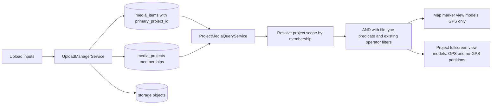
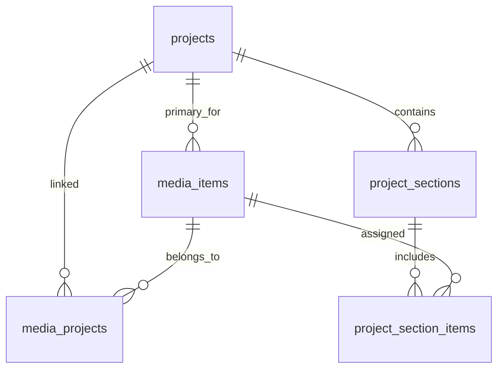
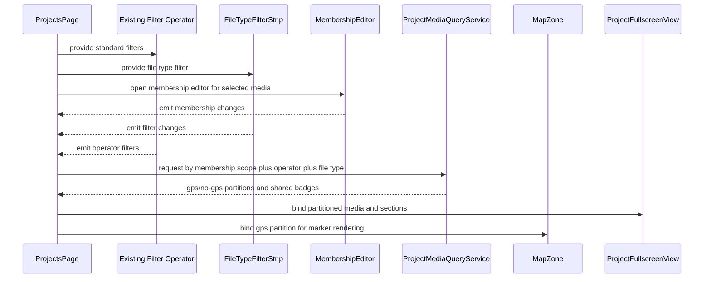

# Project Mixed Media Pre-Spec

> Use cases: [project-mixed-media.md](../use-cases/project-mixed-media.md)

## What It Is

A pre-spec contract for adding document and video support next to photos while keeping Feldpost map-first and stable. Every media item has one `primary_project_id`; GPS media may also belong to additional projects via membership links.

## What It Looks Like

The map keeps current marker and cluster language, but individual markers gain media-type signatures: photo squares, document portrait cards (3:4), and video cards with play badge. Fullscreen project view uses two lanes: GPS media on top and project-only no-GPS media below. Shared GPS media shows a compact "shared" badge in project lists. A compact File Type filter strip sits beside existing toolbar controls but remains separate from the generic Filter operator.

## Where It Lives

- Route: `/projects` (primary), `/map` (media-aware marker rendering)
- Parent: `ProjectsPageComponent`, `MapShellComponent`
- Appears when: user uploads mixed media, toggles file type filter, opens fullscreen project view, or manages project Sections and memberships

## Actions

| #   | User Action                                      | System Response                                                     | Triggers                       |
| --- | ------------------------------------------------ | ------------------------------------------------------------------- | ------------------------------ |
| 1   | Uploads mixed files to selected project          | Creates media item with `primary_project_id` and initial membership | Upload manager pipeline        |
| 2   | Upload finishes with coordinates                 | Item appears in GPS lane and map marker set                         | `location_status = gps`        |
| 3   | Upload finishes without coordinates              | Item appears in project-only lane                                   | `location_status = no_gps`     |
| 4   | Adds second project to GPS media                 | Inserts new membership while primary remains unchanged              | `media_projects` insert        |
| 5   | Attempts second project for no-GPS media         | Rejects action and shows rule hint                                  | no-GPS membership constraint   |
| 6   | Attempts GPS assignment for GPS-locked file type | Disables action and shows explanation                               | `gpsAssignmentAllowed = false` |
| 7   | Toggles File Type strip chip                     | Includes/excludes media family from current result set              | `fileTypeFilter` state         |
| 8   | Opens fullscreen project view                    | Shows GPS lane and project-only lane                                | `projectFullscreenOpen`        |
| 9   | Creates/Renames/Reorders Section                 | Persists section update and rerenders order                         | section actions                |
| 10  | Assigns media to section                         | Media appears in section grouping                                   | `project_section_items` upsert |

## Component Hierarchy

```
ProjectMixedMediaSystem
├── MapZoneIntegration
│   ├── MediaMarkerRenderer
│   │   ├── [photo] SquareMarkerThumb
│   │   ├── [document] PortraitMarkerThumb (3:4)
│   │   └── [video] SquareMarkerThumb + PlayBadge
│   └── MarkerDetailDrawer (shared)
├── ProjectsPageIntegration
│   ├── FileTypeFilterStrip (separate from Filter operator)
│   │   ├── PhotosChip
│   │   ├── VideosChip
│   │   └── DocumentsChip
│   └── ProjectFullscreenView
│       ├── ProjectHeader
│       ├── GpsMediaArea
│       │   └── SectionedMediaGrid
│       └── ProjectOnlyMediaArea
│           └── SectionedMediaGrid
└── MembershipAndSections
    ├── SharedBadge
    ├── MembershipEditor
    ├── AddSectionAction
    ├── SectionHeader
    └── SectionItemAssignment
```

## Data

### Data Flow (Mermaid)



### Data Requirements Table

| Field                  | Source                                                        | Type               |
| ---------------------- | ------------------------------------------------------------- | ------------------ | -------- | ------------- |
| Media item id          | `media_items.id`                                              | `string`           |
| Primary project id     | `media_items.primary_project_id`                              | `string`           |
| Membership projects    | `media_projects.project_id[]`                                 | `string[]`         |
| Media type             | `media_items.media_type` (`photo`, `video`, `document`)       | `'photo'           | 'video'  | 'document'`   |
| MIME type              | `media_items.mime_type`                                       | `string`           |
| Location status        | `media_items.location_status` (`gps`, `no_gps`, `unresolved`) | `'gps'             | 'no_gps' | 'unresolved'` |
| GPS assignment allowed | derived from media type policy                                | `boolean`          |
| Thumbnail path         | `media_items.thumbnail_path`                                  | `string            | null`    |
| Poster path (video)    | `media_items.poster_path`                                     | `string            | null`    |
| Section definition     | `project_sections`                                            | `ProjectSection[]` |
| Section membership     | `project_section_items`                                       | `SectionItem[]`    |

### Data Model Proposal (Mermaid)



## State

| Name                      | Type          | Default | Controls                               |
| ------------------------- | ------------- | ------- | -------------------------------------- | --------------------------- | --------------------- |
| `fileTypeFilter`          | `Set<'photo'  | 'video' | 'document'>`                           | all selected                | File family inclusion |
| `projectFullscreenOpen`   | `boolean`     | `false` | Fullscreen project media mode          |
| `gpsMediaItems`           | `MediaItem[]` | `[]`    | Top lane in fullscreen project view    |
| `projectOnlyMediaItems`   | `MediaItem[]` | `[]`    | No-GPS lane in fullscreen project view |
| `activeProjectSectionIds` | `string[]`    | `[]`    | Expanded/collapsed sections            |
| `selectedMediaItemId`     | `string       | null`   | `null`                                 | Shared detail drawer target |
| `membershipEditorOpen`    | `boolean`     | `false` | Project membership editing state       |
| `gpsAssignmentAllowed`    | `boolean`     | `true`  | Enables/disables manual map placement  |

## File Map

| File                                                               | Purpose                                                                   |
| ------------------------------------------------------------------ | ------------------------------------------------------------------------- |
| `docs/use-cases/project-mixed-media.md`                            | Cross-element interaction contract for mixed media                        |
| `docs/element-specs/project-mixed-media-pre-spec.md`               | Pre-spec contract and rollout boundaries                                  |
| `docs/implementation-blueprints/project-mixed-media-data-model.md` | Technical schema/RLS/migration blueprint for safe rollout                 |
| `docs/element-specs/project-details-view.md`                       | Existing project detail view to extend with fullscreen and two-lane model |
| `docs/element-specs/component/item-grid-filter-operator.md`                               | Existing filter spec to keep stable while adding separate File Type strip |
| `docs/element-specs/upload-panel.md`                               | Existing upload entry to extend for mixed media intake                    |

## Wiring

### Wiring Flow (Mermaid)



- Keep adapter boundaries unchanged: no direct Leaflet or Supabase calls from components.
- Keep existing photo query paths operational while adding typed media queries behind service abstraction.
- Introduce feature flags for phased rollout so photo-only behavior remains default until mixed media is enabled.

## Acceptance Criteria

- [ ] Dedicated File Type filter exists and does not replace existing Filter operator.
- [ ] Document markers on map render portrait-oriented previews and remain accessible.
- [ ] Every media item has one `primary_project_id` and at least one project membership.
- [ ] GPS media can be linked to multiple projects.
- [ ] No-GPS media is constrained to exactly one project membership.
- [ ] GPS assignment is blocked for configured GPS-locked file types.
- [ ] GPS and no-GPS project media are separated in fullscreen project view.
- [ ] User can create, rename, reorder, and delete project Sections.
- [ ] Legacy photo-only flows work unchanged when mixed media feature flag is off.
- [ ] Query performance remains within existing viewport and project-page targets after adding media type predicates.
- [ ] RLS remains the security boundary for every new table and storage path.

## Complexity and Consequences

- Hybrid membership model is more expressive but adds integrity logic.
- Storage policy surface increases; MIME and path rules must remain strict per media type.
- Thumbnail strategy must be type-aware: document first-page preview, video poster extraction, graceful fallback.
- Map density can regress if non-photo media floods marker rendering; keep cluster behavior stable.
- Membership constraints must be enforced in DB, not only UI.

## Rollout Plan (Do Not Break Current Project)

1. Phase 0: Add data model + RLS + storage policies with no UI changes.
2. Phase 1: Add mixed upload intake and persist primary project plus initial membership.
3. Phase 2: Add membership editor with no-GPS single-project rule.
4. Phase 3: Add project fullscreen two-lane view and Section management.
5. Phase 4: Add map rendering for GPS videos/documents and dedicated file type strip.
6. Phase 5: Enable by organization feature flag and monitor performance/error rates.

## File Type Inventory

- Photos
  - `image/jpeg`, `image/png`, `image/webp`, `image/heic`, `image/heif`
- Videos
  - `video/mp4`, `video/quicktime`, `video/webm`
- Documents
  - `application/pdf`, `image/tiff`, `application/vnd.openxmlformats-officedocument.wordprocessingml.document`, `application/msword`

## Thumbnail Strategy by Type

- Photo: existing image thumbnail pipeline (square 128x128 plus larger lazy variants).
- Video: poster frame thumbnail with play badge and optional duration label.
- Document: first-page preview when possible; fallback icon card with file extension; map marker preview uses portrait 3:4 ratio.

## Settings

- **File Type Visibility**: default selected media families in map/workspace/project views.
- **Fullscreen Project Mode**: default entry behavior for project detail (inline pane vs fullscreen).
- **Section Rules**: max sections per project, empty-section auto-collapse, and deletion confirmation mode.

