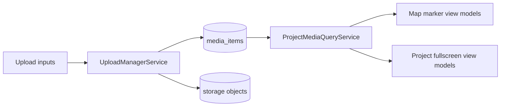
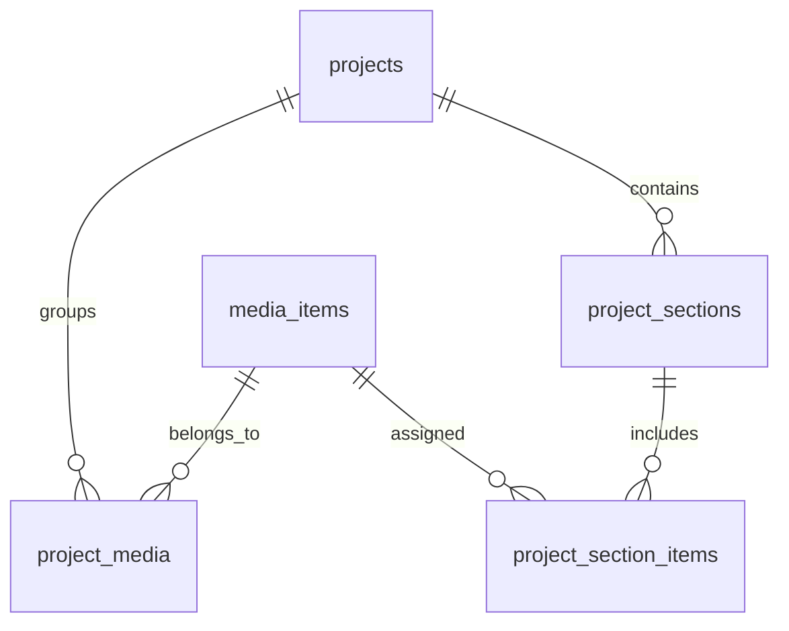
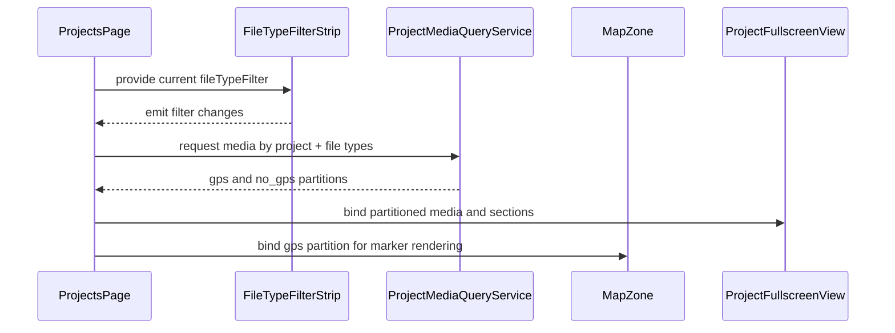

# Project Mixed Media Pre-Spec

> Use cases: [project-mixed-media.md](../use-cases/project-mixed-media.md)

## What It Is

A pre-spec contract for adding document and video support next to photos, while keeping Feldpost map-first behavior stable. It introduces file type aware rendering, a dedicated file type filter, fullscreen project media view, and project Sections for user-defined organization.

## What It Looks Like

The map keeps existing marker and cluster language, but individual markers gain media-type signatures: photo squares, document portrait cards (3:4), and video cards with play badge. Project fullscreen view becomes a two-lane media surface with GPS media on top and project-only no-GPS media below. A compact file type filter strip sits next to existing toolbar controls but is not merged into the generic Filter operator. Section headers in project view use shared `.ui-container` rhythm and stable collapsed/expanded behavior.

## Where It Lives

- Route: `/projects` (primary), `/map` (media-aware marker rendering)
- Parent: `ProjectsPageComponent`, `MapShellComponent`
- Appears when: user uploads mixed media, toggles file type filter, opens fullscreen project view, or manages project Sections

## Actions

| #   | User Action                                           | System Response                                              | Triggers                       |
| --- | ----------------------------------------------------- | ------------------------------------------------------------ | ------------------------------ |
| 1   | Uploads mixed files (photo/video/document) to project | Creates media jobs and validates by MIME/size policy         | Upload manager pipeline        |
| 2   | Upload finishes with coordinates                      | Item appears in GPS media lane and map marker set            | `location_status = gps`        |
| 3   | Upload finishes without coordinates                   | Item appears in project-only lane, no map marker             | `location_status = no_gps`     |
| 4   | Toggles File Type strip chip                          | Includes/excludes media family from current result set       | `fileTypeFilter` state         |
| 5   | Opens fullscreen project view                         | Shows GPS lane and project-only lane with same detail drawer | `projectFullscreenOpen`        |
| 6   | Creates custom Section                                | Persists section name/order and renders empty section slot   | `project_sections` insert      |
| 7   | Assigns media to section                              | Media appears in section grouping                            | `project_section_items` upsert |
| 8   | Renames/reorders section                              | UI updates immediately and persists new ordering             | section update/reorder action  |
| 9   | Deletes non-empty section                             | Requires confirm, then detaches items and removes section    | section delete flow            |
| 10  | Opens map marker detail for document/video            | Opens shared detail frame with type-specific metadata panel  | Detail drawer open             |

## Component Hierarchy

```
ProjectMixedMediaSystem
├── MapZoneIntegration
│   ├── MediaMarkerRenderer
│   │   ├── [photo] SquareMarkerThumb
│   │   ├── [document] PortraitMarkerThumb (3:4)
│   │   └── [video] SquareMarkerThumb + PlayBadge
│   └── MarkerDetailDrawer (shared)
├── ProjectsPageIntegration
│   ├── FileTypeFilterStrip (separate from Filter operator)
│   │   ├── PhotosChip
│   │   ├── VideosChip
│   │   └── DocumentsChip
│   └── ProjectFullscreenView
│       ├── ProjectHeader
│       ├── GpsMediaArea
│       │   └── SectionedMediaGrid
│       └── ProjectOnlyMediaArea
│           └── SectionedMediaGrid
└── SectionManagement
    ├── AddSectionAction
    ├── SectionHeader (name, count, menu)
    └── SectionItemAssignment
```

## Data

### Data Flow (Mermaid)



### Data Requirements Table

| Field               | Source                                                        | Type                       |
| ------------------- | ------------------------------------------------------------- | -------------------------- | -------- | ------------- |
| Media item id       | `media_items.id`                                              | `string`                   |
| Media type          | `media_items.media_type` (`photo`, `video`, `document`)       | `'photo'                   | 'video'  | 'document'`   |
| MIME type           | `media_items.mime_type`                                       | `string`                   |
| Location status     | `media_items.location_status` (`gps`, `no_gps`, `unresolved`) | `'gps'                     | 'no_gps' | 'unresolved'` |
| Thumbnail path      | `media_items.thumbnail_path`                                  | `string                    | null`    |
| Poster path (video) | `media_items.poster_path`                                     | `string                    | null`    |
| Project membership  | `project_media` join                                          | `MediaProjectMembership[]` |
| Section definition  | `project_sections`                                            | `ProjectSection[]`         |
| Section membership  | `project_section_items`                                       | `SectionItem[]`            |

### Data Model Proposal (Mermaid)



## State

| Name                      | Type          | Default | Controls                               |
| ------------------------- | ------------- | ------- | -------------------------------------- | --------------------------- | --------------------- |
| `fileTypeFilter`          | `Set<'photo'  | 'video' | 'document'>`                           | all selected                | File family inclusion |
| `projectFullscreenOpen`   | `boolean`     | `false` | Fullscreen project media mode          |
| `gpsMediaItems`           | `MediaItem[]` | `[]`    | Top lane in fullscreen project view    |
| `projectOnlyMediaItems`   | `MediaItem[]` | `[]`    | No-GPS lane in fullscreen project view |
| `activeProjectSectionIds` | `string[]`    | `[]`    | Expanded/collapsed sections            |
| `selectedMediaItemId`     | `string       | null`   | `null`                                 | Shared detail drawer target |
| `sectionDraftName`        | `string`      | `''`    | Add Section input                      |

## File Map

| File                                                 | Purpose                                                                   |
| ---------------------------------------------------- | ------------------------------------------------------------------------- |
| `docs/use-cases/project-mixed-media.md`              | Cross-element interaction contract for mixed media                        |
| `docs/element-specs/project-mixed-media-pre-spec.md` | Pre-spec contract and rollout boundaries                                  |
| `docs/element-specs/project-details-view.md`         | Existing project detail view to extend with fullscreen and two-lane model |
| `docs/element-specs/filter-panel.md`                 | Existing filter spec to keep stable while adding separate File Type strip |
| `docs/element-specs/upload-panel.md`                 | Existing upload entry to extend for mixed media intake                    |

## Wiring

### Wiring Flow (Mermaid)



- Keep adapter boundaries unchanged: no direct Leaflet or Supabase calls from components.
- Keep existing photo query paths operational while adding typed media queries behind service abstraction.
- Introduce feature flags for phased rollout so photo-only behavior remains default until mixed media is enabled.

## Acceptance Criteria

- [ ] Dedicated File Type filter exists and does not replace existing Filter operator.
- [ ] Document markers on map render portrait-oriented previews and remain accessible.
- [ ] GPS and no-GPS project media are separated in fullscreen project view.
- [ ] Videos and documents without GPS remain fully accessible in project-only area.
- [ ] User can create, rename, reorder, and delete project Sections.
- [ ] Legacy photo-only flows work unchanged when mixed media feature flag is off.
- [ ] Query performance remains within existing viewport and project-page targets after adding media type predicates.
- [ ] RLS remains the security boundary for every new table and storage path.

## Complexity and Consequences

- Data model expansion is mandatory. Reusing `images` for all asset types risks null-heavy schema and brittle constraints.
- Storage policy surface increases. MIME and bucket rules must be segmented by media type to avoid privilege leaks.
- Thumbnail strategy must be type-aware. Documents need generated first-page previews; videos need poster extraction; unsupported preview generation must degrade gracefully.
- Map density can regress if non-photo media floods marker rendering. Keep cluster behavior unchanged and apply media type marker simplification at low zoom.
- Search and grouping semantics become cross-type. Shared fields and type-specific fields must be normalized in one query contract.
- Migration risk is high if done as a big bang. Roll out in phases behind flags and backfill jobs.

## Rollout Plan (Do Not Break Current Project)

1. Phase 0: Add data model + RLS + storage policies with no UI changes.
2. Phase 1: Add mixed upload intake and persist media items; keep map photo-only.
3. Phase 2: Add project fullscreen two-lane view and Section management.
4. Phase 3: Add map rendering for GPS videos/documents and dedicated file type strip.
5. Phase 4: Enable by organization feature flag; monitor performance and error rates before default-on.

## File Type Inventory

- Photos
  - `image/jpeg`, `image/png`, `image/webp`, `image/heic`, `image/heif`
- Videos
  - `video/mp4`, `video/quicktime`, `video/webm`
- Documents
  - `application/pdf`, `image/tiff`, `application/vnd.openxmlformats-officedocument.wordprocessingml.document`, `application/msword`

## Thumbnail Strategy by Type

- Photo: existing image thumbnail pipeline (square 128x128 plus larger lazy variants).
- Video: poster frame thumbnail with play badge; optional duration label.
- Document: first-page preview when possible; fallback icon card with file extension; map marker preview uses portrait 3:4 ratio.

## Settings

- **File Type Visibility**: default selected media families in map/workspace/project views.
- **Fullscreen Project Mode**: default entry behavior for project detail (inline pane vs fullscreen).
- **Section Rules**: max sections per project, empty-section auto-collapse, and deletion confirmation mode.
